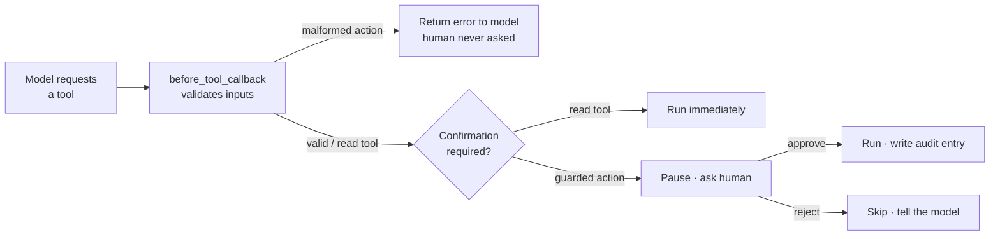

# 4.5. Guardrails

## What is a guardrail, and why does an agent need one?

A **guardrail** is a check that runs around a tool call to keep the agent safe — validating inputs before they run, screening outputs after, or pausing for a human on a risky action. An agent needs guardrails because the _model_ decides what to call and with what arguments, and the model is fallible: it can pass a malformed id, misread a request, or be steered by a prompt-injection payload ([4.6. Security](./4.6. Security.md)). Guardrails are the deterministic backstop between the model's intent and your state.

ADK exposes them as **callbacks** on the agent. The Ops Copilot uses two complementary layers:

- **Input validation** — a `before_tool_callback` that fails fast on bad arguments to the write actions.
- **Human-in-the-loop (HITL)** — the write actions require explicit human approval before they run.

## How does the input-validation callback work?

A `before_tool_callback` runs **before** a tool executes. It can inspect the arguments and either short-circuit the call by returning a result (which the model sees instead of the tool running) or return "nothing" to let the call proceed. The Ops Copilot's guardrail rejects malformed inputs to the mutating actions — a boundary check kept separate from the actions' own business logic:

=== "Python"

    ```python
    # agents/python/src/agent/guardrails.py
    _INCIDENT_ID = re.compile(r"^INC-\d+$")

    # Tools that change state — the ones worth validating strictly before they run.
    _ACTION_TOOLS = frozenset({"restart_service", "resolve_incident"})


    def validate_actions(tool: BaseTool, args: dict[str, Any], tool_context: ToolContext) -> dict[str, Any] | None:
        """Reject malformed inputs to mutating actions before they touch state."""
        del tool_context  # part of the ADK callback signature; unused here
        if tool.name not in _ACTION_TOOLS:
            return None
        if tool.name == "resolve_incident":
            incident_id = str(args.get("incident_id", ""))
            if not _INCIDENT_ID.match(incident_id):
                return {"error": f"Refusing to resolve {incident_id!r}: expected an id like INC-002."}
        if tool.name == "restart_service" and not str(args.get("name", "")).strip():
            return {"error": "Refusing to restart: no service name was provided."}
        return None
    ```

=== "Go"

    ```go
    // agents/go/internal/guardrails/guardrails.go
    var incidentID = regexp.MustCompile(`^INC-\d+$`)

    // ValidateActions is a BeforeToolCallback: it rejects malformed inputs to mutating actions.
    func ValidateActions(_ agent.Context, tl tool.Tool, args map[string]any) (map[string]any, error) {
    	switch tl.Name() {
    	case "resolve_incident":
    		id, _ := args["incident_id"].(string)
    		if !incidentID.MatchString(id) {
    			return map[string]any{"error": fmt.Sprintf("Refusing to resolve %q: expected an id like INC-002.", id)}, nil
    		}
    	case "restart_service":
    		name, _ := args["name"].(string)
    		if strings.TrimSpace(name) == "" {
    			return map[string]any{"error": "Refusing to restart: no service name was provided."}, nil
    		}
    	}
    	return nil, nil // not a guarded action, or inputs are valid: proceed
    }
    ```

The two are the same logic in each language's idiom. Read-only tools are ignored (return `None`/`nil, nil`, so the call proceeds). For a write action, the argument is parsed to a `string` and checked: an incident id must match `^INC-\d+$`, a service name must be non-empty. A failed check returns an **error map** — the tool never runs, and the model receives the error and can correct itself. Because the callback only reads the tool name and args, it is trivially unit-testable ([4.2. Testing](./4.2. Testing.md)) with a `nil` context.

## How do I register the guardrail on the agent?

You attach it when constructing the agent — one callback covers every tool call:

=== "Python"

    ```python
    # agents/python/src/agent/agent.py
    root_agent = Agent(
        model=settings.model,
        name="agentops_agent",
        instruction=INSTRUCTION,
        tools=[*ALL_TOOLS, *KNOWLEDGE_TOOLS, *ACTION_TOOLS],
        before_tool_callback=validate_actions,
    )
    ```

=== "Go"

    ```go
    // agents/go/internal/agent/agent.go
    a, err := llmagent.New(llmagent.Config{
    	Name:                Name,
    	Model:               model,
    	Instruction:         Instruction,
    	Tools:               allTools,
    	BeforeToolCallbacks: []llmagent.BeforeToolCallback{guardrails.ValidateActions},
    })
    ```

## What makes an action require human approval?

The write actions are built as **confirmation-gated tools**: ADK pauses and asks a human before the function runs. That flag is set where the tool is defined, alongside the mock logic:

=== "Python"

    ```python
    # agents/python/src/agent/actions.py
    def restart_service(name: str) -> dict[str, Any]:
        """Restart a service (mock) — flips it back to operational and writes an audit entry."""
        if data.get_service(name) is None:
            return {"error": f"No service named {name!r}; nothing to restart."}
        data.set_service_status(name, "operational")
        entry = data.append_audit(_ACTOR, "restart_service", name, "service restarted (mock)")
        return {"result": f"Service {name!r} restarted and marked operational.", "audit": entry}


    # Guarded actions: ADK requests human approval before the function runs (HITL).
    ACTION_TOOLS = [
        FunctionTool(func=restart_service, require_confirmation=True),
        FunctionTool(func=resolve_incident, require_confirmation=True),
    ]
    ```

=== "Go"

    ```go
    // agents/go/internal/actions/actions.go
    func restartServiceTool(store *data.Store) (tool.Tool, error) {
    	return functiontool.New(functiontool.Config{
    		Name:                "restart_service",
    		Description:         "Restart a service (mock): flip it back to operational and write an audit entry.",
    		RequireConfirmation: true, // HITL: ADK asks for approval before this runs
    	}, func(_ agent.Context, in restartServiceInput) (map[string]any, error) {
    		// ... flips status and appends an audit entry ...
    	})
    }
    ```

`require_confirmation=True` / `RequireConfirmation: true` is the whole HITL switch. Every read tool runs freely; every state-changing action is gated. The unit tests assert this flag is on for both actions, so a refactor can never silently remove the approval step.

## How does the human-in-the-loop approval flow actually run?

Every tool call first passes the `before_tool_callback`. Only when a well-formed, confirmation-gated tool survives that check does ADK decline to run the function immediately — instead it emits a **confirmation request** and suspends the invocation, waiting for a decision:



- In the **`adk web`** developer UI (Python, `mise run web`), the pending action surfaces as a confirmation prompt — an operator approves or rejects it in the browser before anything mutates.
- In the Go **launcher** web UI, the same tool-confirmation flow pauses the run for the operator's decision.
- Programmatically, the confirmation is an event your host application answers — the seam that later becomes a real approval workflow in [7.6. Governance](../7. Observability/7.6. Governance.md).

Note the ordering in the diagram: **validation comes first**. ADK runs the `before_tool_callback` on every tool call _before_ it requests confirmation (verified in both tracks' flow runners), so a malformed action — say `resolve INC-oops` — is rejected outright and the human is never even asked to approve it. Only a well-formed guarded action reaches the confirmation step, where a person decides whether to proceed. The two guardrails compound rather than overlap: the deterministic input check gates whether a human is prompted at all. And because everything here is mock and local, "restart" only flips a database status and appends to the audit log — no real infrastructure is touched.

!!! warning "Never let the model self-approve"

    HITL only protects you if the human is a *real* second party. Don't wire the confirmation to
    auto-approve, and don't let the agent's own output stand in for the approval. The point of the
    gate is that a mutating action needs a decision made outside the model's control — that is
    exactly what stops a hijacked prompt from restarting services on its own.

The guardrails defend the agent's actions. [4.6. Security](./4.6. Security.md) widens the lens to secrets, prompt injection, and supply-chain scanning.
