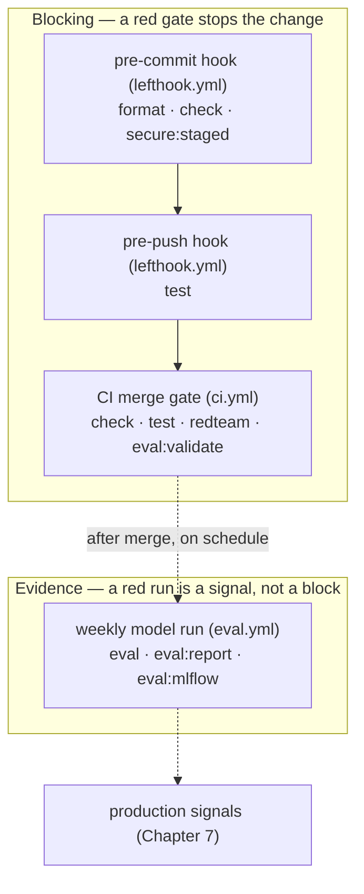

# 4. Quality

## How will you make the agent trustworthy?

Your agent now holds a conversation ([Chapter 2](../2. Agents/)) and has bounded capabilities ([Chapter 3](../3. Capabilities/)); this chapter makes it defensible. You earn trust with layers of evidence rather than one green run: trusted types, warning-free checks, isolated state, and branch-covered tests first; then live-model trajectory and full-conversation evaluation; then PII boundaries, human confirmation, transactional writes, deterministic adversarial regressions, and repository security scans. Each layer catches a class of failure the cheaper layers below it cannot.

This chapter covers:

- **[4.0. Typing](./4.0. Typing.md)**: Python typing with ty, parsing tool I/O at the boundary.
- **[4.1. Linting](./4.1. Linting.md)**: Lint and format with ruff and dprint.
- **[4.2. Testing](./4.2. Testing.md)**: Fast, offline unit tests with pytest, against an isolated dataset copy.
- **[4.3. Metrics](./4.3. Metrics.md)**: A concrete scorecard of release gates and observed operational indicators.
- **[4.4. Evaluations](./4.4. Evaluations.md)**: ADK trajectories plus full-conversation MLflow lineage and optional judge evidence.
- **[4.5. Guardrails](./4.5. Guardrails.md)**: Boundary redaction, stable errors, confirmation, transactions, and audit evidence.
- **[4.6. Security](./4.6. Security.md)**: Threat modeling, offline adversarial regressions, identity, and supply-chain scanning.

Two pages end in a hands-on build step, so expect to write code, not just read: [4.4. Evaluations](./4.4. Evaluations.md) has you add an eval case, and [4.5. Guardrails](./4.5. Guardrails.md) has you turn a guardrail into a test that fails if it ever weakens.

## Where does each quality gate run?

The same `mise run` tasks execute at three different moments, and the moment decides whether a red result blocks you or just informs you:

1. **Local hooks (`lefthook.yml`)** run the fast, offline gates before code leaves your machine: `format` and `check` (typing, lint, docs, links, licenses) plus `secure:staged` on commit, then `test` on push.
1. **The CI merge gate (`.github/workflows/ci.yml`)** re-runs the same `check` and `test` on a clean runner and adds two named signals — the deterministic `redteam` suite and offline `eval:validate` — so a regression blocks the merge instead of hiding in one line of the full log. Every gate above this point is offline: no model, no provider key, no cost.
1. **The weekly model-backed workflow (`.github/workflows/eval.yml`, Monday 07:00 UTC or manual dispatch)** is the only tier that calls a model; it provisions a local Ollama server on the runner and runs `eval`, `eval:report`, and `eval:mlflow` against the fixed seed data. It is scheduled evidence, never a PR gate: a failed run points you at uploaded artifacts to inspect, not at a blocked merge.

So the chapter stays model-free until [4.4. Evaluations](./4.4. Evaluations.md) explicitly asks for a configured provider; everything before it runs with no account and no bill. Be equally clear about the ceiling. The `redteam` suite is a deterministic offline regression, not live model red-teaming; the optional MLflow judge is advisory evidence with no enforced pass threshold unless a release policy sets one; and the audit trail is an append-only SQLite log on a writable volume, not an externally immutable or externally shipped sink. A green interactive demo cannot substitute for any of these gates.
