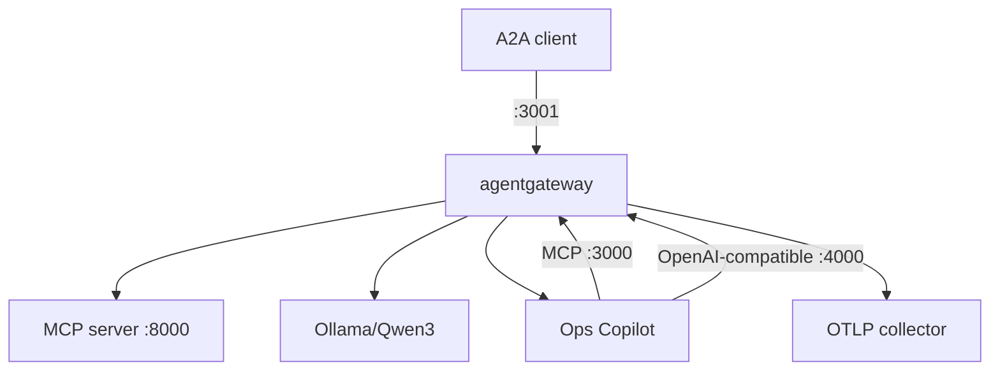

# 5.0. Gateway

## Why add a gateway after the agent works?

Without a gateway, every agent process must own provider endpoints, tool routing, network policy, rate limits, and telemetry. That duplicates security decisions and makes provider changes application changes. agentgateway centralizes those traffic concerns while ADK continues to own sessions, tool execution, confirmation, and agent logic.

## Which listener owns each protocol?

| Listener | Protocol                           | Host upstream            | Kubernetes upstream                            |
| -------- | ---------------------------------- | ------------------------ | ---------------------------------------------- |
| `:3000`  | MCP streamable HTTP                | `127.0.0.1:8000/mcp`     | `agentops-mcp:8000/mcp`                        |
| `:3001`  | A2A                                | `127.0.0.1:8080`         | `agentops-agent:8080`                          |
| `:4000`  | OpenAI-compatible chat completions | Ollama `127.0.0.1:11434` | Ollama through the k3d bridge or Vertex on GKE |
| `:15020` | Internal metrics                   | Collector scrape         | In-cluster collector scrape                    |
| `:15021` | Host gateway readiness             | Local health check       | Pod-local probe, not a Kubernetes Service port |

Separate ports make routing unambiguous and avoid catch-all rules that accidentally send one protocol to another backend.

## Which configurations are shipped?

- `infra/agentgateway/host/config.yaml` connects processes running directly on the workstation.
- `infra/agentgateway/k3d/config.yaml` uses Kubernetes service DNS and local Ollama.
- `infra/agentgateway/gke/config.yaml` uses Kubernetes service DNS and Vertex AI with ambient workload identity.

All three keep the same data-plane listener contract and security policies. Only upstream addresses and model identity change. The host quickstart runs the digest-pinned gateway image through `mise run gateway:host`; the wrapper publishes every gateway listener on `127.0.0.1`. On native Linux, its bridge-address-only relay lets the container reach raw services that remain bound to host loopback. Other containers on the local Docker engine are inside that host trust boundary; no relay listener is opened on the LAN address.

The raw `agentgateway -f ...` binary currently opens its configured listeners on all host interfaces. Treat it as an advanced/manual path and review the machine's network exposure first; learner quickstarts use the loopback-published wrapper.

## What policy belongs at the gateway?

- MCP tool authorization and fail-closed backend behavior.
- Per-instance request rate limits.
- A2A protocol-aware forwarding.
- Model request/response prompt guards.
- Upstream model authentication at the deployment identity boundary.
- Structured access logs, metrics, and tracing.

Human confirmation and transaction integrity stay in the application because the gateway cannot reconstruct an authenticated ADK `ToolContext` or database transaction.

## What does the gateway not solve?

The default course profile has no end-user authentication, TLS termination, distributed rate-limit store, multi-replica HA, public ingress, or comprehensive content classifier. Chapter 5.5 adds an opt-in local JWT/API-key and TLS profile while preserving that frictionless default. Regex prompt guards are useful demonstrations, not complete injection or data-loss prevention; neither profile is a public security edge.

## What is the gateway checkpoint?

Before starting a process, compare the three config files and confirm they expose the same four ports, six MCP allowlist entries, rate limits, prompt guards, and OTLP destination appropriate to the environment.
