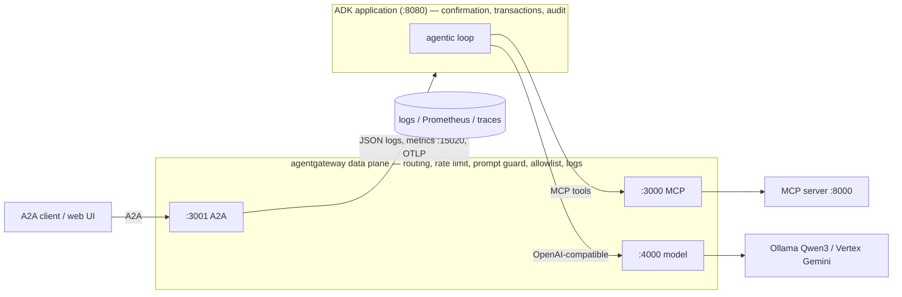
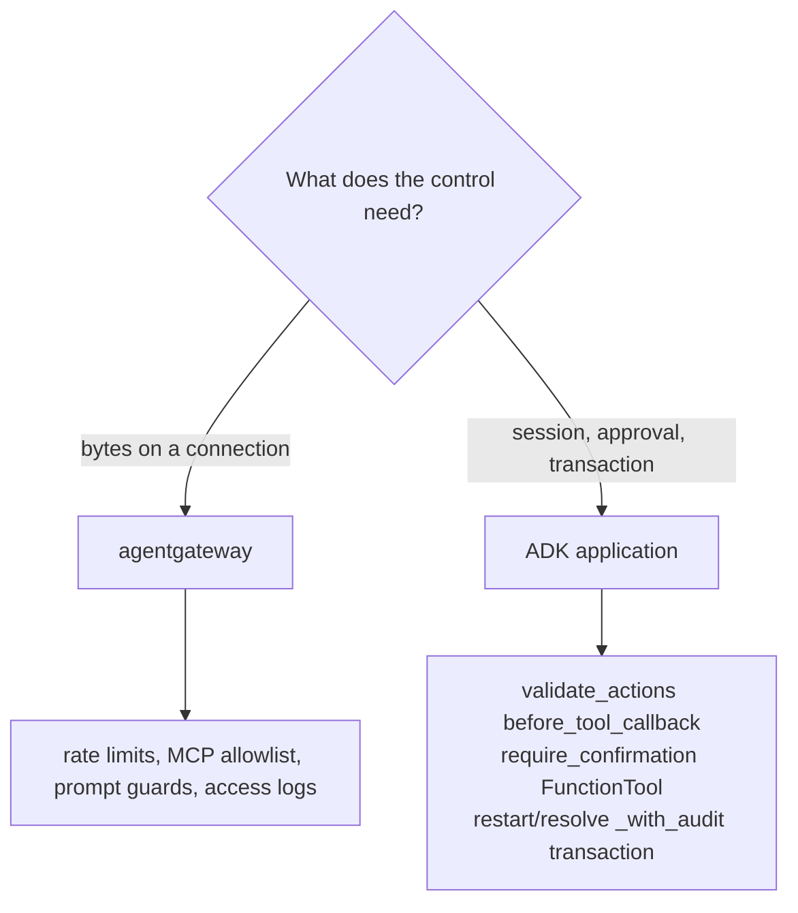

# 5.0. Gateway

## Why add a gateway after the agent works?

The agent from Chapters 2-4 already talks to its model, its MCP tools, and its A2A clients directly. Each of those connections hides a policy decision: which model endpoint, which tools are callable, how fast a caller may push, what gets logged, who is allowed in. Leave those decisions inside the agent process and they are duplicated in the next process that talks to the same backends — and the second copy is where they drift. The general pattern that fixes this is the **reverse proxy**: put one process in the request path, in front of shared backends, and move the cross-cutting traffic concerns into it. A control enforced once at a shared boundary cannot be forgotten by the next client — the same argument [5.5](5.5.%20Gateway%20Security.md#could-an-optional-managed-classifier-screen-prompts-here-instead) uses for tool allowlists and rate limits.

A gateway does not replace the agent; it splits responsibilities. agentgateway owns **traffic**: transport, routing, per-listener rate limits, prompt guards, tool authorization, and structured access logs, metrics, and traces. ADK keeps owning **application logic**: sessions, the agentic loop, human confirmation, and the transaction that writes an action together with its audit record. The rest of this chapter is that split, listener by listener.



Concretely, the agent stops naming its backends. In Chapter 5.1 you start it with `AGENT_MCP_URL=http://127.0.0.1:3000/mcp` and `OPENAI_BASE_URL=http://127.0.0.1:4000/v1` — gateway ports only. Nothing in that command names the MCP server's `:8000` or Ollama's `:11434`; the agent no longer knows where its tools or its model actually live. The model side is the smallest possible change: this chapter swaps only `OPENAI_BASE_URL` to point at the gateway listener, which is [5.4](5.4.%20Model%20Gateway.md#what-is-the-application-contract).

## What is a data plane, and does this course run a control plane?

Networking splits a running system into two planes. The **data plane** is the code on the request path that moves and inspects each call — every gateway listener here is data plane. The **control plane** is the out-of-band system that _configures_ the data plane: it computes routes, pushes policy, and discovers backends, often dynamically over a protocol like xDS while the data plane keeps serving. Service meshes ship both; a mesh sidecar is a data-plane proxy fed by a control plane.

This course runs a data plane only. agentgateway reads a **static, checked-in YAML file** — `infra/agentgateway/host/config.yaml` and its two Kubernetes siblings — and serves it. There is no control plane, no xDS stream, no dynamic service discovery, and no hot policy push: to change a route or a limit you edit the file and restart the process. The host profile is a **single replica** with a per-instance token-bucket rate limit, which [5.5](5.5.%20Gateway%20Security.md#why-is-the-local-rate-limit-not-a-quota) is explicit is not a distributed quota. Do not read "gateway" as "mesh"; the value here is a readable boundary and its policy, not dynamic fleet management.

## Which listener owns each protocol?

agentgateway's config is a fixed nesting, and every later page in this chapter reuses its vocabulary. Reading `infra/agentgateway/host/config.yaml` top to bottom:

1. `binds` — the list of ports the gateway opens. This course binds three: `3000`, `3001`, `4000`.
1. `listeners` — the named protocol handler on a bind (`mcp`, `a2a`, `llm`).
1. `routes` — the matched request paths under a listener.
1. `policies` — the ordered controls on a route (rate limits, authorization, prompt guards, CORS).
1. `backends` — the upstream a route forwards to once every policy has passed.

The head of the MCP bind makes the nesting concrete:

```yaml
binds:
  - port: 3000
    listeners:
      - name: mcp
        routes:
          - policies:
              localRateLimit:
                - maxTokens: 120
                  tokensPerFill: 120
                  fillInterval: 60s
```

The `backends` block follows under the same route (an MCP target with `failureMode: failClosed`); Chapter 5.2 owns what those policies decide. Three protocols map to three ports, plus two operational listeners the host wrapper injects:

| Listener | Protocol                           | Host upstream             | Kubernetes upstream                             |
| -------- | ---------------------------------- | ------------------------- | ----------------------------------------------- |
| `:3000`  | MCP streamable HTTP                | `localhost:8000/mcp`      | `agentops-mcp:8000/mcp`                         |
| `:3001`  | A2A                                | `localhost:8080`          | `agentops-agent:8080`                           |
| `:4000`  | OpenAI-compatible chat completions | Ollama `localhost:11434`  | Ollama through the k3d bridge, or Vertex on GKE |
| `:15020` | Internal metrics                   | Compose Prometheus scrape | In-cluster collector scrape                     |
| `:15021` | Host gateway readiness             | Local health check        | Pod-local probe, not a Kubernetes Service port  |

Separate ports keep routing unambiguous: a catch-all rule can send one protocol to the wrong backend, which is why the smoke test asserts each listener by protocol, not by a bare TCP connect. The last two rows are not in the config files at all — the host wrapper's render step injects `statsAddr`/`readinessAddr`, covered in [5.1](5.1.%20Gateway%20Setup.md#how-do-you-verify-the-listeners). Each protocol's deep page: fail-closed MCP authorization is [5.2](5.2.%20MCP%20Gateway.md#what-does-failclosed-actually-decide), the `a2a` route policy is [5.3](5.3.%20A2A%20Gateway.md#how-is-a2a-routed), the single-endpoint model swap is [5.4](5.4.%20Model%20Gateway.md#what-is-the-application-contract), and the two operational listeners' scrape/probe story is [5.6](5.6.%20Gateway%20Observability.md#which-gateway-signals-are-available).

## Which configurations are shipped?

Three profiles ship the same listener contract against different environments:

1. `infra/agentgateway/host/config.yaml` — local processes on the workstation.
1. `infra/agentgateway/k3d/config.yaml` — Kubernetes service DNS with a local Ollama upstream.
1. `infra/agentgateway/gke/config.yaml` — Kubernetes service DNS with Vertex AI and ambient workload identity.

What stays **invariant** across all three is the whole shape-and-security contract: the three ports, the exact six-tool MCP allowlist (`list_incidents`, `get_incident`, `get_service_status`, `search_service_logs`, `get_runbook`, `search_runbooks`), the `failClosed` MCP backend, the per-listener token buckets (120/60s MCP, 60/60s A2A, 30/60s model), and the same request/response prompt guards. What **changes** is only what the environment forces:

| Concern                   | Host                     | k3d                            | GKE                            |
| ------------------------- | ------------------------ | ------------------------------ | ------------------------------ |
| MCP / A2A upstream        | `localhost`              | `*.agentops.svc.cluster.local` | `*.agentops.svc.cluster.local` |
| Model upstream            | Ollama `localhost:11434` | Ollama via `host.k3d.internal` | Vertex                         |
| Model identity            | `qwen3:4b-instruct`      | `qwen3:4b-instruct`            | `gemini-3.5-flash`             |
| Model caller auth `:4000` | open                     | `apiKey: mode: strict`         | `apiKey: mode: strict`         |
| Gateway OTLP tracing      | disabled                 | enabled                        | enabled                        |
| Cloud backend auth        | —                        | —                              | ambient Workload Identity      |

Chapter 5.5 owns the caller-auth details ([5.5](5.5.%20Gateway%20Security.md#how-do-callers-authenticate-to-the-gateway)); Chapter 5.6 explains why the host profile leaves gateway OTLP off ([5.6](5.6.%20Gateway%20Observability.md#why-does-the-host-gateway-expose-metrics-but-not-traces)). The host quickstart never runs the raw binary: `mise run gateway:host` runs the digest-pinned image through a wrapper that publishes every listener on `127.0.0.1`, and on native Linux a bridge-address-only relay lets the container reach services still bound to host loopback. The raw `agentgateway -f ...` binary opens its listeners on all interfaces — treat it as an advanced/manual path and review your machine's exposure first. The full wrapper walkthrough is [5.1](5.1.%20Gateway%20Setup.md#what-does-the-host-wrapper-actually-run).

## What policy belongs at the gateway?

A control belongs at the gateway when it is about **traffic and applies to every caller uniformly**. Enforced once, a second client of the same backend inherits it for free — the reverse-proxy payoff again:

1. MCP tool authorization and a fail-closed backend — [5.2](5.2.%20MCP%20Gateway.md#how-is-the-mcp-route-secured).
1. Per-listener request rate limits — [5.5](5.5.%20Gateway%20Security.md#why-is-the-local-rate-limit-not-a-quota).
1. A2A protocol-aware forwarding — [5.3](5.3.%20A2A%20Gateway.md#why-use-a2a-policy-instead-of-generic-http-proxying).
1. Model request/response prompt guards — [5.5](5.5.%20Gateway%20Security.md#how-does-the-prompt-guard-work).
1. Upstream model authentication at the deployment-identity boundary — [5.4](5.4.%20Model%20Gateway.md#how-is-local-qwen3-configured) and [5.5](5.5.%20Gateway%20Security.md#how-is-cloud-authentication-separated).
1. Structured access logs, metrics, and tracing — [5.6](5.6.%20Gateway%20Observability.md#which-gateway-signals-are-available).

## Which concerns cannot move to the gateway?

Some controls need context the gateway does not have, and pushing them to the boundary would quietly weaken them. The gateway sees bytes on a connection; it cannot reconstruct an authenticated ADK `ToolContext`, decide whether a specific write was approved by a specific human, or hold a database transaction open across an action and its audit row. Those stay in the application.



1. **Authenticated tool context.** `validate_actions` runs as ADK's `before_tool_callback` in `agent.py`, and `_validated_approval` in `actions.py` reads the approval off the `ToolContext`. The gateway has no session to read.
1. **Human confirmation.** The mutating tools are wrapped `FunctionTool(func=..., require_confirmation=True)`, so a person approves before the write. A rate limit or allowlist cannot express "a human said yes to this exact action."
1. **Write-plus-audit as one transaction.** `restart_service_with_audit` and `resolve_incident_with_audit` perform the mutation and record who approved, why, and what changed in the same transaction, so a crash cannot commit one without the other.

Chapter 4.5 owns all three ([4.5](../4.%20Quality/4.5.%20Guardrails.md#how-are-action-arguments-validated)); this page only draws the line. The rule to carry: a gateway is a policy point, not the only one. If a control's failure would let an unapproved write through, that control must live in the application, not in a regex or an allowlist at the edge.

## What does the gateway not solve?

The default course profile is not a public security edge. It has no end-user authentication, no TLS termination, no distributed rate-limit store, no multi-replica HA, no public ingress, and no trained content classifier. Chapter 5.5 adds an opt-in local JWT/API-key and TLS profile while preserving the frictionless default, and is honest that the regex prompt guards are demonstrations, not injection or data-loss prevention. No profile creates an Ingress, LoadBalancer, or public endpoint; clients reach the gateway over loopback on the host and through `kubectl port-forward` in Kubernetes. Treat this chapter as learning the mechanism and the boundary, not as a hardened production edge — [5.5](5.5.%20Gateway%20Security.md#which-security-controls-are-intentionally-absent) lists exactly what is deliberately absent.

## What is the gateway checkpoint?

Before starting a process, compare the three config files and confirm they expose the same three protocol ports (`3000`/`3001`/`4000`), the same six MCP allowlist entries, the same rate limits and prompt guards, and the OTLP destination appropriate to the environment. Then run `mise run smoke:host` as the deterministic proof that the composed data plane behaves ([5.1](5.1.%20Gateway%20Setup.md#what-exactly-does-the-host-smoke-prove)), and hold every later chapter check to gateway ports only.
