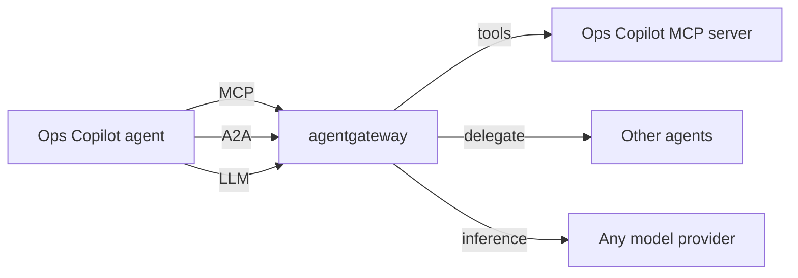

# 5.0. Gateway

## What problem does a gateway solve for agents?

Once an agent does real work, it stops being a single process talking to one model. The Ops Copilot you built calls **MCP tools** (incidents, runbooks, service status), can delegate to **other agents** over A2A, and sends every turn to an **LLM**. That is three kinds of outbound traffic, each pointed at a different endpoint, each needing the same production concerns:

1. **Authentication** — who is allowed to call this tool, agent, or model?
1. **Authorization** — which specific tools or actions may a given caller invoke?
1. **Rate limiting** — cap runaway loops and protect upstreams (and your token bill).
1. **Safety** — strip PII and block prompt-injection before it reaches a model.
1. **Observability** — one place to see every tool call, agent hop, and model request.

Wiring all of that into the agent code — in **both** the Python and Go tracks — duplicates the same policy logic in two languages and couples your business logic to your security posture. A gateway pulls those cross-cutting concerns out of the agent and into one configurable proxy.

## What is agentgateway?

[agentgateway](https://agentgateway.dev) is an open-source, AI-native proxy written in Rust. It sits between your agent and everything the agent connects to, and it speaks the three protocols agents actually use:

1. **MCP** — front one or many Model Context Protocol servers as a single secured endpoint.
1. **A2A** — proxy Agent2Agent traffic between agents.
1. **LLM / inference** — proxy model calls to any provider (OpenAI, Anthropic, Gemini, local Ollama, …) behind one endpoint.

Because it is a proxy, the agent's code barely changes: you repoint a URL. The same gateway config secures both tracks identically — the policy lives in YAML, not in Python or Go.

!!! info "AAIF project"

    agentgateway was created by Solo.io and **donated to the Linux Foundation** (2025-08-25).
    It is now a project of the **[Agentic AI Foundation (AAIF)](https://aaif.io/projects/agentgateway/)** —
    the same foundation that anchors MCP, A2A, and AGENTS.md. This course dedicates Chapter 5 to
    it as the flagship AAIF connectivity and security layer.

## How does it fit the AgentOps lifecycle?

You run it **locally first** (this chapter) as a single binary in front of your agent, then promote the exact same config to Kubernetes as kagent's data plane in [6.5. Platform Gateway](../6. Platform/6.5. Platform Gateway.md). Nothing about the agent's behaviour changes between the two — only where the proxy runs. That is the whole point: connectivity and security become infrastructure you configure, not code you rewrite.

## What does agentgateway proxy, and what stays in the agent?

The gateway owns the **edges** — the connections leaving the agent. The agent keeps its own logic: reasoning, tool selection, workflow, and memory. A useful mental model:

Each arrow into the gateway can carry auth, rate limits, guards, and tracing — configured once, in one file, for both language tracks.

## Where do I start?

Set the gateway up locally and front the Ops Copilot's MCP tools first, then add each capability in turn:

1. [5.1. Gateway Setup](./5.1. Gateway Setup.md) — install and run it locally.
1. [5.2. MCP Gateway](./5.2. MCP Gateway.md) — front the MCP server.
1. [5.3. A2A Gateway](./5.3. A2A Gateway.md) — route agent-to-agent traffic.
1. [5.4. Model Gateway](./5.4. Model Gateway.md) — reach any model provider, including Ollama.
1. [5.5. Gateway Security](./5.5. Gateway Security.md) — auth, guards, and rate limits.
1. [5.6. Gateway Observability](./5.6. Gateway Observability.md) — metrics, tracing, admin UI.
