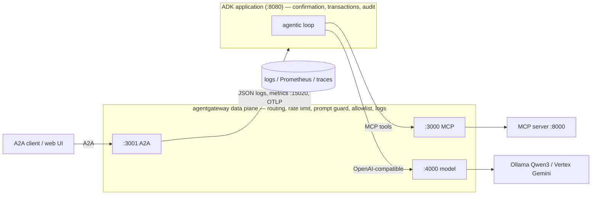
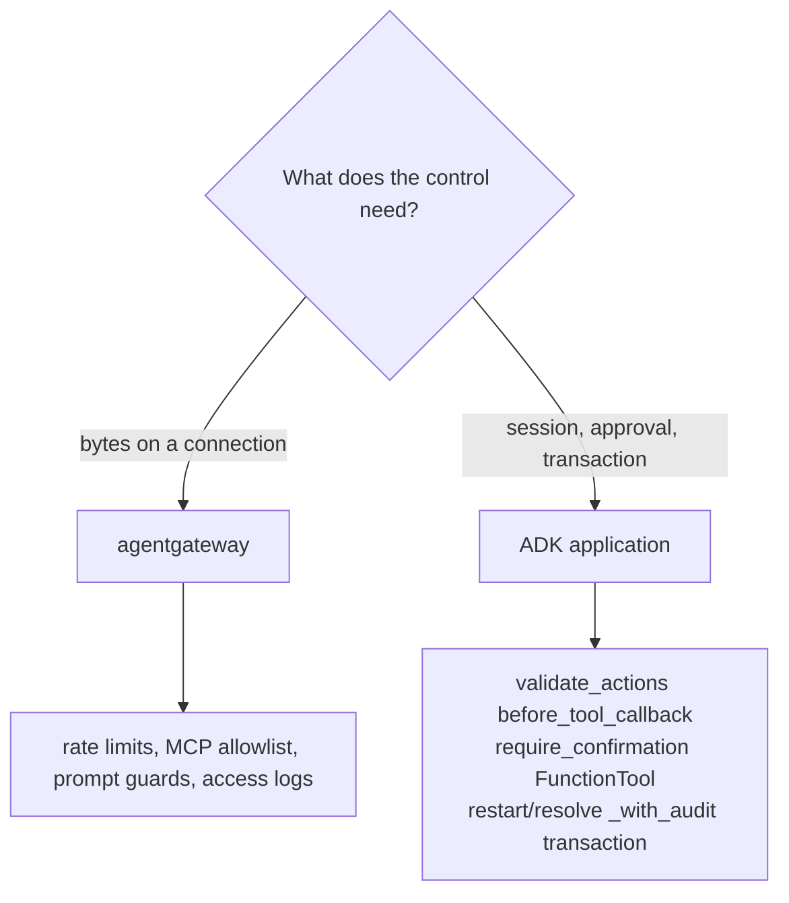

# 5.0. Gateway

!!! abstract "In one glance"

    - **You will:** Learn why the agent's model, tool, and client connections are worth routing through one proxy, and which port carries which.
    - **You need:** Chapters 2-4 finished; nothing to run until the closing checkpoint.
    - **Time:** about 14 minutes, concept.

## Why add a gateway after the agent works?

The agent stops naming its backends. In Chapter 5.1 you start it with `AGENT_MCP_URL=http://127.0.0.1:3000/mcp` and `OPENAI_BASE_URL=http://127.0.0.1:4000/v1` — gateway ports only. Nothing in that command names the MCP server's `:8000` or Ollama's `:11434`; the agent no longer knows where its tools or its model actually live.

Why is that indirection worth an extra hop? The agent from Chapters 2-4 already talks to its model, its MCP tools, and its A2A clients directly. Each of those connections hides a policy decision: which model endpoint, which tools are callable, how fast a caller may push, what gets logged, who is allowed in.

Leave those decisions inside the agent process and they are duplicated in the next process that talks to the same backends. The second copy is where they drift.

The general pattern that fixes this is the **reverse proxy**: put one process in the request path, in front of shared backends, and move the cross-cutting traffic concerns into it. A control enforced once at a shared boundary cannot be forgotten by the next client — the same argument [5.5. Gateway Security](5.5.%20Gateway%20Security.md#could-an-optional-managed-classifier-screen-prompts-here-instead) uses for tool allowlists and rate limits.

A gateway does not replace the agent; it splits responsibilities. agentgateway owns **traffic**: transport, routing, per-listener rate limits, prompt guards, tool authorization, and structured access logs, metrics, and traces. ADK keeps owning **application logic**: sessions, the agentic loop, human confirmation, and the transaction that writes an action together with its audit record. The rest of this chapter is that split, listener by listener.


```mermaid
flowchart LR
    Client[A2A client / web UI] -->|A2A| L3001
    subgraph GW["agentgateway data plane — routing, rate limit, prompt guard, allowlist, logs"]
        L3001[":3001 A2A"]
        L3000[":3000 MCP"]
        L4000[":4000 model"]
    end
    L3001 --> ADK
    subgraph ADK["ADK application (:8080) — confirmation, transactions, audit"]
        Loop[agentic loop]
    end
    Loop -->|MCP tools| L3000
    Loop -->|OpenAI-compatible| L4000
    L3000 --> MCP[MCP server :8000]
    L4000 --> Model[Ollama Qwen3 / Vertex Gemini]
    GW -. JSON logs, metrics :15020, OTLP .-> Obs[(logs / Prometheus / traces)]
```

The model side is the smallest possible change: this chapter swaps only `OPENAI_BASE_URL` to point at the gateway listener. Owned by [5.4. Model Gateway](5.4.%20Model%20Gateway.md#what-is-the-application-contract).

## What is a data plane, and does this course run a control plane?

This course runs a data plane only, and there is no control plane anywhere in it.

Networking splits a running system into two planes. The **data plane** is the code on the request path that moves and inspects each call — every gateway listener here is data plane. The other plane, the **control plane**, is the separate system that configures the data plane: it decides the routes and pushes the policy.

Any term on this page you do not recognize is defined in one line in [0.7. Glossary](../0.%20Overview/0.7.%20Glossary.md).

??? note "Deeper: where a service mesh would fit"

    The **control plane** is the out-of-band system that _configures_ the data plane: it computes routes, pushes policy, and discovers backends, often dynamically over a protocol like xDS while the data plane keeps serving. Service meshes ship both; a mesh sidecar is a data-plane proxy fed by a control plane.

agentgateway reads a **static, checked-in YAML file** — `infra/agentgateway/host/config.yaml` and its two Kubernetes siblings — and serves it. There is no control plane, no xDS stream, no dynamic service discovery, and no hot policy push: to change a route or a limit you edit the file and restart the process.

The host profile is a **single replica** with a per-instance token-bucket rate limit: a fixed allowance of requests that refills on a timer. [5.5. Gateway Security](5.5.%20Gateway%20Security.md#why-is-the-local-rate-limit-not-a-quota) is explicit that this is not a distributed quota. Do not read "gateway" as "mesh"; the value here is a readable boundary and its policy, not dynamic fleet management.

## Which listener owns each protocol?

Three protocols map to three ports, plus two operational listeners the host wrapper injects.

| Listener | Protocol                           | Host upstream             | Kubernetes upstream                             |
| -------- | ---------------------------------- | ------------------------- | ----------------------------------------------- |
| `:3000`  | MCP streamable HTTP                | `localhost:8000/mcp`      | `agentops-mcp:8000/mcp`                         |
| `:3001`  | A2A                                | `localhost:8080`          | `agentops-agent:8080`                           |
| `:4000`  | OpenAI-compatible chat completions | Ollama `localhost:11434`  | Ollama through the k3d bridge, or Vertex on GKE |
| `:15020` | Internal metrics                   | Compose Prometheus scrape | In-cluster collector scrape                     |
| `:15021` | Host gateway readiness             | Local health check        | Pod-local probe, not a Kubernetes Service port  |

Separate ports keep routing unambiguous: a catch-all rule can send one protocol to the wrong backend. That is why the smoke test asserts each listener by protocol, not by a bare TCP connect. The last two rows are not in the config files at all — the host wrapper's render step injects `statsAddr`/`readinessAddr`, covered in [5.1. Gateway Setup](5.1.%20Gateway%20Setup.md#how-do-you-verify-the-listeners).

Those ports come from a fixed nesting in `infra/agentgateway/host/config.yaml`, and every later page in this chapter reuses its vocabulary. Reading that file top to bottom:

1. `binds` — the list of ports the gateway opens. This course binds three: `3000`, `3001`, `4000`.
1. `listeners` — the named protocol handler on a bind (`mcp`, `a2a`, `llm`).
1. `routes` — the matched request paths under a listener.
1. `policies` — the ordered controls on a route (rate limits, authorization, prompt guards, CORS).
1. `backends` — the upstream a route forwards to once every policy has passed.

The head of the MCP bind makes the nesting concrete:

```yaml
--8<-- "infra/agentgateway/host/config.yaml:host-mcp-bind"
```

The `backends` block follows under the same route (an MCP target with `failureMode: failClosed`); Chapter 5.2 owns what those policies decide.

Each protocol gets its own page next; the chapter index lists them in order.

## Which configurations are shipped?

Three profiles ship the same listener contract against different environments:

1. `infra/agentgateway/host/config.yaml` — local processes on the workstation.
1. `infra/agentgateway/k3d/config.yaml` — Kubernetes service DNS with a local Ollama upstream.
1. `infra/agentgateway/gke/config.yaml` — Kubernetes service DNS with Vertex AI and ambient workload identity.

What stays **invariant** across all three is the whole shape-and-security contract:

1. The three ports, `3000`, `3001`, and `4000`.
1. The exact six-tool MCP allowlist: `list_incidents`, `get_incident`, `get_service_status`, `search_service_logs`, `get_runbook`, `search_runbooks` (explained in 5.2).
1. The `failClosed` MCP backend, which denies a request instead of forwarding it when the tool server is unreachable (explained in 5.2).
1. The per-listener token buckets: 120/60s MCP, 60/60s A2A, 30/60s model (explained in 5.5).
1. The same request and response prompt guards on the model listener (explained in 5.5).

Owned by [5.2. MCP Gateway](5.2.%20MCP%20Gateway.md#how-is-the-mcp-route-secured) and [5.5. Gateway Security](5.5.%20Gateway%20Security.md#which-controls-are-active-in-every-profile).

What **changes** is only what the environment forces: the upstream addresses, the model identity, whether callers must authenticate to `:4000`, whether the gateway exports traces, and how it authenticates to a cloud backend.

??? note "Deeper: what changes in the cluster (Chapter 6)"

    | Concern                   | Host                     | k3d                            | GKE                            |
    | ------------------------- | ------------------------ | ------------------------------ | ------------------------------ |
    | MCP / A2A upstream        | `localhost`              | `*.agentops.svc.cluster.local` | `*.agentops.svc.cluster.local` |
    | Model upstream            | Ollama `localhost:11434` | Ollama via `host.k3d.internal` | Vertex                         |
    | Model identity            | `qwen3:4b-instruct`      | `qwen3:4b-instruct`            | `gemini-3.6-flash`             |
    | Model caller auth `:4000` | open                     | `apiKey: mode: strict`         | `apiKey: mode: strict`         |
    | Gateway OTLP tracing      | disabled                 | enabled                        | enabled                        |
    | Cloud backend auth        | —                        | —                              | ambient Workload Identity      |

    Chapter 5.5 owns the caller-auth details ([5.5. Gateway Security](5.5.%20Gateway%20Security.md#how-do-callers-authenticate-to-the-gateway)); Chapter 5.6 explains why the host profile leaves gateway OTLP off ([5.6. Gateway Observability](5.6.%20Gateway%20Observability.md#why-does-the-host-gateway-expose-metrics-but-not-traces)).

The host quickstart never runs the raw binary. `mise run gateway:host` runs the **digest-pinned** image — pinned by content hash, so the same bytes run every time — through a wrapper that publishes every listener on `127.0.0.1`. On native Linux a bridge-address-only relay lets the container reach services still bound to host loopback.

The raw `agentgateway -f ...` binary opens its listeners on all interfaces. Treat it as an advanced/manual path and review your machine's exposure first.

The full wrapper walkthrough is [5.1. Gateway Setup](5.1.%20Gateway%20Setup.md#what-does-the-host-wrapper-actually-run).

## What policy belongs at the gateway?

A control belongs at the gateway when it is about **traffic and applies to every caller uniformly**. Enforced once, a second client of the same backend inherits it for free — the reverse-proxy payoff again:

1. MCP tool authorization and a fail-closed backend — [5.2. MCP Gateway](5.2.%20MCP%20Gateway.md#how-is-the-mcp-route-secured).
1. Per-listener request rate limits — [5.5. Gateway Security](5.5.%20Gateway%20Security.md#why-is-the-local-rate-limit-not-a-quota).
1. A2A protocol-aware forwarding — [5.3. A2A Gateway](5.3.%20A2A%20Gateway.md#why-use-a2a-policy-instead-of-generic-http-proxying).
1. Model request/response prompt guards — [5.5. Gateway Security](5.5.%20Gateway%20Security.md#how-does-the-prompt-guard-work).
1. Upstream model authentication at the deployment-identity boundary — [5.4. Model Gateway](5.4.%20Model%20Gateway.md#how-is-local-qwen3-configured) and [5.5. Gateway Security](5.5.%20Gateway%20Security.md#how-is-cloud-authentication-separated).
1. Structured access logs, metrics, and tracing — [5.6. Gateway Observability](5.6.%20Gateway%20Observability.md#which-gateway-signals-are-available).

## Which concerns cannot move to the gateway?

Three controls stay in the agent: argument validation, human confirmation, and the write-plus-audit transaction.

The gateway sees bytes on a connection. It cannot reconstruct an authenticated ADK `ToolContext`, the object a tool reads its caller, session, and approval from. It cannot decide whether a specific write was approved by a specific human, and it cannot hold a database transaction open across an action and its audit row. Those controls need context the gateway does not have, and pushing them to the boundary would quietly weaken them.


```mermaid
flowchart TD
    Q{What does the control need?} -->|bytes on a connection| GW[agentgateway]
    Q -->|session, approval, transaction| APP[ADK application]
    GW --> GWc["rate limits, MCP allowlist, prompt guards, access logs"]
    APP --> APPc["validate_actions before_tool_callback<br/>require_confirmation FunctionTool<br/>restart/resolve _with_audit transaction"]
```

??? note "Deeper: which code enforces each of the three?"

    1. **Authenticated tool context.** `validate_actions` runs as ADK's `before_tool_callback` in `composition.py`, and `_validated_approval` in `actions.py` reads the approval off the `ToolContext`. The gateway has no session to read.
    1. **Human confirmation.** The mutating tools are wrapped `FunctionTool(func=..., require_confirmation=True)`, so a person approves before the write. A rate limit or allowlist cannot express "a human said yes to this exact action."
    1. **Write-plus-audit as one transaction.** `restart_service_with_audit` and `resolve_incident_with_audit` perform the mutation and record who approved, why, and what changed in the same transaction, so a crash cannot commit one without the other.

The rule to carry: a gateway is a policy point, not the only one. If a control's failure would let an unapproved write through, that control must live in the application, not in a regex or an allowlist at the edge.

Chapter 4.5 owns all three ([4.5. Guardrails](../4.%20Quality/4.5.%20Guardrails.md#how-are-action-arguments-validated)); this page only draws the line.

## What does the gateway not solve?

The default course profile is not a public security edge. It has none of these:

1. End-user authentication.
1. TLS termination.
1. A distributed rate-limit store.
1. Multi-replica HA.
1. Public ingress.
1. A trained content classifier.

Chapter 5.5 adds an opt-in local JWT/API-key and TLS profile while preserving the frictionless default, and is honest that the regex prompt guards are demonstrations, not injection or data-loss prevention. No profile creates an Ingress, LoadBalancer, or public endpoint; clients reach the gateway over loopback on the host and through `kubectl port-forward` in Kubernetes.

Treat this chapter as learning the mechanism and the boundary, not as a hardened production edge. Owned by [5.5. Gateway Security](5.5.%20Gateway%20Security.md#which-security-controls-are-intentionally-absent), which lists exactly what is deliberately absent.

## What proves this page worked?

Before starting a process, verify the three-profile contract — with a command, not with your eyes:

```bash
mise run check:infra
```

That gate asserts what this page claimed: the same three protocol ports (`3000`/`3001`/`4000`), the same six MCP allowlist entries, the same `failClosed` posture, the same rate limits and prompt guards, and an OTLP destination appropriate to each environment. It also checks the allowlist against the tools the MCP server actually registers, so adding a read tool cannot be silently denied at the gateway.

Reading the three files side by side is still worth doing once, to see what the invariant _is_. But an invariant a human has to re-check by hand is one that drifts the week nobody looks — which is why this page's central claim now has a gate behind it rather than an instruction.

Then run `mise run smoke:host` as the deterministic proof that the composed data plane behaves ([5.1. Gateway Setup](5.1.%20Gateway%20Setup.md#what-exactly-does-the-host-smoke-prove)), and hold every later chapter check to gateway ports only.

**You are done when:**

- You can say which of `:3000`, `:3001`, and `:4000` carries MCP tools, A2A clients, and OpenAI-compatible model calls.
- You have opened `infra/agentgateway/host/config.yaml` and found the `binds` → `listeners` → `routes` → `policies` → `backends` nesting in it.
- You can explain why a control enforced once at the gateway beats the same control copied into every client.
- You can name the three controls that stay in the agent — argument validation, human confirmation, and the write-plus-audit transaction — and why the gateway cannot hold them.

Continue to [1.2. Containers](../1.%20Setup/1.2.%20Containers.md) when you can say what each of the three ports carries without looking it up. That deferred prerequisite returns you to [5.1. Gateway Setup](./5.1.%20Gateway%20Setup.md).
