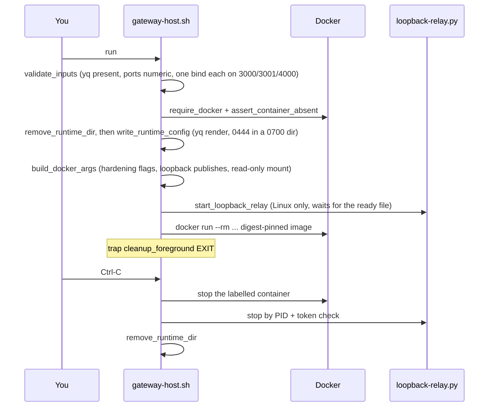
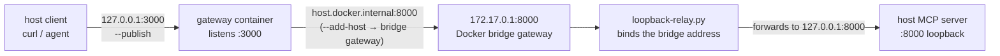
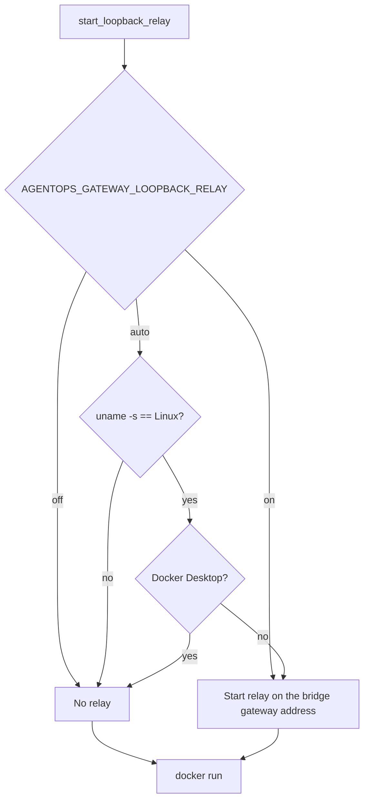
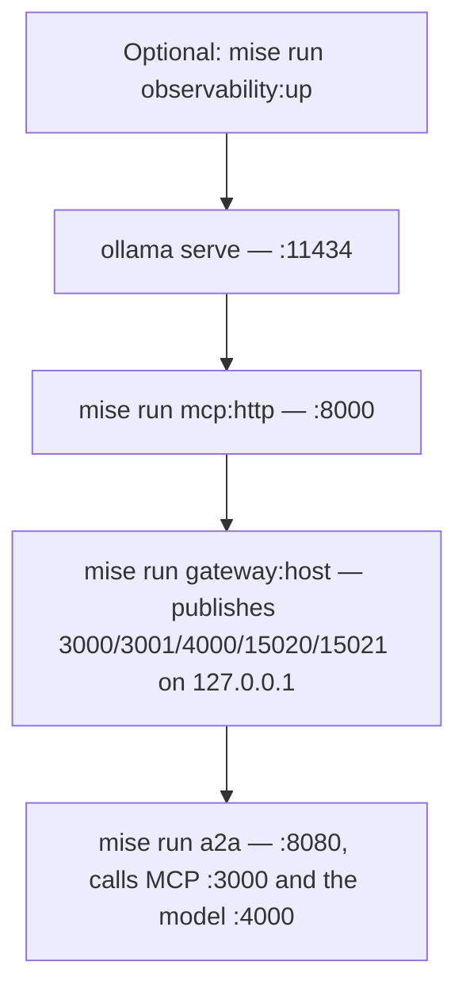

# 5.1. Gateway Setup

## What are the prerequisites?

Complete Chapters 1-4, install Ollama, and run the offline gate:

```bash
mise run check
mise run test
ollama pull qwen3:4b-instruct
mise run doctor:model
mise run doctor:gateway
```

The host profile needs no Kubernetes cluster, cloud account, or provider key. The two doctor profiles check exactly what the next steps assume, and nothing else: `doctor:model` fails unless `qwen3:4b-instruct` already answers on `127.0.0.1:11434`, and `doctor:gateway` requires `curl`, `docker`, `jq`, and `yq` on `PATH`, an answering Docker daemon, `docker compose version`, an executable wrapper script, and both installed virtualenvs. See [`doctor.sh`](https://github.com/MLOps-Courses/agentops-open-course/blob/main/scripts/doctor.sh). `yq` is not decoration: the wrapper rewrites the config with it before every start.

Before starting long-lived processes, run the deterministic smoke harness:

```bash
mise run smoke:host
```

It starts isolated fake-model, MCP, A2A, and gateway processes on temporary ports, verifies all four gateway surfaces plus CORS/readiness, and tears them down. It proves the host composition without spending model time; it does not inspect the manual Ollama stack you start next.

## What does the host wrapper actually run?

A gateway is the one process in the lab that terminates traffic from clients you do not control. Running it as root, writable, and bound to every interface is how a learning environment becomes an exposure. The general rule — the more traffic a component sees, the fewer privileges it should hold — is why this course never tells you to run the gateway binary directly.

`mise run gateway:host` is one line of `mise.toml`: `infra/scripts/gateway-host.sh run`. Everything below is that script.



**The config is rendered, not used as-is.** The checked-in `infra/agentgateway/host/config.yaml` points at `localhost` upstreams because that is what it means on the host. Inside a container, `localhost` is the container. So `render_config()` rewrites the three upstream addresses and adds the operational listeners:

```bash
.config.statsAddr = "0.0.0.0:15020" |
.config.readinessAddr = "0.0.0.0:15021" |
.config.adminAddr = "off"
```

The rewrite sends the MCP target to `http://host.docker.internal:8000/mcp`, the A2A backend to `host.docker.internal:8080`, and the model `hostOverride` to `host.docker.internal:11434`. `0.0.0.0` here is container-scoped, not host-scoped: those two listeners are only reachable through the loopback publishes below. `adminAddr = "off"` removes the admin surface entirely — nothing to protect is better than something to protect. See [`gateway-host.sh`](https://github.com/MLOps-Courses/agentops-open-course/blob/main/infra/scripts/gateway-host.sh).

The rendered file is written `0444` into a `0700` runtime directory under `$XDG_RUNTIME_DIR` and mounted read-only. The container never sees your working tree.

**The container runs with the privileges it needs and no others.** These are the literal arguments from `build_docker_args()`:

```bash
docker_args=(
	run
	--pull missing
	--user 65532:65532
	--read-only
	--cap-drop ALL
	--security-opt no-new-privileges=true
	--tmpfs "/tmp:rw,noexec,nosuid,nodev,size=16m,mode=1777"
	--add-host host.docker.internal:host-gateway
)
```

| Flag                                                                   | What it buys you                                                                      |
| ---------------------------------------------------------------------- | ------------------------------------------------------------------------------------- |
| `--user 65532:65532`                                                   | The `nonroot` UID convention. A container escape starts as an unprivileged user.      |
| `--read-only`                                                          | No writes to the image filesystem, so a compromised process cannot persist a payload. |
| `--cap-drop ALL`                                                       | The gateway binds only unprivileged ports; it needs no Linux capability at all.       |
| `--security-opt no-new-privileges=true`                                | No setuid binary inside can regain privilege.                                         |
| `--tmpfs /tmp:...,noexec,nosuid,nodev`                                 | The one writable path is capped at 16 MB and cannot execute what is dropped into it.  |
| `--publish 127.0.0.1:3000:3000` (and `3001`, `4000`, `15020`, `15021`) | The host side of every listener is loopback. Your gateway is not on the LAN.          |
| `--mount ...,dst=/etc/agentgateway/config.yaml,readonly`               | Policy is immutable at runtime.                                                       |
| `@sha256:c3ce7b75...` on `agentgateway:v1.3.1`                         | The tag can move; the digest cannot. Same bytes on every machine and in CI.           |

Read that publish line carefully: the **left** side is what changes when a port is taken, the **right** side is fixed at `3000`/`3001`/`4000` because the config binds those. The wrapper enforces that invariant up front — `validate_inputs()` fails with `canonical config must contain exactly one MCP, A2A, and model bind` if you edit the binds.

**The wrapper only ever touches its own container.** It labels what it starts with `dev.fmind.agentops.host-gateway=true`; `assert_container_absent()` refuses to start over an existing name (`choose another name or inspect it before removal`), and `stop_managed_container()` refuses to stop a container without that label (`refusing to stop unowned container`). `status` and `logs` apply the same check. This is a rule worth stealing for your own lab scripts: **a script may only destroy what it created**. A `docker rm -f agentgateway` in a helper script that hits an unrelated container of the same name is a lesson nobody wants twice.

## Why does native Linux need a bridge relay at all?

`--add-host host.docker.internal:host-gateway` is not magic DNS to "the host". On native Linux, Docker resolves it to the **bridge gateway address** (typically `172.17.0.1`). Your MCP server, A2A server, and Ollama are all bound to `127.0.0.1`, which the bridge address cannot reach — different interface. The two usual fixes are both bad: rebind those services to `0.0.0.0` and put your unauthenticated model and tool servers on the LAN, or run the gateway with `--network host` and lose the isolation above.

The third fix is a relay: bind **only** the bridge address, forward to loopback. The request path then has two hops the agent never sees — one _into_ the gateway over host loopback (the `--publish 127.0.0.1:3000:3000` bind), and one back _out_ to the host services through the relay (the gateway dials `host.docker.internal`, which `--add-host host.docker.internal:host-gateway` points at the bridge gateway):



The MCP `:8000` upstream stands in for all of them — the A2A `:8080` and model `:11434` upstreams take the identical path. When that relay actually runs is decided by `AGENTOPS_GATEWAY_LOOPBACK_RELAY`:



Docker Desktop on macOS and Windows is excluded because its VM already provides its own `host.docker.internal` transport to the host's loopback. That is `loopback_relay_required()` in full.

[`loopback-relay.py`](https://github.com/MLOps-Courses/agentops-open-course/blob/main/infra/scripts/loopback-relay.py) is ~120 lines of asyncio: `docker network inspect bridge` supplies the listen address, and it forwards TCP for the MCP (`8000`), A2A (`8080`), and model (`11434`) upstreams — plus the gateway's own published metrics port (`15020`), because Prometheus runs in Compose and `infra/observability/prometheus.yml` scrapes `host.docker.internal:15020`. It writes a ready file containing `listen_host`, `ports`, and a `token`; the wrapper waits for that file rather than sleeping, and `stop_loopback_relay()` refuses to signal a PID whose command line does not contain both this script and that exact token. Same ownership rule as the container.

Bridge scope is a host-exposure boundary, not per-container authentication. Any trusted container on Docker's default bridge can reach the relayed ports, so do not run untrusted containers there during this lab. A multi-user or hostile-container environment needs a dedicated owned network and host firewall policy.

## How do you start the host data plane?

Order matters, because each step is another step's upstream:



Keep the application processes in separate terminals so their logs remain visible. If Ollama is not already managed as a service, run `ollama serve` first.

Start the MCP server:

```bash
cd agents/python
mise run mcp:http
```

Start the digest-pinned gateway image from the repository root:

```bash
mise run gateway:host
```

The wrapper publishes MCP `:3000`, A2A `:3001`, model `:4000`, metrics `:15020`, and readiness `:15021` on `127.0.0.1`, and on native Linux starts the bridge relay described above. For a detached process, use `mise run gateway:host:start`; inspect it with `mise run gateway:host:status` and `mise run gateway:host:logs`.

Start the A2A agent with both governed client routes:

```bash
cd agents/python
AGENT_MODEL_PROVIDER=openai-compatible \
AGENT_MODEL=qwen3:4b-instruct \
AGENT_MCP_URL=http://127.0.0.1:3000/mcp \
OPENAI_BASE_URL=http://127.0.0.1:4000/v1 \
OPENAI_API_KEY=local-ollama \
mise run a2a
```

The agent is started last and points at gateway ports only. Nothing in that block names `:8000` or `:11434`: the agent no longer knows where its tools or its model actually live, which is the entire point of the chapter.

Do not substitute the raw `agentgateway -f ...` binary in the quickstart: its host listeners bind all interfaces. The wrapper is the checked loopback boundary.

## How do you inspect the rendered config without starting anything?

The rendered config is the file the gateway actually reads, so "it works on my machine" arguments should start there rather than at the checked-in YAML. Three read-only subcommands exist for that; they have no `mise` alias, so call the script:

```bash
infra/scripts/gateway-host.sh render
infra/scripts/gateway-host.sh args
infra/scripts/gateway-host.sh validate
```

1. `render` prints the rewritten YAML to stdout. Diff it against `infra/agentgateway/host/config.yaml` to see exactly what the wrapper changed and nothing else.
1. `args` prints the exact `docker` argv, one per line — the honest answer to "what is this task really doing to my machine".
1. `validate` renders into a temporary directory and runs the pinned image with `--validate-only --network none`, so the config is parsed by the real gateway binary with no network and no published port. Use it after editing policy, before restarting a working stack.

Combine them with the environment overrides below: `AGENTOPS_GATEWAY_CONFIG=config-auth.yaml infra/scripts/gateway-host.sh render` shows what the secured profile of [5.5](5.5.%20Gateway%20Security.md) mounts.

## How do you verify the listeners?

```bash
curl -fsS http://127.0.0.1:3001/.well-known/agent-card.json | jq '{name,url}'
curl -fsS http://127.0.0.1:15020/metrics | head
curl -fsS http://127.0.0.1:15021/healthz/ready
```

The first response should name `AgentOps Agent` and advertise the governed `:3001` address; the second should return Prometheus text; the third should print `ready`. MCP and model listeners use protocol requests shown on the next pages, so a successful TCP connection alone is not their checkpoint.

Do not go looking for `:15021` in `infra/agentgateway/host/config.yaml` — it is not there. Readiness is injected by the wrapper's render step (`.config.readinessAddr`), which is also why the Kubernetes profiles have no `15021` Service port and probe agentgateway with a `tcpSocket` connect instead ([5.5](5.5.%20Gateway%20Security.md#what-stays-unauthenticated-and-why)). `:15020` is in neither file for the same reason, but it _is_ a Service port in Kubernetes, because the in-cluster collector scrapes it.

## What exactly does the host smoke prove?

`mise run smoke:host` is the chapter's deterministic proof, and its design is the interesting part. It runs [`scripts/smoke-host.sh`](https://github.com/MLOps-Courses/agentops-open-course/blob/main/scripts/smoke-host.sh):

1. **It runs the real wrapper.** The harness sets `AGENTOPS_GATEWAY_*` and calls `infra/scripts/gateway-host.sh start` — the same code path you run by hand. A smoke test that reimplements the thing it tests proves nothing.
1. **It owns no fixed port.** Eight ephemeral ports are allocated by binding `:0`, then re-checked for uniqueness and bindability. It can run while your manual stack is up, and it cannot collide on `3000`.
1. **It spends no model time.** The model upstream is [`load/fake_model.py`](https://github.com/MLOps-Courses/agentops-open-course/blob/main/load/fake_model.py), a deterministic OpenAI-compatible server. The assertion is exact: `.choices[0].message.content` must equal `Fake model response for platform latency measurement.` and `.model` must be echoed back as `qwen3:4b-instruct`. Any gateway rewrite or truncation of the body fails the test.
1. **It asserts the allowlist by equality, not membership.** The MCP tool set through the gateway must be exactly `get_incident`, `get_runbook`, `get_service_status`, `list_incidents`, `search_runbooks`, `search_service_logs` — so a tool leaking _in_ fails as loudly as one going missing. Then `list_incidents` is actually called.
1. **It checks the A2A identity and one real turn.** The agent card's `name` must be `AgentOps Agent` and its `url` must be the gateway's A2A address, not the raw `:8080`. One `message/send` must return a task or message with no error.
1. **It checks CORS both ways.** A preflight from `http://localhost:8001` must return 2xx _with_ a matching `Access-Control-Allow-Origin`; a preflight from `http://evil.invalid` must come back with **no** `Access-Control-Allow-Origin` header at all. Only testing the allowed origin would pass against a wildcard policy.
1. **It scrapes metrics twice.** Once from the host, once from a pinned `curlimages/curl` container on the bridge via `host.docker.internal` — because Prometheus lives in Compose, and on native Linux that second scrape is what proves the relay works. On native Linux it additionally asserts the relay's ready file reports the bridge gateway address, not `0.0.0.0` or `127.0.0.1`, and that the metrics port is relayed.
1. **It proves teardown.** After `stop`, the container must not exist and every spawned PID must be dead. On success the work directory is deleted; on failure it is preserved and its path printed, with the gateway and relay logs already captured.

The ordering assertions are worth noting too: MCP is brought up to `/livez` only, because it is a read-only consumer that stays _unready_ until the A2A server publishes the shared database — that dependency is asserted, not assumed.

## What goes wrong first, and how do you tell?

The wrapper fails fast with a prefixed message rather than leaving a half-started stack. The common ones, in the order learners hit them:

| Message or symptom                                                                                     | Cause                                                      | Fix                                                                 |
| ------------------------------------------------------------------------------------------------------ | ---------------------------------------------------------- | ------------------------------------------------------------------- |
| `gateway-host: yq is required`                                                                         | `yq` missing; the render step cannot run                   | `mise run install`, then `mise run doctor:gateway`                  |
| `gateway-host: Docker daemon is unavailable`                                                           | Daemon not running or your user lacks socket access        | Start Docker; re-run `mise run doctor:gateway`                      |
| `gateway-host: canonical config must contain exactly one MCP, A2A, and model bind`                     | You edited or removed a `3000`/`3001`/`4000` bind          | Restore the bind; change the _published_ port instead (table below) |
| `gateway-host: container 'agentops-host-gateway' already exists`                                       | A previous `gateway:host:start` is still around            | `mise run gateway:host:status`, then `mise run gateway:host:stop`   |
| `gateway-host: refusing to stop unowned container ...`                                                 | Something else already owns that container name            | Inspect it yourself; or set `AGENTOPS_GATEWAY_CONTAINER`            |
| `gateway-host: Linux loopback relay requires the installed agent Python; run 'mise run install' first` | `agents/python/.venv` is absent                            | `mise run install` (or point `AGENTOPS_GATEWAY_PYTHON` at a Python) |
| `gateway-host: loopback relay did not become ready`                                                    | Bridge address already in use for one of the relayed ports | The last 40 relay log lines are printed above the error — read them |
| `docker: ... address already in use`                                                                   | Something else holds `3000`/`3001`/`4000`/`15020`/`15021`  | Override the published port (table below)                           |
| Gateway starts, but requests return 502                                                                | An upstream is not up yet, or the relay is off             | Check the startup order diagram; MCP and Ollama come first          |

Every knob the script honours is documented in `infra/scripts/gateway-host.sh --help`:

| Variable                                                                                    | Default                                  | When you need it                                                              |
| ------------------------------------------------------------------------------------------- | ---------------------------------------- | ----------------------------------------------------------------------------- |
| `AGENTOPS_GATEWAY_CONTAINER`                                                                | `agentops-host-gateway`                  | A second gateway alongside the first                                          |
| `AGENTOPS_GATEWAY_MCP_PORT`, `_A2A_PORT`, `_MODEL_PORT`, `_METRICS_PORT`, `_READINESS_PORT` | `3000`, `3001`, `4000`, `15020`, `15021` | A published port is taken — update the agent's URLs to match                  |
| `AGENTOPS_MCP_UPSTREAM_PORT`, `AGENTOPS_A2A_UPSTREAM_PORT`, `AGENTOPS_MODEL_UPSTREAM_PORT`  | `8000`, `8080`, `11434`                  | Your host processes listen somewhere else                                     |
| `AGENTOPS_GATEWAY_CONFIG`                                                                   | `infra/agentgateway/host/config.yaml`    | A path, or a bare basename resolved in the host config directory              |
| `AGENTOPS_GATEWAY_AUTH_DIR`                                                                 | the host `auth/` directory               | TLS/JWKS source for the secured profile ([5.5](5.5.%20Gateway%20Security.md)) |
| `AGENTOPS_GATEWAY_LOOPBACK_RELAY`                                                           | `auto`                                   | Force `on` or `off` when the detection is wrong for your setup                |
| `AGENTOPS_GATEWAY_PYTHON`                                                                   | the agent virtualenv Python              | The relay interpreter                                                         |
| `AGENTOPS_GATEWAY_RUNTIME_DIR`                                                              | under `$XDG_RUNTIME_DIR`                 | Rendered config and relay state live here                                     |

Overriding a published port changes only the host side. `AGENTOPS_GATEWAY_MCP_PORT=3100` still publishes the container's `3000`; point `AGENT_MCP_URL` at `http://127.0.0.1:3100/mcp` and everything else is unchanged.

## How do you enable host observability?

Start the Compose stack **before** the gateway/agent when you want complete startup traces:

```bash
mise run observability:up
```

Add this to the agent process environment:

```bash
OTEL_EXPORTER_OTLP_ENDPOINT=http://127.0.0.1:4318
OTEL_EXPORTER_OTLP_PROTOCOL=http/protobuf
OTEL_SERVICE_NAME=agentops-agent
```

The host agent exports traces when those variables are set. The host gateway always exposes metrics on `:15020`, which Compose Prometheus scrapes, but deliberately leaves OTLP export disabled so the optional collector can be stopped without retry noise. Kubernetes gateway profiles enable OTLP because their collector is deployed with them. MLflow is on `127.0.0.1:5000`, Grafana on `127.0.0.1:3002`, and Prometheus on `127.0.0.1:9090`.

## How do you stop the host profile?

Stop the foreground gateway, A2A, and MCP processes with `Ctrl-C`. Stop a detached gateway explicitly; the wrapper also removes its bridge relay:

```bash
mise run gateway:host:stop
mise run observability:down
```

Foreground `run` cleans up through an `EXIT` trap — container stopped, relay signalled, runtime directory removed — so `Ctrl-C` leaves nothing behind. A detached `start` deliberately has no such trap: that is why `stop` exists, and why it is the only way to remove the relay and rendered config that a `start` left running.

The observability task preserves its MLflow, Prometheus, and Grafana volumes. Delete volumes only when the observability chapter explicitly asks you to reset them.

## Which gateway tasks exist, and when do you run each?

Chapter 5 spreads roughly a dozen `mise run` tasks across a multi-terminal lab. This is the consolidated reference — the foreground-versus-detached distinction (`gateway:host` blocks a terminal; `gateway:host:start` returns and needs an explicit `stop`) is the one most worth internalizing:

| Task                                  | What it does                                                       | When                          |
| ------------------------------------- | ------------------------------------------------------------------ | ----------------------------- |
| `mise run gateway:host`               | Run the loopback host gateway in the **foreground** (Ctrl-C exits) | one-terminal quickstart       |
| `mise run gateway:host:start`         | Start the gateway **detached**                                     | multi-terminal labs           |
| `mise run gateway:host:status`        | Show the course-owned gateway container                            | is it running?                |
| `mise run gateway:host:logs`          | Follow the gateway logs                                            | debugging a 4xx / route       |
| `mise run gateway:host:stop`          | Stop a detached gateway and remove its bridge relay                | after a `start`               |
| `mise run gateway:host:auth`          | Run the secured profile (JWT + API key + TLS)                      | Chapter 5.5                   |
| `mise run smoke:host`                 | Exercise the model, MCP, A2A, CORS, and metrics path               | the chapter checkpoint        |
| `mise run mcp:http`                   | Serve the raw MCP server over Streamable HTTP (`agents/python`)    | inspecting `:8000` directly   |
| `mise run a2a`                        | Serve the raw A2A server (`agents/python`)                         | the upstream A2A backend      |
| `mise run client:web`                 | Serve the offline A2A web client                                   | exercising A2A from a browser |
| `mise run observability:up` / `:down` | Start/stop the host telemetry stack                                | Chapter 7 correlation         |

## What is the setup checkpoint?

Keep the isolated `mise run smoke:host` result as the deterministic composition proof. On the manual Ollama stack, confirm the agent card only through `:3001`, list MCP tools through `:3000`, and make one model request through `:4000`. Do not bypass the gateway ports during the remaining chapter checks.
