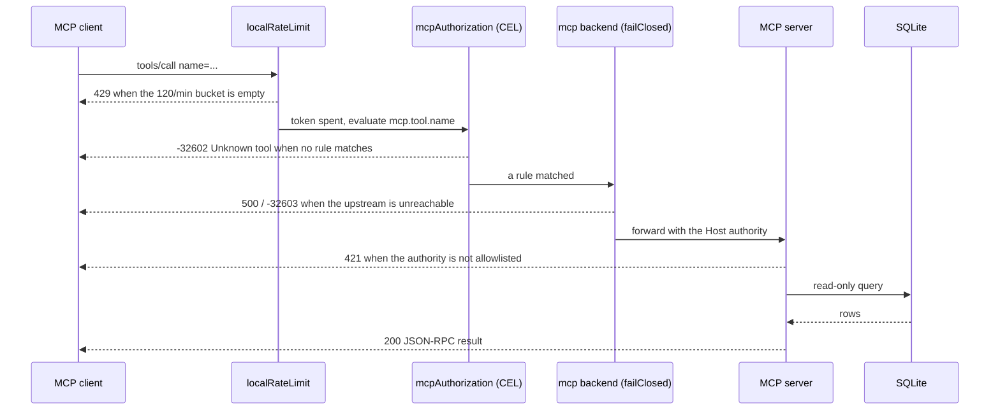
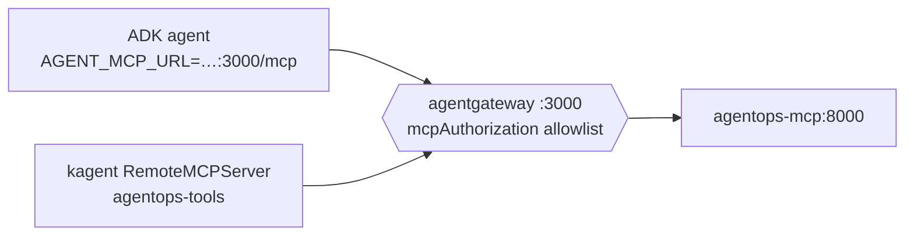

# 5.2. MCP Gateway

## How is the MCP route secured?

Chapter 3.3 turned the agent's read tools into a protocol server so something could sit between the caller and the tools and enforce policy on every message. The MCP route is where that promise is cashed in. The shipped `:3000` route stacks three policies before the backend and relies on one check after it — from `infra/agentgateway/host/config.yaml`:

```yaml
- port: 3000
  listeners:
    - name: mcp
      routes:
        - policies:
            localRateLimit:
              - maxTokens: 120
                tokensPerFill: 120
                fillInterval: 60s
            mcpAuthorization:
              rules:
                - 'mcp.tool.name == "list_incidents"'
                - 'mcp.tool.name == "get_incident"'
                - 'mcp.tool.name == "get_service_status"'
                - 'mcp.tool.name == "search_service_logs"'
                - 'mcp.tool.name == "get_runbook"'
                - 'mcp.tool.name == "search_runbooks"'
          backends:
            - mcp:
                failureMode: failClosed
                targets:
                  - name: agentops-agent
                    mcp:
                      host: http://localhost:8000/mcp
```

`localRateLimit` is a per-instance token bucket; `mcpAuthorization` is an **allowlist expressed in CEL** (Common Expression Language) — each rule is a boolean predicate evaluated against the request, and a call is admitted only if at least one predicate is true; the `failClosed` backend decides what happens when the upstream is unreachable. Naming the CEL layer matters, because it is the exact seam Chapter 5.5 extends: once a verified identity exists, the same rules gain a `jwt.sub` term (`jwt.sub == "ops-admin" && mcp.tool.name == "search_service_logs"`) and become per-caller — same mechanism, one more clause. The `k3d`/GKE profiles keep this route byte-for-byte identical and only change the target to the internal `agentops-mcp` service; the host profile's committed `http://localhost:8000/mcp` is itself rewritten at container start (see the container-address question below).

One `tools/call` therefore passes through four gates, each with a distinct observable outcome:



Every one of those status codes is reproduced under its own question below, so the policy is something you verify, not something you take on faith.

## Why re-list tools the MCP server already restricts?

A fair objection: `mcp_server.py` already exports only six read tools, so the `mcpAuthorization` list looks redundant. It is not, and the reason is the whole point of putting policy at a shared boundary instead of inside one client. The agent is not the only MCP client in the cluster. `infra/kagent/toolserver.yaml` declares a `RemoteMCPServer` that points kagent at the same gateway URL:

```yaml
spec:
  description: Read-only incident, service, log, and runbook tools through agentgateway.
  url: http://agentgateway.agentops.svc.cluster.local:3000/mcp
  protocol: STREAMABLE_HTTP
  timeout: 30s
```

kagent is a second, non-ADK consumer. It never imports the agent's Python, never sees `mcp_server.py`, and inherits the six-tool allowlist purely by dialing `:3000`. Tighten the CEL rules once and every current and future caller of the data plane is bound by them; there is no code path where a new client can quietly acquire a seventh tool. That is the argument the allowlist encodes: policy defined once at a boundary cannot be forgotten by the next integration.



## Why are write tools absent?

`restart_service` and `resolve_incident` are never added to the MCP server in the first place — they depend on ADK's confirmation flow and audit identity, neither of which survives a translation into stateless protocol messages. They remain in the agent process and cannot be discovered or invoked through MCP at all. The gateway allowlist and the server's export list therefore describe the same six functions from two sides: a write action is missing at the source, and even if a future edit leaked one into the server, the CEL allowlist would still refuse to route it. Keeping the read surface and the write surface physically separate is what makes the authorization boundary easy to reason about ([4.5](../4.%20Quality/4.5.%20Guardrails.md)).

## What does failClosed actually decide?

`failureMode` chooses what a policy point does when it cannot reach the thing it is protecting. `failClosed` denies the request; the alternative the schema offers, `failOpen`, would let it through unmediated. For a tool gateway the right choice is not a toggle preference — it is the definition of the control. A gateway that fails open when its backend is unreachable is a gateway that stops enforcing exactly when something is already wrong, which is the moment you most need the policy to hold. Stop the MCP backend and repeat any request: the gateway returns HTTP `500` with a JSON-RPC `-32603` error naming the refused upstream connection, and even the `initialize` handshake fails. Nothing reaches a dead backend, and no caller mistakes an outage for an empty result. The cost is honesty: `failClosed` means a backend blip is a hard denial rather than a silent degrade, which is the correct trade for an operations tool that reads incident state.

## Which address does the container really dial?

The committed host config targets `http://localhost:8000/mcp`, but a learner who reads only that file would be looking for a value the container never uses. `infra/scripts/gateway-host.sh` renders a network-correct copy before it starts the pinned image, rewriting the loopback target to Docker's host bridge alias; `scripts/check-infra.sh` asserts the exact rewritten string:

```bash
[[ "${container_mcp}" == "http://host.docker.internal:8000/mcp" ]]
```

That rewrite is why the backend's Host check does not reject the gateway's forwarded requests. The MCP server keeps DNS-rebinding protection enabled even when it binds to all interfaces, from `mcp_server.py`:

```python
mcp = FastMCP(
    "agentops-agent",
    host=os.environ.get("MCP_HOST", "127.0.0.1"),
    port=int(os.environ.get("MCP_PORT", "8000")),
    stateless_http=True,
    transport_security=TransportSecuritySettings(
        enable_dns_rebinding_protection=True,
        allowed_hosts=_allowed_hosts(),
        allowed_origins=list(_ALLOWED_ORIGINS),
    ),
)
```

The `_DEFAULT_ALLOWED_HOSTS` tuple in the same file explicitly lists `host.docker.internal`, `agentgateway`, `agentgateway.agentops.svc.cluster.local`, `agentops-mcp`, and the loopback forms — precisely the authorities each profile forwards. `_allowed_hosts()` reads `MCP_ALLOWED_HOSTS` as a comma-separated **full override** (not an addition), so a deployment can narrow the set without ever falling back to `*`. Send a `Host` header the server does not expect and it answers `421 Misdirected Request` before any protocol handling: a second, transport-layer defense underneath the gateway's CEL allowlist.

## How does the deployed agent select this path?

The Kubernetes agent flips to the gateway with one variable, from `infra/kagent/agent.yaml`:

```bash
AGENT_MCP_URL=http://agentgateway:3000/mcp
```

`root_agent` then replaces its local read/knowledge functions with a single remote toolset; guarded writes and the instruction-only skills stay in-process. A secured route (Ch. 5.5) needs a second variable, `AGENT_MCP_TOKEN`, and both transports carry the course deadline so a hung gateway fails a turn instead of hanging it — from `mcp_client.py`:

```python
endpoint = url or settings.mcp_url
if endpoint:
    # A secured gateway route (Ch. 5.5) authenticates the caller by bearer
    # token; the default local route needs no header.
    headers = {"Authorization": f"Bearer {settings.mcp_token.get_secret_value()}"} if settings.mcp_token else None
    return McpToolset(
        connection_params=StreamableHTTPConnectionParams(
            url=endpoint,
            headers=headers,
            timeout=settings.tool_timeout_s,
            sse_read_timeout=settings.tool_timeout_s,
        ),
    )
```

`settings.tool_timeout_s` (30 s) becomes both `timeout` and `sse_read_timeout`, so a stalled gateway is a fast tool failure, never an unbounded wait. `mcp_token` is a `SecretStr`, so it is absent when unset — no empty `Authorization` header leaks onto the open local route — and masked wherever configuration is printed. See [`mcp_client.py`](https://github.com/MLOps-Courses/agentops-open-course/blob/main/agents/python/src/agent/mcp_client.py); the same excerpt is build-checked into [3.3](../3.%20Capabilities/3.3.%20MCP.md).

## How do you list tools through the gateway?

With the host stack running, execute from `agents/python/`:

```bash
uv run python - <<'PY'
import asyncio

import httpx
from mcp import ClientSession
from mcp.client.streamable_http import streamable_http_client

URL = "http://127.0.0.1:3000/mcp"


async def main() -> None:
    async with httpx.AsyncClient() as client:
        async with streamable_http_client(
            URL,
            http_client=client,
            terminate_on_close=False,
        ) as (read, write, get_session_id):
            async with ClientSession(read, write) as session:
                await session.initialize()
                result = await session.list_tools()
                print("\n".join(sorted(tool.name for tool in result.tools)))
            session_id = get_session_id()

        if session_id:
            response = await client.delete(
                URL,
                headers={"Mcp-Session-Id": session_id},
            )
            if response.status_code not in {200, 202, 204}:
                response.raise_for_status()


asyncio.run(main())
PY
```

Expected names are the six read/runbook tools in the allowlist. No write action appears.

The explicit `DELETE` checks session cleanup instead of hiding it, and it exposes a version-skew pitfall worth internalizing: the pinned gateway (`v1.3.1`) accepts session termination with `202`, but the pinned MCP Python client (`mcp >= 1.28.1`) has an automatic closer that recognizes only `200`/`204` and otherwise prints a misleading warning after a request that in fact succeeded. Whenever a pinned server and a pinned client library disagree on a protocol detail like this, prefer an explicit, status-checked call to the library's convenience path so a green run does not look red.

## What does a denied tool call look like?

The checkpoint below fails the route closed on a backend outage, but that never exercises the allowlist itself — a backend-down test would pass even if `mcpAuthorization` were deleted. Prove the allowlist is load-bearing by asking for a tool that is not in it. Call a write action by name through `:3000`:

```bash
uv run python - <<'PY'
import asyncio

from mcp import ClientSession
from mcp.client.streamable_http import streamable_http_client


async def main() -> None:
    async with streamable_http_client("http://127.0.0.1:3000/mcp", terminate_on_close=False) as (read, write, _):
        async with ClientSession(read, write) as session:
            await session.initialize()
            result = await session.call_tool("restart_service", {"service": "api"})
            print(result)


asyncio.run(main())
PY
```

The gateway answers with a JSON-RPC `-32602` error, `Unknown tool: restart_service`, over HTTP `400`. The denial is total: a tool with no matching CEL rule is not merely refused on call, it is filtered out of `tools/list` entirely, so a client cannot even discover it exists. Remove one of the six read rules from the config, restart the gateway, and the same thing happens to that read tool — the allowlist, not the server's export list, is what the caller sees.

## What does the rate limit guarantee?

`maxTokens: 120, tokensPerFill: 120, fillInterval: 60s` is a token bucket that refills to 120 every 60 seconds: **120 requests per minute, per gateway instance**. Send more and the surplus returns HTTP `429` until the next refill. That number is a shared contract, not a loose default — `load/mcp-read.js` encodes the same budget as a hard threshold so the load test measures the platform rather than its own throttle:

```javascript
mcp_rate_limited: ['count==0'], // any 429 means the gateway budget, not the platform, was measured
```

The k6 scenario defaults to 60 tool calls per minute, comfortably under 120, so a single `429` fails the run and tells you the request rate crossed the gateway budget instead of surfacing real backend latency. Be honest about what this control is: it belongs to one instance and has no authenticated-user dimension, so it blunts accidental bursts in this single-replica lab but is not a per-tenant quota. A production budget needs identity, a shared policy/quota store, and a decision for rejected versus queued work ([5.5](./5.5.%20Gateway%20Security.md)).

## What is the MCP checkpoint?

Stop the raw MCP process and repeat the list request: the gateway must fail closed with `500`/`-32603`. Restart it, confirm the six tools return, and additionally call `restart_service` by name to confirm the allowlist denies it with `-32602 Unknown tool`. Inspect gateway logs and `:15020` metrics for each outcome — a denial, a rate-limited `429`, and a fail-closed `500` should all be visible as gateway decisions, not inferred from the client alone.
