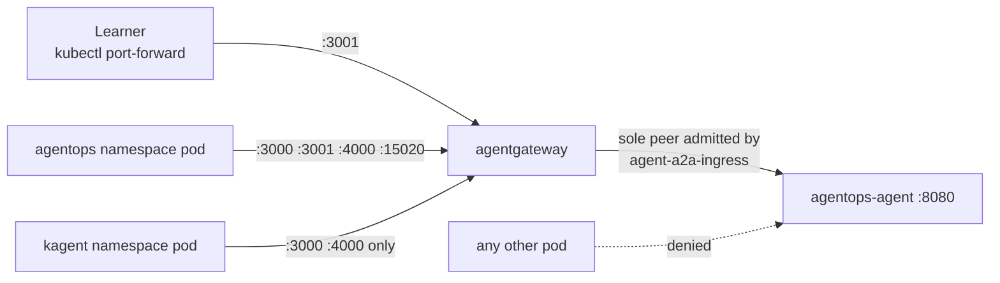
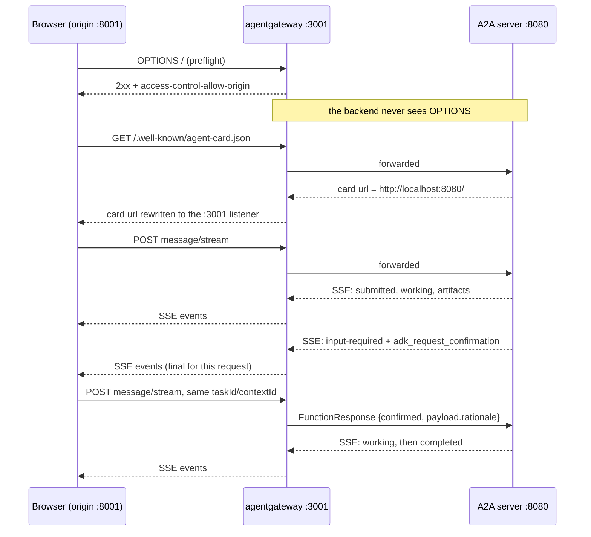

# 5.3. A2A Gateway

## How is A2A routed?

A2A is JSON-RPC over HTTP with Server-Sent Events for streaming ([3.6](../3.%20Capabilities/3.6.%20A2A.md)) — deliberately boring transport, which is exactly what makes it governable by ordinary infrastructure. The gateway's job on this route is to become the only address a client ever needs to know.

The host profile [`infra/agentgateway/host/config.yaml`](https://github.com/MLOps-Courses/agentops-open-course/blob/main/infra/agentgateway/host/config.yaml) composes three policies on one route:

```yaml
- port: 3001
  listeners:
    - name: a2a
      routes:
        - policies:
            a2a: {}
            # The single-file course client is served on this exact local
            # origin. Keep the browser boundary narrow: no wildcard origin.
            cors:
              allowOrigins:
                - "http://localhost:8001"
              allowMethods:
                - GET
                - POST
                - OPTIONS
              allowHeaders:
                - content-type
            localRateLimit:
              - maxTokens: 60
                tokensPerFill: 60
                fillInterval: 60s
          backends:
            - host: localhost:8080
```

`a2a: {}` makes the route protocol-aware, `cors` draws the browser boundary, and `localRateLimit` bounds arrival rate. The k3d/GKE configs replace only the backend with `agentops-agent.agentops.svc.cluster.local:8080`; the three policies are identical across all three profiles, so what you verify on the host is what runs in the cluster.

## What does the a2a policy change on the wire?

`a2a: {}` looks like an empty stanza. It is the whole point of this route.

The application builds its card `url` from its own configured address, in [`server.py`](https://github.com/MLOps-Courses/agentops-open-course/blob/main/agents/python/src/agent/server.py):

```python
url=f"{settings.a2a_protocol}://{settings.a2a_host}:{settings.a2a_port}/",
```

With the defaults that string is `http://localhost:8080/` — the raw backend, pinned by `test_agent_card_is_public_and_does_not_expose_instruction`. A generic HTTP proxy would forward it untouched, and discovery would then hand every client a route _around_ the boundary it just crossed: fetch the card through `:3001`, be told to talk to `:8080`. In Kubernetes that address is not even reachable (see below), so the client would simply break.

The `a2a` policy rewrites the advertised `url` to the listener the client actually reached. `scripts/smoke-host.sh` asserts exactly that:

```bash
agent_name="$(jq -r '.name' "${work_dir}/agent-card.json")"
agent_url="$(jq -r '.url' "${work_dir}/agent-card.json")"
[[ "${agent_name}" == "AgentOps Agent" ]]
[[ "${agent_url}" == "http://localhost:${gateway_a2a_port}" ]]
```

Both the raw upstream port and the gateway port are randomly allocated per smoke run, so nothing hard-codes `8080` or `3001`: the assertion can only pass if the gateway rewrote the value it proxied. That is the mechanical difference between "the gateway forwards A2A" and "the gateway _is_ the A2A endpoint".

## Why use A2A policy instead of generic HTTP proxying?

The card rewrite above is the concrete answer; protocol awareness is the general one. A proxy that parses discovery and task traffic can attribute outcomes per route in its logs and metrics ([5.6](5.6.%20Gateway%20Observability.md)) and key future policy on protocol shape rather than on URL prefixes it guesses at. It is the same argument that put `mcpAuthorization` on the MCP route in [5.2](5.2.%20MCP%20Gateway.md): a rule enforced once at a shared boundary cannot be forgotten by the next client.

Do not overclaim the split. The application still owns task execution, streaming events, persistent task/session state, and the model-call budget. Nothing in this config understands `input-required`, an approval rationale, or the audit trail — those are ADK and application contracts ([4.5](../4.%20Quality/4.5.%20Guardrails.md)), and the gateway sees them only as JSON bodies it forwards.

## Which address should clients use?

Command-line host clients use `http://127.0.0.1:3001`; the gateway wrapper publishes the container port on loopback only. Kubernetes learners forward the ClusterIP first and then use the same local URL:

```bash
kubectl -n agentops port-forward svc/agentgateway 3001:3001
```

The direct agent `:8080` is an internal diagnostic boundary, not the documented client route.

```bash
curl -fsS http://127.0.0.1:3001/.well-known/agent-card.json \
  | jq '{name,version,capabilities,skills}'
```

Expected name: `AgentOps Agent`; expected skills: incident triage and guarded remediation.

Note what comes back: the card advertises `http://localhost:3001`, not the `127.0.0.1` you dialled. That is not sloppiness. Three addresses are deliberately distinct, and [`config.py`](https://github.com/MLOps-Courses/agentops-open-course/blob/main/agents/python/src/agent/config.py) keeps two of them apart on purpose:

```python
# Bind and advertised A2A addresses are deliberately separate. The host
# runtime stays loopback-only; Kubernetes explicitly opts into 0.0.0.0.
# Never advertise 0.0.0.0: it is a listener, not a callable endpoint.
a2a_bind_host: str = Field(default="127.0.0.1", min_length=1)
a2a_host: str = Field(default="localhost", min_length=1)
```

1. `AGENT_A2A_BIND_HOST` is where the socket listens — `127.0.0.1` on the host, while the container image explicitly opts into `0.0.0.0` (`test_container_explicitly_opts_into_an_a2a_network_bind` pins that opt-in to the Dockerfile).
1. `AGENT_A2A_HOST` is what the card advertises — a name a client can actually dial.
1. The gateway then overrides the advertised value with its own listener, per the section above.

The pitfall is collapsing the first two into one setting, which is what most quickstarts do. A bind address answers "which interfaces accept connections"; an advertised address answers "what should a stranger type". `0.0.0.0` is a valid answer to the first and a meaningless answer to the second — a card advertising it is a discovery document that discovers nothing.

## What keeps clients off the raw :8080 in Kubernetes?

Documentation is not enforcement. On the host, `:8080` stays reachable and loopback is the only thing keeping strangers out. In Kubernetes the governed route is mandatory, because `infra/k8s/base/network-policies.yaml` admits exactly one peer to the agent's A2A port:

```yaml
# The BYO agent's raw A2A listener is an implementation detail. Only
# agentgateway may enter it; agentops callers use the governed gateway service
# on :3001 instead. The kagent namespace is intentionally not admitted to A2A.
apiVersion: networking.k8s.io/v1
kind: NetworkPolicy
metadata:
  name: agent-a2a-ingress
  namespace: agentops
spec:
  podSelector:
    matchLabels:
      app.kubernetes.io/name: agentops-agent
  policyTypes: [Ingress]
  ingress:
    - from:
        - podSelector:
            matchLabels:
              app.kubernetes.io/name: agentgateway
      ports:
        - { port: 8080, protocol: TCP }
```

Two policies compose. `agentgateway-ingress` decides who reaches which listener — the `agentops` namespace gets `3000`/`3001`/`4000`/`15020`, the `kagent` namespace only `3000` and `4000`, because kagent consumes MCP and the model but never A2A. `agent-a2a-ingress` then reduces the agent's own `:8080` to a single admitted pod selector.



A caller that ignores the documented route does not get a slower path; it gets no path. Be precise about what this control is, though: NetworkPolicy is namespace- and pod-scoped reachability, not caller identity. It cannot tell one `agentops` pod's user from another's, an authenticated A2A listener is still absent ([5.5](5.5.%20Gateway%20Security.md)), and `kubectl port-forward` enters through the kubelet rather than from a pod, so these ingress rules never evaluate it. That is precisely why the lab stays private rather than exposed.

## How do I chat with the agent from a browser?

The repository ships a self-built, single-file A2A web client in `clients/web/` (vanilla JavaScript, no build step, no external requests, MIT licensed). It discovers the agent card, streams `message/stream` events over SSE with a `message/send` fallback, and renders each task state distinctly. Its incremental parser accepts the CRLF, LF, and CR separators allowed by SSE; the locked A2A server emits CRLF, and the server/client regression test preserves that wire contract.

Browsers enforce CORS, and neither the raw A2A server nor the `a2a`/`localRateLimit` policies emit CORS headers (the raw server answers preflight `OPTIONS` with `405`). The `cors` policy quoted at the top of this page exists for exactly this case, so the browser path stays on the governed `:3001` route.



The general rule the diagram encodes: preflight is answered _by the gateway_, so the backend never sees `OPTIONS` at all, and CORS is granted by the server but enforced by the browser. That is why the interesting test is the denied origin, not the allowed one. `scripts/smoke-host.sh` asserts both directions — an exact echo for the allowed origin:

```bash
[[ "${allowed_cors_status}" =~ ^2[0-9][0-9]$ ]]
allowed_origin="$(awk 'tolower($1) == "access-control-allow-origin:" { print $2 }' "${work_dir}/cors-allowed.normalized")"
[[ "${allowed_origin}" == "http://localhost:8001" ]]
```

and the _absence_ of the header for anyone else:

```bash
if awk 'tolower($1) == "access-control-allow-origin:" { found = 1 } END { exit found ? 0 : 1 }' "${work_dir}/cors-denied.normalized"; then
	die "gateway returned an Access-Control-Allow-Origin header for a denied origin"
fi
```

The preflight from `http://evil.invalid` still gets an HTTP response — it just carries no `access-control-allow-origin`, so the browser blocks its own request. An allowlist you never test against a denied origin is a comment, not a control.

Run it:

1. Start the A2A server (`mise run a2a` from `agents/python`) and the gateway (`mise run gateway:host` from the repository root).
1. Serve the client from the repository root: `mise run client:web`.
1. Open `http://localhost:8001` (the exact checked-in origin), keep the base URL `http://localhost:3001`, and press Connect.

The gateway answers the preflight itself and stamps `access-control-allow-origin` on the card, RPC, and SSE responses. No CORS policy means the browser blocks every call — `curl` keeps working because CORS is a browser-side control.

The most common failure here is the origin, not the policy. `mise run client:web` serves `clients/web` on port `8001` precisely because `http://localhost:8001` is the one string in the allowlist. Opening `index.html` from the filesystem gives the origin `null`; serving it on another port, or on `http://127.0.0.1:8001`, gives a different origin string. CORS matches origins by exact string, not by "the same machine". The symptom is confusing the first time — `curl` succeeds, the browser blocks, and the client's card fetch reports a hint about a missing CORS policy — so check the origin before you touch the config, and do not widen it to `*`, especially if you later add credentials.

## What does the web client show for a guarded action?

Asking for a mock remediation (for example "Restart the inventory service.") pauses the task in the `input-required` state. The stream's final event carries a long-running `adk_request_confirmation` function call whose arguments include the original call and its confirmation hint. The client keeps the preceding evidence/tool results visible, repeats the exact action arguments, warns that current state is revalidated at execution, and requires a rationale — the agent refuses approvals without one (Chapter 4.5).

Approving sends a `FunctionResponse` data part on the same `taskId`/`contextId` with `{"confirmed": true, "payload": {"rationale": "..."}}`; denying sends `"confirmed": false`. That exact round-trip is locked offline by `test_a2a_confirmation_response_resumes_the_guarded_action_with_audit_identity` in `tests/test_server.py`, which drives the same DataPart shape the browser sends, asserts the resumed task keeps its `taskId`/`contextId` and reaches `completed`, and then reads the audit row back:

```python
assert audit["approved_by"] == f"A2A_USER_{context_id}"
assert audit["rationale"] == rationale
```

That assertion is also the honest limit of the unauthenticated default path: the audit trail is enriched server-side in the same transaction as the action, but its approver is a synthetic A2A context user derived from the A2A context id, not a verified person. This browser round-trip requires a model backend (local Qwen3 through Ollama or a configured provider), unlike the deterministic fake-model test.

## Why does a token bucket not bound a streaming turn?

Rate limits are usually reasoned about as "requests per minute", which quietly assumes requests are short. A2A breaks that assumption: `message/stream` is one request that stays open for an entire turn.

The bucket on this route is 60 tokens, refilled to 60 every 60 seconds, and a token is spent when a request _arrives_. One `message/stream` POST spends exactly one token and may then hold its SSE response open while the agent runs a full tool loop. So this policy bounds arrival rate — not concurrency, not stream duration, not model spend. Sixty admitted streams can all be running at once, while the sixty-first _new_ request in that minute is rejected even if the process is idle.

Three consequences worth internalizing:

1. It is not a capacity limit. Concurrency is bounded by the A2A process itself — one Uvicorn, SQLite behind a single pooled writer ([3.6](../3.%20Capabilities/3.6.%20A2A.md)) — not by this policy.
1. It is not a spend limit. Per-turn model calls are capped in the application (next section); per-session token budgets are Chapter [7.3](../7.%20Observability/7.3.%20Costs.md).
1. It is not a quota. The bucket has no caller dimension and lives in one gateway instance's memory ([5.5](5.5.%20Gateway%20Security.md)).

Everything on `:3001` shares that bucket, including health probes — which is why the load script keeps a deliberate margin in `load/health.js`:

```javascript
gateway_hop: {
  // 30 requests/min keeps a 30-token margin under the gateway A2A rate limit.
  executor: 'constant-arrival-rate',
  rate: 30,
  timeUnit: '1m',
```

Its gateway hop measures proxy overhead by fetching `:3001/healthz`, and every one of those GETs competes with real client traffic for the same 60 tokens. A load generator that trips the limiter measures the limiter, not the hop.

## How are long-running tasks bounded?

"Long-running" fails in more than one way, and no single timeout addresses them all: too many callers arrive at once, one turn loops forever, or a deploy kills a turn mid-flight. This repository answers each with a separate, small control.

| Control                                                               | Where it lives                       | Bounds                                              | Blind to                                    |
| --------------------------------------------------------------------- | ------------------------------------ | --------------------------------------------------- | ------------------------------------------- |
| `localRateLimit` 60/min                                               | A2A route policy, all three profiles | A2A requests admitted per minute, per gateway pod   | Concurrency, turn duration, caller identity |
| `max_llm_calls` (`AGENT_A2A_MAX_LLM_CALLS`, default `12`)             | `_bounded_request` in `server.py`    | Model calls inside one turn's tool loop             | Wall-clock time, arrival rate               |
| `timeout_graceful_shutdown` (`AGENT_DRAIN_TIMEOUT_S`, default `10.0`) | `main()` in `server.py`              | Time in-flight requests get to finish after SIGTERM | Everything before shutdown                  |

The model-call budget is applied per request rather than configured once at startup, because ADK builds a fresh `RunConfig` per A2A request:

```python
converted = convert_a2a_request_to_agent_run_request(request, part_converter)
run_config = converted.run_config or RunConfig()
updates: dict[str, object] = {"max_llm_calls": settings.a2a_max_llm_calls}
```

Two properties follow. A client cannot raise its own budget: the server overrides the field _after_ conversion, and `test_a2a_requests_have_a_bounded_model_call_budget` proves it by feeding a converter that asks for `max_llm_calls=500` and asserting `12` survives. And a typo cannot buy an unbounded loop: `config.py` declares `a2a_max_llm_calls: int = Field(default=12, ge=1, le=100)`, so an out-of-range environment variable fails at startup with a named error instead of surfacing mid-turn.

The drain is the third control. Uvicorn owns SIGTERM: it stops accepting connections and gives in-flight requests `AGENT_DRAIN_TIMEOUT_S` (default `10.0`, bounded `gt=0, le=300`) to finish. It reduces avoidable interruption; it is not a correctness mechanism. A turn that exceeds it is still cut, which is why state changes are transactional ([4.5](../4.%20Quality/4.5.%20Guardrails.md)) rather than relying on drain time. In Kubernetes, `terminationGracePeriodSeconds` must exceed this value, or the kubelet kills the process before its own drain expires.

The pitfall is collapsing all three into "one timeout". A single request deadline would not stop a burst at the boundary, would not stop a tool loop inside an already-admitted turn, and would still cut in-flight work at shutdown. Different failure modes, different layers.

## What is still missing for public A2A?

The default A2A path creates no public endpoint, client authentication, TLS, per-tenant authorization, request-size policy, or distributed task store. Port-forwarding/loopback keep the lab private. Chapter [5.5](5.5.%20Gateway%20Security.md) adds an opt-in local authenticated/TLS profile, but it does not turn this into a public edge — and even there, the gateway validates the caller without propagating that identity into the action audit. Adding public exposure before production identity and abuse controls would be a regression.

## What is the A2A checkpoint?

Run `cd agents/python && uv run pytest tests/test_server.py` to lock the SSE and confirmation/resume wire contracts with a fake model. Then fetch the agent card through `:3001`, stop the A2A backend, and confirm the gateway returns a failure rather than a stale success. Restart it and verify the card again. A live model is not needed for either checkpoint.

`mise run smoke:host` covers the two claims on this page that are easy to assume and easy to get wrong: that the card returned through the gateway advertises the gateway's own port on randomly allocated ports, and that the allowed origin gets an exact `access-control-allow-origin` echo while a denied origin gets none.
