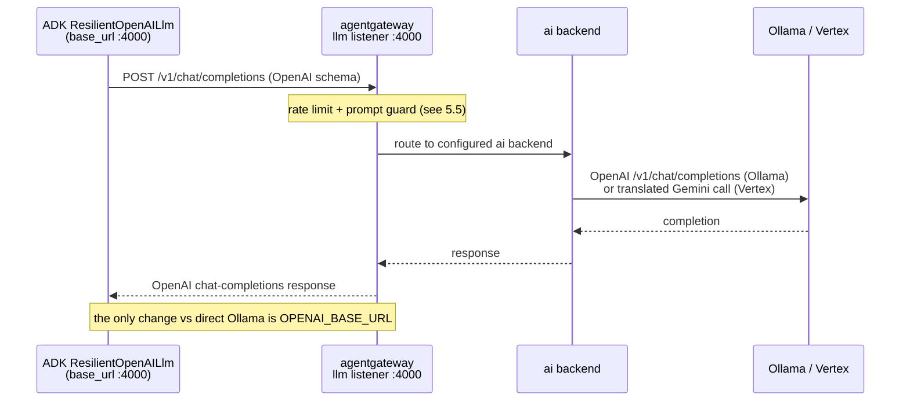
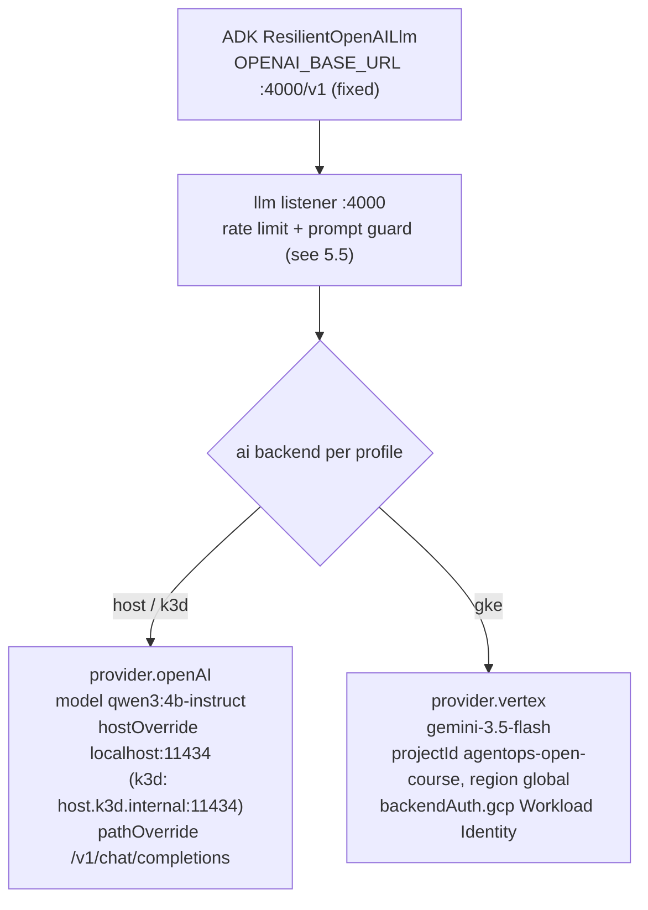

# 5.4. Model Gateway

## What does "OpenAI-compatible" actually standardize?

OpenAI's `POST /v1/chat/completions` request and response shape has become a de-facto interface standard. Ollama, vLLM, llama.cpp, most hosted providers, and agentgateway itself all speak it, which means the _transport_ is uniform across backends: the URL path, the JSON body (`model`, `messages`, `temperature`), the streaming event format, and the `Authorization: Bearer …` header look the same no matter what runs behind them. That uniformity is what makes a proxy possible at all. A gateway can speak the same schema on both sides — OpenAI in from the caller, OpenAI (or something it translates) out to the backend — so the client cannot tell whether it reached a local model directly or a gateway that re-homed the request somewhere else.

Routing model traffic through that proxy buys three things beyond this repository. **Transport uniformity**: the application keeps one client library and one payload shape. **One policy point**: authentication, rate limits, and prompt guards are enforced once for every caller of the endpoint instead of re-implemented in each agent. **Provider swap with zero application-code change**: moving from a local model to a hosted one becomes an endpoint change, not a code change. That last property is the whole point of this page.

It is also why this repository ships no provider-adapter library. A common alternative is to route through a translation shim like LiteLLM so one call reaches many providers; `AGENTS.md` records the opposite decision as an invariant — "No LiteLLM or garak contract" — because the OpenAI-compatible interface already _is_ the abstraction. ADK's OSS client and, when needed, the gateway's own translation cover the same ground without a second dependency on the request path.



What OpenAI-compatibility does _not_ standardize is covered later on this page: tool-call formats, context limits, JSON behavior, token accounting, content policy, latency, and quality all still vary.

## What is the application contract?

The Python agent keeps its OpenAI-compatible provider and changes only the endpoint from direct Ollama to agentgateway:

```bash
AGENT_MODEL_PROVIDER=openai-compatible
AGENT_MODEL=qwen3:4b-instruct
OPENAI_BASE_URL=http://127.0.0.1:4000/v1
OPENAI_API_KEY=local-ollama
```

`AGENTS.md` is the authority: "Chapter 5 changes only `OPENAI_BASE_URL` to the agentgateway listener." Nothing else in the agent moves. That is not a convention the docs impose; it falls out of how the model is built. `build_model()` in [`model.py`](https://github.com/MLOps-Courses/agentops-open-course/blob/main/agents/python/src/agent/model.py) returns a `ResilientOpenAILlm` — ADK's OpenAI-compatible client — and hands the already-validated endpoint and marker straight to the SDK constructor rather than mutating process-wide environment state:

```python
@cached_property
def _openai_client(self) -> AsyncOpenAI:
    return AsyncOpenAI(
        base_url=self.openai_base_url,
        api_key=self.openai_api_key.get_secret_value(),
        timeout=self.timeout_s,
        max_retries=self.retries,
    )
```

Because `base_url`, `api_key`, `timeout`, and `max_retries` are passed as explicit constructor arguments, pointing the client at the gateway is a settings change (`OPENAI_BASE_URL`) with no new code path — the same client object dials a different authority.

The marker key satisfies the client library in the default unauthenticated host profile. It is not an Ollama credential. The `:4000` listener also carries a per-instance rate limit and request/response prompt guards, and on the k3d/GKE profiles an enforced `apiKey` — all owned by [5.5. Gateway Security](5.5.%20Gateway%20Security.md#which-controls-are-active-in-every-profile). Read that page for what else sits on this port; here the point is only that the application contract is one line.

## How is local Qwen3 configured?

```yaml
backends:
  - ai:
      name: ollama
      hostOverride: localhost:11434
      pathOverride: /v1/chat/completions
      provider:
        openAI:
          model: qwen3:4b-instruct
```

Read the `ai` backend as an object model. `hostOverride` is the upstream authority (`host:port`) the gateway dials. `pathOverride` is the URL path it POSTs to on that upstream — Ollama serves chat completions at `/v1/chat/completions`. `provider.openAI` tells the gateway to speak the OpenAI wire protocol to that upstream and names the `model` it forwards. Together they make the config readable: this backend is "talk OpenAI to `localhost:11434` at `/v1/chat/completions`, asking for `qwen3:4b-instruct`."

The k3d profile changes exactly one field: `hostOverride` becomes `host.k3d.internal:11434`, the bridge address that reaches Ollama on the workstation from inside the cluster. `pathOverride` and `provider.openAI` are identical. The application contract does not move; only the address the gateway dials does.



## How does the gateway reach Vertex Gemini on GKE?

The GKE profile keeps the same `:4000` listener and the same OpenAI-compatible application contract, then swaps the Ollama backend for a Vertex one:

```yaml
backends:
  - ai:
      name: vertex
      provider:
        vertex:
          model: gemini-3.5-flash
          projectId: agentops-open-course
          region: global
      policies:
        backendAuth:
          gcp: {}
```

The gateway translates the incoming OpenAI-compatible chat-completions request into a Vertex Gemini call — `gemini-3.5-flash` in project `agentops-open-course`, region `global` — and translates the Gemini response back into the OpenAI shape. The agent still sends and receives the same schema; the transport translation happens entirely inside the gateway, which is the payoff of standardizing on one interface.

Authentication is deliberately split. The caller sends the `agentgateway` marker as `OPENAI_API_KEY`, which the `:4000` `apiKey: mode: strict` policy enforces. Vertex access is separate: `backendAuth.gcp` obtains a token from the gateway pod's ambient GKE Workload Identity. The GKE config states this in a comment: "Vertex access still comes from ambient Workload Identity (backendAuth below), never from this caller-side key." The reasoning — why the caller credential and the cloud credential must never be the same key — belongs to [5.5. Gateway Security](5.5.%20Gateway%20Security.md#how-is-cloud-authentication-separated); this page only notes where the split lives in the config.

This Vertex path is an optional, proprietary comparison, not part of the required OSS route ([0.4. Providers](../0.%20Overview/0.4.%20Providers.md)). The GKE lab stops at a plan unless you explicitly deploy it. The value of showing it here is honest: it demonstrates that the single-endpoint contract survives a genuine provider change from a local open-weight model to a hosted proprietary one, with no application code touched.

## How do you call the gateway directly?

With Ollama and the host gateway running:

```bash
curl -fsS http://127.0.0.1:4000/v1/chat/completions \
  -H 'Authorization: Bearer local-ollama' \
  -H 'Content-Type: application/json' \
  -d '{
    "model": "qwen3:4b-instruct",
    "messages": [{"role": "user", "content": "Reply with exactly: gateway ready"}],
    "temperature": 0
  }' | jq -r '.choices[0].message.content'
```

The response may include model-specific reasoning or formatting; the transport checkpoint is a valid `choices[0].message` without a direct request to port 11434.

## Does one endpoint make every provider identical?

No. One endpoint standardizes transport and policy placement, not model behavior. Tool-call formats, context limits, JSON behavior, token accounting, content policy, latency, and model quality all differ between Qwen3 on Ollama and Gemini on Vertex, even though both answer the same `POST /v1/chat/completions`. The gateway stabilizes _how_ you reach a backend; evaluations decide _whether_ that backend is compatible with the AgentOps Agent. That is why swapping the model name is never enough on its own — the recorded eval set in the checkpoint below is what promotes a backend from "reachable" to "supported."

Token accounting is a concrete example of behavior the endpoint does not equalize. Two backends can report the same conversation with different token counts and pricing, and the agent's per-turn token budget ([4.5. Guardrails](../4.%20Quality/4.5.%20Guardrails.md)) reads those counts to decide when to refuse. A provider swap can therefore shift how often the budget trips even though no application code changed — one more reason a new backend is an evaluation exercise, not a config edit.

## What happens when the provider fails?

Two layers sit between a flaky backend and a failed turn. First, `ResilientOpenAILlm` already carries the course deadline and retry policy — the `timeout` and `max_retries` passed to `AsyncOpenAI` above — so a transient blip is retried inside the SDK before it ever surfaces (the resilience seam is explained in [4.5. Guardrails](../4.%20Quality/4.5.%20Guardrails.md#how-does-the-agent-survive-transient-failures)). If the provider is genuinely down, agentgateway surfaces the upstream failure and ADK's model error callback takes over. `handle_model_error` in [`guardrails.py`](https://github.com/MLOps-Courses/agentops-open-course/blob/main/agents/python/src/agent/guardrails.py) logs the real exception for operators and returns a stable `LlmResponse` with `error_code` `MODEL_UNAVAILABLE` and a retry-oriented message — no raw provider, path, or secret detail reaches the client.

There is deliberately no automatic failover to a second model. Untested failover can change safety, cost, and quality behavior silently, so the agent asks you to retry or inspect the endpoint rather than quietly switching backends. Choosing and validating an alternate model is an evaluation decision, not a runtime reflex.

## What is the model checkpoint?

Before calling the gateway, confirm the resolved configuration with `mise run config:check` from `agents/python`: it prints the effective settings — including `OPENAI_BASE_URL` — with the marker masked as `**********` because `OPENAI_API_KEY` is a `SecretStr`, so you can verify the endpoint without leaking the credential.

Then call the gateway directly with the `curl` above, and run one read-only A2A request through the agent. On the host, inspect the gateway JSON log/metrics and the application's model span as separate evidence; the host gateway intentionally exports no OTLP trace, and [5.6. Gateway Observability](5.6.%20Gateway%20Observability.md) explains why. Chapter 6's Kubernetes profile adds the gateway span to the shared trace path. Finally, run the recorded eval set with `mise run eval` (from `agents/python`, which calls the configured model) before treating a different model name as supported.
