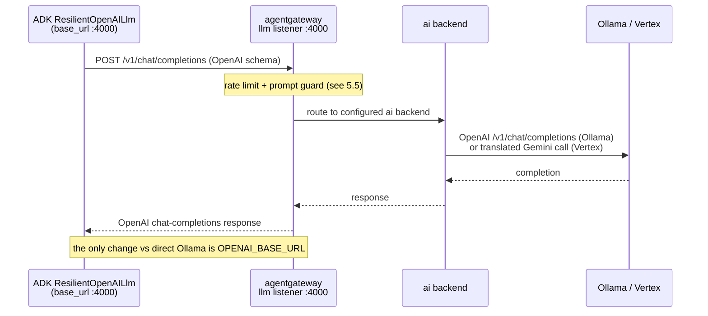
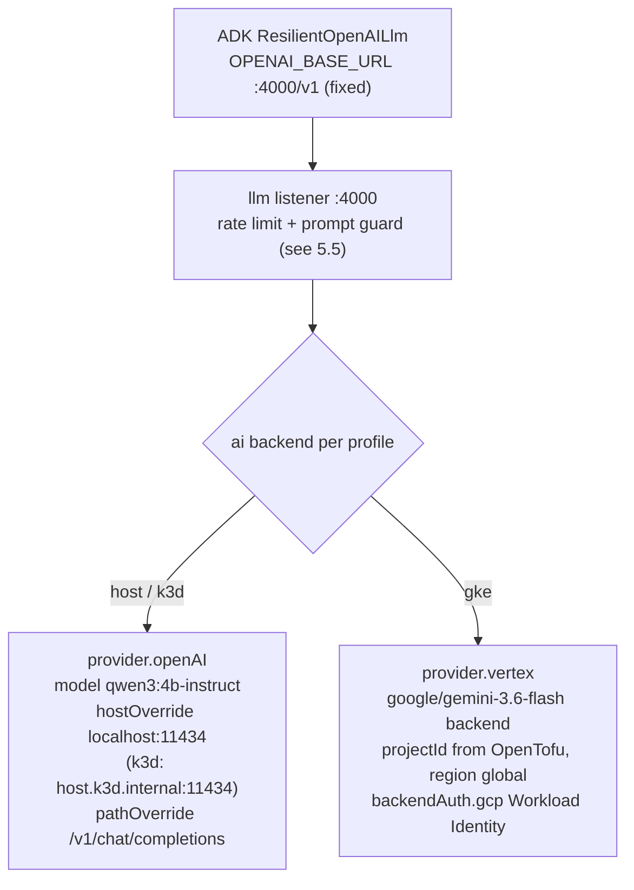

# 5.4. Model Gateway

!!! abstract "In one glance"

    - **You will:** Point the agent's `OPENAI_BASE_URL` at the gateway, call the model through it with one curl, and confirm nothing else in the agent changed.
    - **You need:** The gateway from [5.1. Gateway Setup](./5.1.%20Gateway%20Setup.md) running and Ollama serving qwen3:4b-instruct.
    - **Time:** about 20 minutes, hands-on.

## What is the application contract?

The Python agent keeps its OpenAI-compatible provider and changes only the endpoint from direct Ollama to agentgateway:

```bash
AGENT_MODEL_PROVIDER=openai-compatible
AGENT_MODEL=qwen3:4b-instruct
OPENAI_BASE_URL=http://127.0.0.1:4000/v1
OPENAI_API_KEY=local-ollama
```

One line moves: `OPENAI_BASE_URL`. `AGENTS.md`, the repository's guidance file for coding agents, is the authority: "Chapter 5 changes only `OPENAI_BASE_URL` to the agentgateway listener." Nothing else in the agent moves.

That is not a convention the docs impose; it falls out of how the model is built. `build_model()` in [`model.py`](https://github.com/MLOps-Courses/agentops-open-course/blob/main/agents/python/src/agent/model.py) returns a `ResilientOpenAILlm` — ADK's OpenAI-compatible client. It hands the already-validated endpoint and marker straight to the SDK constructor rather than mutating process-wide environment state:

```python
@cached_property
def _openai_client(self) -> AsyncOpenAI:
    return AsyncOpenAI(
        base_url=self.openai_base_url,
        api_key=self.openai_api_key.get_secret_value(),
        timeout=self.timeout_s,
        max_retries=self.retries,
    )
```

Because `base_url`, `api_key`, `timeout`, and `max_retries` are passed as explicit constructor arguments, pointing the client at the gateway is a settings change (`OPENAI_BASE_URL`) with no new code path. The same client object dials a different authority.

The marker key satisfies the client library in the default unauthenticated host profile. It is not an Ollama credential. The `:4000` listener also carries a per-instance rate limit and request/response **prompt guards** — regex checks that reject a request or a response outright. On the k3d/GKE profiles it enforces an `apiKey` as well.

All of that is owned by [5.5. Gateway Security](5.5.%20Gateway%20Security.md#which-controls-are-active-in-every-profile). Read that page for what else sits on this port; here the point is only that the application contract is one line.

## How do you call the gateway directly?

Prove that one line now; the theory reads better afterwards. With Ollama and the host gateway running:

```bash
curl -fsS http://127.0.0.1:4000/v1/chat/completions \
  -H 'Authorization: Bearer local-ollama' \
  -H 'Content-Type: application/json' \
  -d '{
    "model": "qwen3:4b-instruct",
    "messages": [{"role": "user", "content": "Reply with exactly: gateway ready"}],
    "temperature": 0
  }' | jq -r '.choices[0].message.content'
```

Three outcomes, so you can tell a pass from a failure:

1. **Any non-empty text prints.** That is the pass. The response may include model-specific reasoning or formatting; the transport checkpoint is a valid `choices[0].message` without a direct request to port 11434.
1. **`curl` cannot connect at all** (`Failed to connect`). The gateway itself is not running: start it with `mise run gateway:host`, then re-check with `mise run gateway:host:status`, which reports `managed container 'agentops-host-gateway' does not exist` while nothing is up. `doctor:gateway` only checks prerequisites, so it passes either way.
1. **The request returns `502`.** The gateway is up but its upstream is not, so look at the terminal running Ollama. The failure table in [5.1. Gateway Setup](5.1.%20Gateway%20Setup.md) covers both cases.

## What does "OpenAI-compatible" actually standardize?

Now that the call works, here is why a proxy could sit in the middle at all.

OpenAI's `POST /v1/chat/completions` request and response shape has become a de-facto interface standard. Ollama, vLLM, llama.cpp, most hosted providers, and agentgateway itself all speak it. So the _transport_ is uniform across backends: the URL path, the JSON body (`model`, `messages`, `temperature`), the streaming event format, and the `Authorization: Bearer …` header look the same no matter what runs behind them.

That uniformity is what makes a proxy possible at all. A gateway can speak the same schema on both sides: OpenAI in from the caller, OpenAI (or something it translates) out to the backend. The client cannot tell whether it reached a local model directly or a gateway that re-homed the request somewhere else.

Routing model traffic through that proxy buys three things beyond this repository:

- **Transport uniformity**: the application keeps one client library and one payload shape.
- **One policy point**: authentication, rate limits, and prompt guards are enforced once for every caller of the endpoint instead of re-implemented in each agent.
- **Provider swap with zero application-code change**: moving from a local model to a hosted one becomes an endpoint change, not a code change.

That last property is the whole point of this page.

One consequence: this repository ships no provider-adapter library, because the OpenAI-compatible interface already _is_ the abstraction.

??? note "Deeper: why there is no provider-adapter library here"

    It is also why this repository ships no provider-adapter library. A common alternative is to route through a translation shim like LiteLLM so one call reaches many providers; `AGENTS.md` records the opposite decision as an invariant — "No LiteLLM or garak contract" — because the OpenAI-compatible interface already _is_ the abstraction. ADK's OSS client and, when needed, the gateway's own translation cover the same ground without a second dependency on the request path.


```mermaid
sequenceDiagram
    participant A as ADK ResilientOpenAILlm<br/>(base_url :4000)
    participant G as agentgateway<br/>llm listener :4000
    participant B as ai backend
    participant M as Ollama / Vertex
    A->>G: POST /v1/chat/completions (OpenAI schema)
    Note over G: rate limit + prompt guard (see 5.5)
    G->>B: route to configured ai backend
    B->>M: OpenAI /v1/chat/completions (Ollama)<br/>or translated Gemini call (Vertex)
    M-->>B: completion
    B-->>G: response
    G-->>A: OpenAI chat-completions response
    Note over A,G: the only change vs direct Ollama is OPENAI_BASE_URL
```

What OpenAI-compatibility does _not_ standardize is covered later on this page: tool-call formats, context limits, JSON behavior, token accounting, content policy, latency, and quality all still vary.

## How is local Qwen3 configured?

One backend block tells the gateway where Ollama listens and which model to ask for:

```yaml
backends:
  - ai:
      name: ollama
      hostOverride: localhost:11434
      pathOverride: /v1/chat/completions
      provider:
        openAI:
          model: qwen3:4b-instruct
```

Read the `ai` backend as an object model:

- `hostOverride` is the upstream authority (`host:port`) the gateway dials.
- `pathOverride` is the URL path it POSTs to on that upstream — Ollama serves chat completions at `/v1/chat/completions`.
- `provider.openAI` tells the gateway to speak the OpenAI wire protocol to that upstream and names the `model` it forwards.

Together they make the config readable: this backend is "talk OpenAI to `localhost:11434` at `/v1/chat/completions`, asking for `qwen3:4b-instruct`."

The k3d profile changes exactly one field: `hostOverride` becomes `host.k3d.internal:11434`, the bridge address that reaches Ollama on the workstation from inside the cluster. `pathOverride` and `provider.openAI` are identical. The application contract does not move; only the address the gateway dials does.


```mermaid
flowchart TD
    APP["ADK ResilientOpenAILlm<br/>OPENAI_BASE_URL :4000/v1 (fixed)"] --> L["llm listener :4000<br/>rate limit + prompt guard (see 5.5)"]
    L --> B{ai backend per profile}
    B -->|host / k3d| O["provider.openAI<br/>model qwen3:4b-instruct<br/>hostOverride localhost:11434<br/>(k3d: host.k3d.internal:11434)<br/>pathOverride /v1/chat/completions"]
    B -->|gke| V["provider.vertex<br/>google/gemini-3.6-flash backend<br/>projectId from OpenTofu, region global<br/>backendAuth.gcp Workload Identity"]
```

**Diagram in words:** The ADK application always sends model calls to the gateway's `:4000/v1` listener, which applies its rate limit and prompt guard. The selected profile then routes the request either to local Ollama with Qwen3 over the OpenAI protocol, or to Vertex AI with Gemini 3.6 Flash and Workload Identity.

## How does the gateway reach Vertex Gemini on GKE?

!!! warning "Optional and proprietary"

    This path runs on GKE, Google's managed Kubernetes, so there is nothing to run on your laptop here. It is a comparison, not part of the required OSS route ([0.4. Providers](../0.%20Overview/0.4.%20Providers.md)) — skip to the next section if you only want the local path.

The GKE profile keeps the same `:4000` listener and the same application contract, and swaps only the backend behind it. That is the whole demonstration: a genuine provider change with no application code touched.

??? note "Deeper: the Vertex backend and its split credentials"

    The GKE profile keeps the same `:4000` listener and the same OpenAI-compatible application contract, then swaps the Ollama backend for a Vertex one:

    ```yaml
    backends:
      - ai:
          name: vertex
          provider:
            vertex:
              model: google/gemini-3.6-flash
              projectId: __GCP_PROJECT_ID__
              region: global
          policies:
            backendAuth:
              gcp: {}
    ```

    agentgateway's Vertex backend requires the publisher-qualified `google/gemini-3.6-flash` identifier. The application still requests `gemini-3.6-flash`; the gateway translates that OpenAI-compatible request into a Vertex call in the project selected by OpenTofu, then translates the response back into the OpenAI shape.

    Authentication is deliberately split. The caller sends the `agentgateway` marker as `OPENAI_API_KEY`, which the `:4000` `apiKey: mode: strict` policy enforces. Vertex access is separate: `backendAuth.gcp` obtains a token from the gateway pod's ambient GKE Workload Identity. `infra/scripts/render-gke.sh` resolves the project placeholder from OpenTofu before apply. The reasoning — why the caller credential and the cloud credential must never be the same key — belongs to [5.5. Gateway Security](5.5.%20Gateway%20Security.md#how-is-cloud-authentication-separated); this page only notes where the split lives in the config.

    This Vertex path is an optional, proprietary comparison, not part of the required OSS route ([0.4. Providers](../0.%20Overview/0.4.%20Providers.md)). The GKE lab stops at a plan unless you explicitly deploy it. The value of showing it here is honest: it demonstrates that the single-endpoint contract survives a genuine provider change from a local open-weight model to a hosted proprietary one, with no application code touched.

## Does one endpoint make every provider identical?

No. One endpoint standardizes transport and policy placement, not model behavior. Tool-call formats, context limits, JSON behavior, token accounting, content policy, latency, and model quality all differ between Qwen3 on Ollama and Gemini on Vertex, even though both answer the same `POST /v1/chat/completions`.

The gateway stabilizes _how_ you reach a backend; evaluations decide _whether_ that backend is compatible with the AgentOps Agent. That is why swapping the model name is never enough on its own. The recorded eval set in the checkpoint below is what promotes a backend from "reachable" to "supported."

Token accounting is a concrete example of behavior the endpoint does not equalize. Two backends can report the same conversation with different token counts and pricing, and the agent's per-turn token budget ([4.5. Guardrails](../4.%20Quality/4.5.%20Guardrails.md)) reads those counts to decide when to refuse. A provider swap can therefore shift how often the budget trips even though no application code changed — one more reason a new backend is an evaluation exercise, not a config edit.

## What happens when the provider fails?

Two layers sit between a flaky backend and a failed turn:

1. **A transient blip.** `ResilientOpenAILlm` already carries the course deadline and retry policy — the `timeout` and `max_retries` passed to `AsyncOpenAI` above — so the call is retried inside the SDK before it ever surfaces.
1. **A provider that is genuinely down.** agentgateway surfaces the upstream failure and ADK's model error callback takes over.

`handle_model_error` in [`guardrails.py`](https://github.com/MLOps-Courses/agentops-open-course/blob/main/agents/python/src/agent/guardrails.py) logs the real exception for operators and returns a stable `LlmResponse` with `error_code` `MODEL_UNAVAILABLE` and a retry-oriented message. No raw provider, path, or secret detail reaches the client. The resilience seam behind the first layer is explained in [3.1. Tools](../3.%20Capabilities/3.1.%20Tools.md#what-happens-when-a-tool-hangs).

By default there is no automatic failover to a second model, because untested failover can change safety, cost, and quality behavior silently. Choosing and validating an alternate model is an evaluation decision, not a runtime reflex. So failover is **opt-in**, and the next section shows the seam that turns it on only after you have measured the fallback.

## Does the gateway retry or time out the upstream?

Neither. The retry policy described above lives in the _application_, not the gateway: `ResilientOpenAILlm` owns the `timeout` and `max_retries` on the model call.

The gateway's own upstream request timeout and retry policy are left at their defaults. The config on the `ai` backend sets only `failureMode: failClosed` on the prompt guard ([5.5. Gateway Security](5.5.%20Gateway%20Security.md#which-controls-are-active-in-every-profile)), not an upstream retry or circuit-breaker.

The rule that generalizes: automatic infrastructure retries belong where the call is **idempotent** — safe to repeat — and where another healthy replica exists. That is the MCP read edge and a multi-replica model tier, not this single-backend model listener. The application SDK still has one bounded retry policy as an explicit reliability trade-off; it can repeat inference, so the gateway never adds another layer.

??? note "Deeper: where gateway-level resilience belongs in production"

    A gateway-layer retry on the model listener would be actively harmful here. A chat-completion is **not idempotent**: a retried generation is a second full inference — a second bill, a second dose of latency, and, on a partially streamed response, a duplicated or contradictory answer. Worse, a gateway retry would _stack_ on top of the SDK's `max_retries`, multiplying the real attempt count and the cost. And with a single upstream (one Ollama, or one Vertex model), there is nothing to fail over _to_ — a retry just re-dials the same struggling backend. So the model edge keeps exactly one retry authority, at the application layer, where the deadline and backoff are already tested ([3.1. Tools](../3.%20Capabilities/3.1.%20Tools.md#what-happens-when-a-tool-hangs)).

    Where gateway-layer resilience _does_ belong is the shape a production deployment would add, and the course names it rather than pretending the lab needs it:

    | Control                             | Where it fits                         | Why the lab leaves it at default                                                                                                                     |
    | ----------------------------------- | ------------------------------------- | ---------------------------------------------------------------------------------------------------------------------------------------------------- |
    | Upstream request timeout            | any backend, as a backstop deadline   | The app already bounds the model call; a second deadline just needs care not to fire first                                                           |
    | Bounded retries                     | the **MCP read** listener (`:3000`)   | Reads are idempotent, so a gateway retry is safe there — but the app already retries them, so a second layer must be budgeted, not stacked blindly   |
    | Circuit-breaking / outlier ejection | across **multiple** upstream replicas | Ejecting a bad endpoint only means something with more than one; the single-Spot-node lab ([0.0. Course](../0.%20Overview/0.0.%20Course.md)) has exactly one |

## How does the agent fail over when the primary model is down?

It does not, unless you turn it on. Retries and timeouts handle a _flaky_ backend; they cannot help a _dead_ one — the endpoint is unreachable, the model was unloaded, or the provider is returning errors on every attempt.

For that case the application offers an opt-in fallback: set `AGENT_MODEL_FALLBACK` to a second model on the same provider, and `build_model` wraps the primary in a `FallbackLlm`:

```python
--8<-- "agents/python/src/agent/model.py:build-model"
```

To try it, pull a second local model:

```bash
ollama pull qwen3:1.7b
```

Then add `AGENT_MODEL_FALLBACK=qwen3:1.7b` to the agent process environment; the root `.env.example` ships that exact line, commented out. Nothing forces the switch, so you only see it when the primary really fails. The agent then logs `Primary model qwen3:4b-instruct failed before responding, falling back to qwen3:1.7b` and finishes the turn on the smaller model.

The wrapper is careful about _when_ it switches. It only engages if the primary raises **before yielding any response**. Once a possibly-streamed turn has begun, splicing a second model's completion onto the first would produce a contradictory answer, so a mid-stream failure is re-raised instead of masked. `test_fallback_engages_only_when_primary_fails_before_responding` and `test_mid_stream_failure_is_not_masked_by_fallback` pin both halves of that contract.

Three properties keep this honest rather than a silent quality downgrade:

1. **Off by default.** `AGENT_MODEL_FALLBACK` is unset, so the shipped path is the single model. The config also rejects a fallback identical to the primary — a no-op that only hides a misconfiguration.
1. **Same account-free provider.** The intended fallback is a _smaller local model_ (`qwen3:4b-instruct` → `qwen3:1.7b`), so failover stays inside the OSS path and does not smuggle in a paid API as a "backup".
1. **Validated first.** A fallback you have not evaluated ([4.4. Evaluations](../4.%20Quality/4.4.%20Evaluations.md)) can be cheaper _and worse_. Keep `AGENT_MODEL_FALLBACK` unset during evaluation and make the alternate `AGENT_MODEL`; otherwise one run could silently combine two identities. Enable fallback only after each model clears the same evidence contract separately.

## What proves this page worked?

Before calling the gateway, confirm the resolved configuration with `mise run config:check` from `agents/python`. It prints the effective settings — including `OPENAI_BASE_URL` — with the marker masked as `**********` because `OPENAI_API_KEY` is a `SecretStr`, a type that refuses to print its own value. You can verify the endpoint without leaking the credential.

Then call the gateway directly with the `curl` above, and run one read-only A2A request through the agent.

On the host, inspect the gateway JSON log/metrics and the application's model span as separate evidence; the host gateway intentionally exports no OTLP trace, and [5.6. Gateway Observability](5.6.%20Gateway%20Observability.md) explains why. Chapter 6's Kubernetes profile adds the gateway span to the shared trace path.

Finally, run the recorded eval set with `mise run eval` (from `agents/python`, which calls the configured model) before treating a different model name as supported.

**You are done when:**

- `mise run config:check` reports `Agent configuration is valid.` and shows the resolved `openai_base_url = http://127.0.0.1:4000/v1` with the key masked as `**********`.
- The `curl` to `http://127.0.0.1:4000/v1/chat/completions` prints a non-empty answer.
- One read-only A2A request through the agent answers, with no request from the agent to port 11434.
- You can name the one environment variable that changed between Chapter 4 and this page.

Continue to [5.5. Gateway Security](./5.5.%20Gateway%20Security.md) when the agent reaches its model only through `:4000`.
