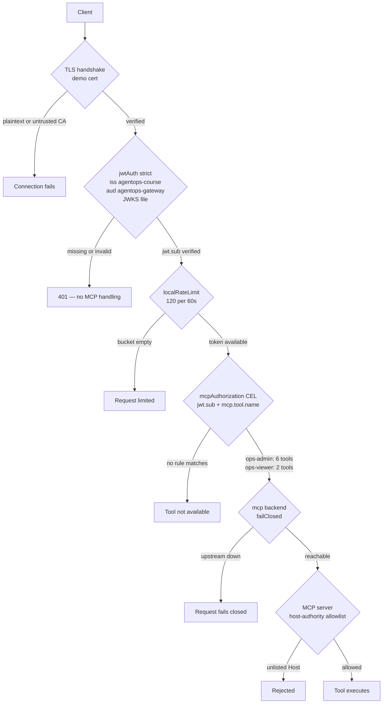

# 5.5. Gateway Security

## Which controls are active in every profile?

- MCP allows exactly six read tools and fails closed when the backend is unavailable.
- The MCP backend keeps DNS-rebinding protection enabled and accepts only explicit host authorities.
- MCP, A2A, and model listeners have separate local token-bucket limits.
- Model requests reject detected email addresses and a narrow ignore/override-instruction pattern.
- Model responses reject detected email addresses with status 502.
- JSON logs and Prometheus metrics record gateway outcomes; the Kubernetes profiles additionally export OTLP gateway traces.
- Kubernetes exposes only ClusterIP services plus namespace/pod network policies.
- Caller authentication is the one control that is **not** uniform across profiles — it varies per listener:

| Profile                | MCP `:3000`             | A2A `:3001`             | Model `:4000`          |
| ---------------------- | ----------------------- | ----------------------- | ---------------------- |
| Host default           | open                    | open                    | open                   |
| k3d / GKE              | open                    | open                    | `apiKey: mode: strict` |
| Host secured (`-auth`) | `jwtAuth: mode: strict` | `jwtAuth: mode: strict` | `apiKey: mode: strict` |

"Active in every profile" and "the model listener is authenticated" are therefore different statements. The k3d and GKE profiles enforce `apiKey` with the `agentgateway` marker value on the model listener only; their MCP and A2A listeners have no caller-auth policy at all, and the default host profile has none anywhere. Before you reason about a request, check which config file is actually running.

These are real shipped controls, not commented examples. Chapter 5.6 explains why the host profile keeps gateway OTLP disabled until the in-cluster observability path.

The native-Linux host relay binds only Docker's default bridge address, but that is not per-container authorization: other trusted containers on that bridge can reach its relayed upstreams and metrics. Do not share the default bridge with untrusted containers; stronger multi-tenant isolation needs a dedicated network and host firewall policy.

## How does the prompt guard work?

```yaml
ai:
  promptGuard:
    request:
      - regex:
          action: reject
          rules:
            - builtin: email
            - pattern: "(?i)(ignore|override).{0,40}(instructions|system prompt)"
        rejection:
          status: 400
          body: Request rejected by the course prompt guard.
    response:
      - regex:
          action: reject
          rules:
            - builtin: email
        rejection:
          status: 502
```

Test request rejection through `:4000`:

```bash
curl -i http://localhost:4000/v1/chat/completions \
  -H 'Content-Type: application/json' \
  -d '{
    "model": "qwen3:4b-instruct",
    "messages": [{"role": "user", "content": "Email jane.doe@example.com"}]
  }'
```

Expected status: `400` before Ollama is called.

## Why is regex not enough?

Attackers can paraphrase, encode, split, translate, or move instructions into retrieved/tool content. Regex also creates false positives. Layer it with application callbacks, tool allowlists, argument validation, approval, retrieval provenance, call budgets, adversarial tests, and monitoring. Never advertise a small pattern list as prompt-injection prevention.

## Could an optional managed classifier screen prompts here instead?

The prompt guard above is a deliberately small regex, and the previous section is honest about why that is weak. A trained classifier is the usual next layer, and [4.5](../4.%20Quality/4.5.%20Guardrails.md#can-an-optional-managed-service-screen-prompts-for-you) introduces **Model Armor** as one optional, paid, Google Cloud option for it.

!!! warning "Optional and proprietary"

    Not part of the required OSS path, and not wired into any shipped profile. It needs a Google Cloud project, billing, and `modelarmor.googleapis.com`. The host and k3d profiles stay account-free; every checkpoint on this page passes without it.

The interesting question here is not _whether_ to screen but _where_, and this chapter's whole argument applies:

| Screen in…                                                     | Covers                                    | Cost                            | Fails when                         |
| -------------------------------------------------------------- | ----------------------------------------- | ------------------------------- | ---------------------------------- |
| The ADK callback ([4.5](../4.%20Quality/4.5.%20Guardrails.md)) | This one agent                            | One integration                 | A second client bypasses the agent |
| The gateway (here)                                             | Every caller of the data plane, uniformly | One policy point                | The gateway is bypassed            |
| Both                                                           | Defense in depth                          | Two integrations, two latencies | —                                  |

Screening at the gateway is the same reasoning that put tool allowlists and rate limits here: a policy enforced once at a shared boundary cannot be forgotten by the next client. That is the argument for it. Against it: every prompt then leaves your infrastructure for a hosted API on the request path, which adds latency to every turn, a paid dependency, and a third party in your data-protection story — and a gateway-level filter has no idea which ADK tool the text was destined for, so it cannot make the fine-grained decisions a callback can.

The honest recommendation for this course: keep the deterministic controls that are already here — tool allowlists, argument validation, approval, transactions — as the boundary, and treat any classifier, hosted or local, as a **risk reducer layered on top**. It is probabilistic. It will miss things. If a control's failure would let an unapproved write through, that control must not be a classifier ([4.5](../4.%20Quality/4.5.%20Guardrails.md)).

If you do adopt it on GKE, screen at the gateway, give the gateway service account the Model Armor role through workload identity exactly as the section below does for Vertex, and keep the marker-only path intact for the local profiles.

## How is cloud authentication separated?

The agent sends a marker or real client credential to the gateway endpoint. On GKE, only the `agentgateway` Kubernetes service account maps to a Google service account with Vertex permissions. MLflow has a different identity scoped to its GCS bucket. No static cloud key is mounted into either pod.

## How do callers authenticate to the gateway?

The default host profile stays unauthenticated so Chapters 5.1-5.4 run without extra steps. The opt-in secured profile [`infra/agentgateway/host/config-auth.yaml`](https://github.com/MLOps-Courses/agentops-open-course/blob/main/infra/agentgateway/host/config-auth.yaml) adds the two missing fundamentals on the same ports: identity before authorization, and encryption in transit.

1. Start the secured profile from the repository root. The task generates demo-only material in a gitignored directory, stages only the listener certificate/private key and public JWKS, then starts the hardened loopback wrapper in the foreground:

   ```bash
   mise run gateway:host:auth
   ```

   The CA key and JWT signing key never enter the container — not by convention, but because the wrapper stages an explicit three-file allowlist into a private runtime directory and mounts only that:

   ```bash
   if config_needs_auth; then
   	mkdir -p -- "${auth_directory}"
   	chmod 0700 -- "${auth_directory}"
   	for auth_file in tls-cert.pem tls-key.pem jwks.json; do
   		cp "${auth_dir_input}/${auth_file}" "${auth_directory}/${auth_file}"
   		chmod 0444 -- "${auth_directory}/${auth_file}"
   	done
   	# The parent runtime directory remains private to the invoking user.
   	# This mount root must be traversable by the container's non-root UID.
   	chmod 0555 -- "${auth_directory}"
   fi
   ```

   From `write_runtime_config` in [`gateway-host.sh`](https://github.com/MLOps-Courses/agentops-open-course/blob/main/infra/scripts/gateway-host.sh). `ca-key.pem` and `jwt-signing-key.pem` sit in the same generated directory and are simply not in the loop, so no bind mount can reach them; the staged copies are world-readable (`0444`) inside a `0700` runtime root and mounted `readonly`. The same function rewrites the config's checked-in `infra/agentgateway/host/auth/*` paths to `/etc/agentgateway/auth/*` — the paths you read in the YAML below are the authoring view, not what the container sees. The secured profile otherwise preserves the default wrapper's digest pin, non-root UID (`65532:65532`), read-only filesystem, dropped capabilities, loopback-only published ports, and ownership-scoped cleanup.

1. In another terminal, mint a caller token. The script signs an RS256 JWT (`iss=agentops-course`, `aud=agentops-gateway`, one-hour expiry) with a local key whose public JWKS the gateway trusts:

   ```bash
   TOKEN="$(infra/scripts/gateway-jwt.sh ops-admin)"
   ```

Verify identity enforcement on the A2A listener (with the Chapter 5.1 host stack running):

```bash
CA=infra/agentgateway/host/auth/ca-cert.pem
curl -s -o /dev/null -w '%{http_code}\n' --cacert "$CA" \
  https://localhost:3001/.well-known/agent-card.json
curl -s -o /dev/null -w '%{http_code}\n' --cacert "$CA" \
  -H "Authorization: Bearer $TOKEN" \
  https://localhost:3001/.well-known/agent-card.json
```

Expected: `401` without a token, `200` with one.

The verified identity then feeds the existing MCP tool authorization: the same CEL rules from Chapter 5.2 gain a `jwt.sub` condition, so different callers see different tools.

```yaml
mcpAuthorization:
  rules:
    - 'jwt.sub == "ops-admin" && mcp.tool.name == "search_service_logs"'
    - 'jwt.sub == "ops-viewer" && mcp.tool.name == "list_incidents"'
```

Rerun the Chapter 5.2 tool listing against `https://localhost:3000/mcp` — pass `ssl.create_default_context(cafile=...)` as `verify` and an `Authorization` header to the `httpx.AsyncClient`. An `ops-admin` token lists all six read tools, an `ops-viewer` token only `list_incidents` and `get_incident`, and no token is rejected with `401` before any MCP handling.

The model listener uses an API key instead of a JWT, because the OpenAI SDK already sends `OPENAI_API_KEY` as a `Bearer` header: the local marker can become an enforced credential with no application-code change. The Kubernetes profiles use the value from the `agentgateway-client` Secret — so a port-forwarded `curl` to a cluster gateway needs its configured bearer value.

You do not have to take this lab on faith: `mise run check:infra` exercises it on every run and in CI. It regenerates the TLS and JWT material, runs `openssl verify` of the server certificate against the demo CA and `openssl x509 -checkhost localhost`, validates all four gateway configs with `agentgateway --validate-only`, and asserts that the rendered secured container config resolves every `tls.cert`, `tls.key`, and `jwtAuth.jwks.file` to `/etc/agentgateway/auth/*` — that last assertion is what stops a refactor from silently mounting or referencing host paths. It then deletes the generated material again if it created it, so a learner who never ran this chapter keeps a clean `mise run secure` scan. See [`check-infra.sh`](https://github.com/MLOps-Courses/agentops-open-course/blob/main/scripts/check-infra.sh).

Be honest about the scope: the JWT issuer is a local script, not an identity provider, and the API key value is public in this repository. Both demonstrate the mechanism; production needs an OIDC/IdP-issued token, secret key material, rotation, and short lifetimes. The gateway validates the A2A caller, but this lab does not propagate the JWT subject into ADK's action `ToolContext`; the application audit still records the synthetic A2A context user. In-cluster MCP and A2A listeners stay token-free for now — see the unauthenticated section below.

## In what order do the policies run?

Order is the whole lesson of a policy chain. A gateway that rate-limits before it authenticates lets an anonymous caller consume a tenant's budget; one that authorizes before it authenticates has nothing to authorize on; one that opens its backend before it authorizes turns a policy failure into a tool call. The secured `:3000` route is written so each stage can only be reached by a request the previous stage already accepted:



The config's own comment states the first edge: "Identity first: a missing or invalid token is rejected with 401 before any MCP protocol handling or authorization rule runs." That is why the `401` edge leaves the diagram before `mcpAuthorization` — an unauthenticated caller never reaches a CEL rule, so `jwt.sub` is always a verified claim by the time a rule reads it, never an attacker-supplied string. The ordering also means the rate limit is spent by identified callers only, and `failureMode: failClosed` sits _after_ authorization so an unavailable backend can never widen the tool set.

Two properties of this chain are worth carrying to any gateway you build:

1. Every stage is a narrowing. Nothing later in the chain can re-admit what an earlier stage rejected, which is what makes the order auditable by reading top to bottom.
1. The last stage is not the gateway. The MCP server's own DNS-rebinding host allowlist ([`mcp_server.py`](https://github.com/MLOps-Courses/agentops-open-course/blob/main/agents/python/src/agent/mcp_server.py)) still runs, and the application still validates action arguments and requires approval ([4.5](../4.%20Quality/4.5.%20Guardrails.md)). A gateway is a policy point, not the only one — assume it can be bypassed and keep the upstream defensible on its own.

The `:4000` model route is the same shape with different links: `apiKey: mode: strict` in place of `jwtAuth`, a 30/60s bucket, then the request prompt guard, then Ollama, then the response guard on the way back.

## How does the agent connect when authentication is on?

The agent's model route works with environment variables only, exactly as in Chapter 5.4 plus trust for the demo certificate:

```bash
AGENT_MODEL_PROVIDER=openai-compatible
AGENT_MODEL=qwen3:4b-instruct
OPENAI_BASE_URL=https://127.0.0.1:4000/v1
OPENAI_API_KEY=agentgateway
SSL_CERT_FILE=../../infra/agentgateway/host/auth/ca-cert.pem
```

The path is relative to `agents/python`, where model-backed mise tasks execute. Set `SSL_CERT_FILE` only in the agent process: it replaces the default trust store, so exporting it shell-wide breaks every other HTTPS call in that shell.

The agent's MCP client now closes this seam: set `AGENT_MCP_TOKEN` to a demo JWT (mint one with `./infra/scripts/gateway-jwt.sh`) and `ops_mcp_toolset()` attaches it as a `Bearer` header on the streamable-HTTP connection. The token is a `SecretStr`, so `mise run config:check` masks it like every other credential. With `AGENT_MCP_URL` pointed at the secured gateway and `AGENT_MCP_TOKEN` set, the agent lists tools through the authenticated route end to end; leave the token unset for the open local profile and no header is sent.

## How do I turn on TLS locally?

`infra/scripts/gateway-tls.sh` generates a local CA and a CA-signed server certificate for `localhost`/`127.0.0.1` (30-day validity, gitignored). Clients trust `ca-cert.pem`; the secured profile terminates TLS on its MCP, A2A, and model listeners:

```yaml
listeners:
  - name: a2a
    protocol: HTTPS
    tls:
      cert: infra/agentgateway/host/auth/tls-cert.pem
      key: infra/agentgateway/host/auth/tls-key.pem
```

Verify encryption in transit:

1. `curl --cacert "$CA" https://localhost:3001/...` with a token returns `200` — the client verified the exact certificate it was given.
1. The same request without `--cacert` fails certificate verification: nothing else trusts this lab certificate, by design.
1. A plaintext `http://localhost:3001/...` request fails at the connection: the listener only speaks TLS.

This is lab trust, not public PKI: no real CA, hostname set to `localhost`, no rotation or revocation. On GKE the course keeps ClusterIP services plus `kubectl port-forward`; real exposure would instead terminate TLS at a public edge with managed or ACME certificates (or run mesh mTLS), which this course does not implement.

## What stays unauthenticated and why?

1. Gateway metrics on `:15020` — an internal listener scraped by Prometheus and the in-cluster collector, carrying operational counters rather than request content. Adding auth would break the pinned scrape configs for little gain; network scope (loopback use, ClusterIP plus a NetworkPolicy admitting only the collector) is the actual control.
1. The Kubernetes agentgateway readiness/liveness probes — they use `tcpSocket` connects against its MCP port, so caller authentication does not affect them.
1. The default host profile — a deliberate learning-friction trade-off on loopback upstreams; the secured profile exists precisely to remove it once the basics work.
1. The in-cluster MCP and A2A listeners — the agent's ADK `McpToolset` can now send a `Bearer` token (`AGENT_MCP_TOKEN`, see above), but kagent's `RemoteMCPServer` still does not, and the A2A listener has no client-side token path yet, so enforcing JWT cluster-wide would break the running platform. NetworkPolicies restricting callers to declared namespaces are the compensating control, and this remaining gap is listed as absent work, not claimed as secured.

## Why is the local rate limit not a quota?

Its state belongs to one gateway instance and has no authenticated user dimension. It reduces accidental bursts in this single-replica lab. Production budgets require identity, per-tenant policy, shared state, alerting, and a decision for rejected/queued work.

## Which security controls are intentionally absent?

No OIDC/external identity provider, verified A2A-subject propagation into action audit, mTLS, public ingress, WAF, distributed authorization, signed request, or external audit store is configured. Caller authentication and TLS exist only as the opt-in local demonstrations above, built on script-generated demo material and a repository-visible API key — mechanisms to learn from, not managed identity or public PKI. The lab remains loopback-only or ClusterIP/port-forwarded. Chapter 6 preserves that private posture on GKE.

## What is the security checkpoint?

Verify an email prompt returns 400, the six MCP reads are visible, writes are absent, a malformed action fails in the application, and gateway logs/metrics show each decision. With the secured profile, additionally verify that a request without a token returns 401 and that `ops-admin` and `ops-viewer` tokens list different tools. Document bypasses as regression cases rather than expanding a regex without evidence.

When you finish the secured-profile lab, tear down its material with `rm -r infra/agentgateway/host/auth`. The directory is gitignored and deliberately excluded from the filesystem scan because generating it is part of the lab; staged/full-history gitleaks still protects the repository boundary. Teardown minimizes local secret lifetime, and the scripts regenerate everything on demand.
