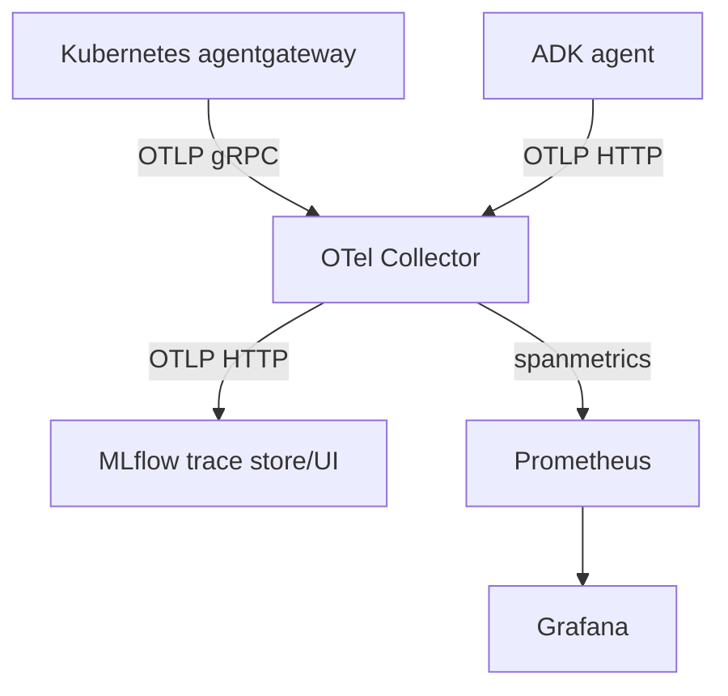

# 5.6. Gateway Observability

## Which gateway signals are available?

- Structured JSON logs on standard output in every profile.
- Prometheus metrics on internal port `15020` in every profile.
- Protocol/model/route/policy attributes in logs and metrics.
- OTLP gateway traces in the k3d and GKE profiles, whose collector is part of the deployment.

The host gateway deliberately leaves OTLP disabled so the optional Compose stack can be down without exporter retries. Host application traces are still available when the agent's `OTEL_*` variables are set. Kubernetes gateways export to `otel-collector.agentops.svc.cluster.local:4317`.

## How do you inspect raw metrics?

With the host gateway:

```bash
curl -fsS http://localhost:15020/metrics | head -n 20
```

In Kubernetes, the port is not public. Forward it only while diagnosing:

```bash
kubectl -n agentops port-forward svc/agentgateway 15020:15020
```

The in-cluster collector scrapes the service directly. Host Compose Prometheus uses the forwarded host port when observing a Kubernetes gateway.

## How do traces reach MLflow?



The collector batches traces, applies a memory limiter, exports them to the self-hosted MLflow service, and exposes span-derived RED metrics for Prometheus to scrape. Chapter 7 inspects the implementation.

## Are prompts stored in traces?

The agent sets both ADK and GenAI message-content capture variables to literal `false` unless the operator explicitly overrides them. Gateway prompt logging is not enabled in the shipped configs. Metadata can still be sensitive, and raw content may appear in application logs added by a learner, so review all exporters and retention before using real data.

## How do you correlate a failure?

Start from the A2A client time/status, find the gateway route/policy log, follow the corresponding trace into model or MCP spans, then inspect the application/tool error and persisted audit state. Correlation identifiers should be retained as trace context, not exposed as high-cardinality Prometheus labels.

## What is the observability checkpoint?

Start the host Compose stack, issue one allowed MCP call and one rejected model request, then verify:

1. Gateway JSON logs record both outcomes.
1. `:15020/metrics` changes.
1. MLflow shows the host application's trace; the Kubernetes profile later adds gateway traces.
1. Grafana loads the provisioned dashboard at `http://localhost:3002/d/agentops-overview`.

Stop Compose without `-v` to preserve the evidence for Chapter 7.
