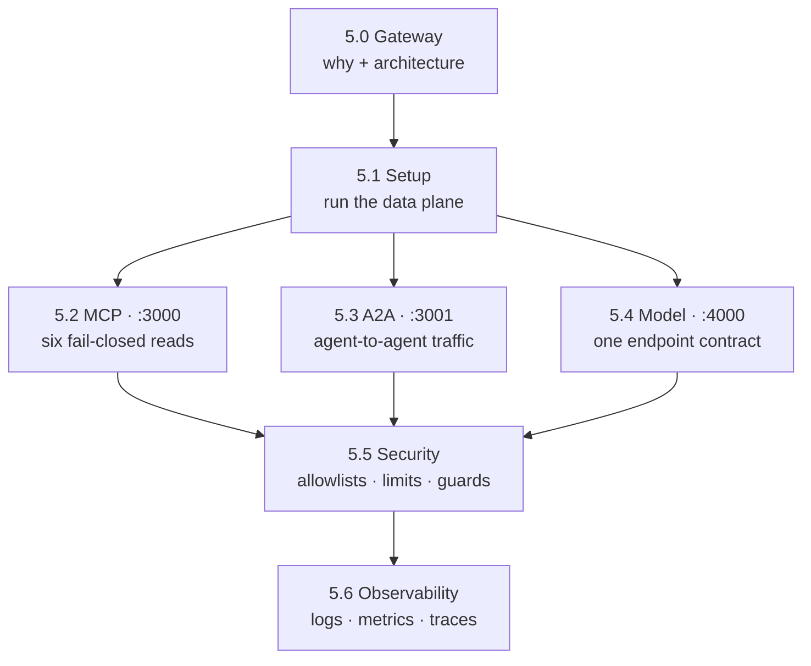

# 5. Gateway

## What will the gateway add?

Your agent already talks to an OpenAI-compatible model ([Chapter 2](../2. Agents/)), reads incidents over MCP ([Chapter 3](../3. Capabilities/)), and answers A2A clients — but every one of those edges is wired straight into the process, so a provider swap, a rate limit, or an audit requirement becomes an application change. Put **[agentgateway](https://agentgateway.dev)** between the agent and those three boundaries and each edge turns into a routed, policied, observed hop instead of code: MCP read tools on `:3000`, A2A clients on `:3001`, and the OpenAI-compatible model endpoint on `:4000`. The gateway owns connectivity and traffic policy; ADK keeps sessions, tool execution, and human confirmation ([Chapter 4](../4. Quality/)). The host profile stays account-free with Ollama/Qwen3; Chapter 6 moves the same listener contract to k3d and optional GKE overlays. [5.0. Gateway](./5.0. Gateway.md) argues the case in full and carries the data-plane architecture and listener table; this page is the map.

!!! info "AAIF project"

    agentgateway was created by Solo.io and donated to the Linux Foundation; it is now an
    **[Agentic AI Foundation (AAIF)](https://aaif.io/projects/agentgateway/)** project. This
    chapter uses it as the connectivity and traffic-policy layer while keeping application approval and transactions in ADK/Python.

This chapter covers:

- **[5.0. Gateway](./5.0. Gateway.md)**: The connectivity and security problem agents face, and an agentgateway overview.
- **[5.1. Gateway Setup](./5.1. Gateway Setup.md)**: Run the digest-pinned gateway image through its loopback-only host wrapper.
- **[5.2. MCP Gateway](./5.2. MCP Gateway.md)**: Front exactly six reads with fail-closed authorization.
- **[5.3. A2A Gateway](./5.3. A2A Gateway.md)**: Route agent-to-agent traffic with the `a2a` route policy.
- **[5.4. Model Gateway](./5.4. Model Gateway.md)**: Stabilize the agent on one endpoint while choosing local Qwen3 or GKE Vertex Gemini upstream.
- **[5.5. Gateway Security](./5.5. Gateway Security.md)**: Active allowlists, limits, prompt guards, identity, and residual risk.
- **[5.6. Gateway Observability](./5.6. Gateway Observability.md)**: JSON logs, internal metrics, OTLP traces, and content-capture privacy.

## How does the chapter fit together?

Read [5.0](./5.0. Gateway.md) for the why and the listener contract, stand the data plane up in [5.1](./5.1. Gateway Setup.md), then govern each of the three boundaries in turn. Security ([5.5](./5.5. Gateway Security.md)) and observability ([5.6](./5.6. Gateway Observability.md)) are cross-cutting rather than a fourth plane: their policies attach per-listener to MCP, A2A, and model traffic alike.

The chapter checkpoint tests fail-closed MCP, A2A discovery, local model translation, prompt rejection, and telemetry through gateway ports only.
