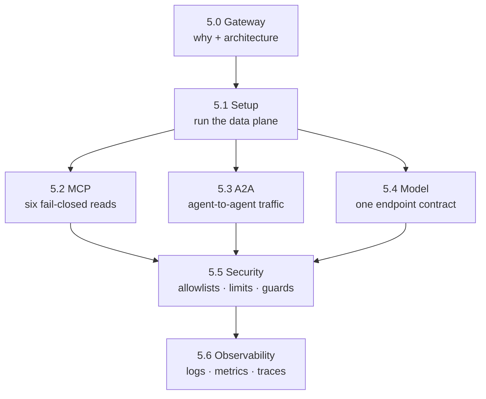

# 5. Gateway

!!! abstract "In one glance"

    - **You will:** Map the chapter's reading order and the page that owns each gateway boundary.
    - **You need:** Chapters 2-4 finished; [5.1. Gateway Setup](./5.1.%20Gateway%20Setup.md) installs the optional platform tier before starting anything.
    - **Time:** about 4 minutes, orientation.

**Part II — Platform engineering.** This part is more demanding and assumes container and Kubernetes knowledge. Complete [4.8. Developer Handoff](../4.%20Quality/4.8.%20Developer%20Handoff.md) or begin from its tested reference checkpoint. Prepare with [Kubernetes Basics](https://kubernetes.io/docs/tutorials/kubernetes-basics/) if needed.

## Where should you begin?

Begin with [5.0. Gateway](./5.0.%20Gateway.md), which owns the case for the extra hop, the data-plane definition, the listener map, and the responsibility boundary.

This index only maps the reading order. The six hands-on pages then apply that single model to MCP, A2A, model, security, and observability concerns.

??? note "Deeper: who builds agentgateway?"

    agentgateway was created by Solo.io and donated to the Linux Foundation; it is now an
    **[Agentic AI Foundation (AAIF)](https://aaif.io/projects/agentgateway/)** project. This
    chapter uses it as the connectivity and traffic-policy layer while keeping application approval and transactions in ADK/Python.

## Which page covers what?

Read the sections by their kind, not just their order. **5.0 is conceptual** — the case for the extra hop. The six pages after it are hands-on, and each ends with something you can see:

- **[5.0. Gateway](./5.0. Gateway.md)** _(concept)_: The connectivity and security problem agents face, and an agentgateway overview.
- **[5.1. Gateway Setup](./5.1. Gateway Setup.md)** _(hands-on)_: Start the whole stack on your laptop, through a wrapper that keeps every listener on loopback.
- **[5.2. MCP Gateway](./5.2. MCP Gateway.md)** _(hands-on)_: Watch the gateway allow exactly six read tools, refuse a seventh, and fail closed when the tool server is down.
- **[5.3. A2A Gateway](./5.3. A2A Gateway.md)** _(hands-on)_: Chat with the agent from a browser through the gateway, and approve a service restart.
- **[5.4. Model Gateway](./5.4. Model Gateway.md)** _(hands-on)_: Move native Gemini traffic behind the gateway, with optional Ollama and GKE profiles.
- **[5.5. Gateway Security](./5.5. Gateway Security.md)** _(hands-on)_: Trip the prompt guard, review the allowlists and limits already active, then add tokens and TLS in an opt-in profile.
- **[5.6. Gateway Observability](./5.6. Gateway Observability.md)** _(hands-on)_: Read the gateway's own logs, metrics, and traces for a single request, and see what stays out of them.

## How does the chapter fit together?

Read [5.0. Gateway](./5.0. Gateway.md) for the conceptual contract. Then stand the gateway up in [5.1. Gateway Setup](./5.1. Gateway Setup.md) and govern each boundary in turn.

Security ([5.5. Gateway Security](./5.5. Gateway Security.md)) and observability ([5.6. Gateway Observability](./5.6. Gateway Observability.md)) are cross-cutting rather than a fourth plane: their policies attach per-listener to MCP, A2A, and model traffic alike.


```mermaid
flowchart TD
    Opener["5.0 Gateway<br/>why + architecture"] --> Setup["5.1 Setup<br/>run the data plane"]
    Setup --> MCP["5.2 MCP<br/>six fail-closed reads"]
    Setup --> A2A["5.3 A2A<br/>agent-to-agent traffic"]
    Setup --> Model["5.4 Model<br/>one endpoint contract"]
    MCP --> Sec["5.5 Security<br/>allowlists · limits · guards"]
    A2A --> Sec
    Model --> Sec
    Sec --> Obs["5.6 Observability<br/>logs · metrics · traces"]
```

Before you start, three things about the shape of the chapter:

- **It all runs on your laptop.** The host profile needs no Kubernetes cluster or GCP project; the default Gemini path uses an API key.
- **It needs the platform tier, Docker, and configured model access.** [5.1. Gateway Setup](./5.1.%20Gateway%20Setup.md) runs `mise run install:platform`, then the gateway doctor.
- **Not all of it is required.** The secured JWT/TLS profile in 5.5. Gateway Security is opt-in, the GKE/Vertex path in 5.4. Model Gateway is an optional cloud extension, and the Kubernetes material is a preview of Chapter 6.

## What proves this chapter worked?

One command stands the whole composition up and tears it down again:

```bash
mise run smoke:host
```

It runs the host stack against a fake model on temporary ports, so it proves the composition without spending model time.

The chapter checkpoint tests fail-closed MCP, A2A discovery, local model translation, prompt rejection, and telemetry through gateway ports only.

**You are done when:**

- You can name the page that owns the MCP, A2A, and model boundaries, and the two pages that cut across all three.
- The chapter's required drill is done: the `## Your turn` in [5.2. MCP Gateway](./5.2.%20MCP%20Gateway.md#your-turn-how-do-you-take-one-tool-off-the-allowlist) took one tool away from every caller by editing one CEL rule, with nothing under `agents/python/` touched.
- You know where to find the listener map and the gateway-versus-ADK responsibility boundary.
- Without reopening Chapter 4: you can name the callback that hardens a tool result before the model reads it, and say why the gateway's prompt guard does not replace it.

[Chapter 6](../6. Platform/) moves the same listener contract to **k3d**, a Kubernetes cluster that runs on your own machine, and to optional GKE overlays.

Continue to [5.0. Gateway](./5.0.%20Gateway.md) when you can explain the chapter order from the map above.
