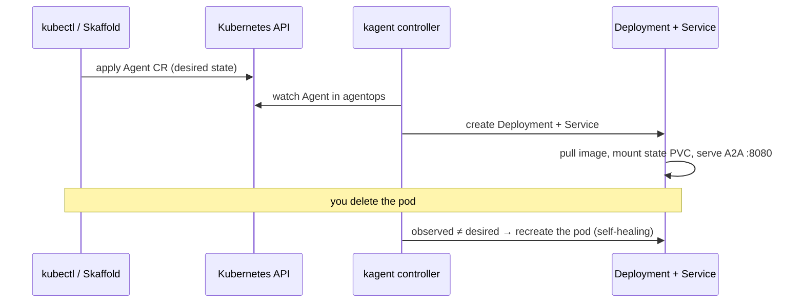
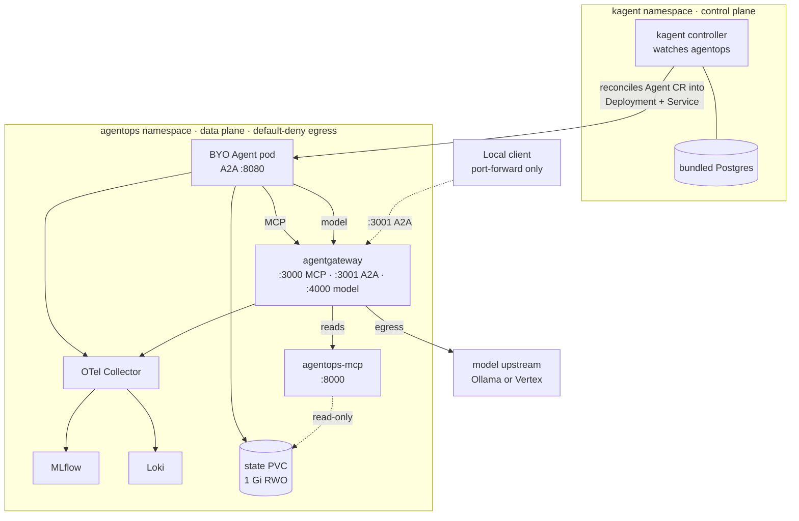

# 6.0. Platform

Chapters 2 through 5 ran the agent as a **host process**: you started `python -m agent.server`, wired the [gateway](../5. Gateway/index.md) beside it, and if either died you noticed and restarted it. This chapter keeps the same code, protocol, and endpoint contracts but hands ownership of "is it running, with the right config, bounds, identity, and storage" to a cluster. That handover is the whole subject of Chapter 6, and it starts with one idea: you stop _running_ the agent and start _declaring_ it.

## Why model an agent as a Kubernetes custom resource?

A host process is **imperative**: a command you run makes exactly one thing happen once. Kubernetes is **declarative**: you write down the desired end state and a controller runs a continuous reconcile loop that drives observed state toward it. The controller re-checks constantly, so it does two things a shell command cannot — it **self-heals** (a killed pod is recreated) and it **corrects drift** (an out-of-band edit is reverted to the declared spec). That is why an agent you intend to keep running belongs in a custom resource, not a `nohup`.

[kagent](https://kagent.dev/) extends the Kubernetes API with agent-shaped custom resources and ships the controller that reconciles them. You apply an `Agent` object; kagent turns it into the running workload and keeps it matching:



You verify this directly in [6.3. Platform Agents](./6.3. Platform Agents.md): delete the agent pod and watch the controller rebuild it against the same state volume. The same loop is why you never patch the Deployment kagent generates — reconciliation will overwrite your edit, so config changes go through the `Agent` resource.

## What does kagent own?

kagent watches an `Agent` custom resource. For `type: BYO`, it creates/manages the Deployment and Service for the course's own A2A image. The course also registers an OpenAI-compatible `ModelConfig` and a `RemoteMCPServer` that both point at agentgateway.

The BYO application remains responsible for model/tool composition, sessions, action confirmation, and audit transactions. kagent does not replace ADK.

Concretely, kagent owns the _lifecycle_ of the workload — scheduling, the Deployment/Service pair, recreation on failure — but not the _internals_ of the container. Because the pinned `v1alpha2` BYO schema exposes no container-probe or termination-grace fields, the agent image supplies its own `/livez` and `/healthz` and its own graceful-shutdown timeout; [6.3. Platform Agents](./6.3. Platform Agents.md) walks that split. The read tools are a separate concern again: they run as their own `agentops-mcp` Deployment registered through the `RemoteMCPServer`, covered in [6.4. Platform Tools](./6.4. Platform Tools.md). When verifying, expect the pinned stable chart `0.9.11` and the `kagent.dev/v1alpha2` API version. One detail matters for the build loop: Skaffold does not edit the pod template but rewrites the logical image reference _inside_ the custom resource, taught to look at `.spec.byo.deployment.image` in [`skaffold.yaml`](https://github.com/MLOps-Courses/agentops-open-course/blob/main/infra/skaffold.yaml):

```yaml
resourceSelector:
  allow:
    - groupKind: Agent.kagent.dev
      image: [.spec.byo.deployment.image]
      labels: [.metadata.labels]
```

The controller's blast radius is deliberately small. [`kagent/values.yaml`](https://github.com/MLOps-Courses/agentops-open-course/blob/main/infra/kagent/values.yaml) scopes it to one namespace, so it never reconciles resources it should not:

```yaml
controller:
  watchNamespaces:
    - agentops
```

## Which custom resources does kagent add?

Installing the pinned chart establishes three `kagent.dev/v1alpha2` CRDs, one per concern. This course uses all three, each owned by a later page:

| Custom resource (CRD)                             | Declares                                                                  | Manifest / page                                                                                                                                        |
| ------------------------------------------------- | ------------------------------------------------------------------------- | ------------------------------------------------------------------------------------------------------------------------------------------------------ |
| `Agent` (`agents.kagent.dev`)                     | The BYO agent workload: image, replicas, env, security context, state PVC | [`agent.yaml`](https://github.com/MLOps-Courses/agentops-open-course/blob/main/infra/kagent/agent.yaml) · [6.3](./6.3. Platform Agents.md)             |
| `ModelConfig` (`modelconfigs.kagent.dev`)         | The OpenAI-compatible model endpoint kagent consumers use                 | [`modelconfig.yaml`](https://github.com/MLOps-Courses/agentops-open-course/blob/main/infra/kagent/modelconfig.yaml) · [6.3](./6.3. Platform Agents.md) |
| `RemoteMCPServer` (`remotemcpservers.kagent.dev`) | The governed MCP endpoint (via agentgateway), not the raw service         | [`toolserver.yaml`](https://github.com/MLOps-Courses/agentops-open-course/blob/main/infra/kagent/toolserver.yaml) · [6.4](./6.4. Platform Tools.md)    |

You can list the established CRDs after install ([6.2. Platform Install](./6.2. Platform Install.md) shows the exact `kubectl get crd` command). Be honest about maturity: `v1alpha2` is an alpha API from a CNCF Sandbox project, so schemas can change between releases and some fields you would want (BYO container probes) simply do not exist yet. That is a real constraint the readiness discussion in [6.3](./6.3. Platform Agents.md) works around, not a bug — pin the chart version and expect churn.

## What changes when the agent moves to Kubernetes?

The code and protocol contracts do not change: the same locked image, the same OpenAI-compatible model call, the same MCP read path, the same A2A card on `:8080`. What changes is everything _around_ the process. Kubernetes adds declarative workload identity (a dedicated ServiceAccount), configuration as env/Secrets, health probes, resource requests and limits, DNS service discovery, persistent volumes, default-deny network policy, and rollout ownership. The host profile from [Chapter 5](../5. Gateway/index.md) gave the agent none of these; you were its supervisor, its firewall, and its config manager. In the cluster those roles become declared objects the platform enforces even while you are asleep.

## How do the chapter's pieces fit together in the cluster?

Two namespaces, one direction of control. The **kagent** namespace is the control plane: the controller plus its bundled Postgres. The **agentops** namespace is the data plane where every workload actually serves traffic. The controller reconciles _into_ agentops; traffic never flows the other way.



Two boundaries in that picture carry the platform's safety story and are owned by [6.5. Platform Gateway](./6.5. Platform Gateway.md), so they are named here but explained there: every pod in `agentops` runs under **default-deny egress** reopened one declared flow at a time, and **no Ingress or LoadBalancer exists** — the k3d cluster even disables the service load balancer, so the only way in is a temporary `kubectl port-forward`. The map from each cluster piece to the page and manifest that stands it up:

| Sub-page                                              | Cluster piece it stands up                     | Owning manifest(s)                                                         |
| ----------------------------------------------------- | ---------------------------------------------- | -------------------------------------------------------------------------- |
| [6.1. Containers](./6.1. Containers.md)               | The non-root agent OCI image                   | `agents/python/Dockerfile`                                                 |
| [6.2. Platform Install](./6.2. Platform Install.md)   | k3d cluster, registry, kagent control plane    | `infra/k3d.yaml`, `infra/helmfile.yaml`, `infra/kagent/values.yaml`        |
| [6.3. Platform Agents](./6.3. Platform Agents.md)     | BYO `Agent`, `ModelConfig`, state PVC          | `infra/kagent/agent.yaml`, `infra/kagent/modelconfig.yaml`                 |
| [6.4. Platform Tools](./6.4. Platform Tools.md)       | `agentops-mcp` Deployment, `RemoteMCPServer`   | `infra/k8s/base/mcp.yaml`, `infra/kagent/toolserver.yaml`                  |
| [6.5. Platform Gateway](./6.5. Platform Gateway.md)   | agentgateway, network policies, quota, secrets | `infra/k8s/base/agentgateway.yaml`, `infra/k8s/base/network-policies.yaml` |
| [6.6. Platform Delivery](./6.6. Platform Delivery.md) | Skaffold loop, optional GKE, state backups     | `infra/skaffold.yaml`, `infra/gcp/`                                        |

## Which environments share the base?

`infra/k8s/base` holds the environment-independent truth: the `agentops` namespace (labelled for the `restricted` Pod Security Standard), service accounts, the gateway-client Secret, the agent-state and state-backup PVCs, agentgateway, the MCP server, MLflow, Loki, the OTel collector, network policies, a resource quota, and the kagent custom resources. Kustomize overlays change only environment-specific values on top of that base:

- `k8s/overlays/local`: patches the model name to `qwen3:4b-instruct` on both the `Agent` and `ModelConfig`, includes the k3d agentgateway config, and adds Prometheus/Alertmanager plus the host-Ollama egress exception.
- `k8s/overlays/gke`: applies a Workload Identity patch, redirects the MLflow artifact store to a GCS bucket, and includes the GKE agentgateway config with its Vertex egress exceptions.

The patches are surgical JSON operations, not forked manifests — the local overlay, for example, only replaces the model env value and the `ModelConfig` model field. Skaffold selects the overlay with `-p local` or `-p gke` and tags images with the abbreviated Git commit. The network-policy exceptions each overlay appends are explained in full by [6.5. Platform Gateway](./6.5. Platform Gateway.md); here the point is that a provider swap is a data-plane patch, never an application change.

## Is this a production architecture?

It is **production-shaped**, not production-ready. It demonstrates non-root workloads, read-only roots, resource bounds, health probes, identity separation, network policy, persistent state, trace/metric collection, and commit-derived image tags.

A commit tag improves provenance but remains a mutable registry reference. A production promotion policy should deploy a verified image digest and preserve its build/SBOM/signature evidence — the signing and verification path [6.1. Containers](./6.1. Containers.md) documents for tagged releases.

It deliberately uses one replica, SQLite, one zonal Spot node, no public endpoint, no public TLS edge, and no HA database. It does ship a lab-grade SQLite backup/restore drill, but the backup PVC remains in the same cluster and is not disaster recovery. Those choices keep a learning lab cheap and explainable; they do not satisfy a production SLO.

## What is the platform checkpoint?

Render both overlays without applying them:

```bash
kubectl kustomize infra/k8s/overlays/local >/dev/null
kubectl kustomize infra/k8s/overlays/gke >/dev/null
```

Then inspect the diff: model backend, identity annotations, and MLflow artifact destination should change; application ports, read-tool route, and A2A image contract should not.
