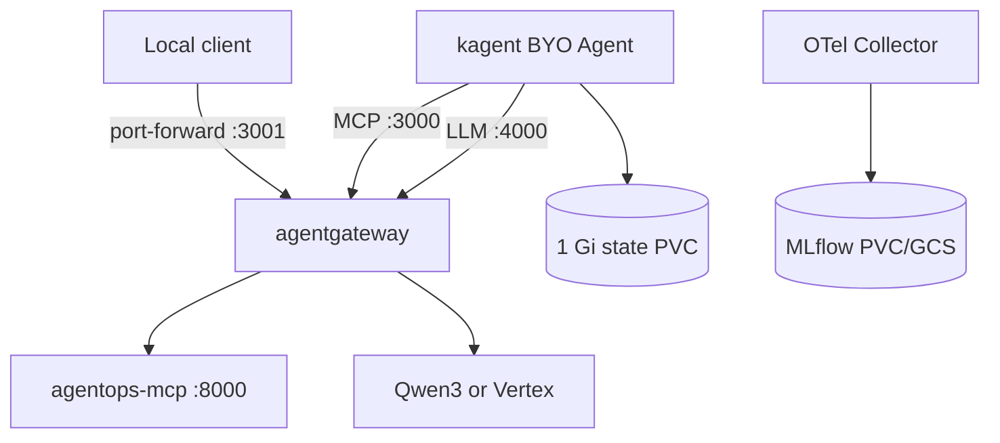

# 6.0. Platform

## What changes when the agent moves to Kubernetes?

The code and protocol contracts do not change. Kubernetes adds declarative workload identity, configuration, health probes, resource bounds, service discovery, persistent volumes, network policy, and rollout ownership.



## What does kagent own?

kagent watches an `Agent` custom resource. For `type: BYO`, it creates/manages the Deployment and Service for the course's own A2A image. The course also registers an OpenAI-compatible `ModelConfig` and a `RemoteMCPServer` that both point at agentgateway.

The BYO application remains responsible for model/tool composition, sessions, action confirmation, and audit transactions. kagent does not replace ADK.

## Which environments share the base?

`infra/k8s/base` contains namespace, service accounts, PVCs, gateway, MCP, MLflow, OTel, network policies, and kagent resources. Kustomize overlays change only environment-specific values:

- `k8s/overlays/local`: Qwen3 model names plus the k3d agentgateway config.
- `k8s/overlays/gke`: Vertex/GCS Workload Identity patches plus the GKE agentgateway config.

Skaffold selects the overlay with `-p local` or `-p gke` and tags images with the abbreviated Git commit.

## Is this a production architecture?

It is **production-shaped**, not production-ready. It demonstrates non-root workloads, read-only roots, resource bounds, health probes, identity separation, network policy, persistent state, trace/metric collection, and commit-derived image tags.

A commit tag improves provenance but remains a mutable registry reference. A production promotion policy should deploy a verified image digest and preserve its build/SBOM/signature evidence.

It deliberately uses one replica, SQLite, one zonal Spot node, no public endpoint, no public TLS edge, and no HA database. It does ship a lab-grade SQLite backup/restore drill, but the backup PVC remains in the same cluster and is not disaster recovery. Those choices keep a learning lab cheap and explainable; they do not satisfy a production SLO.

## What is the platform checkpoint?

Render both overlays without applying them:

```bash
kubectl kustomize infra/k8s/overlays/local >/dev/null
kubectl kustomize infra/k8s/overlays/gke >/dev/null
```

Then inspect the diff: model backend, identity annotations, and MLflow artifact destination should change; application ports, read-tool route, and A2A image contract should not.
