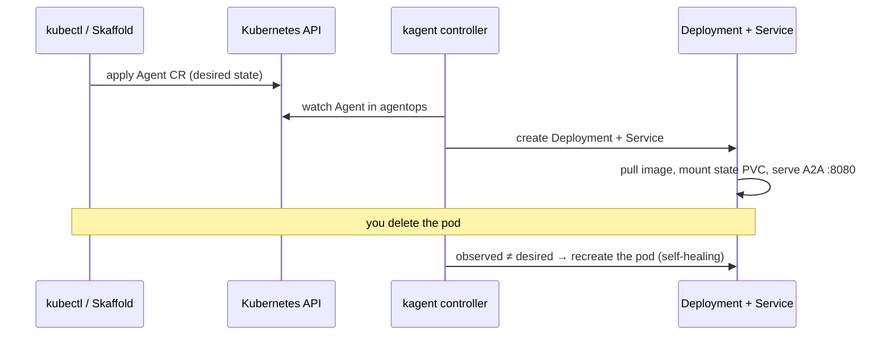
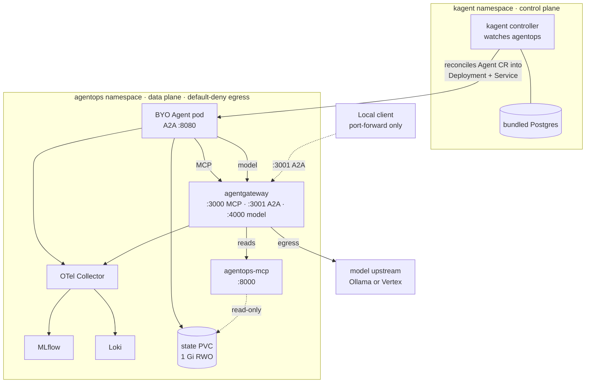

# 6.0. Platform

!!! abstract "In one glance"

    - **You will:** Compare process and cluster ownership, then prove how a base and overlay edit propagate through rendered manifests.
    - **You need:** `mise run doctor:platform` passing; no cluster is needed for this page.
    - **Time:** about 30 minutes, hands-on.

Run the offline render gate before reading the architecture it protects:

```bash
mise run check:infra
```

Chapters 2 through 5 ran the agent as a **host process**: you started `python -m agent.server`, wired the [gateway](../5. Gateway/index.md) beside it, and if either died you noticed and restarted it. This chapter keeps the same code, protocol, and endpoint contracts but hands ownership of "is it running, with the right config, bounds, identity, and storage" to a cluster. That handover is the whole subject of Chapter 6, and it starts with one idea: you stop _running_ the agent and start _declaring_ it.

Concretely, that is the difference between two habits:

- **Before:** `python -m agent.server` in a terminal you keep open.
- **After:** one `kubectl apply`. The cluster restarts the pod when it dies, re-attaches its state disk, and allows only the connections the manifests declare.

## Why model an agent as a Kubernetes custom resource?

A host process is **imperative**: a command you run makes exactly one thing happen once. Kubernetes is **declarative**: you write down the desired end state and a controller runs a continuous reconcile loop that drives observed state toward it.

The controller re-checks constantly, so it does two things a shell command cannot:

- It **self-heals**: a killed pod is recreated.
- It **corrects drift**: an out-of-band edit is reverted to the declared spec.

That is why an agent you intend to keep running belongs in a custom resource, not a `nohup`.

[kagent](https://kagent.dev/) extends the Kubernetes API with agent-shaped **custom resources** — object kinds the API did not ship with — and ships the controller that reconciles them. You apply an `Agent` object; kagent turns it into the running workload and keeps it matching:


```mermaid
sequenceDiagram
    participant You as kubectl / Skaffold
    participant API as Kubernetes API
    participant Ctrl as kagent controller
    participant Wl as Deployment + Service
    You->>API: apply Agent CR (desired state)
    Ctrl->>API: watch Agent in agentops
    Ctrl->>Wl: create Deployment + Service
    Wl->>Wl: pull image, mount state PVC, serve A2A :8080
    Note over You,Wl: you delete the pod
    Ctrl->>Wl: observed ≠ desired → recreate the pod (self-healing)
```

You verify this directly in [6.3. Platform Agents](./6.3. Platform Agents.md): delete the agent pod and watch the controller rebuild it against the same state volume. The same loop is why you never patch the Deployment kagent generates — reconciliation will overwrite your edit, so config changes go through the `Agent` resource.

## Why kagent instead of a plain Deployment?

Declarative Kubernetes does not require kagent. A `Deployment` plus a `Service` plus a ConfigMap is already declarative, already self-healing, and already something your existing pipeline knows how to ship. So the honest question is what the extra control plane buys, and when it does not pay.

What the CRD, the controller, and `ModelConfig` add over hand-written workload objects:

1. **One object per agent instead of three.** The `Agent` resource carries the image, replicas, env, security context, and state volume; the controller renders the Deployment and Service from it. `kubectl get agents -n agentops` is then an agent inventory — a fleet of Deployments is indistinguishable from every other Deployment in the namespace.
1. **The model endpoint is a named object, not copied env.** `ModelConfig` is referenced by name, so the Ollama-to-Vertex swap is a patch on one object ([the local overlay's `patches:` block](#which-environments-share-the-base)) rather than an edit repeated in every workload that calls a model.
1. **The tool surface is declared too.** `RemoteMCPServer` makes "which MCP endpoint may this agent use" a reviewable cluster resource with an owner, instead of a URL buried in a container's environment.
1. **Reconciliation covers the agent-shaped fields.** A ReplicaSet already replaces a dead pod; nothing in a plain Deployment notices that someone edited the model binding or repointed the tool server. The controller reverts both.

What it costs, stated plainly:

1. Another control plane to install, patch, and defend — the controller plus its bundled Postgres, on the same lab node as your workloads.
1. An alpha API. `v1alpha2` from a CNCF Sandbox project can change between releases, and the pinned BYO schema exposes _fewer_ knobs than a Deployment: no container probes, no termination grace period, which is why the image ships its own `/livez` and `/healthz` ([6.3. Platform Agents](./6.3. Platform Agents.md)).
1. One more layer between your manifest and the running pod when you debug: you read the `Agent`, then the Deployment the controller generated from it.

So: run one agent, never swap model backends, and already trust a Deployment pipeline — use the Deployment. Reach for kagent when you expect several agents sharing model and tool endpoints, want that fleet queryable as one kind, and accept an alpha API in exchange. This course uses it because the fleet-of-agents case is the one it is teaching you to build.

## What does kagent own?

kagent owns the _lifecycle_ of the workload — scheduling, the Deployment/Service pair, recreation on failure — but not the _internals_ of the container.

kagent watches an `Agent` custom resource. In a **BYO Agent** you ship the container image and kagent only schedules it ([0.7. Glossary](../0.%20Overview/0.7.%20Glossary.md#byo-agent)). For `type: BYO`, kagent creates/manages the Deployment and Service for the course's own A2A image. The course also registers an OpenAI-compatible `ModelConfig` and a `RemoteMCPServer` that both point at agentgateway.

The BYO application remains responsible for model/tool composition, sessions, action confirmation, and audit transactions. kagent does not replace ADK.

Two consequences follow from that split:

1. The pinned `v1alpha2` BYO schema exposes no container-probe or termination-grace fields, so the agent image supplies its own `/livez` and `/healthz` and its own graceful-shutdown timeout.
1. The read tools are a separate concern again: they run as their own `agentops-mcp` Deployment registered through the `RemoteMCPServer`.

When verifying, expect the pinned stable chart `0.9.12` and the `kagent.dev/v1alpha2` API version.

The controller's blast radius is deliberately small. [`kagent/values.yaml`](https://github.com/MLOps-Courses/agentops-open-course/blob/main/infra/kagent/values.yaml) scopes it to one namespace, so it never reconciles resources it should not:

```yaml
controller:
  watchNamespaces:
    - agentops
```

??? note "Deeper: how Skaffold finds the image inside a custom resource"

    One detail matters for the build loop: Skaffold does not edit the pod template but rewrites the logical image reference _inside_ the custom resource, taught to look at `.spec.byo.deployment.image` in [`skaffold.yaml`](https://github.com/MLOps-Courses/agentops-open-course/blob/main/infra/skaffold.yaml):

    ```yaml
    resourceSelector:
      allow:
        - groupKind: Agent.kagent.dev
          image: [.spec.byo.deployment.image]
          labels: [.metadata.labels]
    ```

    [6.2. Platform Install](./6.2.%20Platform%20Install.md) starts Skaffold after the control plane is ready.

Owned by [6.3. Platform Agents](./6.3. Platform Agents.md) for the probe split, and [6.4. Platform Tools](./6.4. Platform Tools.md) for the separate MCP deployment.

## Which custom resources does kagent add?

Installing the pinned chart establishes three `kagent.dev/v1alpha2` CRDs, one per concern. A **CRD** (CustomResourceDefinition) teaches the API server a new kind of object. _Established_ means the API server now serves that kind. This course uses all three, each owned by a later page:

| Custom resource (CRD)                             | Declares                                                                  | Manifest / page                                                                                                                                                         |
| ------------------------------------------------- | ------------------------------------------------------------------------- | ----------------------------------------------------------------------------------------------------------------------------------------------------------------------- |
| `Agent` (`agents.kagent.dev`)                     | The BYO agent workload: image, replicas, env, security context, state PVC | [`agent.yaml`](https://github.com/MLOps-Courses/agentops-open-course/blob/main/infra/kagent/agent.yaml) · [6.3. Platform Agents](./6.3. Platform Agents.md)             |
| `ModelConfig` (`modelconfigs.kagent.dev`)         | The OpenAI-compatible model endpoint kagent consumers use                 | [`modelconfig.yaml`](https://github.com/MLOps-Courses/agentops-open-course/blob/main/infra/kagent/modelconfig.yaml) · [6.3. Platform Agents](./6.3. Platform Agents.md) |
| `RemoteMCPServer` (`remotemcpservers.kagent.dev`) | The governed MCP endpoint (via agentgateway), not the raw service         | [`toolserver.yaml`](https://github.com/MLOps-Courses/agentops-open-course/blob/main/infra/kagent/toolserver.yaml) · [6.4. Platform Tools](./6.4. Platform Tools.md)     |

You can list the established CRDs after install ([6.2. Platform Install](./6.2. Platform Install.md) shows the exact `kubectl get crd` command).

??? note "Deeper: how mature is the v1alpha2 API?"

    Be honest about maturity: `v1alpha2` is an alpha API from a CNCF Sandbox project, so schemas can change between releases and some fields you would want (BYO container probes) simply do not exist yet. That is a real constraint the readiness discussion in [6.3. Platform Agents](./6.3. Platform Agents.md) works around, not a bug — pin the chart version and expect churn.

## What changes when the agent moves to Kubernetes?

The code and protocol contracts do not change. What changes is everything _around_ the process.

You keep the same locked image, the same OpenAI-compatible model call, the same MCP read path, and the same A2A card on `:8080`. Around them, Kubernetes adds:

- Declarative workload identity, as a dedicated ServiceAccount.
- Configuration as env and Secrets.
- Health probes.
- Resource requests and limits.
- DNS service discovery.
- Persistent volumes.
- Default-deny network policy.
- Rollout ownership.

The host profile from [Chapter 5](../5. Gateway/index.md) gave the agent none of these; you were its supervisor, its firewall, and its config manager. In the cluster those roles become declared objects the platform enforces even while you are asleep.

## How do the chapter's pieces fit together in the cluster?

Two namespaces, one direction of control. The **kagent** namespace is the control plane: the controller plus its bundled Postgres. The **agentops** namespace is the data plane where every workload actually serves traffic. The controller reconciles _into_ agentops; traffic never flows the other way.

One label in the diagram needs unpacking. The **state PVC** is a PersistentVolumeClaim: a disk the cluster keeps and re-attaches to the replacement pod. `RWO` (ReadWriteOnce) means one node mounts it for writing at a time.

Then look for three things: the two namespaces, arrows that run in one direction only, and no way in except a temporary port-forward.


```mermaid
flowchart TD
    Client["Local client<br/>port-forward only"]
    subgraph kagentns["kagent namespace · control plane"]
        Ctrl["kagent controller<br/>watches agentops"]
        PG[("bundled Postgres")]
        Ctrl --- PG
    end
    subgraph agentops["agentops namespace · data plane · default-deny egress"]
        Agent["BYO Agent pod<br/>A2A :8080"]
        GW["agentgateway<br/>:3000 MCP · :3001 A2A · :4000 model"]
        MCP["agentops-mcp<br/>:8000"]
        OTel["OTel Collector"]
        MLflow["MLflow"]
        Loki["Loki"]
        State[("state PVC<br/>1 Gi RWO")]
        Agent -->|MCP| GW
        Agent -->|model| GW
        GW -->|reads| MCP
        Agent --> State
        MCP -.read-only.-> State
        Agent --> OTel
        GW --> OTel
        OTel --> MLflow
        OTel --> Loki
    end
    Ctrl -->|reconciles Agent CR into<br/>Deployment + Service| Agent
    GW -->|egress| Model["model upstream<br/>Ollama or Vertex"]
    Client -.->|:3001 A2A| GW
```

Two boundaries in that picture carry the platform's safety story:

- Every pod in `agentops` runs under **default-deny egress**, reopened one declared flow at a time.
- **No Ingress or LoadBalancer exists.** The k3d cluster even disables the service load balancer, so the only way in is a temporary `kubectl port-forward`.

They are named here and explained by [6.5. Platform Gateway](./6.5. Platform Gateway.md). The map from each cluster piece to the page and manifest that stands it up:

| Sub-page                                              | Cluster piece it stands up                     | Owning manifest(s)                                                         |
| ----------------------------------------------------- | ---------------------------------------------- | -------------------------------------------------------------------------- |
| [6.1. Containers](./6.1. Containers.md)               | The non-root agent OCI image                   | `agents/python/Dockerfile`                                                 |
| [6.2. Platform Install](./6.2. Platform Install.md)   | k3d cluster, registry, kagent, Skaffold loop   | `infra/k3d.yaml`, `infra/helmfile.yaml`, `infra/kagent/values.yaml`        |
| [6.3. Platform Agents](./6.3. Platform Agents.md)     | BYO `Agent`, `ModelConfig`, state PVC          | `infra/kagent/agent.yaml`, `infra/kagent/modelconfig.yaml`                 |
| [6.4. Platform Tools](./6.4. Platform Tools.md)       | `agentops-mcp` Deployment, `RemoteMCPServer`   | `infra/k8s/base/mcp.yaml`, `infra/kagent/toolserver.yaml`                  |
| [6.5. Platform Gateway](./6.5. Platform Gateway.md)   | agentgateway, network policies, quota, secrets | `infra/k8s/base/agentgateway.yaml`, `infra/k8s/base/network-policies.yaml` |
| [6.6. Platform Delivery](./6.6. Platform Delivery.md) | state recovery, optional GKE plan, teardown    | `infra/scripts/`, `infra/gcp/`                                             |

## Which port serves which protocol?

Ports are stable across the host and cluster profiles, so one map covers every `port-forward` and probe you run in this chapter and the next. Reach a service only through the route in the last column — most are cluster-internal and surface locally only via a temporary forward. These are the ports you reach directly in this chapter; the observability ports are in the note below the table, and this chapter's own manifests already deploy all but Grafana.

| Port    | Component      | Protocol / role         | Reached via                          |
| ------- | -------------- | ----------------------- | ------------------------------------ |
| `3000`  | agentgateway   | MCP                     | port-forward `svc/agentgateway`      |
| `3001`  | agentgateway   | A2A                     | port-forward `svc/agentgateway`      |
| `4000`  | agentgateway   | OpenAI-compatible model | port-forward `svc/agentgateway`      |
| `15020` | agentgateway   | internal metrics        | port-forward `svc/agentgateway`      |
| `8080`  | agentops-agent | A2A raw backend         | gateway; direct only for diagnostics |
| `8000`  | agentops-mcp   | raw MCP                 | gateway pods only                    |
| `5000`  | MLflow         | tracking + trace UI     | port-forward `svc/mlflow`            |

??? note "Deeper: the observability ports, deployed here and used in Chapter 7"

    The base deploys Loki and the OTel collector; the `local` overlay adds Prometheus and Alertmanager. Only Grafana and the host Compose profile belong to [Chapter 7](../7. Observability/index.md).

    | Port          | Component      | Protocol / role                      | Reached via                          |
    | ------------- | -------------- | ------------------------------------ | ------------------------------------ |
    | `3100`        | Loki           | log store (OTLP in, query out)       | via collector / Grafana              |
    | `4317`/`4318` | OTel Collector | OTLP gRPC / HTTP                     | in-cluster emitters                  |
    | `8889`        | OTel Collector | span-metrics scrape target           | Prometheus scrape                    |
    | `9090`        | Prometheus     | metrics (local overlay / host)       | port-forward / host Compose          |
    | `9093`        | Alertmanager   | alert routing (local overlay / host) | port-forward / host Compose          |
    | `3002`        | Grafana        | dashboards (host profile)      | host Compose                         |

    The host profile ([Chapter 7](../7. Observability/index.md)) also uses gateway readiness `:15021`.

Every published listener binds to loopback or a ClusterIP; no port here is exposed by an Ingress or LoadBalancer.

## Which environments share the base?

**Kustomize** renders YAML from a shared `base/` folder plus a small per-environment `overlays/` folder of patches. Both environments in this course share one base.

`infra/k8s/base` holds the environment-independent truth:

- The `agentops` namespace, labelled for the `restricted` Pod Security Standard (Kubernetes' strictest built-in pod policy).
- Service accounts and the gateway-client Secret.
- The agent-state and state-backup PVCs.
- agentgateway, the MCP server, MLflow, Loki, and the OTel collector.
- Network policies, a resource quota, and the kagent custom resources.

Kustomize overlays change only environment-specific values on top of that base:

- `k8s/overlays/local`: patches the model name to `qwen3:4b-instruct` on both the `Agent` and `ModelConfig`, includes the k3d agentgateway config, and adds Prometheus/Alertmanager plus the host-Ollama egress exception.
- `k8s/overlays/gke`: applies a Workload Identity patch, redirects the MLflow artifact store to a GCS bucket, and includes the GKE agentgateway config with its Vertex egress exceptions.

The patches are surgical JSON operations, not forked manifests. The local overlay's `patches:` block, for example, is three operations: it replaces the model env value and the `ModelConfig` model field, and appends one host-Ollama egress rule to the `agentgateway-egress` NetworkPolicy.

**Skaffold**, the build-and-deploy loop [6.2. Platform Install](./6.2.%20Platform%20Install.md) starts, selects the overlay with `-p local` or `-p gke` and tags images with the abbreviated Git commit.

The network-policy exceptions each overlay appends are explained in full by [6.5. Platform Gateway](./6.5. Platform Gateway.md). Here the point is that a provider swap is a data-plane patch, never an application change.

## Is this a production architecture?

It is **production-shaped**, not production-ready. It demonstrates non-root workloads, read-only roots, resource bounds, health probes, identity separation, network policy, persistent state, trace/metric collection, and commit-derived image tags.

A commit tag improves provenance but remains a mutable registry reference. A production promotion policy should deploy a verified image digest and preserve its build/SBOM/signature evidence — the signing and verification path [6.1. Containers](./6.1. Containers.md) documents for tagged releases.

It deliberately uses one replica, SQLite, one zonal Spot node, no public endpoint, no public TLS edge, and no HA database. It does ship a lab-grade SQLite backup/restore drill, but the backup PVC remains in the same cluster and is not disaster recovery. Those choices keep a learning lab cheap and explainable; they do not satisfy a production SLO.

## Your turn: how do you prove a manifest change reaches the render?

Required drill — the [Chapter 6 checkpoint](./index.md#what-proves-this-chapter-worked) asks for its result. Change two values, one in the shared base and one in the local overlay, then let the renders tell you which environment each change reached. No cluster, no image, and no model are involved.

- **Mode**: `temporary experiment`.
- **Goal**: make the base edit appear in _both_ renders and the overlay edit appear in exactly _one_, and prove it from the rendered YAML instead of from the file you typed in.
- **Files to touch**: `infra/k8s/base/mcp.yaml`, raising the MCP container's memory limit from `512Mi` to `640Mi`; and `infra/k8s/overlays/local/kustomization.yaml`, changing both `qwen3:4b-instruct` patch values to another tag you have actually pulled.
- **Preflight**: require `git diff --quiet -- infra/k8s/base/mcp.yaml infra/k8s/overlays/local/kustomization.yaml`; stop rather than discarding an existing manifest edit.
- **Gate that proves completion**: predict each command's result, then run the three commands below.

```bash
kubectl kustomize infra/k8s/overlays/local | rg -e qwen3 -e 640Mi
kubectl kustomize infra/k8s/overlays/gke | rg -e gemini -e 640Mi
mise run check:infra
```

The local render carries your model tag, the GKE render still carries `gemini-3.6-flash`, and both carry `640Mi` — one edit reached two environments, the other reached one, and you read that off the output rather than off your own diff.

`mise run check:infra` then exits non-zero, and that is the second half of the lesson. Both objects are still valid YAML; what fails is an assertion in `scripts/check-infra.sh` that pins the local model identity in the `Agent` and in the `ModelConfig`. The `640Mi` bump passes untouched because nothing pins it. Rendering tells you where a value goes; a gate decides which values are allowed to move at all.

- **Final state**: run `git restore -- infra/k8s/base/mcp.yaml infra/k8s/overlays/local/kustomization.yaml`, repeat all three commands against the restored files, and require the focused `git diff --quiet --` preflight to pass again.

## What proves this page worked?

Render both overlays without applying them:

```bash
kubectl kustomize infra/k8s/overlays/local >/dev/null
kubectl kustomize infra/k8s/overlays/gke >/dev/null
```

Then inspect the diff: model backend, identity annotations, and MLflow artifact destination should change; application ports, read-tool route, and A2A image contract should not. Drop the `>/dev/null` to read either render.

One line makes that concrete. The agent's `AGENT_MODEL` value is `qwen3:4b-instruct` in the local render and `gemini-3.6-flash` in the GKE render.

**You are done when:**

- Both `kubectl kustomize` commands exit without an error and print nothing.
- You can point at the `AGENT_MODEL` line that differs between the two renders.
- You can say in your own words what kagent owns and what the BYO application still owns.
- You can name, for every piece in the cluster diagram, the page that stands it up.
- You can name one project you would ship as a plain `Deployment` instead, and the kagent feature you would be giving up.
- The required drill above ended where it started: your two edits appeared exactly where you predicted, `check:infra` refused the pinned one, and `git restore infra/k8s` returned both renders to their committed state.

Continue to [1.3. Kubernetes](../1.%20Setup/1.3.%20Kubernetes.md) when declaring the agent reads to you as a safer default than starting it yourself. That deferred prerequisite returns you to [6.1. Containers](./6.1.%20Containers.md).
