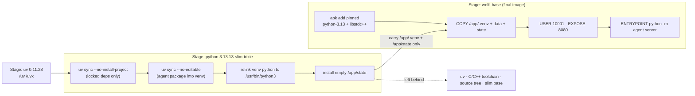
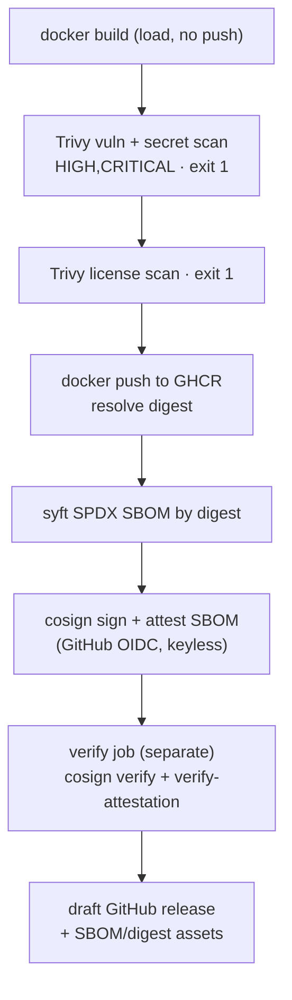

# 6.1. Containers

## What must the image provide?

A container image is the deployment contract between the code you tested and the cluster that runs it: everything the process needs at runtime, and deliberately nothing else. kagent's `type: BYO` Agent deploys this exact image and probes `/.well-known/agent-card.json` (Chapter 6.3), so the surface must be precise and minimal:

- The locked `agent` package and its runtime dependencies.
- Immutable seed data at `/app/data`.
- A writable mount point at `/app/state`.
- A non-root UID/GID `10001` process.
- `python -m agent.server` as its entrypoint.
- A2A discovery/task service on `8080`.
- Message-content telemetry capture disabled by default.

No provider credential, development dependency, mutable local database, or Ollama model belongs in the image. Everything above is grounded in the multi-stage [`Dockerfile`](https://github.com/MLOps-Courses/agentops-open-course/blob/main/agents/python/Dockerfile), which the next answers walk through.

## Why build the image in multiple stages?

The tooling that _builds_ a Python service — a package manager, a C/C++ toolchain, a full interpreter distribution, and your source tree — is attack surface and bloat you never want at _runtime_. A multi-stage build lets you use a fat toolchain image to produce artifacts, then copy only those artifacts into a minimal runtime image, leaving the toolchain behind. Fewer packages means fewer CVEs for a scanner to flag and fewer binaries for an attacker who lands in the container to reuse.

This Dockerfile has three stages: a tiny `uv` stage that carries only the `uv`/`uvx` binaries, a `python:3.13.13-slim-trixie` **build** stage that resolves dependencies into `/app/.venv`, and a `cgr.dev/chainguard/wolfi-base` **runtime** stage that becomes the shipped image.



Only the resolved virtual environment (which already contains the installed `agent` package) and the empty state directory cross the stage boundary. The `uv` binary, the Debian slim base, the compilers pulled in during dependency builds, and the copied `src/` tree never reach the shipped image. Because the runtime stage sets `USER 10001:10001`, `EXPOSE 8080`, and ships `/app/state` as the only writable path the process needs, the cluster can run the pod with `runAsNonRoot`, `readOnlyRootFilesystem`, and every Linux capability dropped — see Chapter 6.3 for the pod-level hardening this image enables.

## Why pin the base images by digest?

A tag is a mutable pointer. `python:3.13.13-slim-trixie` today and the same tag next month can resolve to different bytes when the upstream re-pushes it, so a build "pinned" only by tag is not reproducible and gives you nothing to verify against. A digest (`@sha256:...`) is content-addressed and immutable: the same digest is always the same bytes. Every `FROM` here pins both — a readable tag for humans and a digest for the pull that actually happens:

```dockerfile
FROM ghcr.io/astral-sh/uv:0.11.28@sha256:0f36cb9361a3346885ca3677e3767016687b5a170c1a6b88465ec14aefec90aa AS uv
FROM python:3.13.13-slim-trixie@sha256:aa938a849bcb82dce8f49480f056ab82bf5c1c3ebc294f0430f37b6820e7f286 AS build
```

```dockerfile
FROM cgr.dev/chainguard/wolfi-base@sha256:02dab76bd852a70556b5b2002195c8a5fdab77d323c433bf6642aab080489795 AS runtime
```

Renovate bumps the tag and its digest together, so the pins stay current without ever floating. This is a distinct mechanism from the `apk` version pins _inside_ the runtime stage: the `FROM` digest freezes the base filesystem, while `apk add python-3.13=3.13.14-r2` freezes the packages layered on top of it. Note the two different failure modes — a superseded `FROM` digest still pulls, because registries retain old digests indefinitely, whereas a superseded `apk` pin eventually stops resolving because Wolfi is a rolling repository, covered next.

## How is the image built reproducibly?

The build stage installs dependencies in two passes and then re-links the interpreter the venv points at:

```dockerfile
COPY python/pyproject.toml python/uv.lock ./
RUN uv sync --frozen --no-dev --no-install-project

COPY python/README.md ./README.md
COPY python/src ./src
RUN uv sync --frozen --no-dev --no-editable

RUN ln -sfn /usr/bin/python3 /app/.venv/bin/python \
 && ln -sfn /usr/bin/python3 /app/.venv/bin/python3 \
 && ln -sfn /usr/bin/python3 /app/.venv/bin/python3.13 \
 && install -d -o 10001 -g 10001 /app/state
```

1. The first `uv sync --frozen --no-dev --no-install-project` installs only the locked third-party dependencies declared in `pyproject.toml`/`uv.lock`, and nothing project-specific. Because it runs _before_ the source is copied, Docker caches this layer and re-runs it only when the lockfile changes — editing agent code never re-resolves the dependency tree.
1. The second `uv sync --frozen --no-dev --no-editable` copies the source and installs the `agent` package itself into the venv non-editably, so runtime package metadata (including the A2A card version) is present without shipping a second copy of `src/`.
1. The `ln -sfn` lines repoint the venv's `python`/`python3`/`python3.13` symlinks at Wolfi's `/usr/bin/python3`. The build image installs its interpreter under `/usr/local`, but the final image gets its interpreter from `apk`, under `/usr/bin`; skip the re-link and the copied venv's shebangs point at an interpreter that does not exist in the shipped image.

`--frozen` forces the exact locked versions, and `--no-dev` is why pytest, ruff, ty, and the MLflow eval stack — all under `[dependency-groups] dev` in [`pyproject.toml`](https://github.com/MLOps-Courses/agentops-open-course/blob/main/agents/python/pyproject.toml) — never reach the runtime image.

The runtime stage then adds exactly the OS packages the venv needs:

```dockerfile
RUN apk add --no-cache \
    libstdc++=16.1.0-r4 \
    python-3.13=3.13.14-r2
```

These exact `apk` pins buy reproducibility at a known cost: Wolfi is a rolling repository that drops superseded package versions, so a pinned `python-3.13=...` or `libstdc++=...` will eventually stop resolving until Renovate bumps it. If a build suddenly fails with an `apk` "no such package" error, that is expected drift, not a broken course — refresh the pins to the current versions (or merge the Renovate PR) and rebuild.

The build context is `agents/`, not `agents/python/`, because `data/` is a sibling directory the runtime stage copies to `/app/data`.

## Why does one image serve three roles?

The fewer distinct images you build, scan, sign, and track, the smaller the supply-chain surface and the less version skew between components. This Dockerfile ships one artifact that three workloads run under different commands:

1. The **A2A server** — the image's default `ENTRYPOINT ["python", "-m", "agent.server"]`, deployed by the kagent BYO Agent (Chapter 6.3).
1. The **MCP tool server** — `command: ["python", "-m", "agent.mcp_server"]` in `infra/k8s/base/mcp.yaml` (Chapter 6.4).
1. The **state backup CronJob** — `command: ["python", "-c"]` running a Python-stdlib `sqlite3` script in [`state-backup.yaml`](https://github.com/MLOps-Courses/agentops-open-course/blob/main/infra/k8s/base/state-backup.yaml) (Chapter 6.6). Restore is a host Bash script (`infra/scripts/restore-state.sh`), not an image-run workload — it is covered in Chapter 6.6.

Because all three share one image, they share one scan result, one SBOM, one signature, and one pinned dependency set — the nightly backup CronJob adds no new image pin and no `cp` of a live database to the supply chain. Chapter 6.4 covers the MCP deployment and its six-read allowlist; Chapter 6.6 covers the backup and restore drill; this page only notes that the container underneath them is identical.

## How do you build and inspect it locally?

From the repository root:

```bash
docker build -f agents/python/Dockerfile -t agentops-agent:dev agents
docker image inspect agentops-agent:dev \
  --format '{{.Config.User}} {{json .Config.ExposedPorts}} {{json .Config.Entrypoint}}'
```

Expected: UID/GID `10001`, `8080/tcp`, and the Python module entrypoint. Skaffold builds this same artifact for the cluster from [`infra/skaffold.yaml`](https://github.com/MLOps-Courses/agentops-open-course/blob/main/infra/skaffold.yaml), tagging it with the abbreviated Git commit (Chapter 6.6).

## How is runtime state persisted?

The image contains a read-only seed. Kubernetes mounts the `agentops-agent-state` 1 Gi `ReadWriteOnce` PVC at `/app/state`; ADK sessions, A2A tasks, the writable incident copy, and audit rows survive process/pod replacement while the volume exists. Because the image ships `/app/state` as the sole writable path, the pod can otherwise run with a read-only root filesystem — the state PVC and a small `emptyDir` at `/tmp` are the only writable mounts.

Single-replica SQLite is intentional. Scaling the pod above one requires a shared database and concurrency/migration design, not only changing `replicas`. Chapter 6.4 explains how the read-only MCP mount and the writable agent mount stay coherent on the same claim; Chapter 6.6 covers backing that state up.

## How do you scan the image?

```bash
trivy image --severity HIGH,CRITICAL --exit-code 1 agentops-agent:dev
```

A clean source dependency audit does not cover OS packages or image configuration, so scan the built artifact itself. CI enforces the same gate _before publishing_: the [release workflow](https://github.com/MLOps-Courses/agentops-open-course/blob/main/.github/workflows/release.yml) builds the image with `load: true` (kept local, not pushed), then runs Trivy `vuln,secret` at `HIGH,CRITICAL` followed by a separate Trivy `license` scan, both with `exit-code: 1` against the shared `trivy.yaml` policy. Only when both scans pass does the workflow reach `docker push`, so a finding fails the job and the vulnerable image never leaves the runner.

## What is an SBOM for?

A Software Bill of Materials is a machine-readable inventory of everything inside an artifact: OS packages, Python distributions, and their exact versions. It lets you answer supply-chain questions after release — "does any shipped image contain this newly disclosed CVE?" — without rebuilding or guessing, and it supports license review and incident response.

After the scanned image is pushed, the release workflow resolves its digest and generates an SPDX JSON SBOM _by that digest_ with syft, then attaches it to the image in GHCR as a cosign attestation and uploads it as a GitHub release asset. Generating the SBOM against the pushed digest, not a local tag, guarantees the inventory describes the exact bytes consumers pull. Both tools (cosign and syft) are Apache-2.0 OSS.

## How do I prove an image is the one CI built?

Tagged releases push both images to `ghcr.io/mlops-courses/agentops-open-course/agent` and `.../mlflow` and sign them keyless with cosign: GitHub OIDC binds a short-lived certificate to the exact workflow file and tag, so there is no signing key to leak. A separate `verify` job then re-checks the published signature and attestation from scratch, so the workflow does not merely assert its own output:



Verify the same claim yourself with public tooling by asserting that identity:

```bash
cosign verify \
  --certificate-oidc-issuer https://token.actions.githubusercontent.com \
  --certificate-identity "https://github.com/MLOps-Courses/agentops-open-course/.github/workflows/release.yml@refs/tags/v0.1.0" \
  ghcr.io/mlops-courses/agentops-open-course/agent:v0.1.0

cosign verify-attestation --type spdxjson \
  --certificate-oidc-issuer https://token.actions.githubusercontent.com \
  --certificate-identity "https://github.com/MLOps-Courses/agentops-open-course/.github/workflows/release.yml@refs/tags/v0.1.0" \
  ghcr.io/mlops-courses/agentops-open-course/agent:v0.1.0
```

A successful verification proves the artifact was built by that workflow at that tag, and the attestation carries its SBOM. When consuming a published image, pin it by the verified digest (`ghcr.io/...@sha256:...`), not the tag — the same tag-versus-digest distinction the `FROM` lines rely on. Local builds remain the default learning path; referencing published digests from the kustomize overlays is an option, not a requirement.

## What is the image checkpoint?

Build, inspect, and scan the image. Then run it only with explicit model/gateway endpoints and a writable state volume; confirm it does not attempt to modify `/app/data` or run as root.
