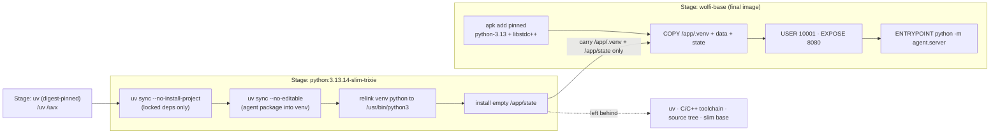

# 6.1. Containers

!!! abstract "In one glance"

    - **You will:** Build the agent's image, run it as a non-root process with a read-only filesystem, and scan it before it ever reaches a cluster.
    - **You need:** Docker running (`mise run doctor:gateway` passes) — no cluster on this page.
    - **Time:** about 40 minutes, hands-on.

## What must the image provide?

One image, built once, runs three things you will meet in this chapter: the A2A server, the MCP tool server, and the nightly backup job.

A container image is the deployment contract between the code you tested and the cluster that runs it: everything the process needs at runtime, and deliberately nothing else. kagent's `type: BYO` Agent deploys this exact image and probes `/.well-known/agent-card.json` (Chapter 6.3), so the surface must be precise and minimal:

- The locked `agent` package and its runtime dependencies.
- Immutable seed data at `/app/data`.
- A writable mount point at `/app/state`.
- A non-root UID/GID `10001` process.
- `python -m agent.server` as its entrypoint.
- A2A discovery/task service on `8080`.
- Message-content telemetry capture disabled by default ([5.6. Gateway Observability](../5.%20Gateway/5.6.%20Gateway%20Observability.md#are-prompts-stored-in-traces)).

No provider credential, development dependency, mutable local database, or Ollama model belongs in the image. Everything above is grounded in the multi-stage [`Dockerfile`](https://github.com/MLOps-Courses/agentops-open-course/blob/main/agents/python/Dockerfile), which the rest of this page walks through.

## How do you build and inspect it locally?

Build it now and let it run while you read. From the repository root:

```bash
mise run build:agent-image
docker image inspect agentops-agent:dev \
  --format '{{.Config.User}} {{json .Config.ExposedPorts}} {{json .Config.Entrypoint}}'
```

The task is exactly `docker build --file agents/python/Dockerfile --tag agentops-agent:dev agents`, so you can run that command directly instead.

Expected: UID/GID `10001`, `8080/tcp`, and the Python module entrypoint. Skaffold builds this same artifact for the cluster from [`infra/skaffold.yaml`](https://github.com/MLOps-Courses/agentops-open-course/blob/main/infra/skaffold.yaml), tagging it with the abbreviated Git commit (Chapter 6.6).

## Why build the image in multiple stages?

The image you just built leaves its build tooling behind. The tooling that _builds_ a Python service is attack surface and bloat you never want at _runtime_: a package manager, a C/C++ toolchain, a full interpreter distribution, and your source tree.

A multi-stage build lets you use a fat toolchain image to produce artifacts, then copy only those artifacts into a minimal runtime image, leaving the toolchain behind. Fewer packages means fewer CVEs for a scanner to flag and fewer binaries for an attacker who lands in the container to reuse.

This Dockerfile has three stages:

1. A tiny `uv` stage that carries only the `uv`/`uvx` binaries.
1. A `python:3.13.14-slim-trixie` **build** stage that resolves dependencies into `/app/.venv`.
1. A `cgr.dev/chainguard/wolfi-base` **runtime** stage that becomes the shipped image. Wolfi is a minimal Linux distribution built for containers.


```mermaid
flowchart LR
    UV["Stage: uv (digest-pinned)<br/>/uv /uvx"] --> B1
    subgraph build["Stage: python:3.13.14-slim-trixie"]
        B1["uv sync --no-install-project<br/>(locked deps only)"] --> B2["uv sync --no-editable<br/>(agent package into venv)"]
        B2 --> B3["relink venv python to /usr/bin/python3"]
        B3 --> B4["install empty /app/state"]
    end
    subgraph runtime["Stage: wolfi-base (final image)"]
        R1["apk add pinned<br/>python-3.13 + libstdc++"] --> R2["COPY /app/.venv + data + state"]
        R2 --> R3["USER 10001 · EXPOSE 8080"]
        R3 --> R4["ENTRYPOINT python -m agent.server"]
    end
    B4 -->|"carry /app/.venv + /app/state only"| R2
    B4 -.->|left behind| L["uv · C/C++ toolchain · source tree · slim base"]
```

Only the resolved virtual environment (which already contains the installed `agent` package) and the empty state directory cross the stage boundary. The `uv` binary, the Debian slim base, the compilers pulled in during dependency builds, and the copied `src/` tree never reach the shipped image.

The runtime stage sets `USER 10001:10001`, `EXPOSE 8080`, and ships `/app/state` as the only writable path the process needs. That is what lets the cluster run the pod with `runAsNonRoot`, `readOnlyRootFilesystem`, and every Linux capability dropped. Chapter 6.3 owns the pod-level hardening this image enables.

## Why pin the base images by digest?

A tag is a mutable pointer. `python:3.13.14-slim-trixie` today and the same tag next month can resolve to different bytes, because the upstream can re-push it. A build "pinned" only by tag is therefore not reproducible, and gives you nothing to verify against.

A digest (`@sha256:...`) is content-addressed and immutable: the same digest is always the same bytes. Every `FROM` here pins both — a readable tag for humans and a digest for the pull that actually happens:

```dockerfile
--8<-- "agents/python/Dockerfile:base-images"
```

```dockerfile
--8<-- "agents/python/Dockerfile:runtime-base"
```

Those two blocks are included from the real `Dockerfile` at build time, not retyped here. That matters more than it sounds: an earlier revision of this page hand-copied a `uv` digest, Dependabot bumped the Dockerfile, and the stale digest sat for weeks _inside the paragraph arguing that a digest cannot drift_. A claim about immutability is worth exactly as much as the mechanism that keeps it true.

Dependabot bumps the tag and its digest together, so the pins stay current without ever floating. That is a distinct mechanism from the `apk` version pins _inside_ the runtime stage. `apk` is Wolfi's package manager: the `FROM` digest freezes the base filesystem, while `apk add python-3.13=3.13.14-r3` freezes the packages layered on top of it.

Note the two different failure modes. A `FROM` digest guarantees identity only while the registry retains its manifest and blobs; deletion or garbage collection can make that exact image unavailable. Durable rebuilds therefore need an archive or trusted mirror of the pinned image. A superseded `apk` pin can stop resolving independently because Wolfi is a rolling repository — covered next.

## How is the image built reproducibly?

The build stage installs dependencies in two passes and then re-links the interpreter the venv points at:

```dockerfile
COPY python/pyproject.toml python/uv.lock ./
RUN uv sync --frozen --no-dev --no-install-project

COPY python/README.md ./README.md
COPY python/src ./src
RUN uv sync --frozen --no-dev --no-editable

RUN ln -sfn /usr/bin/python3 /app/.venv/bin/python \
 && ln -sfn /usr/bin/python3 /app/.venv/bin/python3 \
 && ln -sfn /usr/bin/python3 /app/.venv/bin/python3.13 \
 && install -d -o 10001 -g 10001 /app/state
```

1. The first `uv sync --frozen --no-dev --no-install-project` installs only the locked third-party dependencies declared in `pyproject.toml`/`uv.lock`, and nothing project-specific. Because it runs _before_ the source is copied, Docker caches this layer and re-runs it only when the lockfile changes — editing agent code never re-resolves the dependency tree.
1. The second `uv sync --frozen --no-dev --no-editable` copies the source and installs the `agent` package itself into the venv non-editably. Runtime package metadata (including the A2A card version) is then present without shipping a second copy of `src/`.

`--frozen` forces the exact locked versions, and `--no-dev` is why pytest, ruff, ty, and the MLflow eval stack — all under `[dependency-groups] dev` in [`pyproject.toml`](https://github.com/MLOps-Courses/agentops-open-course/blob/main/agents/python/pyproject.toml) — never reach the runtime image.

The third command re-points the venv at the interpreter the final image will actually have.

??? note "Deeper: why the venv's python symlinks are repointed"

    The `ln -sfn` lines repoint the venv's `python`/`python3`/`python3.13` symlinks at Wolfi's `/usr/bin/python3`. The build image installs its interpreter under `/usr/local`, but the final image gets its interpreter from `apk`, under `/usr/bin`; skip the re-link and the copied venv's shebangs point at an interpreter that does not exist in the shipped image.

    The runtime interpreter here (`python-3.13=3.13.14-r3` from Wolfi) and the build stage's `python:3.13.14-slim-trixie` happen to land on the same `3.13.14` patch today, but that alignment is incidental: only the `3.13` **minor** must match, because the venv is portable across patch releases of the same minor and the runtime stage relinks it against its own interpreter. The two pins drift independently — Debian and Wolfi ship patches on their own cadence — so do not rely on the digits after the second dot lining up.

The runtime stage then adds exactly the OS packages the venv needs:

```dockerfile
--8<-- "agents/python/Dockerfile:apk-pins"
```

These exact `apk` pins buy reproducibility at a known cost: Wolfi is a rolling repository that drops superseded package versions, so a pinned `python-3.13=...` or `libstdc++=...` will eventually stop resolving until someone bumps it. If a build suddenly fails with an `apk` "no such package" error, that is expected drift, not a broken course — refresh the pins to the current versions and rebuild. Dependabot does not watch `apk` pins, so this one is on you; the quarterly docs-freshness issue is the reminder.

The build context is `agents/`, not `agents/python/`, because `data/` is a sibling directory the runtime stage copies to `/app/data`.

## Why does one image serve three roles?

This Dockerfile ships one artifact that three workloads run under different commands. The fewer distinct images you build, scan, sign, and track, the smaller the supply-chain surface and the less version skew between components.

1. The **A2A server** — the image's default `ENTRYPOINT ["python", "-m", "agent.server"]`, deployed by the kagent BYO Agent (Chapter 6.3).
1. The **MCP tool server** — `command: ["python", "-m", "agent.mcp_server"]` in `infra/k8s/base/mcp.yaml` (Chapter 6.4).
1. The **state backup CronJob** — `command: ["python", "-m", "agent.state", "backup"]` in [`state-backup.yaml`](https://github.com/MLOps-Courses/agentops-open-course/blob/main/infra/k8s/base/state-backup.yaml) (Chapter 6.6). The host wrapper and short-lived in-cluster restore Job call the same module's `restore` command, so both environments share one manifest format and rollback implementation.

Because all three share one image, they share one scan result, one SBOM, one signature, and one pinned dependency set. The nightly backup CronJob adds no new image pin and no `cp` of a live database to the supply chain.

This page only notes that the container underneath them is identical. Chapter 6.4 owns the MCP deployment and its six-read allowlist, and Chapter 6.6 owns the backup and restore drill.

## How is runtime state persisted?

The image contains a read-only seed. Kubernetes mounts the `agentops-agent-state` 1 Gi `ReadWriteOnce` PVC at `/app/state`. A **PersistentVolumeClaim** (PVC) is a disk the cluster keeps and re-attaches to the replacement pod.

ADK sessions, A2A tasks, the writable incident copy, and audit rows therefore survive process and pod replacement while the volume exists. Because the image ships `/app/state` as the sole writable path, the pod can otherwise run with a read-only root filesystem — the state PVC and a small `emptyDir` at `/tmp` are the only writable mounts.

Single-replica SQLite is intentional. Scaling the pod above one requires a shared database and concurrency/migration design, not only changing `replicas`. Chapter 6.4 explains how the read-only MCP mount and the writable agent mount stay coherent on the same claim, and Chapter 6.6 covers backing that state up.

## How do you scan the image?

Scan the artifact you just built. A clean source dependency audit does not cover OS packages or image configuration:

```bash
trivy image --severity HIGH,CRITICAL --exit-code 1 agentops-agent:dev
```

The first run downloads Trivy's vulnerability database, so it takes noticeably longer than later runs — a slow first scan is not a hang. A clean scan prints its report and exits `0`; any HIGH or CRITICAL finding exits `1`.

CI enforces the same gate _before publishing_. The [release workflow](https://github.com/MLOps-Courses/agentops-open-course/blob/main/.github/workflows/release.yml) exports an exact Docker archive without pushing. It loads that archive locally for inspection and a non-root runtime smoke, then runs Trivy `vuln,secret` at `HIGH,CRITICAL` followed by a separate Trivy `license` scan. Both use `exit-code: 1` against the shared `trivy.yaml` policy.

Only when the smoke, both scans, and SBOM generation pass does a protected job load that same archive and reach `docker push`. A finding therefore fails before the image leaves the runner.

## What is an SBOM for?

A Software Bill of Materials is a machine-readable inventory of everything inside an artifact: OS packages, Python distributions, and their exact versions. It lets you answer supply-chain questions after release — "does any shipped image contain this newly disclosed CVE?" — without rebuilding or guessing, and it supports license review and incident response.

Every successfully completed release gets its SBOM during read-only preflight. Syft reads the exact loaded image represented by the archive that the protected job later pushes. An SBOM failure therefore writes nothing to the registry. Signing, attestation, and provenance need the pushed digest, so any failure after a successful push can leave a source-SHA tag without complete evidence. A tag alone is never proof of a finished release; consumers verify the signature and SBOM attestation. Nothing on this page asks you to produce an SBOM by hand; CI does it.

??? note "Deeper: how the SBOM is generated and attached"

    After both scans pass, read-only preflight generates an SPDX JSON SBOM with syft from the locally loaded image. It uploads the inventory beside the exact Docker archive. The protected job loads and pushes that archive by source SHA, resolves its digest, signs it, attaches the preflight SBOM, and records provenance. Separate verification later proves the attached inventory matches the release SBOM and the exact bytes consumers pull. Both cosign and syft are Apache-2.0 OSS.

## How do I prove an image is the one CI built?

Tagged release images are signed, and anyone can re-check that signature against the workflow that produced it. **Keyless signing** means CI signs with a short-lived certificate instead of a stored key.

Local builds remain the default learning path; referencing published digests from the kustomize overlays is an option, not a requirement. The verification below is optional, and nothing else in the course depends on it.

??? note "Deeper: verify a published release image yourself"

    `cosign` is not part of the pinned toolchain in `mise.toml`. Install it yourself if you want to run these commands.

    Tagged releases push both images to `ghcr.io/mlops-courses/agentops-open-course/agent` and `.../mlflow` and sign them keyless with cosign: GitHub OIDC binds a short-lived certificate to the workflow on protected `main` and the exact source commit, so there is no signing key to leak. A separate `verify` job then re-checks the published signature and attestation from scratch, so the workflow does not merely assert its own output:

    ```mermaid
    flowchart TD
        B["build exact Docker archive<br/>(no push)"] --> L["load + non-root runtime smoke"]
        L --> S1["Trivy vuln + secret scan<br/>HIGH,CRITICAL · exit 1"]
        S1 --> S2["Trivy license scan · exit 1"]
        S2 --> SB["syft SPDX SBOM<br/>(read-only preflight)"]
        SB --> P["protected job loads same archive<br/>push source-SHA tag + resolve digest"]
        P --> SG["sign + attest preflight SBOM<br/>record SLSA provenance"]
        SG --> T["promote source digest<br/>to annotated version index"]
        T --> Seal["seal public index<br/>sign + exact SBOM + SLSA provenance"]
        Seal --> V["verify job (separate)<br/>digest, labels, signature, SBOM, provenance"]
        V --> R["annotated source tag + complete<br/>draft release assets"]
        R --> Pub["publish immutable GitHub release"]
    ```

    **Diagram in words:** The workflow builds one local archive, smokes and scans it, and generates its SBOM before any registry write. Protected jobs then push and sign it, promote its digest into a version index, seal that index, verify it independently, and publish the complete release.

    Verify the same claim yourself with public tooling by asserting that identity. Set `TAG` to a published release tag — `git tag --list 'v*' --sort=v:refname | tail -1` names the newest one:

    ```bash
    TAG="$(git tag --list 'v*' --sort=v:refname | tail -1)"
    SHA="$(git rev-list -n 1 "$TAG")"
    IDENTITY="https://github.com/MLOps-Courses/agentops-open-course/.github/workflows/release.yml@refs/heads/main"

    cosign verify \
      --certificate-oidc-issuer https://token.actions.githubusercontent.com \
      --certificate-identity "$IDENTITY" \
      --certificate-github-workflow-ref refs/heads/main \
      --certificate-github-workflow-sha "$SHA" \
      "ghcr.io/mlops-courses/agentops-open-course/agent:${TAG}"

    cosign verify-attestation --type spdxjson \
      --certificate-oidc-issuer https://token.actions.githubusercontent.com \
      --certificate-identity "$IDENTITY" \
      --certificate-github-workflow-ref refs/heads/main \
      --certificate-github-workflow-sha "$SHA" \
      "ghcr.io/mlops-courses/agentops-open-course/agent:${TAG}"
    ```

    A successful verification proves the artifact was built by the protected-main workflow for the source commit later published as that tag, and the attestation carries its SBOM. When consuming a published image, pin it by the verified digest (`ghcr.io/...@sha256:...`), not the tag — the same tag-versus-digest distinction the `FROM` lines rely on.

## What proves this page worked?

Build, inspect, and scan the image. Then run it only with explicit model/gateway endpoints and a writable state volume; confirm it does not attempt to modify `/app/data` or run as root.

Reproduce the pod's hardening locally — the same flags kagent applies as `runAsUser: 10001`, `readOnlyRootFilesystem: true`, dropped capabilities, a `/tmp` `emptyDir`, and the state PVC ([`infra/kagent/agent.yaml`](https://github.com/MLOps-Courses/agentops-open-course/blob/main/infra/kagent/agent.yaml)):

```bash
# Boot the A2A server under the pod's securityContext. It serves /healthz and the
# agent card without ever calling a model, so no gateway or Ollama is needed here.
docker run --rm \
  --user 10001:10001 --read-only --cap-drop ALL \
  --security-opt no-new-privileges --tmpfs /tmp:size=128m \
  --volume agentops-state:/app/state --publish 8080:8080 \
  agentops-agent:dev
```

```bash
# In another shell — readiness passes, which proves the /app/state volume is
# writable even though the whole root filesystem is read-only:
curl -fsS http://127.0.0.1:8080/livez            # {"status":"alive"}
curl -fsS http://127.0.0.1:8080/healthz | jq     # {"status":"ready"}
```

The process ran the whole time under `--user 10001:10001` (never root) and `--read-only`. That is the checkpoint made concrete: `/app/data` is immutable, and only the mounted `/app/state` volume and the `/tmp` tmpfs are writable — a healthy `/healthz` under those flags is the proof.

**You are done when:**

- `docker image inspect` prints UID/GID `10001`, `8080/tcp`, and `python -m agent.server` as the entrypoint.
- `trivy image --severity HIGH,CRITICAL --exit-code 1 agentops-agent:dev` finishes and exits `0`.
- `/livez` returns `{"status":"alive"}` and `/healthz` returns `{"status":"ready"}` while the container runs with `--user 10001:10001 --read-only`.
- You can name the three workloads that run this one image, and the chapter that owns each.

Continue to [6.2. Platform Install](./6.2.%20Platform%20Install.md) when the image you built passes its own scan and stays healthy as a non-root, read-only container.
