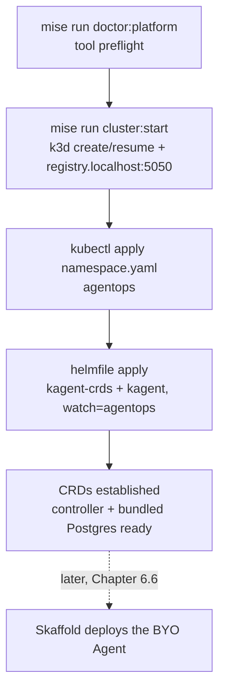
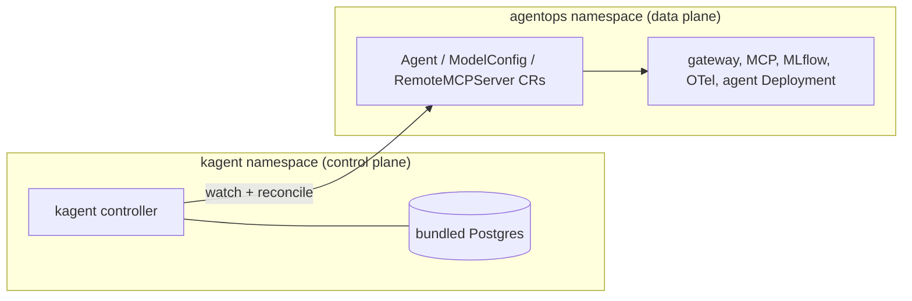

# 6.2. Platform Install

Installing a control plane is a sequence of fail-fast gates: check the toolchain, stand up a reproducible cluster, then land exactly the operator you need and nothing else. Each step here is a `mise` task backed by a checked-in config or guarded script, so every learner gets the same topology instead of an ad-hoc pile of flags. The whole flow is four ordered steps, and the agent itself is not one of them — it arrives later via Skaffold (Chapter 6.6):



## What does the platform doctor check before you start?

A half-installed cluster is worse than no cluster: a missing `helmfile` or `skaffold` surfaces three steps in, after k3d has already claimed Docker resources. The preflight moves that failure to the front. `mise run doctor:platform` runs `scripts/doctor.sh platform`, which refuses to print `platform ready` until every tool the rest of the chapter shells out to is on `PATH`:

```bash
mise run doctor:platform
```

The platform profile requires `git`, `uv`, `dprint`, `curl`, `docker`, `jq`, `rg`, `yq`, then the Kubernetes toolchain: `k3d`, `kubectl`, `helm`, `helmfile`, `skaffold`, `kustomize`, `kubeconform`, `kube-linter`, and `agentgateway`. It also confirms both Python virtualenvs exist, that the gateway wrapper is executable and the Docker daemon answers, that the `helm-diff` plugin `3.15.10` is installed (helmfile uses it to diff on apply), and it reports which kube context is currently selected or that the cluster is not created yet. Most of these tools are version-pinned in `mise.toml` (uv, dprint, jq, rg, yq, and the whole Kubernetes toolchain), so `mise run install` provisions the exact versions the tasks were written against; `git`, `curl`, and `docker` are host prerequisites mise does not manage, so the doctor only checks that they are on `PATH`. The doctor verifies presence, the pins verify reproducibility.

## How do you create the validated local cluster?

Reproducible clusters come from a config file under review, not from remembered command-line flags. `mise run cluster:start` is a guarded root task that runs `scripts/cluster-start.sh`, which creates or resumes cluster `local` from `infra/k3d.yaml`:

```bash
mise run cluster:start
```

The declared topology is one server node plus one agent node, the k3s image pinned to `v1.35.5-k3s1`, an integrated `registry.localhost:5050`, a loopback-only Kubernetes API, and none of k3d's default edge networking. On success it updates your kubeconfig and switches the current context to `k3d-local`, then prints `cluster: k3d-local is ready with registry.localhost:5050`. The next two sections explain why the topology looks the way it does and why re-running the task is always safe.

## Why disable Traefik, servicelb, and the k3d load balancer?

k3d and k3s ship convenience networking for people who want a public-ish cluster in one command: a Traefik ingress controller, the servicelb (klipper) handler that fakes `LoadBalancer` services, and a load-balancer container that fronts the API server. This course wants none of it, because it brings its own hardened agentgateway (Chapter 6.5) and exposes nothing publicly — access is port-forward only. Those extras would be dead weight at best and a second, conflicting ingress path at worst. `infra/k3d.yaml` turns them off deliberately:

```yaml
options:
  k3d:
    wait: true
    timeout: 120s
    disableLoadbalancer: true
  k3s:
    extraArgs:
      - arg: --disable=traefik,servicelb
        nodeFilters:
          - server:*
```

The same file binds the API server to loopback so it is unreachable from off the machine, and it creates the registry the delivery loop pushes to:

```yaml
kubeAPI:
  hostIP: 127.0.0.1
registries:
  create:
    name: registry.localhost
    host: 127.0.0.1
    hostPort: "5050"
```

See [`k3d.yaml`](https://github.com/MLOps-Courses/agentops-open-course/blob/main/infra/k3d.yaml). Each choice earns its place: `disableLoadbalancer: true` drops the extra LB container so the API is reached directly; `--disable=traefik,servicelb` removes the built-in ingress controller and the `LoadBalancer` handler the course never uses; `hostIP: 127.0.0.1` keeps the API loopback-only; `registry.localhost:5050` exists because it is Skaffold's push target (the delivery loop sets `SKAFFOLD_DEFAULT_REPO=registry.localhost:5050`), so image builds stay local to the cluster; and one server plus one agent node keeps the lab cheap to schedule. This is a learning substrate, not a production edge — do not add an Ingress here expecting the manifests to publish it.

## How does cluster:start stay idempotent on a shared cluster?

A start task you cannot safely re-run is a foot-gun during a lab: the second invocation must resume the cluster, not clobber it, and it must refuse an inconsistent half-state rather than build a broken push path. `scripts/cluster-start.sh` first checks that the Docker daemon is up, lists the existing clusters and registries as JSON, and branches on what it finds:

1. Cluster `local` exists, registry present, server running: nothing to do.
1. Cluster `local` exists but its server is stopped: `k3d cluster start local` resumes it.
1. Cluster `local` is absent: `k3d cluster create --config infra/k3d.yaml` builds it from the tracked config.

Two guards refuse the mismatched cases outright, because on the shared `local` k3d cluster (each local project gets its own namespace on one cluster) a leftover registry or a half-deleted cluster would otherwise leave you with a registry no cluster can pull from, or a cluster with no push target:

```text
k3d: cluster local exists without registry.localhost; reconcile it before continuing
k3d: registry.localhost exists without cluster local; reconcile it before continuing
```

See [`cluster-start.sh`](https://github.com/MLOps-Courses/agentops-open-course/blob/main/scripts/cluster-start.sh). When a guard fires, delete the orphan (`k3d registry delete registry.localhost` or `k3d cluster delete local`) and re-run the task; it will rebuild the pair together.

## How is kagent installed?

With the cluster ready, install the operator that will own the agent workload:

```bash
mise run platform:install
```

The task asserts the current context is `k3d-local`, applies `infra/k8s/base/namespace.yaml`, then runs `helmfile --file infra/helmfile.yaml apply`. `infra/helmfile.yaml` pins two OCI charts from the kagent project — `kagent-crds` and `kagent`, both at `0.9.11` — and its `helmDefaults` block is what makes the later verification meaningful: apply blocks until the CRDs are established and the pods are actually ready, instead of returning the moment Helm accepts the release:

```yaml
helmDefaults:
  wait: true
  waitForJobs: true
  timeout: 600

releases:
  - name: kagent-crds
    namespace: kagent
    chart: oci://ghcr.io/kagent-dev/kagent/helm/kagent-crds
    version: 0.9.11
    createNamespace: true
```

See [`helmfile.yaml`](https://github.com/MLOps-Courses/agentops-open-course/blob/main/infra/helmfile.yaml). The `kagent` release declares `needs: [kagent/kagent-crds]`, so the CRDs land before the controller that reconciles them, and it consumes `infra/kagent/values.yaml`. The versions match the `helm 4.2.3` and `helmfile 1.7.0` pins in `mise.toml`; do not float them.

## Why install the namespace first?

kagent installs a cluster-wide control plane, but this course splits control plane from data plane across two namespaces, and the order matters:



The `kagent` namespace holds the controller and its bundled Postgres, created by the chart's `createNamespace: true`. The `agentops` namespace holds every course workload, and the task creates it explicitly first so its guarantees exist before anything lands: `infra/k8s/base/namespace.yaml` labels it with `pod-security.kubernetes.io/enforce: restricted` and marks it `part-of: agentops-open-course`, and the chart's RBAC and watch scope both name `agentops`. Creating it before Helm keeps that scope explicit; the Kustomize overlay also declares the same namespace so later rendering stays self-contained.

Note what install does not do: it does not deploy the agent. `platform:install` only establishes the CRDs and a running controller. The BYO Agent `Deployment`/`Service`, its `ModelConfig`, and its `RemoteMCPServer` are custom resources that arrive later — the resources are declared in Chapters 6.3 and 6.4, and Skaffold applies them in Chapter 6.6. Until then the controller simply has nothing to reconcile in `agentops`, which is exactly the expected post-install state.

## Why run the slim kagent chart?

The upstream kagent chart is a demo distribution: it ships a fleet of built-in agents (`k8s`, `kgateway`, `istio`, `promql`, `observability`, `argo-rollouts`, `helm`, and several `cilium` agents), the `kmcp` and `kagent-tools` add-ons, `grafana-mcp`, `querydoc`, and a web UI. On a shared cluster every extra Deployment is footprint you must schedule, patch, and defend for no course value — it is attack surface, not capability. `infra/kagent/values.yaml` scopes the control plane down to just the controller and its database. It limits RBAC and watching to the two namespaces the course uses:

```yaml
rbac:
  namespaces:
    - kagent
    - agentops

controller:
  watchNamespaces:
    - agentops
```

And it disables every optional component, one flag at a time, so nothing you did not ask for gets scheduled:

```yaml
kmcp:
  enabled: false

kagent-tools:
  enabled: false
```

See [`values.yaml`](https://github.com/MLOps-Courses/agentops-open-course/blob/main/infra/kagent/values.yaml), which also sets `ui.replicas: 0` and disables the whole demo agent fleet, `grafana-mcp`, and `querydoc`. The controller and bundled Postgres carry explicit CPU/memory requests and limits so they fit a one-server, one-agent lab node. The result is a minimal, explainable control-plane footprint: fewer moving parts to keep patched, and a watch scope narrow enough that a mistake in `agentops` cannot cascade into a neighbor's namespace.

## How do you verify the installation?

Because `helmDefaults` waits, a clean `helmfile apply` already implies readiness — but verify it independently rather than trusting the exit code:

```bash
kubectl -n kagent get pods
kubectl get crd \
  agents.kagent.dev \
  modelconfigs.kagent.dev \
  remotemcpservers.kagent.dev
helmfile -f infra/helmfile.yaml list
```

Expected: the kagent controller and bundled Postgres pods are Ready in the `kagent` namespace; the three CRDs the course's custom resources rely on are established; `helmfile list` shows both releases at exactly `0.9.11`; and no demo agent fleet or UI pod is running. If a CRD is missing, the `kagent-crds` release did not apply before the controller — re-run `mise run platform:install`, which is safe to repeat.

## How do you remove kagent?

The kagent control plane is cluster-wide. On the shared `local` cluster, remove the course workloads and keep kagent available for other namespaces. Run this only for a dedicated lab after confirming no other kagent-managed workloads remain:

```bash
helmfile -f infra/helmfile.yaml destroy
```

Remove the course workload with Skaffold first (Chapter 6.6). Helm deletion does not automatically preserve a valid BYO deployment once its controller and CRDs are gone.

## What is the install checkpoint?

Confirm the cluster context is `k3d-local`, both nodes are Ready, and `registry.localhost:5050` exists alongside the cluster. Confirm the chart versions are exactly `0.9.11`, the controller watches only `agentops`, and no UI or demo workload consumes the small lab node. The controller having nothing to reconcile in `agentops` is correct at this stage — the agent, its tools, and its gateway arrive in the following pages.
