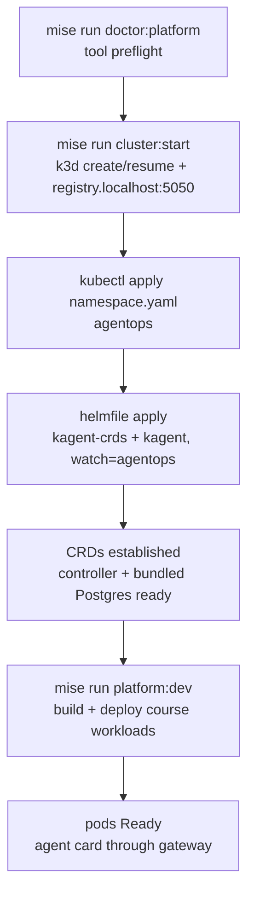
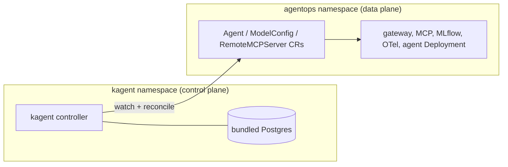
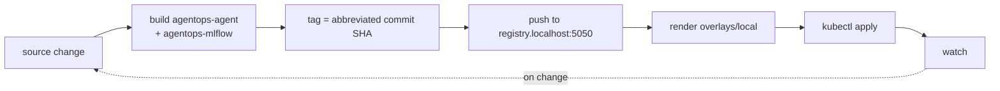

# 6.2. Platform Install

!!! abstract "In one glance"

    - **You will:** Create the local k3d cluster, install the kagent control plane, and start the course workloads with Skaffold.
    - **You need:** `mise run doctor:platform` passing and the Docker engine running.
    - **Time:** about 30 minutes, hands-on.

Installing a platform is a sequence of fail-fast gates: check the toolchain, create a reproducible cluster, install the operator, then start the workloads. Each step is a `mise` task backed by a checked-in config or guarded script, so every learner gets the same topology instead of an ad-hoc pile of flags:


```mermaid
flowchart TD
    Doctor["mise run doctor:platform<br/>tool preflight"] --> Start["mise run cluster:start<br/>k3d create/resume + registry.localhost:5050"]
    Start --> NS["kubectl apply namespace.yaml<br/>agentops"]
    NS --> Helm["helmfile apply<br/>kagent-crds + kagent, watch=agentops"]
    Helm --> Ready["CRDs established<br/>controller + bundled Postgres ready"]
    Ready --> Skaffold["mise run platform:dev<br/>build + deploy course workloads"]
    Skaffold --> Check["pods Ready<br/>agent card through gateway"]
```

## What does the platform doctor check before you start?

A half-installed cluster is worse than no cluster: a missing tool or incompatible cgroup hierarchy can surface after k3d has already claimed Docker resources. The preflight moves those failures to the front. `mise run doctor:platform` runs `scripts/doctor.sh platform`, which checks every tool plus the cgroup-v2 requirement before cluster creation:

```bash
mise run doctor:platform
```

A green run on a machine that has installed the tools but not yet created the cluster prints exactly five lines:

```text
platform   ready
env        optional .env is absent
docker     ready
cgroup     v2 ready
helm       helm-diff 3.15.10 ready
cluster    not created yet; run mise run cluster:start when needed
```

The second line varies with your machine: if you later create a `.env`, it reads `env        .env available to explicit live/config tasks` instead. The last line only reports your kubectl context; the doctor never creates a cluster. It fails on a missing tool, project virtualenv, executable gateway wrapper, Docker daemon, cgroup v2 hierarchy, or `helm-diff` plugin. The doctor verifies prerequisites, while the pins verify reproducibility.

The exact platform-tool inventory and ownership live in [1.3. Kubernetes](../1.%20Setup/1.3.%20Kubernetes.md#which-tools-are-required). `git`, `curl`, and Docker remain host prerequisites; mise installs the pinned project toolchain.

## How do you create the validated local cluster?

Reproducible clusters come from a config file under review, not from remembered command-line flags. `mise run cluster:start` is a guarded root task that runs `scripts/cluster-start.sh`, which creates or resumes cluster `local` from `infra/k3d.yaml`:

```bash
mise run cluster:start
```

The topology that file declares is:

1. One schedulable server node and no agent node.
1. The k3s image tag and multi-platform manifest digest pinned in `infra/k3d.yaml`.
1. An integrated `registry.localhost:5050`.
1. A loopback-only Kubernetes API.
1. None of k3d's default edge networking.

On success the task updates your kubeconfig and switches the current context to `k3d-local`, then prints `cluster: k3d-local is ready with registry.localhost:5050`. The next two sections explain why the topology looks the way it does and why re-running the task is always safe.

## Why disable Traefik, servicelb, and the k3d load balancer?

k3d and k3s switch on three pieces of convenience networking by default. They are there for people who want a public-ish cluster in one command: a Traefik ingress controller, the servicelb (klipper) handler that fakes `LoadBalancer` services, and a load-balancer container that fronts the API server.

This course wants none of it, because it brings its own hardened agentgateway (Chapter 6.5) and exposes nothing publicly — access is port-forward only. Those extras would be dead weight at best and a second, conflicting ingress path at worst. `infra/k3d.yaml` turns them off deliberately:

```yaml
options:
  k3d:
    wait: true
    timeout: 120s
    disableLoadbalancer: true
  k3s:
    extraArgs:
      - arg: --disable=traefik,servicelb
        nodeFilters:
          - server:*
```

The same file binds the API server to loopback so it is unreachable from off the machine, and it creates the registry the delivery loop pushes to:

```yaml
kubeAPI:
  hostIP: 127.0.0.1
registries:
  create:
    name: registry.localhost
    host: 127.0.0.1
    hostPort: "5050"
```

See [`k3d.yaml`](https://github.com/MLOps-Courses/agentops-open-course/blob/main/infra/k3d.yaml). Each choice earns its place:

1. `disableLoadbalancer: true` drops the extra LB container so the API is reached directly.
1. `--disable=traefik,servicelb` removes the built-in ingress controller and the `LoadBalancer` handler the course never uses.
1. `hostIP: 127.0.0.1` keeps the API loopback-only.
1. `registry.localhost:5050` exists because it is Skaffold's push target (the delivery loop sets `SKAFFOLD_DEFAULT_REPO=registry.localhost:5050`), so image builds stay local to the cluster.
1. One server with no agent node avoids cross-node `ReadWriteOnce` volume-affinity failures and reduces the lab footprint.

This is a learning substrate, not a production edge: do not add an Ingress here expecting the manifests to publish it. [1.3. Kubernetes](../1.%20Setup/1.3.%20Kubernetes.md) makes the same argument from the Setup side, before any cluster exists.

## How does cluster:start stay idempotent on a shared cluster?

Running `mise run cluster:start` twice is safe. It resumes a stopped cluster instead of clobbering it, and it stops with a message when it finds a cluster and a registry that do not match.

??? note "Deeper: how cluster:start decides what to do"

    A start task you cannot safely re-run is a foot-gun during a lab: the second invocation must resume the cluster, not clobber it, and it must refuse an inconsistent half-state rather than build a broken push path. `scripts/cluster-start.sh` first checks that the Docker daemon is up, lists the existing clusters and registries as JSON, and branches on what it finds:

    1. Cluster `local` exists, registry present, server running: nothing to do.
    1. Cluster `local` exists but its server is stopped: `k3d cluster start local` resumes it.
    1. Cluster `local` is absent: `k3d cluster create --config infra/k3d.yaml` builds it from the tracked config.

    Two guards refuse the mismatched cases outright, because on the shared `local` k3d cluster (each local project gets its own namespace on one cluster) a leftover registry or a half-deleted cluster would otherwise leave you with a registry no cluster can pull from, or a cluster with no push target:

    ```text
    k3d: cluster local exists without registry.localhost; reconcile it before continuing
    k3d: registry.localhost exists without cluster local; reconcile it before continuing
    ```

    See [`cluster-start.sh`](https://github.com/MLOps-Courses/agentops-open-course/blob/main/scripts/cluster-start.sh). A guard is a diagnosis, not permission to delete either shared resource.

!!! danger "Never auto-delete a mismatched shared cluster"

    Answer the ownership question with these three commands rather than from memory:

    ```bash
    k3d cluster list
    k3d registry list
    kubectl get namespaces --show-labels
    ```

    On a single-user laptop the answer is usually immediate: if `kubectl get namespaces` shows only the Kubernetes built-ins (`default`, `kube-*`) plus `agentops` and `kagent`, this cluster carries nothing but this course and you are its owner — repair or delete the leftover half freely. Any other namespace, or a cluster you do not remember creating, means someone else's work is on it: reconcile the pair instead of deleting either side. Never delete the shared `local` cluster merely to make this task green; [6.6. Platform Delivery](./6.6.%20Platform%20Delivery.md) owns the dedicated-lab teardown.

## How is kagent installed?

With the cluster ready, install the operator that will own the agent workload. An **operator** is a controller that watches custom resources and keeps the cluster matching them.

```bash
mise run platform:install
```

Expect a few minutes on a first run, with no output while it pulls charts and waits. If it exits immediately instead, your current context is not `k3d-local`: the task asserts that before anything else.

The task asserts the current context is `k3d-local`, applies `infra/k8s/base/namespace.yaml`, then runs `helmfile --file infra/helmfile.yaml apply --skip-diff-on-install`. **helmfile** declares which Helm charts a cluster should have and applies them in order. Skipping the diff only for a release's first installation lets the CRD chart establish `ModelConfig` before Helm validates the dependent controller chart; later updates still show their normal diff. `infra/helmfile.yaml` pins two OCI charts from the kagent project: `kagent-crds` and `kagent`, both at `0.9.12`. Its `helmDefaults` block is what makes the later verification meaningful. Apply blocks until the CRDs are established and the pods are actually ready, instead of returning the moment Helm accepts the release:

```yaml
--8<-- "infra/helmfile.yaml:kagent-crds-release"
```

See [`helmfile.yaml`](https://github.com/MLOps-Courses/agentops-open-course/blob/main/infra/helmfile.yaml). The `kagent` release declares `needs: [kagent/kagent-crds]`, so the CRDs land before the controller that reconciles them, and it consumes `infra/kagent/values.yaml`. The versions match the `helm 4.2.3` and `helmfile 1.7.1` pins in `mise.toml`; do not float them.

## Why install the namespace first?

kagent installs a cluster-wide control plane, but this course splits control plane from data plane across two namespaces, and the order matters:


```mermaid
flowchart LR
    subgraph kagentns["kagent namespace (control plane)"]
        Controller[kagent controller]
        Postgres[("bundled Postgres")]
        Controller --- Postgres
    end
    subgraph agentopsns["agentops namespace (data plane)"]
        CRs["Agent / ModelConfig / RemoteMCPServer CRs"]
        Workloads["gateway, MCP, MLflow, OTel, agent Deployment"]
    end
    Controller -->|"watch + reconcile"| CRs
    CRs --> Workloads
```

The `kagent` namespace holds the controller and its bundled Postgres, created by the chart's `createNamespace: true`. The `agentops` namespace holds every course workload, and the task creates it explicitly first so its guarantees exist before anything lands. `infra/k8s/base/namespace.yaml` labels it with `pod-security.kubernetes.io/enforce: restricted` and marks it `part-of: agentops-open-course`. The chart's RBAC and watch scope both name `agentops`, so creating the namespace before Helm keeps that scope explicit. The Kustomize overlay also declares the same namespace, so later rendering stays self-contained.

Note what install does not do: it does not deploy the agent. `platform:install` only establishes the CRDs and a running controller. The next section starts Skaffold, which applies the BYO Agent `Deployment`/`Service`, its `ModelConfig`, and its `RemoteMCPServer`. Until then the controller simply has nothing to reconcile in `agentops`, which is exactly the expected post-install state.

## Why run the slim kagent chart?

The upstream chart ships far more than this course needs, so the install switches the extras off.

??? note "Deeper: what the upstream chart would otherwise install"

    The upstream kagent chart is a demo distribution: it ships a fleet of built-in agents (`k8s`, `kgateway`, `istio`, `promql`, `observability`, `argo-rollouts`, `helm`, and several `cilium` agents), the `kmcp` and `kagent-tools` add-ons, `grafana-mcp`, `querydoc`, and a web UI. On a shared cluster every extra Deployment is footprint you must schedule, patch, and defend for no course value — it is attack surface, not capability.

`infra/kagent/values.yaml` scopes the control plane down to just the controller and its database. **RBAC** is the rule set saying which Kubernetes API objects a component may touch; the values limit both RBAC and the controller's watch scope to the two namespaces the course uses:

```yaml
rbac:
  namespaces:
    - kagent
    - agentops

controller:
  watchNamespaces:
    - agentops
```

And it disables every optional component, one flag at a time, so nothing you did not ask for gets scheduled:

```yaml
kmcp:
  enabled: false

kagent-tools:
  enabled: false
```

See [`values.yaml`](https://github.com/MLOps-Courses/agentops-open-course/blob/main/infra/kagent/values.yaml), which also sets `ui.replicas: 0` and disables the whole demo agent fleet, `grafana-mcp`, and `querydoc`. The controller and bundled Postgres carry explicit CPU/memory requests and limits so they fit a one-server, one-agent lab node. The result is a minimal, explainable control-plane footprint: fewer moving parts to keep patched, and a watch scope narrow enough that a mistake in `agentops` cannot cascade into a neighbor's namespace.

## How do you verify the installation?

Because `helmDefaults` waits, a clean `helmfile apply` already implies readiness — but verify it independently rather than trusting the exit code:

```bash
kubectl -n kagent get pods
kubectl get crd \
  agents.kagent.dev \
  modelconfigs.kagent.dev \
  remotemcpservers.kagent.dev
helmfile -f infra/helmfile.yaml list
```

Expected:

1. The kagent controller and bundled Postgres pods are Ready in the `kagent` namespace.
1. The three CRDs the course's custom resources rely on are established.
1. `helmfile list` shows both releases at exactly `0.9.12`.
1. No demo agent fleet or UI pod is running.

If a CRD is missing, the `kagent-crds` release did not apply before the controller — re-run `mise run platform:install`, which is safe to repeat.

## Which runtime profile should you run?

Choose the profile that matches your host before starting the workloads:

| Your setup                                        | Profile to run                                                     |
| ------------------------------------------------- | ------------------------------------------------------------------ |
| Linux with Docker Engine                          | Local k3d — the validated path (`mise run platform:dev`)           |
| macOS where the VM-to-Ollama bridge is not proven | Stay on the Chapter 5 host profile; it is an acceptable checkpoint |
| GKE                                               | Plan-only unless an approved deployment is explicitly requested    |

Never run the host Compose stack and the in-cluster stack together. Both use the same local forward ports, so stop the Chapter 5 processes first.

## How do you start the local Kubernetes workloads?

Start Ollama on the k3d bridge, then keep the Skaffold development loop running while you work through pages 6.3 to 6.5.

In one terminal:

```bash
export OLLAMA_HOST="$(docker network inspect k3d-local --format '{{(index .IPAM.Config 0).Gateway}}'):11434"
ollama serve
```

In another terminal, use the same bridge address:

```bash
export OLLAMA_HOST="$(docker network inspect k3d-local --format '{{(index .IPAM.Config 0).Gateway}}'):11434"
ollama pull qwen3:4b-instruct
mise run platform:dev
```

The explicit bridge bind is necessary because Ollama's default loopback listener is not reachable from k3d. `mise run platform:dev` asserts the `k3d-local` context, changes into `infra/`, and runs the local Skaffold profile with `registry.localhost:5050` as its push target. It sets `--cleanup=false`, so `Ctrl-C` stops the watcher but leaves workloads and PVCs for the explicit teardown later in the chapter.

!!! danger "On Linux the rebind collides with the Ollama service, and it is not loopback"

    The Linux installer ships a systemd unit that already owns `:11434` on loopback ([1.4. Providers](../1.%20Setup/1.4.%20Providers.md)), so the `ollama serve` above fails with `bind: address already in use`. Pick one of two paths, and undo it after the lab:

    1. **Borrow the port for the session.** `sudo systemctl stop ollama`, run `ollama serve` in its own terminal with `OLLAMA_HOST` exported as above, then `sudo systemctl start ollama` when you are done. Nothing on disk changes.
    1. **Rebind the unit itself**, if you want systemd to keep managing Ollama. `sudo systemctl edit ollama` and add `Environment="OLLAMA_HOST=<bridge address>:11434"` under `[Service]`, using the address the `docker network inspect` command above prints, then `sudo systemctl restart ollama`. Undo it with `sudo systemctl revert ollama && sudo systemctl restart ollama`, which deletes the drop-in and restores the vendor unit.

    Either way you are no longer on loopback, and Ollama has no authentication on that listener: every container on the `k3d-local` network, and anything that can route to that bridge address, can now use your model. Use it on a trusted machine and undo the rebind when the lab ends. The bridge address also changes when Docker recreates the network, so re-read it rather than hard-coding it into the unit for good.

On macOS, the container engine runs inside a VM, so the Linux bridge address is not a valid macOS bind address. Keep using the Chapter 5 host path unless you deliberately rebind Ollama.

!!! danger "A macOS rebind can expose Ollama to your network"

    The Kubernetes path needs Ollama to listen beyond loopback. Ollama has no authentication on this listener, so use only a trusted network and undo the rebind after the lab.

    Follow [Ollama's macOS bind configuration](https://docs.ollama.com/faq#how-do-i-configure-ollama-server), quit and reopen Ollama.app, then verify from a short-lived pod outside the restricted `agentops` namespace:

    ```bash
    launchctl setenv OLLAMA_HOST "0.0.0.0:11434"
    kubectl run ollama-check --rm -i --restart=Never \
      --image=docker.io/library/busybox:1.37.0@sha256:9532d8c39891ca2ecde4d30d7710e01fb739c87a8b9299685c63704296b16028 -- \
      wget -qO- http://host.k3d.internal:11434/api/tags
    launchctl unsetenv OLLAMA_HOST
    # Quit and reopen Ollama.app again after the lab.
    ```

??? note "Deeper: why macOS needs a different bind"

    Docker Desktop and Colima put the container engine inside a VM. k3d injects `host.k3d.internal` for pod-to-host access, but Ollama binds loopback by default.

## What does Skaffold deploy?

Skaffold builds two images, pushes them to the local registry, renders the local Kustomize overlay, and applies it.


```mermaid
flowchart LR
    Src["source change"] --> B["build agentops-agent<br/>+ agentops-mlflow"]
    B --> T["tag = abbreviated commit SHA"]
    T --> Push["push to registry.localhost:5050"]
    Push --> R["render overlays/local"]
    R --> A["kubectl apply"]
    A --> W["watch"]
    W -. on change .-> Src
```

`mise run platform:dev` derives `AGENT_SOURCE_COMMIT` from `HEAD`, then starts Skaffold's watched loop. `infra/skaffold.yaml` refuses a build without that exact-source value, so an image cannot lose its revision label.

In a third terminal, verify the baseline before studying each resource:

```bash
kubectl -n agentops get pods,pvc,svc
kubectl -n agentops wait --for=condition=Ready pod --all --timeout=180s
kubectl -n agentops port-forward svc/agentgateway 3001:3001
```

Leave the port-forward running. From a fourth terminal, call the agent card:

```bash
curl -fsS http://localhost:3001/.well-known/agent-card.json | jq .name
```

Expected name: `AgentOps Agent`. Keep Skaffold running. Pages 6.3, 6.4, and 6.5 now explain and verify the resources you just deployed instead of asking you to jump ahead and return.

## What do you do when the machine runs out of memory?

This is the most common cold-laptop failure of the chapter, and it never announces itself as "out of memory". It shows up as a pod stuck `Pending`, a container in `CrashLoopBackOff`, a Skaffold build that stops moving, or a `kubectl` that suddenly cannot reach the API server.

Diagnose in this order, because three different failures look alike and have different fixes:

```bash
kubectl -n agentops get pods
kubectl -n agentops describe pod <pod> | grep -A6 "Last State"
kubectl get events -A --sort-by=.lastTimestamp | tail -20
docker stats --no-stream
```

| What you observe                                                              | What it actually is                                                                        | What to do                                                                                                                   |
| ----------------------------------------------------------------------------- | ------------------------------------------------------------------------------------------ | ---------------------------------------------------------------------------------------------------------------------------- |
| `Pending`, with `Insufficient memory` or `Insufficient cpu` in the events     | the node has no room left to schedule; nothing is broken or misconfigured                  | free the host first — stop the Chapter 5 and 7 host Compose stacks and any unrelated containers, then re-check               |
| `OOMKilled`, or exit code `137` under `Last State`                            | that one container exceeded **its own** limit; the rest of the cluster is fine             | read the limit in the owning manifest and raise it deliberately, or give that pod less work                                  |
| `kubectl` stops answering, or the k3d node container is gone from `docker ps` | the engine (or the Docker Desktop/Colima VM) hit the machine's ceiling and killed the node | raise the VM's memory allocation, or run fewer tenants: the model, the cluster, and a browser do not share 8 GiB comfortably |

Two structural savings come before tuning any limit. Never run the host Compose observability stack and the in-cluster stack together — they duplicate every component and contend for the same host ports. And stop the cluster when you are not using it, which is the next section. The model is the other large tenant: Ollama keeps `qwen3:4b-instruct` resident while it serves.

## How do you stop the cluster between sessions?

Stopping is not deleting. `k3d cluster stop` stops the node containers and leaves the cluster, its images, its volumes, and your deployed workloads exactly as they are:

```bash
k3d cluster stop local
```

Make that the normal end of a working session. It returns the memory k3s and the course workloads were holding while keeping every byte of state, and `mise run cluster:start` resumes the same cluster in seconds — the second branch of the idempotent path above. Deleting the cluster instead destroys its PVCs, which is why that command sits behind the teardown review in [6.6. Platform Delivery](./6.6.%20Platform%20Delivery.md).

## How do you remove kagent later?

Teardown belongs to Chapter 6.6, at the end of the platform tier. Read this section now; run it then.

!!! danger "Do not run this during the chapter"

    The kagent control plane is cluster-wide. On the shared `local` cluster, remove the course workloads and keep kagent available for other namespaces. Run this only for a dedicated lab after confirming no other kagent-managed workloads remain:

    ```bash
    helmfile -f infra/helmfile.yaml destroy
    ```

    Remove the course workload with Skaffold before the Helm release. Chapter 6.6 owns that teardown sequence because deleting the controller and CRDs first would leave an invalid BYO deployment.

## What proves this page worked?

Confirm the cluster, control plane, and Skaffold workloads are ready before studying their individual resources.

**You are done when:**

- `mise run doctor:platform` ends with `cluster    k3d-local selected` instead of `cluster    not created yet`.
- `kubectl -n kagent get pods` shows the controller and its bundled Postgres Ready, and no demo agent or UI pod.
- `kubectl get crd` lists `agents.kagent.dev`, `modelconfigs.kagent.dev`, and `remotemcpservers.kagent.dev`.
- `helmfile -f infra/helmfile.yaml list` shows `kagent-crds` and `kagent` at exactly `0.9.12`.
- `kubectl -n agentops get pods,pvc,svc` shows the workloads Ready and their claims Bound.
- The agent card request through gateway `:3001` prints `AgentOps Agent`.

Continue to [6.3. Platform Agents](./6.3.%20Platform%20Agents.md) with Skaffold running, because the next page explains the agent resource you can now inspect.
