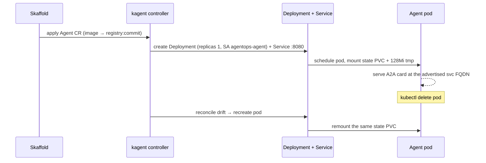
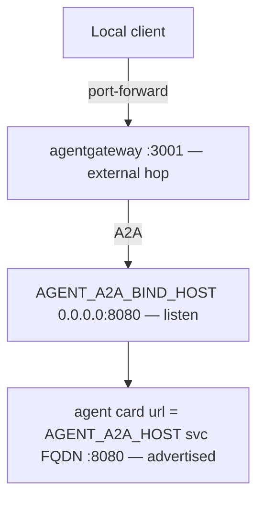

# 6.3. Platform Agents

## Why declare a BYO Agent instead of a declarative kagent Agent?

kagent supports two shapes of `Agent`. A **declarative** Agent hands kagent a model, a system prompt, and a tool list, and kagent composes and runs the loop for you inside its own runtime and container. A **BYO** ("bring your own") Agent inverts that: you ship the container image and own the agent contract, and kagent's job narrows to scheduling the workload and fronting it on the cluster network. Choosing between them is the single most important decision on this page, because it decides who owns the agent's behavior.

This course spent chapters 2 through 5 building a complete Google ADK application: a persistent session/task server (Chapter 2.4), guarded write actions (Chapter 3.1), PII and injection guardrails (Chapter 4.5), audit transactions, and OpenTelemetry spans (Chapter 7). A declarative Agent would discard that and re-express a thinner agent in kagent's vocabulary. `spec.type: BYO` keeps the validated application intact — the exact image that ran on the host in Chapter 5 runs unchanged in the cluster, still serving its own A2A card, still driving its own ADK `Runner`. That is why Chapter 6.0 states plainly that kagent does not replace ADK.

The trade-off is explicit:

1. Choose BYO when you already have a working agent and want to preserve its runtime, framework, protocol surface, and lifecycle exactly — as this course does. You accept that kagent cannot introspect your prompt or tools.
1. Choose a declarative Agent when you want kagent to own composition and are starting from a model and a tool list, not a container. You gain declarative convenience and lose runtime control.

## What does the BYO Agent declare?

[`infra/kagent/agent.yaml`](https://github.com/MLOps-Courses/agentops-open-course/blob/main/infra/kagent/agent.yaml) is one custom resource that carries the full workload shape:

```yaml
apiVersion: kagent.dev/v1alpha2
kind: Agent
metadata:
  name: agentops-agent
  namespace: agentops
spec:
  type: BYO
  byo:
    deployment:
      image: agentops-agent:dev
      imagePullPolicy: IfNotPresent
      replicas: 1
      serviceAccountName: agentops-agent
```

Under `spec.byo.deployment` the same manifest also declares the container `env` (the data-plane and A2A addressing contracts), `resources` (the compute envelope), `podSecurityContext` and `securityContext` (the hardening posture), and `volumeMounts`/`volumes` (the state PVC and a small writable `/tmp`). The sections below take each of those in turn. The logical `image: agentops-agent:dev` is a placeholder that Skaffold rewrites at deploy time — see the next section.

## How does the custom resource become a running Deployment and Service?

A custom resource is declared intent, not a running process; a controller reconciles it into built-in Kubernetes objects. kagent watches `Agent` resources, and for `type: BYO` it turns `spec.byo.deployment` into a `Deployment` (one replica, `serviceAccountName: agentops-agent`, `imagePullPolicy: IfNotPresent`, the hardened security contexts, the declared env, and the volume mounts) plus a `Service` on the A2A port `8080`. You never author those objects; you author the `Agent`, and kagent keeps the derived objects converged to it.

Two rewrites happen before and during that reconcile:

1. Skaffold rewrites `.spec.byo.deployment.image`. Plain kustomize does not know that a custom resource contains an image field, so [`infra/skaffold.yaml`](https://github.com/MLOps-Courses/agentops-open-course/blob/main/infra/skaffold.yaml) declares a `resourceSelector` that points Skaffold at that exact path: `groupKind: Agent.kagent.dev`, `image: [.spec.byo.deployment.image]`. Skaffold replaces `agentops-agent:dev` with the pushed registry reference tagged by the abbreviated Git commit (`tagPolicy.gitCommit.variant: AbbrevCommitSha`). Chapter 6.1 covers why a commit tag improves provenance but is still a mutable reference.
1. The overlay patches env values. The local overlay rewrites `env[0]` (`AGENT_MODEL`) to `qwen3:4b-instruct`; the GKE overlay leaves `gemini-3.5-flash`. Model backend is a data-plane change (Chapter 6.5).



That last loop is exactly the checkpoint at the end of this page: delete the pod, and kagent recreates it against the same claim. Because reconciliation converges the derived objects, do not hand-edit the generated `Deployment` — the controller will overwrite your change.

## Which environment variables preserve the data plane?

Moving to Kubernetes must not change what the agent does; it only repoints the unchanged app at cluster services instead of host processes. The `env` block does that repointing:

```yaml
- name: AGENT_MODEL_PROVIDER
  value: openai-compatible
- name: AGENT_MCP_URL
  value: http://agentgateway:3000/mcp
- name: OPENAI_BASE_URL
  value: http://agentgateway:4000/v1
- name: OPENAI_API_KEY
  value: agentgateway
- name: OTEL_EXPORTER_OTLP_ENDPOINT
  value: http://otel-collector:4318
- name: AGENT_STATE_DIR
  value: /app/state
```

`AGENT_MODEL_PROVIDER=openai-compatible` keeps the same provider the app selected in Chapter 2.2, regardless of which model sits behind the gateway. `AGENT_MCP_URL` sends tool traffic to agentgateway `:3000`, where Chapter 6.4 shows `root_agent` registering one remote `McpToolset` instead of six local read functions. `OPENAI_BASE_URL` sends model traffic to agentgateway `:4000`, and `OPENAI_API_KEY=agentgateway` is the non-secret demo marker the gateway enforces (Chapter 5.5 / 6.5), not a real credential. `OTEL_EXPORTER_OTLP_ENDPOINT` ships spans to the collector `:4318`. The decisive property: no upstream provider credential ever enters the agent pod — the gateway holds real upstream auth, and the local overlay uses `qwen3:4b-instruct` while the optional GKE overlay uses `gemini-3.5-flash` behind that same gateway endpoint.

## Why does the agent advertise a different A2A host than it binds?

Every network server has two distinct addresses: where it **listens** (the bind address) and where clients should **call** it (the advertised address). Conflating them silently breaks discovery, because a listen address like `0.0.0.0` is not a routable endpoint. The A2A block encodes both, plus the port kagent fronts:

```yaml
- name: AGENT_A2A_HOST
  value: agentops-agent.agentops.svc.cluster.local
- name: AGENT_A2A_BIND_HOST
  value: 0.0.0.0
- name: AGENT_A2A_PORT
  value: "8080"
```

`AGENT_A2A_BIND_HOST=0.0.0.0` is the listen address: Uvicorn binds all interfaces so the kubelet and the gateway can reach the pod. It is also baked into the image (`Dockerfile` sets `ENV AGENT_A2A_BIND_HOST=0.0.0.0` and `EXPOSE 8080`), while the host default is loopback-only. `AGENT_A2A_HOST=agentops-agent.agentops.svc.cluster.local` is the advertised host: [`server.py`](https://github.com/MLOps-Courses/agentops-open-course/blob/main/agents/python/src/agent/server.py) builds the agent card `url` from it and hands it to callers.

```python
url=f"{settings.a2a_protocol}://{settings.a2a_host}:{settings.a2a_port}/",
```

The split is deliberate, and [`config.py`](https://github.com/MLOps-Courses/agentops-open-course/blob/main/agents/python/src/agent/config.py) records why:

```python
# Never advertise 0.0.0.0: it is a listener, not a callable endpoint.
a2a_bind_host: str = Field(default="127.0.0.1", min_length=1)
a2a_host: str = Field(default="localhost", min_length=1)
```

A third address completes the picture — external clients never call `8080` directly. They port-forward agentgateway `:3001` (Chapter 6.5), which fronts A2A; direct pod port `8080` is reserved for diagnosis.



The pitfall: set `AGENT_A2A_HOST` to `0.0.0.0` or leave it at the loopback default in-cluster, and the card resolves to an uncallable address — clients fail card resolution even though the pod is healthy and serving.

## What is the ModelConfig for?

`ModelConfig/agentgateway` in [`infra/kagent/modelconfig.yaml`](https://github.com/MLOps-Courses/agentops-open-course/blob/main/infra/kagent/modelconfig.yaml) is kagent's declarative model contract — the object a declarative Agent or any other kagent-managed consumer would read to reach a model:

```yaml
spec:
  provider: OpenAI
  model: gemini-3.5-flash
  apiKeySecret: agentgateway-client
  apiKeySecretKey: OPENAI_API_KEY
  openAI:
    baseUrl: http://agentgateway.agentops.svc.cluster.local:4000/v1
    timeout: 120
```

Because the BYO agent brings its own `env` (the `OPENAI_BASE_URL`/`OPENAI_API_KEY` above), the ModelConfig does not inject the model into the BYO pod. It documents and enables the platform's OpenAI-compatible endpoint at agentgateway `:4000` so the cluster has one declared model contract instead of an implicit one. `apiKeySecret` references the `agentgateway-client` Secret, whose value is the non-secret SDK marker (Chapter 6.5). The local overlay patches `spec.model` to `qwen3:4b-instruct`; the GKE overlay keeps `gemini-3.5-flash` while preserving the same gateway `baseUrl`.

## How is the pod hardened?

The BYO deployment declares a defense-in-depth posture and a bounded compute envelope so one workload cannot escalate privileges or starve neighbors:

- UID/GID/fsGroup 10001 and `runAsNonRoot`.
- RuntimeDefault seccomp.
- no privilege escalation and all capabilities dropped.
- read-only root filesystem, a writable 1 Gi RWO state PVC at `/app/state`, and a 128 MiB `/tmp` `emptyDir`.
- CPU/memory requests and limits.
- service-account token automount disabled — the `agentops-agent` ServiceAccount in [`serviceaccounts.yaml`](https://github.com/MLOps-Courses/agentops-open-course/blob/main/infra/k8s/base/serviceaccounts.yaml) sets `automountServiceAccountToken: false`, because the agent never calls the Kubernetes API.

The compute envelope is concrete, not decorative:

```yaml
resources:
  requests:
    cpu: 250m
    memory: 512Mi
  limits:
    cpu: "1"
    memory: 1536Mi
```

These numbers, plus the 128 MiB `/tmp` and the 1 Gi PVC, are what the namespace `ResourceQuota` and `LimitRange` are sized against — Chapter 6.5 owns that math, including one surge pod per rolling deploy so Skaffold rollouts never deadlock. Do not re-derive it here; cross-link it. A read-only root with an explicit writable state mount also constrains what a compromised process can persist, and the default-deny egress rules (Chapters 6.5 and 4.6) constrain where it can send data.

The optional GKE gateway and MLflow identities obtain ambient cloud credentials through the metadata server, so Workload Identity Federation does not require an automounted Kubernetes API token.

## How does Kubernetes know the processes are actually ready?

The agent image exposes two application-level endpoints on both network servers:

- `/livez` proves the event loop can answer a trivial request.
- On MCP, `/healthz` opens the agent-published runtime database read-only and runs a bounded SQLite integrity/schema probe.
- On A2A, application startup owns first-boot initialization. `/healthz` then runs the same read-only database probe, verifies the writable state directory, and checks the persistent session/task store.

Health polling never creates state. On a fresh volume the A2A startup publishes the database atomically; MCP readiness remains false until that valid database appears on the shared claim. The static MCP `Deployment` — not this BYO Agent — is where those endpoints are actually wired as `startupProbe`, `readinessProbe`, and `livenessProbe`; Chapter 6.4 owns that wiring and the shared-PVC read coherence, and `scripts/check-infra.sh` asserts the exact rendered paths and that the 15-second pod grace period exceeds `AGENT_DRAIN_TIMEOUT_S=10`. Both MCP HTTP transports and A2A run under Uvicorn with that bounded graceful-shutdown timeout, so SIGTERM stops new work and gives in-flight requests time to finish before Kubernetes may send SIGKILL.

The pinned kagent `v1alpha2` BYO deployment schema does **not** expose container probe or pod termination-grace fields. The course therefore does not pretend the controller-created A2A pod has probes it cannot declare. The endpoints still support a direct checkpoint:

```bash
kubectl -n agentops port-forward svc/agentops-agent 8080:8080
curl -fsS http://localhost:8080/livez
curl -fsS http://localhost:8080/healthz
```

When kagent adds those BYO fields, wire the same endpoints through the `Agent` resource and remove this limitation. Do not patch the generated Deployment behind the controller: reconciliation can overwrite that drift.

## How do you verify the resource?

After the local Skaffold deploy:

```bash
kubectl -n agentops get agents.kagent.dev
kubectl -n agentops get pods,pvc,svc
kubectl -n agentops describe agent.kagent.dev/agentops-agent
```

Expected: one ready agent pod, bound `agentops-agent-state`, and ClusterIP `agentops-agent` on 8080.

## What is the agent checkpoint?

Delete only the agent pod and watch kagent recreate it — the reconcile loop above, exercised for real. Confirm the replacement mounts the same PVC and the agent card is available through gateway port `3001`. This tests pod replacement, not zone/PV disaster recovery.
