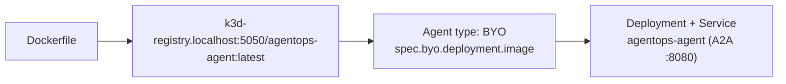

# 6.3. Platform Agents

The control plane is installed and your image is in the registry. Now you tell kagent to run it. This is the **seam** between the two halves of the chapter: [6.1](./6.1. Containers.md) produced an image; here an `Agent` custom resource points at that image and lets kagent provision the workload. Because the agent is `type: BYO`, its model choice already lives inside that image (the `gemini-3.5-flash` default from [2.2](../2. Agents/2.2. Models.md)); a `ModelConfig` and a single Secret declare the same Gemini credentials for kagent's own use.

## How do you tell kagent to run your own image?

kagent's `Agent` resource has a `type: BYO` ("bring your own") variant: instead of kagent building an agent from a prompt and tools, you hand it a pre-built image and it provisions the Deployment and Service. That is exactly what the ADK agent from [Chapter 2](../2. Agents/) is. Here is the full [`infra/kagent/agent.yaml`](https://github.com/MLOps-Courses/agentops-open-course/blob/main/infra/kagent/agent.yaml):

```yaml
apiVersion: kagent.dev/v1alpha2
kind: Agent
metadata:
  name: agentops-agent
  namespace: agentops
spec:
  description: The AgentOps Open Course reference agent.
  type: BYO
  byo:
    deployment:
      image: k3d-registry.localhost:5050/agentops-agent:latest
      env:
        # Native Gemini for the ADK agent — same secret the ModelConfig references.
        - name: GOOGLE_API_KEY
          valueFrom:
            secretKeyRef:
              name: kagent-gemini
              key: GOOGLE_API_KEY
        # The course's provided key is a Vertex AI express key (see 2.2), so the agent needs
        # the Vertex backend — without this the pod gets 403 API_KEY_SERVICE_BLOCKED. Using a
        # plain AI Studio (AIza…) key instead? Set this to "false" or drop it.
        - name: GOOGLE_GENAI_USE_VERTEXAI
          value: "true"
```

`spec.byo.deployment.image` is the BYO seam: it is the same `k3d-registry.localhost:5050/agentops-agent:latest` tag the image build pushes to. The `env` block is standard `core/v1` — you inject the Gemini API key from a Secret rather than baking it into the image. The `GOOGLE_GENAI_USE_VERTEXAI` flag matches the warning in [2.2. Models](../2. Agents/2.2. Models.md): the course's default key is a Vertex AI express key, so the in-cluster pod needs it exactly as your local shell did.

## Why is this the seam between building and deploying?

Everything upstream converges on that one image tag:



The platform only reads the image tag, never how it was built. kagent then creates a Deployment and a Service, **both named `agentops-agent`**, exposing the A2A port 8080 (named `http`), which the ingress in [6.5](./6.5. Platform Gateway.md) fronts.

## How does the agent get a model?

Two paths exist, and it matters which one you are on. A **`type: BYO` agent gets its model from its own image** — the `gemini-3.5-flash` default plus the `GOOGLE_API_KEY` env you injected above. kagent never re-models a BYO workload.

A **`ModelConfig`** is the _other_ path: it declares a provider and model for the agents kagent builds itself (declarative agents) and for the kagent UI. Your BYO agent does **not** consume it — but the course still applies one, because it declares the shared Gemini credentials and documents the model in one place. The [`infra/kagent/modelconfig.yaml`](https://github.com/MLOps-Courses/agentops-open-course/blob/main/infra/kagent/modelconfig.yaml):

```yaml
apiVersion: kagent.dev/v1alpha2
kind: ModelConfig
metadata:
  name: gemini
  namespace: agentops
spec:
  provider: Gemini
  model: gemini-3.5-flash # pin an explicit version (not a -latest alias)
  apiKeySecret: kagent-gemini # v1alpha2 field name (v1alpha1 called it apiKeySecretRef)
  apiKeySecretKey: GOOGLE_API_KEY
```

As in [2.2. Models](../2. Agents/2.2. Models.md), the model is pinned explicitly to `gemini-3.5-flash` rather than a `-latest` alias, so behavior stays reproducible across releases.

!!! warning "The v1alpha2 secret field is `apiKeySecret`, not `apiKeySecretRef`"

    This is the exact "copy the field per version" mistake the next section warns about. `apiKeySecretRef` only exists in the `v1alpha1` schema; under `v1alpha2` the field is `apiKeySecret`. Using the old name fails `kubectl apply` twice over — first on unknown-field validation, then on a CEL rule that requires `apiKeySecret` whenever `apiKeySecretKey` is set.

## Where does the API key come from?

From one Kubernetes Secret, `kagent-gemini`, referenced in two places: the `ModelConfig` names it via `apiKeySecret`, and the BYO `Agent` reads the same key as an env var (the value that actually reaches the running agent). Create it once in the `agentops` namespace before applying the manifests:

```bash
kubectl -n agentops create secret generic kagent-gemini \
  --from-literal=GOOGLE_API_KEY="$GOOGLE_API_KEY"
```

Keeping the credential in a Secret — never in the image or the CRs — is the baseline you established in [4.6. Security](../4. Quality/4.6. Security.md).

## Which apiVersion goes on each resource?

kagent's CRDs share the `kagent.dev` group but carry **mixed versions**, so copy the exact `apiVersion` per kind. The resources this chapter uses:

| Kind              | apiVersion            | Notes                                                 |
| ----------------- | --------------------- | ----------------------------------------------------- |
| `Agent`           | `kagent.dev/v1alpha2` | also served as `v1alpha1`; use `v1alpha2`             |
| `ModelConfig`     | `kagent.dev/v1alpha2` | also served as `v1alpha1`; use `v1alpha2`             |
| `AgentHarness`    | `kagent.dev/v1alpha2` | remote execution env (Agent Substrate); not used here |
| `RemoteMCPServer` | `kagent.dev/v1alpha2` | tools, see [6.4](./6.4. Platform Tools.md)            |
| `ToolServer`      | `kagent.dev/v1alpha1` | tools, see [6.4](./6.4. Platform Tools.md)            |

`Agent` and `ModelConfig` are served at both `v1alpha1` and `v1alpha2`; the course uses `v1alpha2`. `ToolServer` is only `v1alpha1`. Getting this wrong is a common first mistake — `kubectl` will reject an unknown version outright.

## How do you deploy and verify the agent?

Create the namespace and the Secret, then apply the model and agent manifests:

```bash
kubectl apply -f infra/k8s/namespace.yaml
kubectl -n agentops create secret generic kagent-gemini \
  --from-literal=GOOGLE_API_KEY="$GOOGLE_API_KEY"
kubectl apply -f infra/kagent/modelconfig.yaml -f infra/kagent/agent.yaml
```

kagent's controller reconciles the `Agent` into a Deployment and Service. Confirm the workload is up:

```bash
kubectl -n agentops get agents,deploy,svc
kubectl -n agentops get pods -l kagent=agentops-agent
```

kagent labels the pods it generates `app=kagent` and `kagent=<agent-name>` (not `app=<agent-name>`), so select on `kagent=agentops-agent` — an `app=agentops-agent` selector matches nothing even on a healthy deploy.

Once the pod is ready, kagent's readiness probe has already fetched the agent card at `/.well-known/agent-card.json` — the A2A contract the image satisfies. Reaching it from outside the cluster is the ingress step in [6.5](./6.5. Platform Gateway.md).

!!! note "BYO vs. built-in agents"

    kagent can also build an agent for you from a declarative prompt, tools, and a `ModelConfig`. This course uses `type: BYO` instead because the Ops Copilot is a full ADK application with its own code, dataset, and tests — you want to ship _that_ artifact, not reconstruct it in the CR. (`AgentHarness` is a separate CRD for generic remote execution environments on Agent Substrate, not a way to run your own image — out of scope here.) BYO is the right fit for a standalone ADK image.
