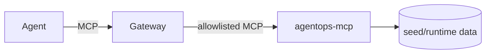

# 6.4. Platform Tools

## Which component serves the tools?

`k8s/base/mcp.yaml` runs the same agent image with a different command:

```yaml
command: ["python", "-m", "agent.mcp_server"]
env:
  - name: MCP_HOST
    value: 0.0.0.0
  - name: MCP_PORT
    value: "8000"
  - name: MCP_TRANSPORT
    value: streamable-http
  - name: MCP_ALLOWED_HOSTS
    value: agentgateway,agentgateway:*,agentgateway.agentops.svc.cluster.local,agentgateway.agentops.svc.cluster.local:*,agentops-mcp,agentops-mcp:*,agentops-mcp.agentops.svc.cluster.local,agentops-mcp.agentops.svc.cluster.local:*
```

The gateway preserves its request authority when proxying, so the full override includes short and namespace-qualified authorities for both the gateway and raw MCP service. It never includes a global `*`. The `agentops-mcp` service is ClusterIP-only, and network policy allows ingress only from the agentgateway pod on 8000.

## How is the server registered with kagent?

```yaml
apiVersion: kagent.dev/v1alpha2
kind: RemoteMCPServer
metadata:
  name: agentops-tools
  namespace: agentops
spec:
  description: Read-only incident, service, log, and runbook tools through agentgateway.
  url: http://agentgateway.agentops.svc.cluster.local:3000/mcp
  protocol: STREAMABLE_HTTP
  timeout: 30s
```

kagent consumers discover the governed endpoint, not the raw service.

## How does the BYO agent use it?

`AGENT_MCP_URL=http://agentgateway:3000/mcp` makes `root_agent` register one remote `McpToolset` instead of six local read functions. The gateway forwards allowed reads to `agentops-mcp:8000`. Confirmation-bound writes and skills stay in the agent process.



## How do reads stay coherent with approved writes?

Both the BYO agent and `agentops-mcp` mount the same `agentops-agent-state` RWO PVC at `/app/state` with fsGroup 10001. A confirmed restart/resolution updates the same SQLite database read by later MCP calls, so the gateway path cannot return an independent stale seed copy.

This is deliberately a single-node, single-replica SQLite design. `infra/scripts/check-state.sh` renders both overlays and asserts the shared claim/fsGroup. A horizontal deployment needs a network database and migration/concurrency plan, not a multi-writer filesystem assumption.

## How do you verify the in-cluster path?

Forward only the gateway:

```bash
kubectl -n agentops port-forward svc/agentgateway 3000:3000
```

Run the MCP list-tools script from Chapter 5 and inspect the gateway/MCP pod logs:

```bash
kubectl -n agentops logs deploy/agentgateway --tail=50
kubectl -n agentops logs deploy/agentops-mcp --tail=50
```

## What is the tools checkpoint?

Confirm six reads through `:3000`, no writes, and a failed-closed response when the MCP deployment is temporarily scaled to zero. Restore it to one replica before continuing.
