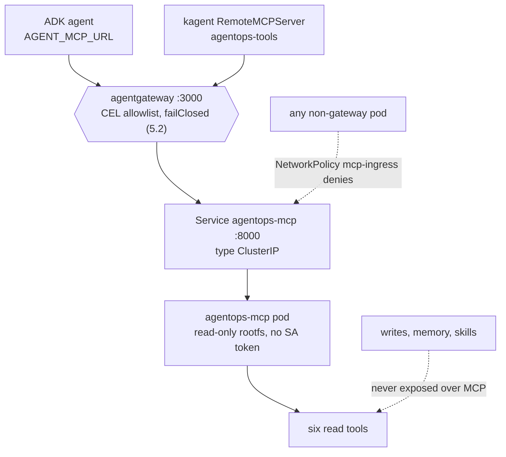
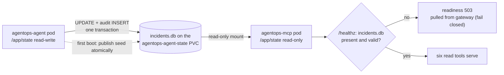

# 6.4. Platform Tools

## Which component serves the tools?

In the running lab the read tools are not a subprocess the agent spawns — they are their own Deployment. `infra/k8s/base/mcp.yaml` runs the same `agentops-agent:dev` image with a different entrypoint, so the tool code and the agent code ship as one artifact but run as two workloads:

```yaml
command: ["python", "-m", "agent.mcp_server"]
env:
  - name: MCP_HOST
    value: 0.0.0.0
  - name: MCP_PORT
    value: "8000"
  - name: MCP_TRANSPORT
    value: streamable-http
```

This is the in-cluster form of the streamable-HTTP transport [3.3](../3.%20Capabilities/3.3.%20MCP.md#which-transports-are-supported) already built: `MCP_HOST=0.0.0.0` binds all interfaces, `MCP_PORT=8000` matches the service, and `streamable-http` is the stateless (`stateless_http=True`) transport, so any replica could answer any request without session affinity. The deployment also sets `AGENT_STATE_DIR=/app/state` and `AGENT_DATA_DIR=/app/data` — the runtime database mount and the immutable image seed — which the coherence question below depends on. A single ClusterIP `Service/agentops-mcp` exposes port 8000 inside the namespace; no `LoadBalancer`, `NodePort`, or Ingress is created.

## Why run the tools as a separate in-cluster deployment?

On the developer host, MCP runs as a [stdio child](../3.%20Capabilities/3.3.%20MCP.md#what-does-the-stdio-transport-actually-launch) the agent spawns — zero-friction for a first run, but it couples tool availability to launching a subprocess on every agent host and leaves nowhere to enforce policy. Promoting the tools to their own Deployment buys four things the in-process form cannot, and each maps to a concrete property of `mcp.yaml`:

1. **Independent lifecycle and scaling.** The tool pod restarts, drains (a 15 s `terminationGracePeriodSeconds` that exceeds the Uvicorn shutdown window), and rolls without touching the agent, and the reverse holds too. A wedged tool process is one pod, not the whole agent.
1. **A read-only state mount.** The tools mount the state claim `readOnly: true`, so the read service physically cannot write the database the agent owns.
1. **Network isolation.** A distinct pod is a distinct NetworkPolicy subject, so only agentgateway may dial port 8000.
1. **One shared MCP surface.** The same FastMCP server backs the ADK agent and any other MCP client. [3.3](../3.%20Capabilities/3.3.%20MCP.md#why-does-mcp-matter-beyond-this-repository) is the general reuse argument; in the cluster the second client is kagent, below.

## Which six tools does the server expose?

Exactly six read capabilities cross the MCP boundary, and naming them is what turns "read-only" into a checkable claim rather than a slogan. `mcp_server.py` re-exposes four operational tools from `tools.py` — `list_incidents`, `get_incident`, `get_service_status`, and `search_service_logs` — and two knowledge tools from `memory.py` — `get_runbook` and `search_runbooks`. FastMCP derives each JSON schema from the same type hints and docstrings the ADK function tools already carry; that `add_tool` loop is quoted in [3.3](../3.%20Capabilities/3.3.%20MCP.md#which-tools-does-the-course-server-expose), and the six are the exact set the gateway allowlist re-lists in [5.2](../5.%20Gateway/5.2.%20MCP%20Gateway.md#why-re-list-tools-the-mcp-server-already-restricts).

What is deliberately absent matters as much as what is present. The state-changing actions `restart_service` and `resolve_incident`, the long-term memory tools, and the instruction-only skills all stay in the agent process, because they depend on ADK confirmation context and audit identity that do not survive translation into stateless protocol messages ([4.5](../4.%20Quality/4.5.%20Guardrails.md), [5.2](../5.%20Gateway/5.2.%20MCP%20Gateway.md#why-are-write-tools-absent)). The MCP surface is therefore idempotent by construction: a compromised or misbehaving client can read incident state but holds no verb that changes it.

## How do consumers reach the tools?

Both MCP clients in the cluster dial the _governed_ gateway URL, never the raw service. kagent registers the tools through a `RemoteMCPServer` in `infra/kagent/toolserver.yaml`:

```yaml
apiVersion: kagent.dev/v1alpha2
kind: RemoteMCPServer
metadata:
  name: agentops-tools
  namespace: agentops
spec:
  description: Read-only incident, service, log, and runbook tools through agentgateway.
  url: http://agentgateway.agentops.svc.cluster.local:3000/mcp
  protocol: STREAMABLE_HTTP
  timeout: 30s
```

The `url` points at `agentgateway…:3000/mcp`, not `agentops-mcp:8000`. That is the deliberate design choice: a kagent consumer discovers the tools _through_ the policy point — the CEL allowlist, rate limit, and fail-closed backend of [5.2](../5.%20Gateway/5.2.%20MCP%20Gateway.md#why-re-list-tools-the-mcp-server-already-restricts) — not around it. The BYO agent reaches the same route through one environment variable, `AGENT_MCP_URL=http://agentgateway:3000/mcp` ([6.3](./6.3.%20Platform%20Agents.md#which-environment-variables-preserve-the-data-plane)), which swaps its six local read functions for a single remote `McpToolset` ([3.3](../3.%20Capabilities/3.3.%20MCP.md#when-does-the-root-agent-use-mcp)); its guarded writes, memory, and skills stay in-process. Two different consumers, one governed path, and no code path where a new client quietly acquires a seventh tool.

## How is the raw MCP service isolated in the cluster?

Steering consumers through the gateway is only half the control; the other half is making the raw service unreachable by anything else. Three transport and network layers stack on the `agentops-mcp` pod, none of which is the tool allowlist:

1. **ClusterIP-only service.** `Service/agentops-mcp` is `type: ClusterIP`, so port 8000 exists only inside the cluster — there is no external address to dial.
1. **NetworkPolicy admitting only the gateway.** `infra/k8s/base/network-policies.yaml` selects the MCP pod and permits ingress on 8000 from agentgateway pods alone:

```yaml
apiVersion: networking.k8s.io/v1
kind: NetworkPolicy
metadata:
  name: mcp-ingress
  namespace: agentops
spec:
  podSelector:
    matchLabels:
      app.kubernetes.io/name: agentops-mcp
  policyTypes: [Ingress]
  ingress:
    - from:
        - podSelector:
            matchLabels:
              app.kubernetes.io/name: agentgateway
      ports:
        - { port: 8000, protocol: TCP }
```

1. **No ambient identity.** The `agentops-mcp` ServiceAccount sets `automountServiceAccountToken: false`, and the pod runs `runAsNonRoot` (UID/GID 10001), `readOnlyRootFilesystem: true`, all Linux capabilities dropped, and the RuntimeDefault seccomp profile — the same hardening [6.3](./6.3.%20Platform%20Agents.md#how-is-the-pod-hardened) applies to every course workload that does not call the Kubernetes API.

The BYO agent's own egress policy has no rule to `agentops-mcp:8000`; it may reach only the gateway and the collector. So even the agent cannot skip the gateway and hit the raw tools — [6.5](./6.5.%20Platform%20Gateway.md#how-does-network-policy-reduce-reachability) walks the full egress matrix. The picture is layered enforcement, where the blocked paths matter as much as the allowed one:



## How does the transport reject spoofed Host headers?

Even a caller that reaches port 8000 must present an expected `Host` authority, which is the application-layer defense underneath the network policy. FastMCP is constructed with `TransportSecuritySettings(enable_dns_rebinding_protection=True, …)` ([3.3](../3.%20Capabilities/3.3.%20MCP.md#which-transports-are-supported) quotes the full constructor), and the allowlist it enforces is not hard-coded — `mcp_server.py` builds it from `MCP_ALLOWED_HOSTS`:

```python
def _allowed_hosts() -> list[str]:
    """Return the explicit DNS-rebinding allowlist from CSV or secure defaults."""
    raw = os.environ.get("MCP_ALLOWED_HOSTS")
    if raw is None:
        return list(_DEFAULT_ALLOWED_HOSTS)
    hosts = [host.strip() for host in raw.split(",") if host.strip()]
    if not hosts:
        raise ValueError("MCP_ALLOWED_HOSTS must contain at least one host authority")
    return hosts
```

The deployment supplies the exact authorities the gateway forwards, and nothing else:

```yaml
- name: MCP_ALLOWED_HOSTS
  value: agentgateway,agentgateway:*,agentgateway.agentops.svc.cluster.local,agentgateway.agentops.svc.cluster.local:*,agentops-mcp,agentops-mcp:*,agentops-mcp.agentops.svc.cluster.local,agentops-mcp.agentops.svc.cluster.local:*
```

Two properties make that env value load-bearing rather than decorative. It is a **full override, not an addition** — the CSV replaces the secure defaults, so a deployment can narrow the accepted authorities without ever falling back to a global `*`, and an empty override is a startup `ValueError`, not a silent open door. And because agentgateway preserves the caller's request authority when it proxies, the list carries both the short and namespace-qualified forms, with and without a port, for the gateway and the service. A request presenting any other `Host` — a DNS-rebinding attempt, a stray probe — is answered `421 Misdirected Request` before any tool runs ([5.2](../5.%20Gateway/5.2.%20MCP%20Gateway.md#which-address-does-the-container-really-dial) shows the same rejection observed from the gateway side).

## How do reads stay coherent with approved writes?

Both the BYO agent and `agentops-mcp` mount the same `agentops-agent-state` RWO PVC at `/app/state` with fsGroup 10001, but with opposite authority. The agent owns the writable mount; the MCP container mounts that claim read-only:

```yaml
volumeMounts:
  - name: state
    mountPath: /app/state
    readOnly: true
```

A confirmed restart or resolution updates the same SQLite database later MCP calls read, without ever giving the six-tool read service filesystem write authority. On a fresh volume the agent initializes `/app/state/incidents.db` from the immutable image seed at `/app/data/incidents.db`; the MCP `/healthz` probe opens that file read-only and stays `503` until it exists and passes an integrity check, so the read replica fails closed instead of serving — or worse, creating — state ([6.3](./6.3.%20Platform%20Agents.md#how-does-kubernetes-know-the-processes-are-actually-ready) covers the probe contract).



This is deliberately a single-node, single-replica SQLite design: an RWO claim binds to one node, and the read/write split is filesystem permissions, not a database protocol. `infra/scripts/check-state.sh` renders both overlays and asserts the shared claim name, fsGroup 10001, and the read-only MCP mount. A horizontal deployment needs a network database with a migration and concurrency plan, not a multi-writer filesystem assumption.

## How do you verify the in-cluster path?

Forward only the gateway — never the raw MCP service — so the check exercises the governed route:

```bash
kubectl -n agentops port-forward svc/agentgateway 3000:3000
```

Run the MCP list-tools script from [5.2](../5.%20Gateway/5.2.%20MCP%20Gateway.md#how-do-you-list-tools-through-the-gateway) against `http://127.0.0.1:3000/mcp` and confirm exactly the six read tools appear and no write action does. Then inspect both sides of the hop:

```bash
kubectl -n agentops logs deploy/agentgateway --tail=50
kubectl -n agentops logs deploy/agentops-mcp --tail=50
```

The gateway log records the routed `tools/call`; the MCP log records the read reaching the server. A request that never appears in the MCP log but returns an error at the gateway is a policy decision (allowlist, rate limit, or fail-closed backend), not a server fault.

## What is the tools checkpoint?

Confirm six reads through `:3000`, no writes, and a fail-closed response when the backend is gone. Scale the MCP Deployment to zero, repeat the list-tools request, and confirm the gateway denies rather than returns an empty result:

```bash
kubectl -n agentops scale deploy/agentops-mcp --replicas=0
# repeat the list-tools request: the gateway must fail closed (500 / -32603), not return []
kubectl -n agentops scale deploy/agentops-mcp --replicas=1
```

Restore the single replica before continuing, and wait for readiness — the MCP `/healthz` stays `503` until it re-opens the agent-published database. This checkpoint tests the governed path and its fail-closed behavior, not zone or PV disaster recovery.
