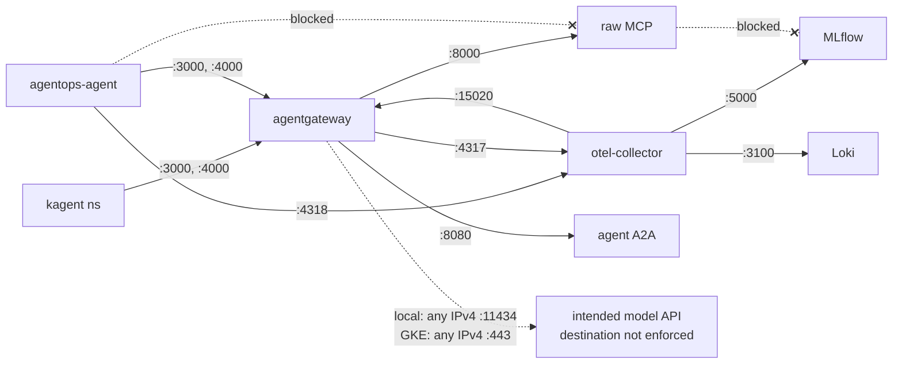

# 6.5. Platform Gateway

!!! abstract "In one glance"

    - **You will:** Put the gateway in front of every in-cluster hop, block undeclared network traffic, and keep credentials in git as ciphertext.
    - **You need:** The Skaffold loop from [6.2. Platform Install](./6.2.%20Platform%20Install.md) still running.
    - **Time:** about 22 minutes, reference.

## How is agentgateway deployed?

Same gateway, same three listeners as Chapter 5 — now a pod instead of a host process. What is new on this page is the network policy around it and where its credentials live.

The base pins agentgateway `v1.4.1` by image digest and runs it as UID/GID 65532 with a read-only root and dropped capabilities. It mounts the selected config read-only and exposes one **ClusterIP** service (one address reachable only from inside the cluster):

```text
agentgateway:3000   MCP
agentgateway:3001   A2A
agentgateway:4000   OpenAI-compatible model
agentgateway:15020  internal metrics
```

Readiness/liveness probes check the MCP listener. Resource bounds keep the lab schedulable on a small node.

## How is the profile selected?

The base does not hard-code a gateway ConfigMap. Each overlay adds one generated ConfigMap:

- Local includes `agentgateway/k3d` and uses Ollama at `host.k3d.internal:11434`.
- GKE includes `agentgateway/gke` and uses Vertex with `backendAuth.gcp`.

The Python agent still points at `agentgateway:3000` and `agentgateway:4000`; provider movement is a data-plane change.

## How does network policy reduce reachability?

A **NetworkPolicy** is a Kubernetes rule naming which pods may talk to which, on which ports ([0.7. Glossary](../0.%20Overview/0.7.%20Glossary.md#networkpolicy)). Ingress rules admit only declared callers:

- The `agentops` namespace can reach all gateway listeners; `kagent` can reach only MCP `:3000` and model `:4000`, not A2A or metrics.
- The raw MCP server accepts only gateway pods.
- MLflow accepts only the OTel collector.
- OTel accepts signals from `agentops` and `kagent` namespaces.

Egress is denied by default for every pod in the namespace, then reopened one declared flow at a time in [`network-policies.yaml`](https://github.com/MLOps-Courses/agentops-open-course/blob/main/infra/k8s/base/network-policies.yaml):

```yaml
spec:
  podSelector: {}
  policyTypes: [Egress]
```

A namespace-wide policy allows DNS to `kube-system`. The base then reopens these flows, and nothing else:

- The gateway reaches the raw MCP server (`:8000`), the agent A2A port (`:8080`), and the collector (`:4317`).
- The agent reaches only gateway `:3000`/`:4000` and collector `:4318`.
- The collector reaches MLflow `:5000`, Loki `:3100`, and gateway metrics `:15020`.
- The raw MCP server, MLflow, and Loki get no base egress beyond DNS.

The model upstream differs per environment, so each overlay appends its own exception to `agentgateway-egress`.

??? note "Deeper: how each overlay opens its model upstream"

    The local overlay allows TCP `11434` to any IPv4 address because `host.k3d.internal` resolves to the Docker bridge gateway on the host, outside every pod or namespace selector. The GKE overlay allows TCP `443` to any IPv4 address (Google APIs publish no stable CIDR) plus `169.254.169.252/32` on TCP `987` and `988` for Workload Identity Federation, and adds the same pair for MLflow's GCS artifacts. Those endpoint details match [GKE's standard NetworkPolicy/Calico path](https://cloud.google.com/kubernetes-engine/docs/how-to/network-policy#network-policy-and-workload-identity); Dataplane V2 uses a different endpoint and is not enabled by this course's OpenTofu module.

The base is a directed allow-list, but each model overlay adds a port-scoped public exception. Solid in-cluster edges below are the only internal flows; the dashed edge is the residual public reach. Note that even the agent cannot reach the raw MCP server directly — it must go through the gateway.



The precise source → destination allow-matrix, mirroring [`network-policies.yaml`](https://github.com/MLOps-Courses/agentops-open-course/blob/main/infra/k8s/base/network-policies.yaml):

| Source pod       | Allowed egress (port)                                      | Ingress admitted from (port)           |
| ---------------- | ---------------------------------------------------------- | -------------------------------------- |
| `agentgateway`   | raw MCP `:8000`, agent `:8080`, collector `:4317`, model\* | `agentops` all; `kagent` `:3000/:4000` |
| `agentops-agent` | gateway `:3000/:4000`, collector `:4318`                   | gateway `:8080`                        |
| `agentops-mcp`   | DNS only                                                   | gateway pods `:8000`                   |
| `otel-collector` | MLflow `:5000`, Loki `:3100`, gateway `:15020`             | `agentops` + `kagent` `:4317/:4318`    |
| `mlflow`         | DNS only                                                   | collector `:5000`                      |
| `loki`           | DNS only                                                   | collector `:3100`                      |

\* The model exception is on the gateway pod only, but vanilla NetworkPolicy scopes it by port rather than hostname: any IPv4 `:11434` locally, or any IPv4 `:443` on GKE, plus WIF `:987/:988`. MLflow receives the same broad HTTPS exception for intended GCS use. Every pod also keeps a namespace-wide DNS allowance to `kube-system`.

The broad HTTPS rule is a residual exfiltration path, not Vertex destination allowlisting. Workload Identity IAM limits which Google operations accept the pod identity; it cannot stop a compromised process from sending ordinary HTTPS elsewhere. Production needs an egress proxy, firewall, or FQDN-aware network policy, then deployment of the exact destinations that policy permits.

These policies depend on a network-policy-capable cluster: k3s enforces them out of the box, and the OpenTofu module enables Calico (the plugin that actually enforces the rules) on GKE. They do not cover the kagent control-plane namespace or cross-cluster security.

## Why should an agent pod have egress rules?

Assume the model has been talked into leaking your data. Egress rules decide whether it can.

Prompt injection turns a tool-using agent into a _confused deputy_: a trusted process made to act for an attacker. Hostile text inside an incident, log line, or runbook can instruct the model to send whatever is in its context somewhere else. [4.6. Security](../4.%20Quality/4.6.%20Security.md) hardens the application layer; `default-deny-egress` blocks undeclared destinations when those layers fail.

A hijacked agent pod can still send data over its allowed model, tool, telemetry, and DNS routes. It cannot open a direct connection to an arbitrary attacker-controlled host.

The same reasoning keeps the model-upstream exception on the gateway pod only, scoped to one port, instead of a namespace-wide allow that every compromised workload would inherit. Port scoping reduces reach; it does not authenticate the destination.

## What do the ResourceQuota and LimitRange protect against?

The shared local cluster hosts other projects, so [`resource-quota.yaml`](https://github.com/MLOps-Courses/agentops-open-course/blob/main/infra/k8s/base/resource-quota.yaml) caps what the `agentops` namespace can claim:

```yaml
hard:
  requests.cpu: "2"
  requests.memory: 4Gi
  limits.cpu: "8"
  limits.memory: 9Gi
  pods: "12"
```

The numbers are the declared per-container requests/limits of the deployed workloads plus one surge pod per rolling deployment, so Skaffold rollouts never deadlock against the quota. A runaway or duplicated workload is rejected at admission — when the API server first accepts the object — instead of starving neighbor namespaces.

A compute quota also rejects any pod that declares no resources at all. The `LimitRange` covers that case: it supplies bounded defaults, so ad-hoc diagnostic pods remain schedulable. Inspect live consumption with:

```bash
kubectl -n agentops describe resourcequota agentops-compute
```

## How do you debug a NetworkPolicy lockout?

Egress policies are easy to over-tighten, so practice a deliberate lockout. First verify the guardrail works. The raw MCP server has no egress allowance beyond DNS, so a connection from it to MLflow must time out, even though the collector keeps delivering traces to that same endpoint:

```bash
kubectl -n agentops exec deploy/agentops-mcp -- python -c \
  'import urllib.request; urllib.request.urlopen("http://mlflow:5000/health", timeout=5)'
```

Expect `TimeoutError` — the policy, not the service, refused the flow.

!!! warning "This breaks DNS in the namespace until you restore it"

    The next command deletes a live policy, so no pod in `agentops` can resolve a name until you run the restore command below. Nothing outside the namespace is affected. Do not walk away between the two steps.

Now cause a real lockout:

```bash
kubectl -n agentops delete networkpolicy dns-egress
kubectl -n agentops exec deploy/agentops-mcp -- python -c \
  'import socket; print(socket.gethostbyname("agentgateway"))'
```

The probe raises `socket.gaierror` instead of printing an address: name resolution fails for every pod in the namespace. Restore the declared state by reapplying only the rendered policies:

```bash
kubectl kustomize infra/k8s/overlays/local | yq 'select(.kind == "NetworkPolicy")' | kubectl apply -f -
```

Render the overlay rather than the base, so the overlay's Ollama exception is preserved.

You have now seen both halves of a lockout: the symptom and the restore. When a policy blocks something for real, diagnose in this order:

1. List which policies select the failing pod: `kubectl -n agentops get networkpolicy` and `kubectl -n agentops describe networkpolicy default-deny-egress`.
1. Separate resolution from connection: retry the `socket.gethostbyname` probe, then the `urllib` probe against an allowed destination.
1. Check that one selected policy allows the destination's port and peer; default-deny plus no matching allow is a lockout.

## How do you access the private services?

No Ingress or LoadBalancer is created. Forward agentgateway in one terminal:

```bash
kubectl -n agentops port-forward svc/agentgateway \
  3000:3000 3001:3001 4000:4000 15020:15020
```

Forward MLflow from a second terminal:

```bash
kubectl -n agentops port-forward svc/mlflow 5000:5000
```

Leave both forwards running while you use them. Use `http://localhost:3001` for A2A clients. Direct agent port 8080 is a raw bypass for diagnostics, not a capability-limited diagnosis surface. The model listener enforces the demo API key from the `agentgateway-client` Secret, so a forwarded call to `:4000` needs `-H "Authorization: Bearer agentgateway"` ([5.5. Gateway Security](../5.%20Gateway/5.5.%20Gateway%20Security.md)).

## How does GKE authenticate to Vertex?

On GKE, no key file exists anywhere. The gateway pod borrows a Google identity with two narrow roles, and Google hands it short-lived credentials on demand.

??? note "Deeper: how GKE issues those credentials"

    OpenTofu creates a Google service account with `roles/aiplatform.user` and `roles/serviceusage.serviceUsageConsumer`, binds `agentops/agentgateway` through Workload Identity Federation, and the overlay annotates that Kubernetes service account. GKE's metadata server obtains the Kubernetes service-account assertion and exchanges it for short-lived ambient credentials; the pod does not need an automounted Kubernetes API token, and no JSON key is created or mounted.

    MLflow receives a separate GSA and only `roles/storage.objectUser` on its artifact bucket, with the same no-API-token posture.

## How do you keep secrets in git safely?

Commit ciphertext, never plaintext, and keep the decryption key out of git.

The course platform holds no real credential today, so nothing below is required to finish the chapter. Read it the day you do hold one, such as a hosted-model API key or a Grafana admin password. The worked example pairs **SOPS**, which encrypts only the values inside a YAML file, with **age** keys.

??? note "Deeper: the SOPS + age pattern, for when you do hold a credential"

    The course platform holds no real credential today: the `agentgateway-client` Secret carries the non-secret `agentgateway` marker, and the GKE path uses Workload Identity, so no key exists to store. But every real platform eventually holds one — a hosted-model API key, a Grafana admin password — and the answer to "how do I commit configuration without committing credentials" is to commit ciphertext. [SOPS](https://github.com/getsops/sops) (MPL-2.0) with [age](https://github.com/FiloSottile/age) (BSD-3-Clause) is the minimal OSS pattern: encrypted values live in git, the decryption key stays local.

    The repository ships a worked example:

    1. [`.sops.yaml`](https://github.com/MLOps-Courses/agentops-open-course/blob/main/.sops.yaml) declares one creation rule: files under `infra/**/secrets/` are encrypted to an age recipient, and `encrypted_regex: ^(data|stringData)$` keeps `kind`, `metadata`, and comments reviewable in diffs — only the secret values become ciphertext.
    1. [`agentgateway-client.enc.yaml`](https://github.com/MLOps-Courses/agentops-open-course/blob/main/infra/k8s/base/secrets/agentgateway-client.enc.yaml) is a committed encrypted Secret: the hosted-model variant of the gateway client key, with a fake demo value as plaintext.
    1. [`secrets.sh`](https://github.com/MLOps-Courses/agentops-open-course/blob/main/infra/scripts/secrets.sh) wraps the lifecycle: `keygen` writes the age key to the gitignored `infra/secrets/age.agekey`, then `encrypt`, `decrypt`, and `edit` operate on manifests through the creation rule.

    The committed recipient is a course demo key whose private half is not published, so the example ciphertext is a reference you can read, not decrypt. Make the pattern yours in three commands:

    ```bash
    infra/scripts/secrets.sh keygen                  # prints your public recipient
    # put that recipient in .sops.yaml, write your Secret manifest, then:
    infra/scripts/secrets.sh encrypt infra/k8s/base/secrets/my-secret.enc.yaml
    infra/scripts/secrets.sh decrypt infra/k8s/base/secrets/my-secret.enc.yaml
    ```

    Be honest about the scope: this is a lab pattern, not a production KMS. Whoever holds the age private key holds every secret encrypted to it, there is no access audit, and rotation means generating a new key, re-encrypting every file, and re-issuing every credential the old key protected. Production platforms back SOPS with a cloud KMS or use an external secrets operator; the git-holds-ciphertext discipline taught here transfers unchanged.

    **How do you decrypt secrets at deploy time?**

    With one explicit, reviewable step — decrypt to stdout and pipe into kubectl, never onto disk:

    ```bash
    infra/scripts/secrets.sh decrypt \
      infra/k8s/base/secrets/agentgateway-client.enc.yaml | kubectl apply -f -
    ```

    The encrypted manifest is deliberately not listed in `kustomization.yaml`. Plain `kubectl kustomize` cannot decrypt SOPS files, so wiring it in would either break `scripts/check-infra.sh` for anyone without the private key or require the `ksops` exec plugin and its `--enable-alpha-plugins` flag on every render. The zero-friction path keeps the plaintext non-secret marker in [`agentgateway-client.yaml`](https://github.com/MLOps-Courses/agentops-open-course/blob/main/infra/k8s/base/agentgateway-client.yaml) inside the overlay, and the encrypted variant is applied on top only when you actually hold a hosted-model credential — the pattern lesson without a decryption dependency in the deploy loop.

    `sops` finds the key through `SOPS_AGE_KEY_FILE`; the script defaults it to `infra/secrets/age.agekey` so decryption works with no extra setup. The GKE path needs none of this for cloud access: Workload Identity issues short-lived ambient tokens, so there is no static key to encrypt in the first place. Prefer identity federation over stored secrets wherever the provider offers it; SOPS is for the credentials that remain.

## What must never be committed?

These three rules hold whether or not you ever use SOPS:

1. The age private key. `infra/secrets/`, `**/*.agekey`, and any decrypted `**/*.dec.yaml` output are gitignored; verify with `git check-ignore -v infra/secrets/age.agekey`. Publishing the private key retroactively decrypts every ciphertext in git history.
1. Plaintext Secret manifests. `scripts/check-infra.sh` fails if any file under `infra/**/secrets/` lacks SOPS metadata or carries a `data`/`stringData` value that is not `ENC[...]` ciphertext, and the repository `gitleaks`/`trivy` secret scans stay green because SOPS ciphertext contains no recognizable credential.
1. Real values as "temporary" placeholders. The only committed plaintext key-like value in the platform is the `agentgateway` marker, which the gateway enforces as a demo API key (Chapter 5.5); anything with actual authority goes through the encrypted path or, better, never exists thanks to Workload Identity.

If a private key does leak, treat every secret encrypted to it as compromised: rotate the credentials themselves, not just the key — git history preserves the old ciphertext forever.

## How would you narrow one ingress rule to least privilege?

Optional exercise: diagnose why the quarantined collector-ingress fixture is broader than the completed reference.

- **Mode**: `inspect`.
- **Goal**: explain why namespace-only selectors plus ports `4317`, `4318`, and `8889` admit more senders than the source-and-port-specific completed policy.
- **Files to touch**: none. Read `infra/k8s/exercises/otel-ingress-broad.yaml`, `infra/k8s/base/network-policies.yaml`, and `infra/k8s/overlays/local/network-policies.yaml`.
- **Preflight**: require `git diff --quiet -- infra/k8s/exercises/otel-ingress-broad.yaml infra/k8s/base/network-policies.yaml infra/k8s/overlays/local/network-policies.yaml` so the comparison uses the reviewed fixtures.
- **Gate that proves completion**: `mise run check:infra` exits zero. It verifies the broad fixture's exact unsafe shape, proves neither overlay includes it, and asserts that the completed base permits only named OTLP emitters while only local Prometheus reaches `8889`.
- **Final state**: no file or cluster changes; the focused `git diff --quiet --` command still exits zero.

## What proves this page worked?

With the local profile, call all three gateway ports through one port-forward and inspect `:15020/metrics`. Verify no service has type `LoadBalancer` or `NodePort`:

```bash
kubectl -n agentops get svc -o custom-columns=NAME:.metadata.name,TYPE:.spec.type
```

Then open one forward and leave it running:

```bash
kubectl -n agentops port-forward svc/agentgateway \
  3000:3000 3001:3001 4000:4000 15020:15020
```

In a second terminal, call the A2A listener, the model listener, and the metrics endpoint:

```bash
curl -fsS http://localhost:3001/.well-known/agent-card.json | jq .name
curl -fsS http://localhost:4000/v1/chat/completions \
  -H 'Authorization: Bearer agentgateway' \
  -H 'Content-Type: application/json' \
  -d '{
    "model": "qwen3:4b-instruct",
    "messages": [{"role": "user", "content": "Reply with exactly: gateway ready"}],
    "temperature": 0
  }' | jq -r '.choices[0].message.content'
curl -fsS http://localhost:15020/metrics | head
```

MCP `:3000` needs an MCP client rather than a plain `curl`. Run the list-tools script from [5.2. MCP Gateway](../5.%20Gateway/5.2.%20MCP%20Gateway.md#how-do-you-list-tools-through-the-gateway) against `http://127.0.0.1:3000/mcp`, exactly as [6.4. Platform Tools](./6.4.%20Platform%20Tools.md) does.

**You are done when:**

- Every row of the service list reads `ClusterIP`: no `LoadBalancer`, no `NodePort`.
- The `:3001` call prints the agent card's name, `AgentOps Agent`.
- The `:4000` call prints a line of model text, so the `agentgateway` marker was accepted and Ollama answered through the gateway.
- `:15020/metrics` prints Prometheus metric lines instead of an empty body.
- The MCP-to-MLflow probe still ends in `TimeoutError`, and DNS resolves again after the restore command.
- You can name, for any arrow in the diagram above, the policy that allows it.

Continue to [6.6. Platform Delivery](./6.6.%20Platform%20Delivery.md) when the only way you reached any of those ports was a port-forward you started yourself.
