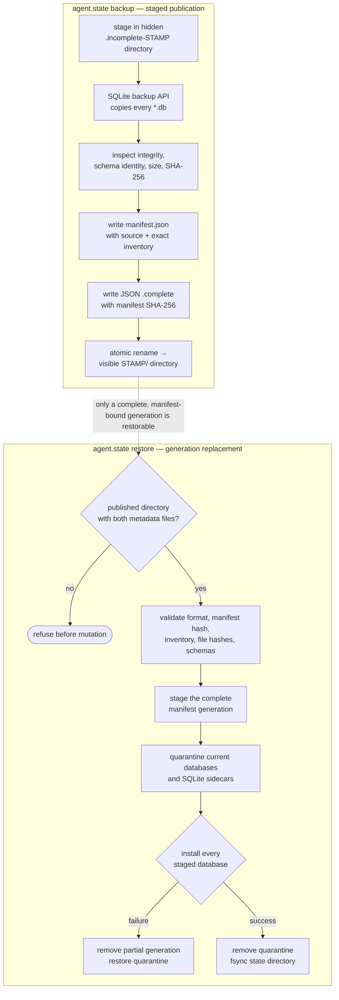

# 6.6. Platform Delivery

!!! abstract "In one glance"

    - **You will:** Back up the platform state, prove it can be restored, and understand the safe local and optional cloud teardown paths.
    - **You need:** The local workloads from [6.2. Platform Install](./6.2.%20Platform%20Install.md) still running.
    - **Time:** about 45 minutes, hands-on.

The deployment loop is already running, so this page focuses on the operational proof that matters next: recovering its state safely.

## What state would you lose if the PVC died?

Everything the platform writes at runtime lives on one **PersistentVolumeClaim (PVC)**: a disk the cluster keeps and re-attaches to a replacement pod.

That volume is `agentops-agent-state`, mounted at `/app/state` (host equivalent: `agents/python/.state/`):

1. `runtime.db` — ADK sessions and A2A tasks from the persistent server (Ch. 2.4).
1. `incidents.db` — the writable dataset copy, including approved `restart_service`/`resolve_incident` mutations and the append-only `audit_log` (Ch. 3.1).

The seed dataset is safe in Git and in the image, so losing the volume loses no course data — it loses the evidence: every session and every audit row justifying an approved action. Without a backup, one PVC failure (or a hasty `skaffold delete`) erases that trail silently.

## How do you back up SQLite state safely?

Never `cp` a live SQLite file: a copy taken mid-transaction can be torn. Safe hot copies go through SQLite itself, which holds the page-level locks for you.

Both the backup and the restore enforce one shared contract. A snapshot only becomes restorable once it is complete and published, so an interrupted attempt can never masquerade as the newest good one:



**Diagram in words:** Backup copies and inspects every database, records an exact hashed manifest, binds the completion marker to that manifest, and publishes once. Restore validates the complete generation before touching state, quarantines the current generation, and either installs every declared database or recovers the byte-identical prior generation.

A multi-file restore cannot switch every SQLite file in one rename. The shared CLI therefore takes an exclusive process lock and fsyncs a three-phase journal before replacing anything. On the next backup, restore, or A2A startup, an interrupted uncommitted transaction reconstructs the exact old generation; a durable committed transaction validates and keeps the complete new generation. Missing or unexplained recovery evidence fails closed instead of guessing. Writers must still be stopped.

On the host, `mise run state:backup` runs [backup-state.sh](https://github.com/MLOps-Courses/agentops-open-course/blob/main/infra/scripts/backup-state.sh). That wrapper invokes the shared `agent.state` CLI, which snapshots every state database through Python's `sqlite3.Connection.backup` API. For each copy, `manifest.json` records the filename, byte size, SHA-256 digest, and SQLite schema identity; its source block records the application version and source commit. The JSON `.complete` file carries `format_version` and `manifest_sha256`, so changing either the manifest or one declared database makes the whole generation invalid. Publication is one atomic directory rename, and retention keeps the newest seven completed snapshots under the gitignored `.state-backups/`:

```bash
mise run state:backup
```

In Kubernetes, a **CronJob** — a workload the cluster runs on a schedule — does the same thing unattended. The `agentops-state-backup` CronJob in [state-backup.yaml](https://github.com/MLOps-Courses/agentops-open-course/blob/main/infra/k8s/base/state-backup.yaml) runs `python -m agent.state backup` from the course image. Host and Kubernetes snapshots therefore have one format and are interchangeable; no copied Python program or additional image pin enters the supply chain. The CronJob writes completed timestamped snapshots from the `agentops-agent-state` PVC into a second `agentops-state-backups` PVC.

Be honest about the scope: this is single-node, lab-grade backup, not disaster recovery. The backup PVC sits in the same cluster on the same disk, there is no point-in-time recovery between nightly snapshots, and `skaffold delete` removes both PVCs together. Production would ship snapshots off-cluster to object storage and restore them on separate infrastructure.

## How do you run a restore drill?

A backup you have never restored is a hope, not a backup. `mise run state:drill` runs [backup-drill.sh](https://github.com/MLOps-Courses/agentops-open-course/blob/main/infra/scripts/backup-drill.sh), which makes that proof repeatable and offline. It runs against a throwaway temporary directory, never your real `agents/python/.state`, and needs no cluster or model:

```bash
mise run state:drill
```

The drill seeds throwaway session and incident state and appends a mock approved-action audit row. It then proves six adversarial properties.

1. A corrupt input publishes neither a completed snapshot nor leftover staging state.
1. A changed database hash is rejected before one byte of live state changes.
1. An injected second-file publication failure restores the complete previous generation.
1. A successful restore removes a live database absent from the manifest instead of silently mixing generations.
1. A future audit schema is rejected without mutating its input.
1. The valid manifest generation restores the original session and audit evidence.

Expected final line: `drill passed: versioned manifest, exact inventory, rollback, hashes, and schema compatibility`.

The Python state suite adds the process boundary the shell drill cannot fake safely: a child exits without cleanup after the first old-file replacement and again after the durable commit marker. The next state command must recover the old generation in the first case, preserve the new generation in the second, and serialize two concurrent restore processes.

To restore real host state, stop every writer first (the A2A server, the MCP server, any `adk run`/`adk web`), select one visible directory carrying both `manifest.json` and `.complete`, then point the wrapper at it. The shared CLI validates the completion marker, manifest hash, exact file inventory, database hashes, and supported schemas before quarantining current state. If any replacement fails, it removes the partial generation and restores every quarantined database and sidecar:

```bash
snapshot=""
for candidate in .state-backups/*; do
  [[ -f "${candidate}/manifest.json" && -f "${candidate}/.complete" ]] && snapshot="${candidate}"
done
test -n "${snapshot}"
mise run state:restore -- "${snapshot}"
```

On k3d, first ask the CronJob to produce a snapshot and capture the exact published generation from its log:

```bash
kubectl -n agentops create job --from=cronjob/agentops-state-backup state-backup-drill
kubectl -n agentops wait --for=condition=complete job/state-backup-drill --timeout=180s
snapshot="$(
  kubectl -n agentops logs job/state-backup-drill |
    sed -n 's|^snapshot complete: /backups/||p' |
    tail -n 1
)"
[[ "${snapshot}" =~ ^[0-9]{8}T[0-9]{6}Z$ ]]
printf 'snapshot=%s\n' "${snapshot}"
kubectl -n agentops delete job state-backup-drill
```

Then run the in-cluster restore with the writers stopped, exactly like on the host. Stop `mise run platform:dev` with `Ctrl-C`; its checked `--cleanup=false` setting leaves the deployed resources and PVCs in place. Verify both claims still exist before deleting the BYO agent and scaling the MCP server to zero:

```bash
kubectl -n agentops get pvc agentops-agent-state agentops-state-backups

# Record this value before the drill; run the same command after redeploying.
kubectl -n agentops exec deploy/agentops-mcp -- \
  python -c 'import sqlite3; c=sqlite3.connect("file:/app/state/incidents.db?mode=ro", uri=True); print(c.execute("SELECT count(*) FROM audit_log").fetchone()[0])'

kubectl -n agentops delete agents.kagent.dev agentops-agent
kubectl -n agentops scale deploy agentops-mcp --replicas=0
```

Both PVCs must report `Bound`. Stop if either is missing: continuing would turn the drill into data loss rather than recovery proof.

Restore that exact snapshot with a short-lived Job that mounts both PVCs and reuses the course image. The Job calls the same `python -m agent.state restore` CLI as the host wrapper; manifest validation, exact-generation replacement, and rollback therefore have one implementation. The backup claim is read-only; only the stopped state claim is writable.

First capture the image the Job should reuse:

```bash
image="$(kubectl -n agentops get deploy agentops-mcp -o jsonpath='{.spec.template.spec.containers[0].image}')"
```

Then apply the Job. The `${image}` and `${snapshot}` values come from the two commands above, so this Job cannot silently restore a different nightly generation:

```bash
kubectl -n agentops apply -f - <<YAML
apiVersion: batch/v1
kind: Job
metadata:
  name: state-restore-drill
  namespace: agentops
spec:
  backoffLimit: 0
  template:
    spec:
      automountServiceAccountToken: false
      restartPolicy: Never
      securityContext:
        runAsNonRoot: true
        runAsUser: 10001
        runAsGroup: 10001
        fsGroup: 10001
        seccompProfile: { type: RuntimeDefault }
      containers:
        - name: restore
          image: ${image}
          command: ["python", "-m", "agent.state", "restore"]
          args: ["/backups/${snapshot}", "--state-dir", "/app/state"]
          securityContext:
            allowPrivilegeEscalation: false
            readOnlyRootFilesystem: true
            capabilities: { drop: [ALL] }
          volumeMounts:
            - { name: state, mountPath: /app/state }
            - { name: backups, mountPath: /backups, readOnly: true }
      volumes:
        - { name: state, persistentVolumeClaim: { claimName: agentops-agent-state } }
        - { name: backups, persistentVolumeClaim: { claimName: agentops-state-backups } }
YAML
```

Finally wait for the Job, read its log, and delete it:

```bash
kubectl -n agentops wait --for=condition=complete job/state-restore-drill --timeout=180s
kubectl -n agentops logs job/state-restore-drill
kubectl -n agentops delete job state-restore-drill
```

Then redeploy, wait for the read service, and run the same direct count used before the drill:

```bash
(
  cd infra
  AGENT_SOURCE_COMMIT="$(git rev-parse HEAD)" \
    SKAFFOLD_DEFAULT_REPO=registry.localhost:5050 \
    skaffold run --filename skaffold.yaml --profile local
)
kubectl -n agentops rollout status deploy/agentops-mcp --timeout=180s
kubectl -n agentops exec deploy/agentops-mcp -- \
  python -c 'import sqlite3; c=sqlite3.connect("file:/app/state/incidents.db?mode=ro", uri=True); print(c.execute("SELECT count(*) FROM audit_log").fetchone()[0])'
```

The value must match the pre-drill count. The stopped-writer requirement is the whole reason to practice this before an incident, not during one.

## How do you tear down without losing data by accident?

`skaffold delete` removes the course workloads, including their PVCs and data, without deleting the shared cluster or its kagent control plane:

```bash
# Choose exactly one profile after reviewing the context.
(
  cd infra
  skaffold delete --filename skaffold.yaml --profile local
  # skaffold delete --filename skaffold.yaml --profile gke
)
```

The kagent controller and the cluster itself are shared, so answer the ownership question with commands instead of memory:

```bash
kubectl get agents.kagent.dev -A
kubectl get namespaces --show-labels
```

If the only `Agent` resources are the ones you deployed and the only non-built-in namespaces are `agentops` and `kagent`, this cluster carries nothing but this course: removing the controller and the cluster costs no one else anything. Anything else on the list belongs to another project — leave the controller installed and stop after `skaffold delete`.

If you would rather keep the cluster for a later session, `k3d cluster stop local` frees the memory and keeps every volume ([6.2. Platform Install](./6.2.%20Platform%20Install.md#how-do-you-stop-the-cluster-between-sessions)). Delete it only when you are done with the lab entirely:

```bash
helmfile --file infra/helmfile.yaml destroy
k3d cluster delete local
```

For an approved GCP lab, capture every state-owned coordinate before teardown and keep every Kubernetes mutation on that exact context:

```bash
set -euo pipefail

: "${audit_dir:?reuse the protected audit directory created before apply}"
project_id="$(tofu -chdir=infra/gcp output -raw project_id)"
cluster_name="$(tofu -chdir=infra/gcp output -raw cluster_name)"
cluster_zone="$(tofu -chdir=infra/gcp output -raw cluster_zone)"
bucket="$(tofu -chdir=infra/gcp output -raw mlflow_bucket_name)"
repository="$(tofu -chdir=infra/gcp output -raw artifact_registry_repository)"
expected_context="gke_${project_id}_${cluster_zone}_${cluster_name}"
test "$(kubectl config current-context)" = "${expected_context}"

./infra/scripts/gcp-lab-audit.sh \
  capture-pvs "${expected_context}" "${audit_dir}"

(
  cd infra
  SKAFFOLD_DEFAULT_REPO="${repository}" \
    skaffold delete \
    --filename skaffold.yaml \
    --profile gke \
    --kube-context "${expected_context}"
)
kubectl --context "${expected_context}" \
  wait --for=delete namespace/agentops --timeout=300s
helmfile \
  --file infra/helmfile.yaml \
  --kube-context "${expected_context}" \
  destroy
kubectl --context "${expected_context}" \
  delete namespace kagent --wait=true --timeout=300s
```

The dedicated cloud lab owns both namespaces. Capture their PVs before either deletion, then require every recorded PV name and CSI disk handle to disappear; CSI disks normally use `pvc-*` names, not the cluster prefix.

GCS `force_destroy=false` blocks silent data loss. List `gs://${bucket}/**`; if it is non-empty, review and explicitly remove only those objects before continuing. Then review and apply one saved destroy plan:

```bash
gcloud storage ls --recursive "gs://${bucket}/**"
# Destructive, only after reviewing the exact object list:
gcloud storage rm --recursive "gs://${bucket}/**"
tofu -chdir=infra/gcp plan -destroy -out=destroy.tfplan
tofu -chdir=infra/gcp apply destroy.tfplan
test -z "$(tofu -chdir=infra/gcp state list)"
```

The [GCP substrate runbook](https://github.com/MLOps-Courses/agentops-open-course/blob/main/infra/gcp/README.md#how-do-you-prove-an-approved-lab-was-destroyed) owns the final cluster, registry, bucket, disk, network, and identity inventories. Every inventory must be empty. OpenTofu leaves APIs enabled intentionally because it cannot know who enabled them; an approved disposable lab snapshots the enabled set before apply and disables only its set difference after destroy.

!!! info "Optional from here: the GKE lab creates nothing"

    The four sections below plan a Google Kubernetes Engine deployment and stop at `tofu plan`. The course checkpoint is the local profile only, so you can skip them and lose nothing.

## What would the optional GKE lab create?

Nothing is created on this page. This is what the module would build if an approved apply ever ran.

**OpenTofu** is the open-source fork of Terraform. The module under `infra/gcp/` requires a project ID and creates:

- Required GCP APIs, VPC-native subnet/ranges, and a zonal GKE Standard cluster.
- One Spot `e2-standard-2` node with a 30 GiB standard disk.
- GKE-specific CPU requests measured to fit the course and required GKE system pods on that two-core node, while preserving burst limits.
- A 2 GiB MLflow memory ceiling for its GCS client and startup migration peak; its reservation stays at 512 MiB.
- One zonal standard-disk StorageClass for the course's small persistent claims.
- Artifact Registry cleanup for tagged or untagged image versions older than 30 days, while preserving the five most recent versions.
- A private-access-prevented GCS bucket for MLflow artifacts.
- Separate node, agentgateway, and MLflow Google service accounts plus narrow IAM/WIF bindings.

Three words in that list are GCP vocabulary:

- **zonal**: the cluster's control plane lives in one zone.
- **VPC-native**: pods take their IP addresses from the network's own ranges.
- **Spot**: discounted capacity Google can reclaim at any time.

It creates no Cloud NAT, Ingress, or public LoadBalancer. Nodes have public IPs to avoid NAT cost; workloads remain private ClusterIP services.

## How do you plan without deploying?

A plan prints what an apply would create and changes nothing in the cloud.

From `infra/gcp/`, authenticate Application Default Credentials, create a gitignored `terraform.tfvars` from the example, and restrict the control plane to your public `/32`. Then:

```bash
tofu init
tofu validate
tofu plan -out=tfplan
```

Review every created/changed/destroyed resource, and read the monthly figure off the page that owns it — [7.3. Costs](../7.%20Observability/7.3.%20Costs.md#what-does-the-gke-lab-cost-per-month) states the estimate, its date, and what it excludes. Planning is not permission to apply. This course task does not execute cloud commands.

## How would an approved GKE deployment proceed?

Only after explicit approval, first snapshot the project-level state that OpenTofu deliberately does not restore:

```bash
audit_dir="$(mktemp -d)"
project_id="<project-id>"
gcloud services list --enabled --project "${project_id}" \
  --format='value(config.name)' | sort -u >"${audit_dir}/services-before.txt"
gcloud iam service-accounts list --project "${project_id}" \
  --format='value(email)' | sort -u >"${audit_dir}/service-accounts-before.txt"
gcloud projects get-iam-policy "${project_id}" \
  --format=json >"${audit_dir}/project-iam-before.json"

tofu apply tfplan
gke_kube_dir="$(mktemp -d)"
export KUBECONFIG="${gke_kube_dir}/config"
tofu output -raw get_credentials_command
```

Run the printed `gcloud container clusters get-credentials ...` command while `KUBECONFIG` points at that isolated file, then return to the repository root:

```bash
cd ../..
mise run gke:deploy
```

The task requires one clean committed source revision, checks the exact context at each mutation, and uses temporary Artifact Registry credentials. It builds, renders, validates, and applies the workload bundle without changing the workstation's normal kubeconfig or Docker config. Its renderer reads the project, bucket, service-account coordinates, and kube-dns service IP from OpenTofu outputs. The DNS value lets Calico permit service-routed DNS without opening arbitrary port 53 traffic. Rendering fails if any placeholder remains.

!!! success "Key takeaways"

    - A backup is evidence only after a restore drill succeeds.
    - Local teardown removes course data, while the optional GKE path stops at a reviewed plan.

## What proves this page worked?

Prove the local state can survive a restore drill, then leave GCP at a reviewed plan without deploying it.

**You are done when:**

- `mise run state:drill` ends with `drill passed: versioned manifest, exact inventory, rollback, hashes, and schema compatibility`.
- The in-cluster restore printed the same `audit_log` count you recorded before the drill.
- Nothing exists in GCP: you reviewed a `tofu plan` and ran no `tofu apply`.

Continue to [6.7. Progressive Delivery](./6.7.%20Progressive%20Delivery.md) when you have restored the local state from a backup at least once.
