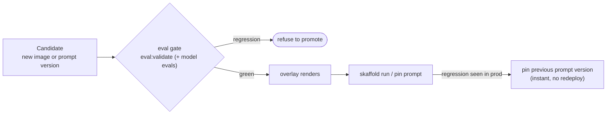

# 6.7. Progressive Delivery

## Why gate a rollout on evaluation?

[6.6. Platform Delivery](./6.6.%20Platform%20Delivery.md) ships a change with one `skaffold run`: build the image, apply the overlay, done. That is fine for infrastructure whose correctness a container probe can confirm. It is not fine for an agent, because the thing most likely to regress — does it still call the right tools, stay grounded, and cost the same? — is exactly what a readiness probe cannot see. A new prompt version or model can be perfectly healthy and quietly worse.

The fix is not a fancier deployment; it is a **gate**. Promotion should be conditional on the same evaluations [4.4. Evaluations](../4.%20Quality/4.4.%20Evaluations.md) already defines, run against the candidate before it takes traffic. `mise run promote` makes that conditionality a command instead of a discipline you have to remember:



## What does `mise run promote` actually gate?

Three steps, from [`promote.sh`](https://github.com/MLOps-Courses/agentops-open-course/blob/main/scripts/promote.sh), in strict order — a failure at any step refuses the promotion:

1. **The deterministic offline gate always runs.** `mise run eval:validate` checks the eval set is consistent against the seed with no model needed. This is the same gate CI runs, re-asserted at the promotion boundary.
1. **Model-backed evidence is opt-in.** With `--with-model`, it also runs `eval:mlflow` (trajectory + response scorers) and `eval:ground` (groundedness) against the candidate, so a wrong-trajectory or newly-hallucinated regression blocks promotion — not just a structural one. Skipped by default so the gate stays runnable without a model or cluster.
1. **The target overlay must render.** `kustomize build` of the overlay proves the manifests are valid before anyone applies them, the same render `mise run check:infra` validates.

Only after all three pass does it print the exact `skaffold run` promote command and the instant prompt-rollback lever. It applies nothing itself — the gate is the value; the apply stays an explicit human step.

```bash
mise run promote                 # gate the local overlay, offline
mise run promote -- --with-model # include the model-backed evals
mise run promote -- gke          # gate the gke overlay
```

## Which surface should you promote progressively, and which reverses instantly?

Prefer to move the **prompt version** first, because it is the one surface you can both canary and reverse without a redeploy. The instruction lives in the MLflow prompt registry ([4.4](../4.%20Quality/4.4.%20Evaluations.md#how-do-you-version-pin-and-roll-back-the-instruction)), so a new version is promoted by pinning `AGENT_PROMPT_URI=prompts:/agentops-agent-instruction/N`, compared against the current one with `mise run eval:ab`, and rolled back in seconds by pinning `N-1` — the same lever [7.7. Incident Response](../7.%20Observability/7.7.%20Incident%20Response.md#what-can-you-change-to-mitigate-without-a-redeploy) reaches for during an incident. A new **image** is the heavier surface: it promotes through `skaffold run` behind the same gate, and rolls back by redeploying the previous immutable digest ([7.0. Reproducibility](../7.%20Observability/7.0.%20Reproducibility.md)).

The rule that generalizes: gate every promotion on evaluation, and reach first for the surface whose rollback is a config change, not a rebuild.

## What does this lab deliberately not do?

It does not ship an automated, traffic-splitting canary with SLO-driven rollback, and it says so rather than implying otherwise. Two honest reasons:

1. **There is one replica to split.** The agent runs as a single kagent-managed workload on a single-node cluster ([6.0. Platform](./6.0.%20Platform.md)); a canary needs a second instance and a router that weights traffic between them. That is real infrastructure, not a manifest tweak.
1. **Automated rollback needs a live quality signal.** Rolling back on a metric requires an online scorer the course deliberately does not run ([7.5. Online Evaluation](../7.%20Observability/7.5.%20Online%20Evaluation.md)) — so any rollback here is a human reading evidence and pinning a version, not an automated controller.

A production progressive rollout would add exactly those pieces: a second agent instance (a canary kagent Agent), agentgateway route **weights** shifting traffic from stable to canary in steps, and an automated rollback keyed to the burn-rate SLO and online scores. The eval gate in this chapter is the precondition every one of those steps still depends on — you canary a candidate you have already evaluated, never one you have not.

## What is the progressive-delivery checkpoint?

Prove the gate blocks a regression, with no cluster required:

1. Run `mise run promote` and confirm it passes the offline gate, renders the `local` overlay, and prints the promote and rollback commands.
1. Induce a regression: temporarily add a case to `agents/python/evals/ops.evalset.json` that references an incident id absent from the seed. Run `mise run promote` again and confirm `eval:validate` fails and the promotion is refused before any render or apply.
1. Revert the eval set and confirm `mise run promote` passes again.

You have completed the loop when a change that fails evaluation cannot reach the promote command — which is what makes evaluation a gate rather than a report.
