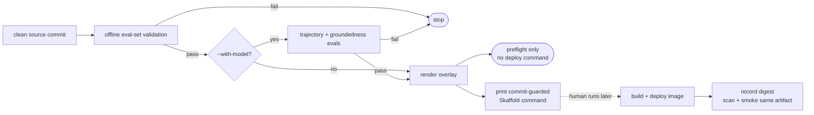

# 6.7. Promotion and Rollback

!!! abstract "In one glance"

    - **You will:** Run a non-deploying source preflight, prove a broken eval stops it, and separate that evidence from the image built afterward.
    - **You need:** [4.4. Evaluations](../4.%20Quality/4.4.%20Evaluations.md) finished and `mise run install:platform` completed; no cluster required.
    - **Time:** about 15 minutes, hands-on.

## Why gate a rollout on evaluation?

A healthy process can still be a worse agent.

A readiness probe proves the server starts. It cannot prove the source composition calls the right tools, stays grounded, or follows the evaluated operating contract. Those are release properties, so a build/deploy handoff needs behavior evidence first.

`mise run promote` packages that reasoning into a preflight:



The script never builds or applies anything. It validates source inputs and manifests, then may print the next command for a human to review.

## What does `mise run promote` prove?

The default command is an offline preflight, not permission to deploy.

```bash
mise run promote
```

It runs three ordered checks:

1. `eval:validate` verifies that committed eval cases and seed references agree.
1. The model-backed step is skipped and says how to enable it.
1. `kubectl kustomize` renders the selected overlay.

When those pass, the script exits zero but prints **no** deployment command. Offline validation proves the dataset and manifests are coherent; it has not measured candidate behavior.

Pass `--with-model` only when the configured model is ready:

```bash
mise run promote -- --with-model
```

Step 2 then runs `eval:mlflow` for deterministic conversation scorers and `eval:ground` for evidence grounding. This mode requires a clean Git worktree and records its commit. It explicitly clears `AGENT_PROMPT_URI`, so both evaluations use the committed instruction the production image will contain; use `eval:ab` separately for registry experiments. A failure or later source change stops before any command is emitted. Only a green model-backed run plus a clean render prints a commit-guarded `skaffold run` command.

!!! warning "Model-backed means real inference"

    `--with-model` calls the configured model. The default course path uses hosted Gemini, but a hosted endpoint can consume paid tokens. Run it deliberately.

## How does the target overlay change the command?

Select exactly one overlay: `local` by default, or `gke`.

```bash
mise run promote -- local --with-model
mise run promote -- gke --with-model
```

Both paths render `infra/k8s/overlays/<overlay>`. The repository in the emitted command differs:

| Overlay | Image repository source                                                       |
| ------- | ----------------------------------------------------------------------------- |
| `local` | `registry.localhost:5050`, the registry created by the shared local k3d setup |
| `gke`   | `tofu output -raw artifact_registry_repository` from `infra/gcp`              |

Unknown flags, unknown overlays, and a second overlay fail fast. The GKE path still prints a command only; it does not run `tofu apply`, create a cluster, or deploy.

## What must a real rollback record?

This preflight evaluates a clean source commit, not an image.

The serving image contains the committed `INSTRUCTION`; it deliberately omits MLflow. `AGENT_PROMPT_URI` is available only to host development and evaluation processes, so a prompt-registry URI is not a production rollback lever in this repository.

Use the prompt registry to compare wording before committing it. The printed Skaffold command then builds an image from that unchanged commit. Only after the build does an image digest exist, and the source evaluation alone does not prove that artifact starts, is clean, or contains the expected code.

For a production release, scan and smoke the exact immutable digest you will deploy, then record it with its source commit. If a release regresses, redeploy the previous known-good digest. This lab stops at the explicit build/deploy handoff rather than pretending to provide that image-provenance pipeline.

This course does not claim an automated canary. The local platform has one replica, no traffic-weighted stable/canary route, and no online scorer that can make a safe automatic rollback decision.

??? note "Deeper: what a production canary would add"

    A production progressive rollout needs a second agent instance, weighted routing, an online quality signal, and an automated rollback policy. Each adds real operational state. Pre-deployment eval evidence still comes first: do not send live traffic to a candidate that already fails its reviewed floors.

## How do you prove a regression cannot reach promotion?

Use one reversible eval-set edit and no cluster.

1. Run `mise run promote`. Confirm all three steps pass, the overlay renders, and the final message says no promotion command was emitted.
1. In `agents/python/evals/ops.evalset.json`, find the `incident-detail` case and temporarily change its expected `get_incident` argument from `INC-001` to absent id `INC-042`.
1. Run `mise run promote` again. Confirm it stops inside `[1/3]` before rendering and emits no deployment command.
1. Change `INC-042` back to `INC-001`, inspect `git diff`, and run `mise run promote` once more.

`INC-999` is not suitable for this drill: the eval set deliberately uses it as a negative case and the validator knows it should remain absent.

The optional final proof needs a model:

```bash
mise run doctor:model
mise run promote -- --with-model
```

Read the printed command; do not execute it for this page. Clean source behavior evidence makes a build/deploy command _eligible_ for human review. It neither authorizes a rollout nor evaluates the image that command will build.

## What proves this page worked?

The offline preflight and the deliberate regression are sufficient.

**You are done when:**

- `mise run promote` passes without a model and emits no deployment command.
- The temporary invalid eval reference stops inside `[1/3]`, before the overlay render.
- The eval set is restored, `git diff` shows no accidental drill residue, and the offline preflight passes again.
- You can explain why only `--with-model` may emit a command and why the script still never applies it.
- You can name the handoff: evaluated source commit, then build, scan, smoke, deploy, and record one immutable image digest.

Continue to [Observability](../7.%20Observability/index.md) when “preflight passed” and “safe to deploy” no longer mean the same thing.
