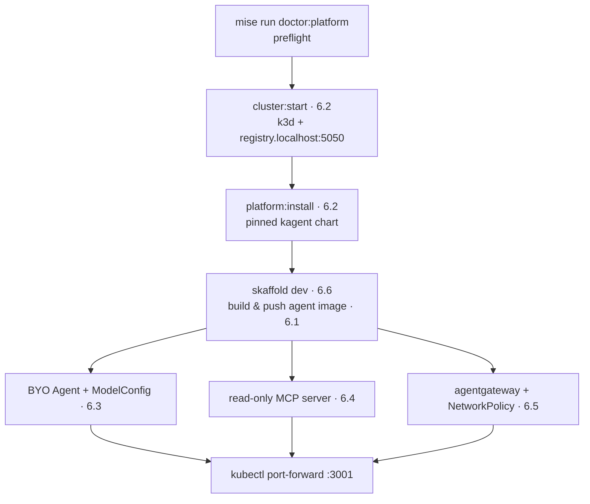

# 6. Platform

## Where will you run the agent?

Chapters 1-5 ran the reference agent as host processes behind agentgateway. This chapter moves that same validated data plane onto Kubernetes: first onto a local [k3d](https://k3d.io/) cluster driven by [kagent](https://kagent.dev/), then, optionally and without applying, onto a GKE plan. The application, protocol, and model-endpoint contracts do not change; the cluster only adds declarative identity, resource bounds, health probes, network policy, persistent state, and rollout ownership. [6.0. Platform](./6.0. Platform.md) owns that "what changes when you move to Kubernetes" argument — read it first.

The install is a short, ordered path, and each step is owned by exactly one sub-page:



## Which page owns which platform manifest?

Every platform concern has one owning manifest, so a broken rollout has one place to look. This chapter's pages map onto the `infra/` tree like this:

| Sub-page                                                    | What it adds                                                    | Owning manifest(s)                                        |
| ----------------------------------------------------------- | --------------------------------------------------------------- | --------------------------------------------------------- |
| [6.0. Platform](./6.0. Platform.md)                         | Agents as Kubernetes workloads; the shared base and overlays    | `infra/k8s/base/kustomization.yaml`                       |
| [6.1. Containers](./6.1. Containers.md)                     | The multi-stage, digest-pinned agent image                      | `agents/python/Dockerfile`                                |
| [6.2. Platform Install](./6.2. Platform Install.md)         | The tracked k3d cluster/registry and the kagent chart           | `infra/k3d.yaml`, `infra/helmfile.yaml`                   |
| [6.3. Platform Agents](./6.3. Platform Agents.md)           | The hardened BYO `Agent` and gateway `ModelConfig`              | `infra/kagent/agent.yaml`, `modelconfig.yaml`             |
| [6.4. Platform Tools](./6.4. Platform Tools.md)             | The read-only MCP server and its governed `RemoteMCPServer`     | `infra/k8s/base/mcp.yaml`, `infra/kagent/toolserver.yaml` |
| [6.5. Platform Gateway](./6.5. Platform Gateway.md)         | The private data plane, network policy, and workload identity   | `infra/k8s/base/network-policies.yaml` + overlays         |
| [6.6. Platform Delivery](./6.6. Platform Delivery.md)       | Skaffold dev loop, the OpenTofu GKE plan, and teardown          | `infra/skaffold.yaml`, `infra/gcp/`                       |
| [6.7. Progressive Delivery](./6.7. Progressive Delivery.md) | Evaluation as the promotion gate for an image or prompt version | `scripts/promote.sh`                                      |

## What changes between the local and GKE overlays?

Both overlays layer onto the same `infra/k8s/base` Kustomize base, so ports, the MCP read route, the A2A image contract, the state PVCs, and the OTel pipeline are byte-identical across environments. Only environment-specific values differ, and every one is a small patch you can diff:

| Concern          | `overlays/local`                        | `overlays/gke`                                               |
| ---------------- | --------------------------------------- | ------------------------------------------------------------ |
| Gateway config   | `agentgateway/k3d`                      | `agentgateway/gke`                                           |
| Model backend    | `qwen3:4b-instruct` (host Ollama)       | `gemini-3.5-flash` (Vertex)                                  |
| Image registry   | `registry.localhost:5050`               | Artifact Registry (`…-docker.pkg.dev`)                       |
| Identity         | in-cluster ServiceAccounts              | GKE Workload Identity annotations (`workload-identity.yaml`) |
| MLflow artifacts | local PVC (`/var/lib/mlflow/artifacts`) | `gs://agentops-open-course-mlflow-artifacts`                 |
| Egress exception | host Ollama TCP `:11434`                | Vertex `:443` plus the WIF metadata endpoint `:987`/`:988`   |

Each of those two rows is a `patches:` entry in exactly one overlay's `kustomization.yaml`, not in both: the model-backend override (`qwen3:4b-instruct`) lives only in `overlays/local`, and `overlays/gke` inherits `gemini-3.5-flash` from the base `infra/kagent/modelconfig.yaml`; conversely the MLflow override (`gs://agentops-open-course-mlflow-artifacts`) lives only in `overlays/gke`, and `overlays/local` inherits `/var/lib/mlflow/artifacts` from the base `infra/k8s/base/mlflow.yaml`. The egress rows are `NetworkPolicy` additions [6.5](./6.5. Platform Gateway.md) explains and `scripts/check-infra.sh` asserts. Skaffold selects the overlay with `-p local` or `-p gke` and never mixes the two.

## How do you verify the whole platform without a cloud account?

The chapter checkpoint renders and validates both overlays offline: no live cluster, no GCP project, no model. `mise run check:infra` (which runs `scripts/check-infra.sh`) builds each overlay with `kustomize`, validates every object with `kubeconform` and `kube-linter`, diagnoses both Skaffold profiles, lints the helmfile, and runs `tofu validate` against the GKE plan:

```bash
mise run check:infra
```

For a faster spot check, render each overlay the way [6.0](./6.0. Platform.md) does and diff the output; the model backend, identity annotations, and MLflow artifact destination should change while the application ports, read-tool route, and A2A image contract stay fixed (the local overlay also adds the Prometheus/Alertmanager stack the GKE overlay omits):

```bash
kubectl kustomize infra/k8s/overlays/local >/dev/null
kubectl kustomize infra/k8s/overlays/gke >/dev/null
```

The chapter's required outcome is local. GCP stays at `tofu plan`: [6.6. Platform Delivery](./6.6. Platform Delivery.md) walks the plan and the teardown, and no cloud resource is created without a later, explicit approval.
