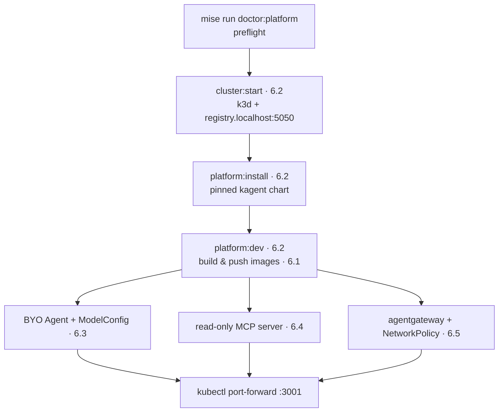

# 6. Platform

!!! abstract "In one glance"

    - **You will:** See where each piece of the Kubernetes deployment lives, and prove both environments render before you install anything.
    - **You need:** Chapter 5 finished and `mise run doctor:platform` passing.
    - **Time:** about 12 minutes, orientation.

## Where will you run the agent?

Until now you started the agent yourself and restarted it when it died. From here the cluster does that.

Chapters 1-5 ran the reference agent as host processes behind agentgateway. This chapter moves that same validated data plane onto Kubernetes: first onto a local [k3d](https://k3d.io/) cluster driven by [kagent](https://kagent.dev/), then, optionally and without applying, onto a GKE plan. The application, protocol, and model-endpoint contracts do not change. The cluster only adds six things around them:

1. **Declarative identity**: each workload runs as a service account you declared, not as whoever launched it.
1. **Resource bounds**: CPU and memory limits, so one pod cannot starve the others.
1. **Health probes**: the cluster calls an endpoint on a schedule and acts when it stops answering.
1. **Network policy**: an explicit allowlist of which pod may reach which.
1. **Persistent state**: a volume that outlives the pod using it.
1. **Rollout ownership**: the cluster restarts and replaces pods, so you stop doing it by hand.

[6.0. Platform](./6.0. Platform.md) owns that "what changes when you move to Kubernetes" argument — read it first.

This page applies nothing and creates no cluster. [6.2. Platform Install](./6.2.%20Platform%20Install.md) creates the cluster, installs kagent, and starts the workloads before the following pages inspect them.

The install is a short, ordered path, and each step is owned by exactly one sub-page:


```mermaid
flowchart TD
    doctor["mise run doctor:platform<br/>preflight"] --> start["cluster:start · 6.2<br/>k3d + registry.localhost:5050"]
    start --> install["platform:install · 6.2<br/>pinned kagent chart"]
    install --> build["platform:dev · 6.2<br/>build & push images · 6.1"]
    build --> agent["BYO Agent + ModelConfig · 6.3"]
    build --> mcp["read-only MCP server · 6.4"]
    build --> gw["agentgateway + NetworkPolicy · 6.5"]
    agent --> pf["kubectl port-forward :3001"]
    mcp --> pf
    gw --> pf
```

**Diagram in words:** Run the platform doctor, start k3d and its local registry, install kagent, then let Skaffold build and push the images. That build creates the BYO Agent, read-only MCP server, and agentgateway/NetworkPolicy path. A temporary port-forward to agentgateway `:3001` is the host entry point.

The loop runs the other way too: `k3d cluster stop local` between sessions returns the memory without destroying anything, and `mise run cluster:start` resumes the same cluster ([6.2. Platform Install](./6.2.%20Platform%20Install.md#how-do-you-stop-the-cluster-between-sessions) owns both).

## Which page owns which platform manifest?

Every platform concern has one owning manifest, so a broken rollout has one place to look.

This chapter covers:

- **[6.0. Platform](./6.0. Platform.md)** _(hands-on)_: Understand process-to-cluster ownership and prove base-versus-overlay render propagation.
- **[6.1. Containers](./6.1. Containers.md)** _(hands-on)_: Build the non-root agent image, then scan the exact artifact you built.
- **[6.2. Platform Install](./6.2. Platform Install.md)** _(hands-on)_: Create the tracked cluster, install kagent, and start the workloads with Skaffold.
- **[6.3. Platform Agents](./6.3. Platform Agents.md)** _(reference)_: Read the hardened BYO `Agent` and the `ModelConfig` that points it at the gateway.
- **[6.4. Platform Tools](./6.4. Platform Tools.md)** _(reference)_: Move the six read-only tools into their own in-cluster MCP deployment.
- **[6.5. Platform Gateway](./6.5. Platform Gateway.md)** _(reference)_: Keep agentgateway private behind network policy, and keep its secrets encrypted in git.
- **[6.6. Platform Delivery](./6.6. Platform Delivery.md)** _(hands-on)_: Back up the state, drill a restore, plan optional GKE, and tear down safely.
- **[6.7. Progressive Delivery](./6.7. Progressive Delivery.md)** _(hands-on)_: Review source evidence before promotion, then use an immutable image digest as the rollback surface.

Each page also owns the manifests below, so a symptom maps to one file:

| Sub-page                                                    | What it adds                                                  | Owning manifest(s)                                             |
| ----------------------------------------------------------- | ------------------------------------------------------------- | -------------------------------------------------------------- |
| [6.0. Platform](./6.0. Platform.md)                         | Agents as Kubernetes workloads; the shared base and overlays  | `infra/k8s/base/kustomization.yaml`                            |
| [6.1. Containers](./6.1. Containers.md)                     | The multi-stage, digest-pinned agent image                    | `agents/python/Dockerfile`                                     |
| [6.2. Platform Install](./6.2. Platform Install.md)         | Cluster/registry, kagent, and the Skaffold development loop   | `infra/k3d.yaml`, `infra/helmfile.yaml`, `infra/skaffold.yaml` |
| [6.3. Platform Agents](./6.3. Platform Agents.md)           | The hardened BYO `Agent` and gateway `ModelConfig`            | `infra/kagent/agent.yaml`, `modelconfig.yaml`                  |
| [6.4. Platform Tools](./6.4. Platform Tools.md)             | The read-only MCP server and its governed `RemoteMCPServer`   | `infra/k8s/base/mcp.yaml`, `infra/kagent/toolserver.yaml`      |
| [6.5. Platform Gateway](./6.5. Platform Gateway.md)         | The private data plane, network policy, and workload identity | `infra/k8s/base/network-policies.yaml` + overlays              |
| [6.6. Platform Delivery](./6.6. Platform Delivery.md)       | State recovery, the OpenTofu GKE plan, and teardown           | `infra/scripts/`, `infra/gcp/`                                 |
| [6.7. Progressive Delivery](./6.7. Progressive Delivery.md) | Source evaluation before the image build/deploy handoff       | `scripts/promote.sh`                                           |

## What changes between the local and GKE overlays?

Six values change between local k3d and GKE. Everything else is the same file.

**Kustomize** renders YAML from a shared `base/` folder plus a small per-environment `overlays/` folder of patches; `kubectl kustomize <dir>` prints the result.

Both overlays layer onto the same `infra/k8s/base` Kustomize base, so ports, the MCP read route, the A2A image contract, the state PVCs, and the OTel pipeline are byte-identical across environments. A **PersistentVolumeClaim (PVC)** is a disk the cluster keeps and re-attaches to a replacement pod.

Skaffold selects the overlay with `-p local` or `-p gke` and never mixes the two.

??? note "Deeper: the row-by-row overlay diff"

    Only environment-specific values differ, and every one is a small patch you can diff:

    | Concern          | `overlays/local`                        | `overlays/gke`                                               |
    | ---------------- | --------------------------------------- | ------------------------------------------------------------ |
    | Gateway config   | `agentgateway/k3d`                      | `agentgateway/gke`                                           |
    | Model backend    | `qwen3:4b-instruct` (host Ollama)       | `gemini-3.6-flash` (Vertex)                                  |
    | Image registry   | `registry.localhost:5050`               | Artifact Registry (`…-docker.pkg.dev`)                       |
    | Identity         | in-cluster ServiceAccounts              | GKE Workload Identity annotations (`workload-identity.yaml`) |
    | MLflow artifacts | local PVC (`/var/lib/mlflow/artifacts`) | GCS bucket from the OpenTofu `mlflow_bucket_name` output     |
    | Egress exception | any IPv4 TCP `:11434` (intended Ollama) | any IPv4 `:443` (intended Vertex) plus WIF `:987`/`:988`     |

    Two of those rows are a `patches:` entry in exactly one overlay's `kustomization.yaml`, not in both:

    1. The model-backend override (`qwen3:4b-instruct`) lives only in `overlays/local`; `overlays/gke` inherits `gemini-3.6-flash` from the base `infra/kagent/modelconfig.yaml`.
    1. The MLflow GCS placeholder lives only in `overlays/gke`; `render-gke.sh` resolves it from OpenTofu, while `overlays/local` inherits `/var/lib/mlflow/artifacts` from the base `infra/k8s/base/mlflow.yaml`.

    The egress rows are `NetworkPolicy` additions [6.5. Platform Gateway](./6.5. Platform Gateway.md) explains and `scripts/check-infra.sh` asserts.

## What breaks first, and where do you look?

The same handful of failures recur across this chapter and the next. Every one is a wiring mistake, not a bug in the agent.

Each row below is a symptom you can observe, the misconfiguration that usually causes it, and the page that owns the fix:

| Symptom                                               | Likely cause                                                                                                                              | Where to look                                                                                                     |
| ----------------------------------------------------- | ----------------------------------------------------------------------------------------------------------------------------------------- | ----------------------------------------------------------------------------------------------------------------- |
| No traces appear in MLflow                            | An `http/protobuf` client points at `:4317` instead of `:4318`, or `OTEL_EXPORTER_OTLP_ENDPOINT` is unset entirely                        | [7.1. Tracing](../7. Observability/7.1. Tracing.md#how-do-you-point-a-host-agent-at-the-collector)                |
| Agent card fails to resolve though the pod is healthy | `AGENT_A2A_HOST` was left at `0.0.0.0` or the loopback default in-cluster, so the card advertises an uncallable URL                       | [6.3. Platform Agents](./6.3. Platform Agents.md#why-does-the-agent-advertise-a-different-a2a-host-than-it-binds) |
| Dashboards are flat / a port-forward returns nothing  | Host Compose and the in-cluster stack were started together and bound the same local ports                                                | [6.2. Platform Install](./6.2. Platform Install.md#how-do-you-start-the-local-kubernetes-workloads)               |
| Agent turns fail in k3d                               | Ollama is not reachable from pods because it binds loopback instead of the k3d bridge                                                     | [6.2. Platform Install](./6.2. Platform Install.md#how-do-you-start-the-local-kubernetes-workloads)               |
| Eval evidence vanished                                | `MLFLOW_TRACKING_URI` was unset, so `mise run eval:mlflow` wrote to the local `evals/mlflow.db` no one else sees                          | [7.0. Reproducibility](../7. Observability/7.0. Reproducibility.md#how-do-you-select-the-mlflow-destination)      |
| Pods stay `Pending`, or a container dies with `137`   | The machine is out of memory: host Compose and the in-cluster stack are running together, or the model plus k3s exceeds what the host has | [6.2. Platform Install](./6.2. Platform Install.md#what-do-you-do-when-the-machine-runs-out-of-memory)            |

## What proves this chapter worked?

One command renders and validates both overlays offline: no live cluster, no GCP project, no model.

```bash
mise run check:infra
```

It runs `scripts/check-infra.sh`. That script builds each overlay with `kubectl kustomize`, then validates every object with `kubeconform` and `kube-linter` — a schema checker and a best-practice linter. It also diagnoses both Skaffold profiles, lints the helmfile, and runs `tofu validate` against the GKE plan.

The script also runs `tflint` on that plan, so it needs the `opentofu` and `tflint` binaries pinned in `mise.toml`. `mise run doctor:platform` checks for neither, so this gate can fail on a machine whose doctor is green.

For a faster spot check, render each overlay the way [6.0. Platform](./6.0. Platform.md) does and diff the output; its checkpoint owns those two commands. The local overlay also adds the Prometheus/Alertmanager stack the GKE overlay omits.

The chapter's required outcome is local. GCP stays at `tofu plan`: [6.6. Platform Delivery](./6.6. Platform Delivery.md) walks the plan and the teardown, and no cloud resource is created without a later, explicit approval.

**You are done when:**

- `mise run doctor:platform` exits 0.
- `mise run check:infra` exits 0, having rendered and validated both the `local` and the `gke` overlay.
- You can name, for any of the eight sub-pages, the manifest it owns.
- You can say why no cluster exists yet, and which page creates one.
- You finished the required drill in [6.0. Platform](./6.0.%20Platform.md#your-turn-how-do-you-prove-a-manifest-change-reaches-the-render): your base edit showed up in both renders, your overlay edit in one, `mise run check:infra` refused the pinned model value, and `git restore infra/k8s` put the tree and the gate back.
- Without reopening Chapter 5, you can name the three protocols agentgateway fronts and say why no cluster Service publishes any of them.

Continue to [6.0. Platform](./6.0.%20Platform.md) when `mise run check:infra` passes without a cluster, a GCP project, or a model.
