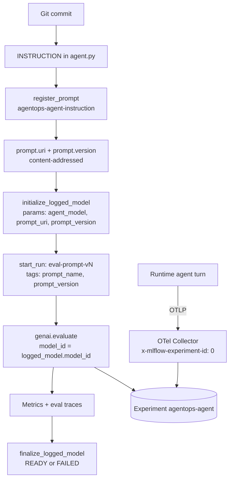
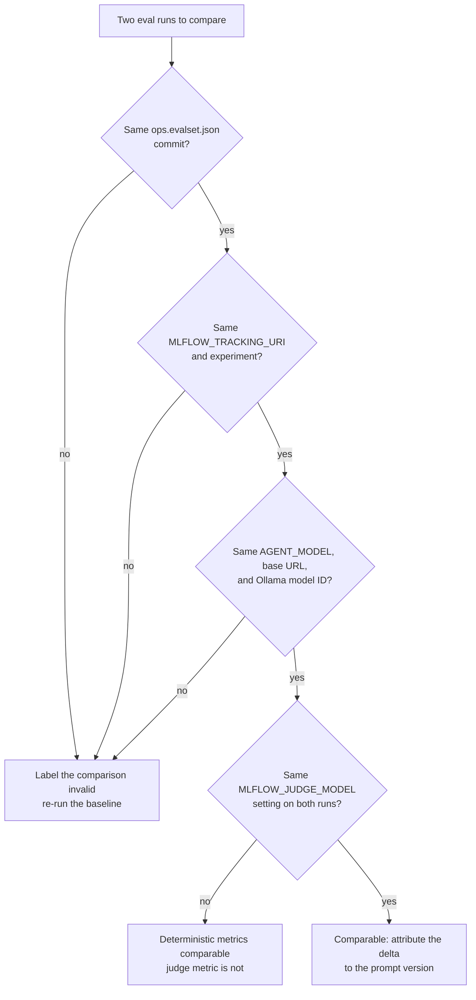

# 7.0. Reproducibility

## What must be recorded to reproduce an agent run?

Deterministic software has one input worth versioning: the code. An agent has at least nine, and any one of them can change the answer without changing the commit. A colleague who says "it worked yesterday" is usually right — a different weight file, a mutated database row, or a re-registered prompt did the work. So an agent release is a tuple, not only a Git commit:

| Input                   | Course evidence                                                               |
| ----------------------- | ----------------------------------------------------------------------------- |
| Code                    | Git commit and clean/intentional diff                                         |
| Python/CLI dependencies | `uv.lock`, `mise.lock`, pinned image digests                                  |
| Container               | Skaffold abbreviated-commit image tag and registry digest                     |
| Model path              | Provider, model, base URL, gateway profile/backend, and local Ollama model ID |
| Prompt                  | Committed instruction and optional dev/eval MLflow prompt URI/version         |
| Data                    | committed seed/runbooks/skills/logs plus reset state                          |
| Tool contract           | typed source, MCP discovery, gateway allowlist                                |
| Runtime                 | local/GKE Kustomize overlay and Helm chart version                            |
| Evaluation              | dataset commit, scorer versions, run/model id, metrics/failures               |

A hosted model name does not freeze provider weights or service behavior. Likewise, `qwen3:4b-instruct` is a mutable Ollama tag rather than a content pin. Record the installed ID/digest and model metadata from `ollama list`/`ollama show` with evaluation evidence. Reproducibility means enough evidence to explain and compare the run, not byte-identical text forever.

The practical test is not "can I replay this token stream" — you cannot, with a sampling model. It is: **given this evidence, can I explain the difference between two runs, or prove there is none?** Everything below exists to make that question answerable.

## How do a trace, a run, a prompt version, and a logged model link together?

Two independent paths write evidence into the same MLflow server. The runtime path produces **traces**: the agent exports OTLP spans, the collector forwards them, and MLflow stores them (Chapter 7.1). The evaluation path produces a **run**, a **logged model**, and a **prompt version**: `mise run eval:mlflow` writes them directly through the MLflow client. Nothing joins the two automatically — they meet because both land in the same experiment, by construction:

1. The collector hard-codes the destination experiment id in an export header (`x-mlflow-experiment-id: "0"` in [`infra/observability/otel-collector.yaml`](https://github.com/MLOps-Courses/agentops-open-course/blob/main/infra/observability/otel-collector.yaml)). It cannot resolve a name.
1. The evaluation script resolves an experiment by name: `_EXPERIMENT = os.environ.get("MLFLOW_EXPERIMENT_NAME", "agentops-agent")`.
1. The course MLflow image closes that gap before the server starts. [`infra/mlflow/entrypoint.py`](https://github.com/MLOps-Courses/agentops-open-course/blob/main/infra/mlflow/entrypoint.py) idempotently renames built-in experiment `0` to `MLFLOW_EXPERIMENT_NAME` — its docstring states the intent exactly: _"Give experiment zero the course-wide name without splitting lineage."_

Point either path somewhere else and the join silently disappears: traces in experiment `0`, evaluations in a new experiment `1`, and no error anywhere. The whole lineage graph a release note needs looks like this:



The arrow that does _not_ exist is worth naming: a production trace carries no prompt version. The runtime uses the committed `INSTRUCTION`, so the Git commit of the deployed image is what attributes a production trace to a prompt — not the registry.

## How does MLflow link prompt and model evidence?

`mise run eval:mlflow` registers the exact `INSTRUCTION`, initializes a logged model with its prompt URI/version and `AGENT_MODEL`, evaluates the full conversations, then marks the logged model `READY` or `FAILED`. From `main()` in [`mlflow_eval.py`](https://github.com/MLOps-Courses/agentops-open-course/blob/main/agents/python/evals/mlflow_eval.py):

```python
prompt = mlflow.genai.register_prompt(
    name="agentops-agent-instruction",
    template=INSTRUCTION,
    commit_message="AgentOps Agent system instruction",
)
logged_model = mlflow.initialize_logged_model(
    name="agentops-agent",
    experiment_id=experiment.experiment_id,
    model_type="agent",
    params={
        "agent_model": settings.model,
        "prompt_uri": prompt.uri,
        "prompt_version": str(prompt.version),
    },
)
```

`experiment_id` comes from `mlflow.set_experiment(_EXPERIMENT)` on the line above, which is what pins the logged model into the same experiment the traces land in. `model_type="agent"` tells the MLflow UI how to render it.

The evaluation itself closes the loop by passing `model_id`, so every scorer result attaches to that logged model rather than floating in a run:

```python
with mlflow.start_run(run_name=f"eval-prompt-v{prompt.version}"):
    mlflow.set_tags({"prompt_name": prompt.name, "prompt_version": str(prompt.version)})
    result = mlflow.genai.evaluate(
        data=_load_cases(),
        predict_fn=ask,
        scorers=_scorers(),
        model_id=logged_model.model_id,
    )
```

The `try`/`except` around that block finalizes the logged model `FAILED` on any exception — including a deterministic metric falling below its threshold in `_required_metric_failures` — and `READY` only on a clean pass. That matters for reproducibility more than it looks: a logged model left in `READY` is a claim that its evidence was produced, not merely attempted. Never promote a model whose lineage ends in `FAILED`.

## How do you select the MLflow destination?

```bash
MLFLOW_TRACKING_URI=http://localhost:5000
MLFLOW_EXPERIMENT_NAME=agentops-agent
mise run eval:mlflow
```

Both variables are optional, and that is the trap. The script falls back to a local file store:

```python
_TRACKING_URI = os.environ.get("MLFLOW_TRACKING_URI", f"sqlite:///{Path(__file__).parent / 'mlflow.db'}")
_EXPERIMENT = os.environ.get("MLFLOW_EXPERIMENT_NAME", "agentops-agent")
```

With `MLFLOW_TRACKING_URI` unset, the run succeeds, prints metrics, registers a prompt version — and writes all of it to a SQLite file next to the script (`agents/python/evals/mlflow.db`) that the server, the collector, and your colleagues never see. The prompt version counter in that file is independent of the server's, so a local `version 2` and a server `version 2` can be different text. This is a real failure mode, not a hypothetical: `mise run eval:mlflow` loads the root `.env`, so a commented-out `MLFLOW_TRACKING_URI` line is enough to split your evidence in two.

The script prints the authoritative tracking URI as its last line — read it, every time:

```text
Tracking URI: http://localhost:5000
```

It suggests `mlflow ui --backend-store-uri ...` only when the URI is a local SQLite store, never for a remote HTTP server. If you see that suggestion and expected the server, you just wrote to the wrong store.

## How do I know which prompt produced this behavior?

By default every runtime uses the committed `INSTRUCTION` from [`agent.py`](https://github.com/MLOps-Courses/agentops-open-course/blob/main/agents/python/src/agent/agent.py) — the prompt is whatever Git says it is at that commit. In the host development/evaluation environment, you can compare behavior against a registered version by setting `AGENT_PROMPT_URI`:

```bash
MLFLOW_TRACKING_URI=http://localhost:5000
AGENT_PROMPT_URI=prompts:/agentops-agent-instruction/2
```

`_instruction()` then loads that exact version from the self-hosted MLflow prompt registry at startup, so traces and evaluations from that host process are attributable to one immutable prompt text. Configuration validation rejects a malformed URI at startup, and `mlflow` is imported lazily from the dev dependency group.

The production agent image intentionally installs no dev dependencies, so it does not support `AGENT_PROMPT_URI`; containers and Kubernetes use the committed instruction. This keeps the runtime image small and avoids an MLflow availability dependency on startup. Promote or roll back production behavior by shipping the evaluated Git/image version, not by setting a registry URI in the deployment.

The full versioning workflow uses the evaluation script rather than a separate registration step, because `register_prompt` versions by content — an unchanged instruction reuses the existing version, a changed one becomes the next:

1. Edit `INSTRUCTION` in `agent.py` (for example, tighten an operating rule).
1. Run `mise run eval:mlflow`; it registers the edited text as `agentops-agent-instruction` version 2 and evaluates it in a run named `eval-prompt-v2`.
1. Every run carries `prompt_name` and `prompt_version` tags, so in the MLflow UI you filter or sort the experiment by `tags.prompt_version` and compare v1 and v2 scorer results side by side.
1. Decide with evidence: keep the new version if the deterministic scorers hold and any judge evidence improves, otherwise roll back.

Content addressing cuts both ways. Change whitespace and you get a new version that behaves identically; change nothing and re-run, and you get a second run named `eval-prompt-v1` against the _same_ version — which is the cheapest way to measure your own sampling noise, and also the most common cause of "why is there no v2?" Check the run name the script prints against the edit you thought you made.

The registry is the self-hosted MLflow server only; there is no hosted prompt service in this course.

## How do you test a prior prompt version?

Point a host development/evaluation process at the prior registered version:

```bash
MLFLOW_TRACKING_URI=http://localhost:5000
AGENT_PROMPT_URI=prompts:/agentops-agent-instruction/1
```

Use that comparison to decide which committed version to ship. Production rollback means redeploying the previously evaluated code/image (or reverting `INSTRUCTION`, re-evaluating, and releasing a corrected image), then leaving `AGENT_PROMPT_URI` unset. A pinned host process depends on the MLflow server at startup; the production path deliberately avoids that coupling.

Evolve the eval set with the prompt, not after it. A prompt change that adds behavior (say, a new escalation rule) needs cases that exercise it, or v1 and v2 will score identically while behaving differently. Record the dataset commit next to the prompt version, as in the reproducibility checkpoint: comparing `eval-prompt-v1` with `eval-prompt-v2` is only valid on the same eval set commit. If the dataset changed in between, re-run the old prompt version against the new dataset before drawing a conclusion.

## How is data reset for comparison?

```bash
cd agents/python
mise run data:reset
```

That deletes runtime sessions/tasks and the writable incident copy, then the next run initializes from the committed seed. Record the seed Git commit and do not compare a fresh run with one whose mock actions changed service/incident state.

The reason is concrete. `restart_service`, `resolve_incident`, and `save_incident_note` write. Once a case resolves `INC-001`, a later run asking "what is the status of INC-001?" is answering a different question against a different database — and it will score differently for a reason that has nothing to do with your prompt. The separation is by design: `_DEFAULT_DATA_DIR` in [`config.py`](https://github.com/MLOps-Courses/agentops-open-course/blob/main/agents/python/src/agent/config.py) points at the committed, immutable dataset, while `_DEFAULT_STATE_DIR` points at a disposable `.state` directory, so `mise run data:reset` is a one-line `rm -rf .state`. Nothing under Git ever needs restoring.

`mise run eval:mlflow` is stricter than a manual run and does not depend on you remembering the reset — see the next section.

## What is deterministic and what is not?

Deterministic: types, validators, SQL seed, retrieval ranking, tool functions, policy callbacks, graph topology, scanner/test configuration, and exact expected trajectories.

Non-deterministic/external: model output, provider implementation, sampling, network timing, Spot scheduling, and live service availability. Pin/control what you can, record what you cannot, and use distributions/evaluations instead of promising replay identity.

That split is not left to discipline in the evaluation path — `mlflow_eval.py` forces it where it can:

1. **State isolation.** `ask()` gives every case a disposable state directory, so a write in one case cannot leak into the next:

   ```python
   def ask(turns: list[str], eval_id: str) -> dict[str, Any]:
       """Run one conversation with an isolated user and disposable runtime state."""
       with _EVAL_STATE_LOCK, tempfile.TemporaryDirectory(prefix=f"agentops-{_eval_user_id(eval_id)}-") as state_dir:
           original_state_dir = settings.state_dir
           settings.state_dir = Path(state_dir)
           try:
               return asyncio.run(_run(turns, eval_id))
           finally:
               settings.state_dir = original_state_dir
   ```

   `_EVAL_STATE_LOCK` is what makes that safe: `settings.state_dir` is process-global mutable state, so two cases running concurrently would otherwise fight over it.

1. **Session isolation.** `_eval_user_id()` derives a stable per-case logical user (`eval-<slug>`), so memory written by `save_incident_note` in one case is invisible to another — and identical across re-runs of the same case.

1. **Judge determinism, as far as it goes.** The optional gateway judge in `_gateway_judge()` calls the model with `temperature=0` and `response_format={"type": "json_object"}`, and validates the reply against a strict `JudgeVerdict` model. That removes sampling as a variable; it does not make an LLM judge a deterministic scorer. Treat judge output as evidence, not as a gate — which is exactly why only the four deterministic metrics appear in `_REQUIRED_METRIC_THRESHOLDS`.

1. **Scorer text tolerance.** `response_facts` checks polarity-aware domain terms and claims rather than exact prose, so an equivalent rewording passes. That is how a non-deterministic generator gets a deterministic pass/fail without pinning the wording.

What remains uncontrolled is the model itself: the same prompt, the same state, and the same seed can still produce a different trajectory. Run the eval twice before you attribute a metric change to your edit.

## Which comparisons are silently invalid?

Every failure mode below produces a _number_. None of them produce an error. That is what makes them expensive: you ship a prompt because v2 scored better, when what actually changed was the dataset.



The concrete traps, in the order learners hit them:

1. **Different evalset commits.** `eval-prompt-v1` was scored on eleven cases, `eval-prompt-v2` on twelve. The mean metrics are over different denominators. Record the dataset commit next to the run; if it moved, re-run the old prompt against the new dataset.
1. **Leftover state.** You ran `adk run` by hand, approved a `resolve_incident`, then ran the eval. `ask()` isolates the eval's own state, but `mise run data:reset` is still what guarantees a clean starting point across your whole session — reset before a comparison you intend to trust.
1. **An unchanged instruction.** You edited a docstring, not `INSTRUCTION`. `register_prompt` is content-addressed, so the run is `eval-prompt-v1` again and you are comparing v1 to v1. The run name is the tell.
1. **Judge on in one run, off in the other.** `_scorers()` appends `gateway_judge` only when `MLFLOW_JUDGE_MODEL` is set. One run has a `gateway_judge/mean` metric and the other does not; the deterministic four still compare, the judge metric does not exist to compare.
1. **A re-pulled model tag.** `qwen3:4b-instruct` is mutable. An `ollama pull` between the two runs can swap the weights under a stable name, and nothing in MLflow will tell you: `params.agent_model` records the tag, not the digest. This is the one input the tooling cannot pin for you — capture `ollama show` output yourself.
1. **Split stores.** One run went to the server, the other to `evals/mlflow.db` because a shell forgot `MLFLOW_TRACKING_URI`. You will notice this one only when the MLflow UI shows a single run where you expected two.

## How do you capture the release tuple in one pass?

The table at the top of this page is only useful if capturing it is cheap. Each row has a command that prints the evidence:

```bash
git rev-parse HEAD                        # Code
git status --porcelain                    # Code: must be empty, or the commit is a lie
ollama show qwen3:4b-instruct             # Model path: local weight digest and parameters
cd agents/python && mise run config:check # Model path, prompt, data: resolved settings, secrets masked
```

`mise run config:check` is the highest-value line: it constructs `Settings` exactly the way every runtime entrypoint does and prints every resolved field, so `model`, `openai_base_url`, `prompt_uri`, `data_dir`, and `state_dir` are captured as the process actually sees them — not as your `.env` suggests they might be. Dependencies need no command: `uv.lock` and `mise.lock` are in the commit you just recorded.

The two rows the rest of this page never verifies are Container and Runtime. Both are Kubernetes-side, and both are one command:

```bash
# Container: the digest actually running, not the tag Skaffold wrote
kubectl -n agentops get pods -l app.kubernetes.io/name=agentops-agent \
  -o jsonpath='{.items[*].status.containerStatuses[*].imageID}'

# Runtime: the fully rendered overlay that produced the cluster state
kustomize build infra/k8s/overlays/local
```

`imageID` is the point. Skaffold's `tagPolicy` is `gitCommit` with `variant: AbbrevCommitSha` ([`infra/skaffold.yaml`](https://github.com/MLOps-Courses/agentops-open-course/blob/main/infra/skaffold.yaml)), so the tag already carries the commit — but a tag is a mutable pointer and `imageID` is the digest the kubelet pulled. Record the digest. `kustomize build` is the same render `mise run check:infra` validates, so what you capture is what CI checks. The Helm side of the Runtime row is pinned in [`infra/helmfile.yaml`](https://github.com/MLOps-Courses/agentops-open-course/blob/main/infra/helmfile.yaml): kagent and its CRDs at chart version `0.9.11`.

## What is the reproducibility checkpoint?

Before comparing two runs, record `git rev-parse HEAD`, `AGENT_MODEL_PROVIDER`, `AGENT_MODEL`, `OPENAI_BASE_URL`, the Ollama model ID when local, gateway profile, prompt URI/version, dataset commit, image tag/digest, and MLflow run/model id. Reset state and use the same eval set; otherwise label the comparison invalid.

Then prove the lineage end to end, once:

1. Start the observability stack (`mise run observability:up`) and confirm `http://localhost:5000` serves the `agentops-agent` experiment.
1. Run `mise run data:reset`, then `mise run eval:mlflow` with `MLFLOW_TRACKING_URI` set. Check the printed tracking URI matches the server, and that no `Local UI:` suggestion appears.
1. In the MLflow UI, open the `eval-prompt-vN` run, read its `prompt_name`/`prompt_version` tags, follow them to the logged model, and confirm its `agent_model`, `prompt_uri`, and `prompt_version` params and its `READY` status.
1. Send one ordinary agent turn and find its trace in the _same_ experiment. Two paths, one lineage — that is the join this chapter exists to protect.
