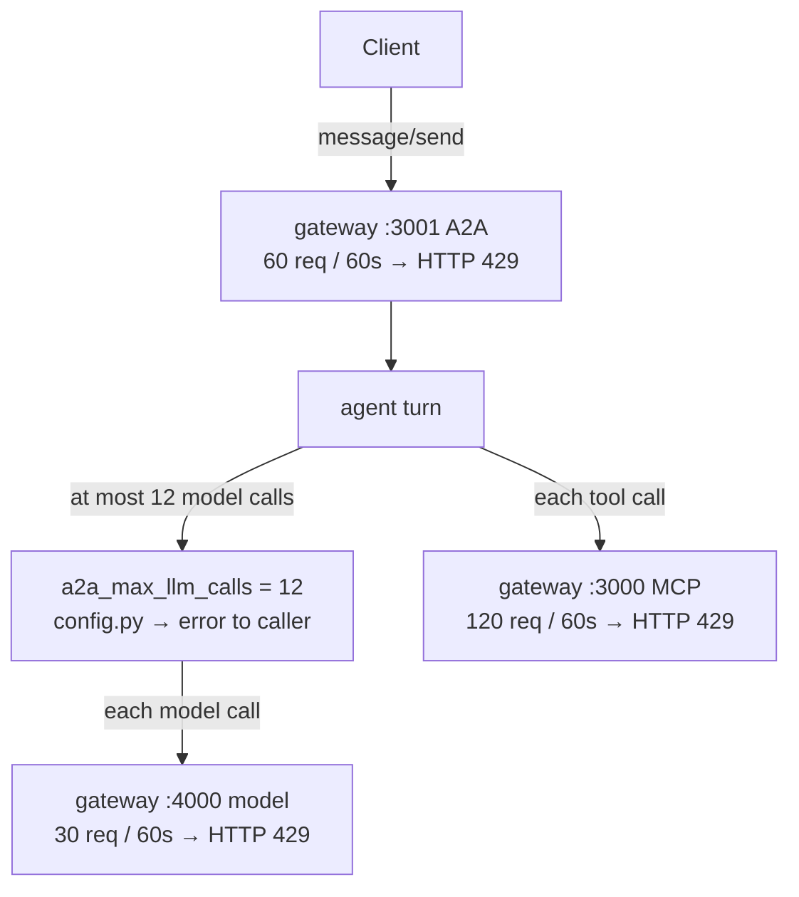
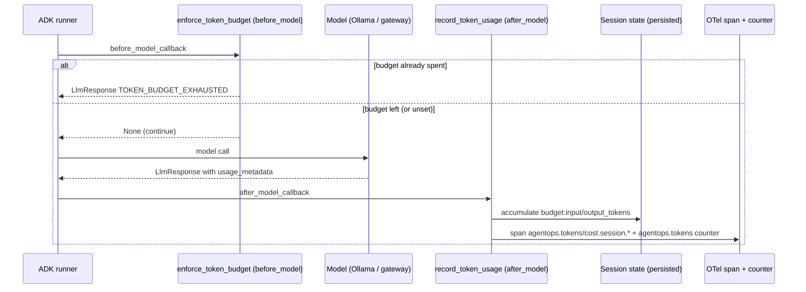

# 7.3. Costs

## Where can agent cost grow?

A model agent has no fixed price per request the way a CRUD endpoint does. Cost is a function of how many tokens the loop consumes, and the loop decides that at runtime. The usual growth sources:

- Repeated model calls inside one loop/task — each tool round-trip is another full prompt.
- Large prompts from session history, tools, skills, or runbooks (`search_runbooks` alone returns whole markdown documents that then live on in history).
- Expensive judge/evaluation calls that run a second model over every answer.
- Idle Kubernetes control plane, node, disks, registry, bucket, and observability retention.
- Retries or failures that repeat non-idempotent/expensive work.

Latency and cost usually share the same cause: unnecessary loop steps or context. If you fix one you generally fix both, which is why the same telemetry backs both this page and [7.2. Monitoring](7.2.%20Monitoring.md).

## Which hard bounds are implemented?

Cost control here is defense in depth: an application-level cap on how much reasoning one request may do, plus gateway rate limits on how fast any client may hit each surface. None of them is a dollar budget — they bound work, not spend.

- **A2A model-call cap.** One A2A request runs at most `AGENT_A2A_MAX_LLM_CALLS` model calls. It is a typed setting in [`config.py`](https://github.com/MLOps-Courses/agentops-open-course/blob/main/agents/python/src/agent/config.py), `a2a_max_llm_calls: int = Field(default=12, ge=1, le=100)`, applied in `server.py` as the runner's `max_llm_calls`. Exceeding it fails the turn back to the caller as an error, not a silent truncation.
- **Gateway rate limits** in [`infra/agentgateway/host/config.yaml`](https://github.com/MLOps-Courses/agentops-open-course/blob/main/infra/agentgateway/host/config.yaml), each a `localRateLimit` token bucket per gateway instance that returns HTTP 429 when drained: the model route on `:4000` allows 30 requests per 60s, the MCP route on `:3000` allows 120, and the A2A route on `:3001` allows 60.
- Qwen3 runs on learner-owned compute for the local path, so the local path has no per-token invoice at all.
- One small single-replica lab replaces a production HA topology.
- Artifact Registry deletes tagged or untagged image versions older than 30 days while preserving the five most recent versions.

Where a single request meets each of those bounds:



These are safety rails, not a monetary budget. There is no shipped dollar-cost alert or billing export.

## How should model cost be calculated?

Use observed input/output tokens from the selected provider/instrumentation and the provider price effective on the run date:

```text
request_cost = input_tokens * input_price_per_token
             + output_tokens * output_price_per_token
             + provider-specific cached/reasoning/tool charges
```

Do not hard-code prices in the agent or infer token counts from character length. Local Ollama has no API price but consumes machine time, memory, energy, and operator capacity.

## How do I attribute cost to a session or tool?

The general problem is closing the loop between "how many tokens did this consume?" and "who pays for it?" without inventing a number. Do that at the boundary where the token count is authoritative — the model response — instead of estimating from character length later.

This repository does it with two model callbacks chained in [`agent.py`](https://github.com/MLOps-Courses/agentops-open-course/blob/main/agents/python/src/agent/agent.py):

```python
before_model_callback=[enforce_token_budget, redact_request_pii],
after_model_callback=[record_token_usage, redact_response_pii],
```

`record_token_usage` (the `after_model_callback`) in [`budget.py`](https://github.com/MLOps-Courses/agentops-open-course/blob/main/agents/python/src/agent/budget.py) reads `usage_metadata` from each response, accumulates prompt/completion tokens into session state, and only then emits the running totals as OpenTelemetry span attributes plus a counter:

```python
callback_context.state[INPUT_TOKENS_KEY] = input_tokens
callback_context.state[OUTPUT_TOKENS_KEY] = output_tokens

_TOKEN_COUNTER.add(turn_input, {"direction": "input"})
_TOKEN_COUNTER.add(turn_output, {"direction": "output"})
span = trace.get_current_span()
span.set_attribute("agentops.tokens.session.input", input_tokens)
span.set_attribute("agentops.tokens.session.output", output_tokens)
span.set_attribute("agentops.tokens.session.total", input_tokens + output_tokens)
span.set_attribute("agentops.cost.session.estimate", estimate_cost(input_tokens, output_tokens))
```

`estimate_cost` multiplies accumulated tokens by `AGENT_INPUT_PRICE_PER_1K` / `AGENT_OUTPUT_PRICE_PER_1K` — both default `0.0`, so the local Ollama path reports a real token count and a zero cost estimate rather than a fabricated one. Set your provider's published per-1k rates to make `agentops.cost.session.estimate` meaningful; no vendor price is hardcoded. The span attributes ride the MLflow trace; the `agentops.tokens` counter is what Prometheus scrapes (as `agentops_tokens_token_total`, tagged by direction).

Trace one model call end to end:



Be honest about the granularity: despite the heading, the implementation attributes tokens **per session only**. There is no per-tool cost breakdown anywhere in the code — no callback splits a turn's tokens across the tools it invoked, because the model reports one usage figure per call, not one per tool. To approximate per-component weight you must measure by ablation (hold a question constant, change one toolset or docstring, and diff the first turn's `prompt_token_count`), the method described in [3.4. Memory](../3.%20Capabilities/3.4.%20Memory.md#how-do-i-measure-tokens-per-component).

## How do I enforce a budget?

Attribution is measurement; enforcement is a decision to stop. `enforce_token_budget` (the `before_model_callback`) short-circuits the next model call once the session's running total reaches `AGENT_MAX_TOKENS_PER_SESSION`, returning an actionable message instead of a silent failure or an open-ended bill:

```python
if used < settings.max_tokens_per_session:
    return None
message = (
    f"This session has exhausted its token budget ({used} of {settings.max_tokens_per_session} tokens used). "
    "Start a new session to continue, or raise AGENT_MAX_TOKENS_PER_SESSION if the work warrants it."
)
return LlmResponse(
    content=types.Content(role="model", parts=[types.Part(text=message)]),
    error_code="TOKEN_BUDGET_EXHAUSTED",
    error_message="Per-session token budget exhausted.",
)
```

The scope is a deliberate design decision. The session-state keys carry no `temp:` prefix:

```python
# Session-state keys. No ``temp:`` prefix, so DatabaseSessionService persists
# the running totals across turns — the budget covers the whole conversation.
INPUT_TOKENS_KEY = "budget:input_tokens"
OUTPUT_TOKENS_KEY = "budget:output_tokens"
```

Without the `temp:` prefix, `DatabaseSessionService` persists the totals across turns, so the budget is **per conversation**, not per turn — a single long session cannot spend forever. The flip side, which you must design around: a new session starts the counter at zero. That is the intended reset, but it is also the easy bypass — a client that opens a fresh session per request never hits the ceiling. The budget bounds one conversation, not one client.

The budget works identically on the free local path and the gateway path — it counts tokens, not dollars. Left unset (`None`), enforcement is disabled and only measurement runs.

## How do you verify the token accounting locally?

Prove the mechanism, do not assume it. With the self-hosted stack up (`mise run observability:up`) and the agent launched with the documented OTLP environment (`OTEL_EXPORTER_OTLP_ENDPOINT=http://127.0.0.1:4318`):

1. Send one question through the agent (`mise run run` and ask `What is the status of the checkout service?`, or drive a turn through `mise run a2a`).
1. Read the counter through Prometheus, which scrapes the collector's `:8889` exporter inside the Docker network (Compose does not publish `:8889` to the host, so curl it directly only after a `kubectl -n agentops port-forward svc/otel-collector 8889:8889` in Kubernetes) — this is the same series the dashboard and the `AgentTokenTelemetryMissing` alert watch:

```bash
curl -fsS 'http://localhost:9090/api/v1/query?query=agentops_tokens_token_total' \
  | jq '.data.result'
```

1. Open that turn's trace in MLflow at `http://localhost:5000` and read the span attributes `agentops.tokens.session.total` and `agentops.cost.session.estimate` (the estimate is `0` until you set the per-1k prices).
1. Force the budget to trip: restart the agent with `AGENT_MAX_TOKENS_PER_SESSION=1`, then send two turns in one session. The second short-circuits with `error_code="TOKEN_BUDGET_EXHAUSTED"` and the message above, before any model call.

If step 2 stays empty while spans still flow, the accounting is broken — the exact condition `AgentTokenTelemetryMissing` fires on in [7.2. Monitoring](7.2.%20Monitoring.md#what-alerts-ship-with-the-course).

## Where does the token budget stop protecting you?

The mechanism has real edges. Know them before you rely on the number:

- **A usage-less response defeats it.** `record_token_usage` returns early when `llm_response.usage_metadata is None`, so a response with no reported usage adds nothing to the running total. The gateway streaming path reports no usage on streamed responses — one reason `AGENT_A2A_STREAMING` defaults off — but any provider or path that omits `usage_metadata` also silently escapes both the counter and the budget.
- **A new session resets it.** As above, the budget is per conversation; a client that rotates sessions is unbounded.
- **It counts the agent's model calls only.** The optional gateway judge (`MLFLOW_JUDGE_MODEL` / `MLFLOW_JUDGE_BASE_URL` / `MLFLOW_JUDGE_API_KEY`) uses its own `OpenAI` client in [`evals/mlflow_eval.py`](https://github.com/MLOps-Courses/agentops-open-course/blob/main/agents/python/evals/mlflow_eval.py), and semantic retrieval calls the embeddings endpoint directly in `retrieval.py`. Neither routes through the agent's model callbacks, so neither is counted or bounded here — budget them separately.
- **It is tokens, not dollars.** Even with prices set, `agentops.cost.session.estimate` is an estimate from a rate you configured, not a billing export. Reconcile it against the provider invoice before trusting it for money.

## What does the dashboard measure today?

Request/error rate, latency, and — since token telemetry was added — an `agentops_tokens_token_total` counter by direction, which supports a token-throughput panel. Traces additionally carry the per-session token and cost-estimate attributes above. A USD time series still needs a verified price source per model, so a monetary panel stays an explicit opt-in rather than a shipped claim. The one guard that ships for this mechanism is the `AgentTokenTelemetryMissing` ticket alert: spans flowing without any `agentops_tokens_token_total` increase means the budget callback or the metrics pipeline broke, and the dashboard would otherwise lie by omission.

## Why is the GKE target conditional?

The module uses one zonal Spot `e2-standard-2` node, no Cloud NAT, no public load balancer, a 30 GiB boot disk, 1/5 GiB PVCs, Artifact Registry cleanup, and light GCS artifacts. The under-USD-20 target assumes the billing account's GKE free-tier credit covers the zonal management fee and the lab is destroyed when idle.

Without that credit, GKE charges USD 0.10 per cluster-hour for management. Compute, storage, registry, network, GCS, and Vertex remain separate billable SKUs. Spot capacity/price and provider pricing can change; consult [current GKE pricing](https://cloud.google.com/kubernetes-engine/pricing) and the OpenTofu plan.

## How do you prevent an idle bill?

Prefer local development. Label cloud resources, review the plan, set an external billing budget/alert, record the start time, and teardown immediately after the lab. `tofu destroy` is destructive and requires explicit review; a non-empty GCS bucket has `force_destroy=false` to prevent silent data deletion.

## What is the cost checkpoint?

For one representative trace, record model calls, input/output tokens (read `agentops.tokens.session.total` off the span, or query `agentops_tokens_token_total` from host Prometheus at `:9090`), total latency, model path, and current price source/date. Confirm the budget trips by setting `AGENT_MAX_TOKENS_PER_SESSION` low and observing `TOKEN_BUDGET_EXHAUSTED`. For the GKE plan, list every billable resource and the free-tier assumption. Mark unknown values as unknown; do not claim a monthly total from machine type alone.
