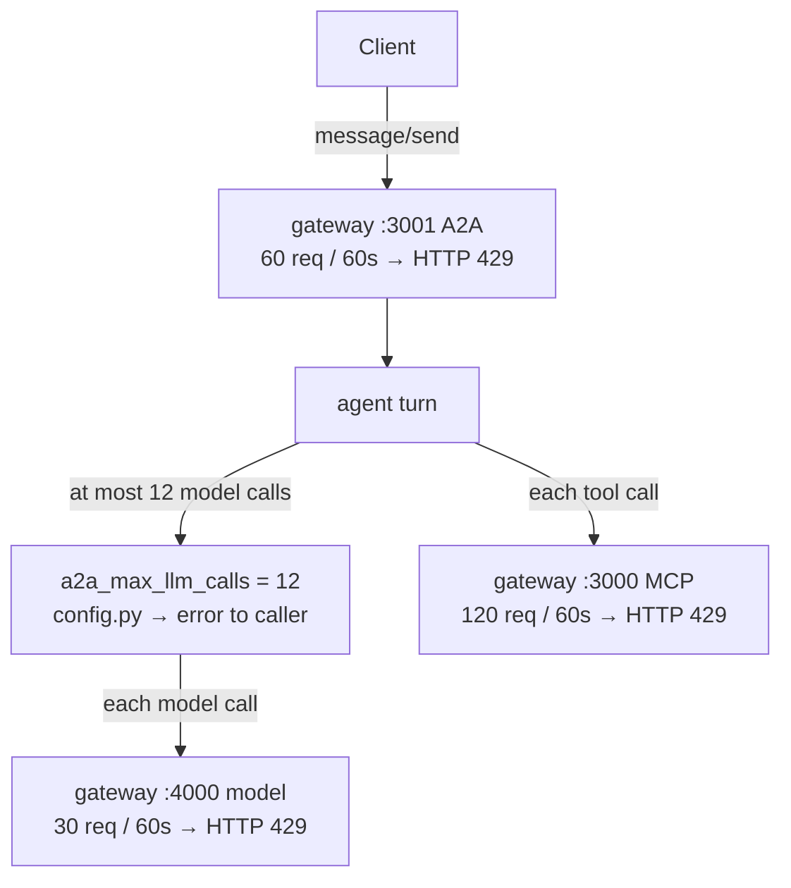
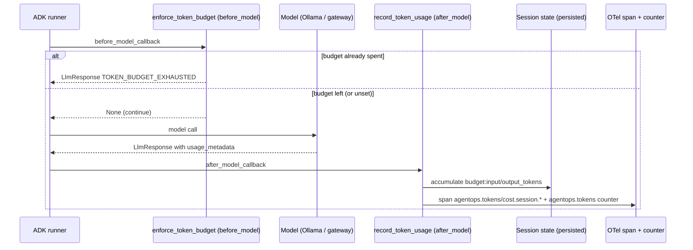

# 7.3. Costs

!!! abstract "In one glance"

    - **You will:** Read the tokens one session actually spent, then set a budget low enough to watch the agent refuse the next call.
    - **You need:** [7.1. Tracing](./7.1.%20Tracing.md) finished, with the agent exporting to the collector on `http://localhost:4318`.
    - **Time:** about 30 minutes, hands-on.

## Where can agent cost grow?

A model agent has no fixed price per request the way a CRUD endpoint does. Cost is a function of how many tokens the loop consumes, and the loop decides that at runtime. The usual growth sources:

- Repeated model calls inside one loop/task — each tool round-trip is another full prompt.
- Large prompts from session history, tools, skills, or runbooks (`search_runbooks` alone returns whole markdown documents that then live on in history).
- Expensive judge/evaluation calls that run a second model over every answer.
- Idle Kubernetes control plane, node, disks, registry, bucket, and observability retention.
- Retries or failures that repeat non-idempotent/expensive work.

Latency and cost usually share the same cause: unnecessary loop steps or context. If you fix one you generally fix both, which is why the same telemetry backs both this page and [7.2. Monitoring](7.2.%20Monitoring.md).

## How do you verify the token accounting locally?

Run this section before you read the rest of the page. Everything after it explains the numbers you are about to read off your own session.

Prove the mechanism, do not assume it. With the self-hosted stack up (`mise run observability:up`) and the agent launched with the documented OTLP environment (`OTEL_EXPORTER_OTLP_ENDPOINT=http://127.0.0.1:4318`):

1. Send one question through the agent (`mise run run` and ask `What is the status of the checkout service?`, or drive a turn through `mise run a2a`).
1. Read the counter through Prometheus — the same series the dashboard and the `AgentTokenTelemetryMissing` alert watch:

```bash
curl -fsS 'http://localhost:9090/api/v1/query?query=agentops_tokens_token_total' \
  | jq '.data.result'
```

!!! info "Why the query goes to Prometheus and not to the collector"

    Prometheus scrapes the collector's `:8889` exporter inside the Docker network. Compose does not publish `:8889` to the host, so curl it directly only after a `kubectl -n agentops port-forward svc/otel-collector 8889:8889` in Kubernetes.

1. Open that turn's trace in MLflow at `http://localhost:5000` and read the span attributes `agentops.tokens.session.total` and `agentops.cost.session.estimate` (the estimate is `0` until you set the per-1k prices).
1. Turn that zero into a number. Both prices default to `0.0`, so the shipped estimate on the local path is always `0.0` — which proves nothing about the arithmetic. Look up the published per-1k input and output rates of one hosted model you would realistically use, note the page and the date, and restart the agent with them:

   ```bash
   cd agents/python
   AGENT_INPUT_PRICE_PER_1K=<published input rate> \
     AGENT_OUTPUT_PRICE_PER_1K=<published output rate> \
     mise run run
   ```

   Ask the same question again and reopen the new trace: `agentops.cost.session.estimate` is now non-zero and equals `agentops.tokens.session.input / 1000 × your input rate + agentops.tokens.session.output / 1000 × your output rate`. Recompute it by hand once; if the two disagree, you are reading a stale span, not a broken formula.

   Local Ollama bills nothing, so that number is a **stated assumption**: what this exact turn would have cost on the provider whose rate you entered. It is a budgeting signal you can defend because you can name its source and date — never a billing figure.

1. Force the budget to trip: restart the agent with `AGENT_MAX_TOKENS_PER_SESSION=1`, then send two turns in one session. The second short-circuits with `error_code="TOKEN_BUDGET_EXHAUSTED"` and the refusal message quoted below, before any model call.

If step 2 stays empty while spans still flow, the accounting is broken — the exact condition `AgentTokenTelemetryMissing` fires on in [7.2. Monitoring](7.2.%20Monitoring.md#what-alerts-ship-with-the-course).

## Which request and rate bounds are implemented?

Now you have a number; here is what stops it growing. Two mechanisms bound cost today, and neither counts money.

The application caps how much reasoning one request may do, and the gateway caps how fast any client may hit each surface. That is defense in depth: they bound work, not spend. Qwen3 runs on learner-owned compute for the local path, so the local path has no per-token invoice at all.

- **A2A model-call cap.** One A2A request runs at most `AGENT_A2A_MAX_LLM_CALLS` model calls. It is a typed setting in [`config.py`](https://github.com/MLOps-Courses/agentops-open-course/blob/main/agents/python/src/agent/config.py), `a2a_max_llm_calls: int = Field(default=12, ge=1, le=100)`, applied in `server.py` as the runner's `max_llm_calls`. Exceeding it fails the turn back to the caller as an error, not a silent truncation.
- **Gateway rate limits** in [`infra/agentgateway/host/config.yaml`](https://github.com/MLOps-Courses/agentops-open-course/blob/main/infra/agentgateway/host/config.yaml). Each route gets a `localRateLimit` **token bucket** per gateway instance: a request allowance that refills on a fixed interval and returns HTTP 429 once drained. The model route on `:4000` allows 30 requests per 60s, the MCP route on `:3000` allows 120, and the A2A route on `:3001` allows 60.

Where a single request meets each of those bounds:


```mermaid
flowchart TD
  Client[Client] -->|message/send| A2A["gateway :3001 A2A<br/>60 req / 60s → HTTP 429"]
  A2A --> Agent[agent turn]
  Agent -->|at most 12 model calls| Cap["a2a_max_llm_calls = 12<br/>config.py → error to caller"]
  Cap -->|each model call| LLM["gateway :4000 model<br/>30 req / 60s → HTTP 429"]
  Agent -->|each tool call| MCP["gateway :3000 MCP<br/>120 req / 60s → HTTP 429"]
```

These are safety rails, not a monetary budget. There is no shipped dollar-cost alert or billing export.

## What does one request actually cost?

Start with numbers, not the formula. The rate below is **illustrative**, not a vendor quote.

Suppose one session's trace reports `agentops.tokens.session.input = 1500` and `agentops.tokens.session.output = 400`, and an operator has set `AGENT_INPUT_PRICE_PER_1K=0.20` and `AGENT_OUTPUT_PRICE_PER_1K=0.60`:

```text
input  : 1500 / 1000 * 0.20 = 0.30
output :  400 / 1000 * 0.60 = 0.24
estimate = 0.54
```

That `0.54` is what `estimate_cost` writes to `agentops.cost.session.estimate` for that session — the arithmetic you reproduced by hand two sections ago with your own rates. On the default local path both prices are `0.0`, so the same session estimates `0.0`. The mechanism runs either way, but the number is only meaningful once an operator sets published rates and reconciles the total against the provider's own invoice. Treat it as a budgeting signal, never as billing truth.

Generalised, that arithmetic is the formula to reuse for any provider:

```text
request_cost = input_tokens * input_price_per_token
             + output_tokens * output_price_per_token
             + provider-specific cached/reasoning/tool charges
```

Use observed input/output tokens from the selected provider/instrumentation and the provider price effective on the run date. Do not hard-code prices in the agent or infer token counts from character length. Local Ollama has no API price but consumes machine time, memory, energy, and operator capacity.

## How do I attribute cost to a session or tool?

Tokens are attributed **per session only**, despite the heading. There is no per-tool cost breakdown anywhere in the code, because the model reports one usage figure per call, not one per tool. No callback splits a turn's tokens across the tools it invoked.

To approximate per-component weight you must measure by **ablation**: hold a question constant, change one toolset or docstring, and diff the first turn's `prompt_token_count`. That method is described in [3.4. Memory](../3.%20Capabilities/3.4.%20Memory.md#how-do-i-measure-tokens-per-component).

The general problem is closing the loop between "how many tokens did this consume?" and "who pays for it?" without inventing a number. Do that at the boundary where the token count is authoritative — the model response — instead of estimating from character length later.

This repository does it in one app-wide policy plugin, [`governance.py`](https://github.com/MLOps-Courses/agentops-open-course/blob/main/agents/python/src/agent/governance.py), so token accounting cannot be missing from an agent someone added later:

```python
--8<-- "agents/python/src/agent/governance.py:policy-plugin"
```

`record_token_usage` (the `after_model_callback`) in [`budget.py`](https://github.com/MLOps-Courses/agentops-open-course/blob/main/agents/python/src/agent/budget.py) reads `usage_metadata` from each response. Input includes prompt and tool-result prompt tokens; output includes candidates and reasoning tokens. If a compatible provider reports only a total, the unclassified remainder goes into the output bucket so enforcement cannot silently count zero. The callback then emits the running totals as OpenTelemetry span attributes plus a counter:

```python
--8<-- "agents/python/src/agent/budget.py:record-session-usage"
```

The callback lock is keyed by ADK's application, user, and session IDs. It prevents overlapping callbacks over the same in-memory state from losing an increment, and its registry entry disappears after the last waiter exits.

That callback lock cannot repair two detached session snapshots. The A2A server therefore uses `_SessionSerializingRunner`: it queues a user's overlapping turns for one session before ADK loads state, holds the lock until the event stream and compaction finish, then lets the next turn read the persisted total. Different users or sessions still run concurrently.

Both locks are process-local. The shipped single-replica runtime has one process and one SQLite writer; a multi-replica deployment needs atomic accounting or a distributed per-session gate in its shared session store. Direct Runner callers and ADK Web also sit outside the A2A invocation gate.

`estimate_cost` multiplies accumulated tokens by `AGENT_INPUT_PRICE_PER_1K` / `AGENT_OUTPUT_PRICE_PER_1K`, both of which default to `0.0`. The local Ollama path therefore reports a real token count and a zero cost estimate rather than a fabricated one. Set your provider's published per-1k rates to make `agentops.cost.session.estimate` meaningful; no vendor price is hardcoded. The span attributes ride the MLflow trace; the `agentops.tokens` counter is what Prometheus scrapes (as `agentops_tokens_token_total`, tagged by direction).

Trace one model call end to end:


```mermaid
sequenceDiagram
  participant ADK as ADK runner
  participant B as enforce_token_budget (before_model)
  participant M as Model (Ollama / gateway)
  participant R as record_token_usage (after_model)
  participant S as Session state (persisted)
  participant O as OTel span + counter
  ADK->>B: before_model_callback
  alt budget already spent
    B-->>ADK: LlmResponse TOKEN_BUDGET_EXHAUSTED
  else budget left (or unset)
    B-->>ADK: None (continue)
    ADK->>M: model call
    M-->>ADK: LlmResponse with usage_metadata
    ADK->>R: after_model_callback
    R->>S: accumulate budget:input/output_tokens
    R->>O: span agentops.tokens/cost.session.* + agentops.tokens counter
  end
```

**Diagram in words:** ADK checks the session budget before the model call. If it is spent, ADK returns `TOKEN_BUDGET_EXHAUSTED`; otherwise the model runs and reports usage. The after-model callback adds those tokens to persisted session state, then sends the running token and cost attributes to OpenTelemetry.

## How do I enforce a budget?

Attribution is measurement; enforcement is a decision to stop. `enforce_token_budget` (the `before_model_callback`) short-circuits the next model call once the session's running total reaches `AGENT_MAX_TOKENS_PER_SESSION`. The caller gets an actionable message instead of a silent failure or an open-ended bill:

```python
if used < settings.max_tokens_per_session:
    return None
message = (
    f"This session has exhausted its token budget ({used} of {settings.max_tokens_per_session} tokens used). "
    "Start a new session to continue, or raise AGENT_MAX_TOKENS_PER_SESSION if the work warrants it."
)
return LlmResponse(
    content=types.Content(role="model", parts=[types.Part(text=message)]),
    error_code="TOKEN_BUDGET_EXHAUSTED",
    error_message="Per-session token budget exhausted.",
)
```

The scope is a deliberate design decision. The session-state keys carry no `temp:` prefix:

```python
# Session-state keys. No ``temp:`` prefix, so DatabaseSessionService persists
# the running totals across turns — the budget covers the whole conversation.
INPUT_TOKENS_KEY = "budget:input_tokens"
OUTPUT_TOKENS_KEY = "budget:output_tokens"
```

Without the `temp:` prefix, `DatabaseSessionService` persists the totals across turns. Two consequences follow:

- The budget is **per conversation**, not per turn: further model calls stop after tracked usage reaches the threshold.
- A new session starts the counter at zero. That is the intended reset, and it is also the easy bypass — a client that opens a fresh session per request never hits the threshold.

The budget bounds one conversation, not one client. It works identically on the free local path and the gateway path — it counts tokens, not dollars. Left unset (`None`), enforcement is disabled and only measurement runs.

## Where does the token budget stop protecting you?

The mechanism has real edges. Know them before you rely on the number:

- **Admitted calls can overshoot.** The callback checks accumulated usage before a model call and records that call afterward. A call that starts below the threshold may finish above it; only the next call is refused. The shipped A2A server queues same-session turns, but direct Runner callers, ADK Web, or another replica can still admit overlapping calls. Neither process-local gate reserves tokens or sets a per-call output-token cap.
- **A usage-less response defeats it.** `record_token_usage` returns early when `llm_response.usage_metadata is None`, so a response with no reported usage adds nothing to the running total. The gateway streaming path reports no usage on streamed responses — one reason `AGENT_A2A_STREAMING` defaults off. Any provider or path that omits `usage_metadata` also silently escapes both the counter and the budget.
- **A new session resets it.** As above, the budget is per conversation; a client that rotates sessions is unbounded.

??? note "Deeper: two more edges, once you enable the optional paths"

    - **It counts the agent's model calls only.** The optional gateway judge (`MLFLOW_JUDGE_MODEL` / `MLFLOW_JUDGE_BASE_URL` / `MLFLOW_JUDGE_API_KEY`) uses its own `OpenAI` client in [`evals/mlflow_eval.py`](https://github.com/MLOps-Courses/agentops-open-course/blob/main/agents/python/evals/mlflow_eval.py), and semantic retrieval calls the embeddings endpoint directly in `retrieval.py`. Neither routes through the agent's model callbacks, so neither is counted or bounded here — budget them separately.
    - **It is tokens, not dollars.** Even with prices set, `agentops.cost.session.estimate` is an estimate from a rate you configured, not a billing export. Reconcile it against the provider invoice before trusting it for money.

## What does the dashboard measure today?

The shipped dashboard graphs request/error rate and latency. No panel shows tokens, and none shows dollars.

The cost signals that do exist:

- The `agentops_tokens_token_total` counter, by direction, added with token telemetry. It would support a token-throughput panel, but the shipped dashboard does not include one.
- The per-session token and cost-estimate attributes that traces carry, described above.
- The `AgentTokenTelemetryMissing` ticket alert, the one guard that ships for this mechanism. Spans flowing without any `agentops_tokens_token_total` increase means the budget callback or the metrics pipeline broke, and the dashboard would otherwise lie by omission.

A USD time series still needs a verified price source per model, so a monetary panel stays an explicit opt-in rather than a shipped claim.

## What does the GKE lab cost per month?

The cloud lab is optional and billable. At prices checked on 31 July 2026, its starting fixed resources cost about USD 28.25 monthly when the billing account's GKE, disk, and registry allowances remain available. They cost about USD 29.49 with only the GKE credit and one current-size image pair; retained image history can add storage. This page owns those figures; [6.6. Platform Delivery](../6.%20Platform/6.6.%20Platform%20Delivery.md), which plans the lab, links here instead of restating them.

Two cloud-side bounds keep that figure low:

- One small single-replica lab replaces a production HA topology.
- The GKE overlay right-sizes idle CPU requests for the two-core node while preserving each workload's burst limit.
- Artifact Registry deletes tagged or untagged image versions older than 30 days while preserving the five most recent versions. Versions younger than 30 days still accumulate, so this cleanup is not a storage cap.

The note below has the full arithmetic, including which **billable SKUs** — separately priced Google Cloud line items — you still pay for without the credit.

??? note "Deeper: what the GKE lab provisions, and what it costs"

    The official `europe-west1` Spot SKUs list USD 0.01162 per vCPU-hour and USD 0.001558 per GiB-hour. The `e2-standard-2` node has two vCPUs and 8 GiB, so `2 × 0.01162 + 8 × 0.001558 = 0.035704` per hour. A 730-hour month is USD 26.06.

    The module assigns that Spot node an external IPv4 address instead of provisioning Cloud NAT. Its USD 0.0025 hourly Spot-address charge adds USD 1.83 monthly.

    The 30 GiB boot disk plus 9 GiB of PVCs provision 39 GiB. The first 30 GiB of standard persistent disk is free per billing account, so the remaining 9 GiB costs about USD 0.36 at USD 0.04 per GiB-month. If another project has consumed that allowance, all 39 GiB cost USD 1.56.

    The current published image pair totals about 0.40 GiB (0.43 GB). One pair fits inside Artifact Registry's 0.5 GiB free allowance, or costs about USD 0.04 monthly if another project has consumed it. Repeated deployments retain more versions and can raise that line item until cleanup catches up.

    With every allowance available, starting fixed resources total about USD 28.25 before variable GCS, network, Vertex, and retained registry-history use. With only the GKE credit and one current-size image pair, they cost about USD 29.49. Without that credit, add USD 73 for a 730-hour month: about USD 101.25 to USD 102.49 before extra retained image history.

    The GKE credit, persistent-disk allowance, and Artifact Registry allowance are per billing account, so another project may already consume them. Spot prices can change daily; refresh [Spot VM pricing](https://cloud.google.com/spot-vms/pricing), [external IPv4 pricing](https://cloud.google.com/vpc/network-pricing#ipaddress), [disk pricing](https://cloud.google.com/compute/disks-image-pricing), [Artifact Registry pricing](https://cloud.google.com/artifact-registry/pricing), and [GKE pricing](https://cloud.google.com/kubernetes-engine/pricing).

## How do you prevent an idle bill?

Prefer local development. The Kubernetes control plane, node, disks, registry, and bucket keep billing while the cloud lab sits idle.

!!! danger "`tofu destroy` is destructive"

    `tofu destroy` requires explicit review; a non-empty GCS bucket has `force_destroy=false` to prevent silent data deletion.

??? note "Deeper: the teardown checklist on the cloud path"

    Label cloud resources, review the plan, set an external billing budget/alert, record the start time, and teardown immediately after the lab.

## What proves this page worked?

For one representative trace, record:

1. Model calls.
1. Input/output tokens — read `agentops.tokens.session.total` off the span, or query `agentops_tokens_token_total` from host Prometheus at `:9090`.
1. Total latency.
1. Model path.
1. Current price source and date.

Confirm the budget trips by setting `AGENT_MAX_TOKENS_PER_SESSION` low and observing `TOKEN_BUDGET_EXHAUSTED`. For the GKE plan, list every billable resource and the free-tier assumption. Mark unknown values as unknown; do not claim a monthly total from machine type alone.

**You are done when:**

- `agentops_tokens_token_total` comes back non-empty from Prometheus for a turn you just sent.
- That turn's MLflow trace carries `agentops.tokens.session.total` and `agentops.cost.session.estimate`.
- With both per-1k prices set to a rate you can cite by page and date, a later turn reports a **non-zero** `agentops.cost.session.estimate` that matches your own hand calculation.
- With `AGENT_MAX_TOKENS_PER_SESSION=1`, the second turn of a session returns `error_code="TOKEN_BUDGET_EXHAUSTED"` and no model call is made.
- Your recorded numbers name a price source and a date, with every unknown value written as unknown.

Continue to [7.4. Feedback](./7.4.%20Feedback.md) when you can point at the token count for one of your own sessions and say where the number came from.
