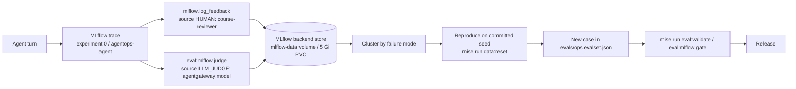

# 7.4. Feedback

## Why must feedback reference a trace?

Feedback is a signal about a specific execution, and it comes in two shapes. _Implicit_ signals — the user retried, rephrased, ignored the recommendation, or approved the guarded action — are free to collect because they fall out of normal traffic, but they are ambiguous: a retry might mean a wrong answer, a slow answer, or a distracted user. _Explicit_ ratings — a reviewer marking one turn correct or unsafe — are expensive but unambiguous. Either way the signal is worthless unless you can recover the exact model, prompt version, tool trajectory, evidence, latency, and policy decisions that produced the judged turn.

A trace id is that anchor. It links a human verdict to those facts without copying prompt text into a Prometheus label, an issue title, or a chat message — the same cardinality and leakage discipline Chapter 7.2 applies to metrics. "Bad answer" with no trace id is an opinion; "`safe_and_grounded=false` on trace `tr-…`" is a reproducible defect.

## What feedback should you collect?

Use a small rubric tied to decisions the agent actually makes, not a single thumbs rating:

1. Correct and grounded in tool/runbook evidence?
1. Chose the necessary tools without waste?
1. Recommendation safe and actionable?
1. Approval/policy behavior correct?
1. Free-text rationale with sensitive details removed?

A thumbs-up rate alone cannot separate wrong facts from poor style from unsafe action selection, and those three failures need different fixes.

One caveat the rubric must respect: an assessment attaches to a trace, and the trace inherits that turn's content-capture setting. `setup_telemetry()` sets `ADK_CAPTURE_MESSAGE_CONTENT_IN_SPANS=false` by default, so spans carry timing, model, tool names/arguments, token counts, and status — the _trajectory_ — but not prompt or response bodies. A reviewer scoring a turn while it runs (in the terminal, the web client, or `adk web`) can judge answer correctness from what they just saw. A reviewer who opens the stored trace later sees only the trajectory, so a rubric item like "correct and grounded" cannot honestly be re-derived from the trace body — only tool selection and policy behavior can. Decide up front whether your rubric scores the trajectory or the live answer.

## How does a reviewer get the right trace id?

Nothing in the shipped runtime hands a reviewer a trace id. The persistent A2A server ([`server.py`](https://github.com/MLOps-Courses/agentops-open-course/blob/main/agents/python/src/agent/server.py)) exposes only `/healthz` and `/livez` beyond the A2A routes; neither the A2A response envelope nor the single-file web client ([`clients/web/index.html`](https://github.com/MLOps-Courses/agentops-open-course/blob/main/clients/web/index.html)) surfaces the id of the turn just answered. That is why the lab snippet below falls back to selecting the most recent trace by `timestamp_ms DESC`: with no id on the response, "the latest trace in experiment `0`" is a serviceable heuristic for a single reviewer driving one turn at a time.

Treat that heuristic as a lab shortcut, not a design. It breaks the moment two turns interleave, and it silently attaches your verdict to someone else's execution. A production feedback path must thread the trace id from the response context back to the reviewer, which is the boundary the course does not ship.

## How can you log feedback to self-hosted MLflow?

With a recent trace in the local `agentops-agent` experiment (id `0`):

```bash
cd agents/python
export MLFLOW_TRACKING_URI=http://localhost:5000
TRACE_ID="$(uv run mlflow traces search \
  --experiment-id 0 \
  --max-results 1 \
  --order-by 'timestamp_ms DESC' \
  --output json \
  --extract-fields info.trace_id \
  | jq -r '.traces[0].info.trace_id')"
export TRACE_ID
uv run python - <<'PY'
import os

import mlflow
from mlflow.entities import AssessmentSource, AssessmentSourceType

mlflow.set_tracking_uri(os.environ["MLFLOW_TRACKING_URI"])
mlflow.log_feedback(
    trace_id=os.environ["TRACE_ID"],
    name="safe_and_grounded",
    value=True,
    source=AssessmentSource(
        source_type=AssessmentSourceType.HUMAN,
        source_id="course-reviewer",
    ),
    rationale="Matched the incident and cited the expected runbook.",
)
print(os.environ["TRACE_ID"])
PY
```

This attaches one assessment to the selected trace. Confirm the trace before judging it; production systems must take the trace id from the response context rather than assume "latest".

## How do human and judge assessments share one store?

`log_feedback` is the human side of the same assessment API the evaluation code already writes with a machine. Every assessment carries an `AssessmentSource`, and the `source_type` is what tells the two apart in one place. The human call above uses `AssessmentSourceType.HUMAN` with `source_id="course-reviewer"`. The optional gateway judge in [`mlflow_eval.py`](https://github.com/MLOps-Courses/agentops-open-course/blob/main/agents/python/evals/mlflow_eval.py) returns its verdict as the same entity type from a different source:

```python
return Feedback(
    value=verdict.passed,
    rationale=verdict.rationale,
    source=AssessmentSource(source_type="LLM_JUDGE", source_id=f"agentgateway:{model}"),
)
```

Because both land as assessments on a trace, you can filter a trace's verdicts by `source_type` (`HUMAN` vs `LLM_JUDGE`) and by `source_id` (which reviewer, which judge model), and you never confuse a machine score for a human one.

That shared model also means assessments _accumulate_: each `log_feedback` call appends a new assessment with its own id — it does not overwrite an earlier one with the same `name`. Two reviewers scoring `safe_and_grounded` on the same trace produce two coexisting HUMAN assessments; a judge run adds a third from an `LLM_JUDGE` source. Nothing forces last-write-wins, so conflicting verdicts sit side by side and must be reconciled by policy (source precedence, adjudication, majority) rather than by the store. To revise one specific assessment instead of appending, use `update_assessment` against its assessment id.

## Where does an assessment live, and for how long?

Assessments are rows in MLflow's backend store, not a separate service. The pinned `agentops-mlflow` image (`3.14.0`) runs the tracking server against a SQLite backend (`mlflow.db`) on a persistent volume — the `mlflow-data` Docker volume on the host Compose profile ([`compose.yaml`](https://github.com/MLOps-Courses/agentops-open-course/blob/main/infra/observability/compose.yaml)), and the 5 Gi `mlflow` `PersistentVolumeClaim` in Kubernetes ([`infra/k8s/base/mlflow.yaml`](https://github.com/MLOps-Courses/agentops-open-course/blob/main/infra/k8s/base/mlflow.yaml)). Your verdict persists there next to the trace it references.

For how long is the sharp edge. Prometheus and Loki both apply an explicit short retention (`--storage.tsdb.retention.time`; Loki `retention_period: 168h`), so a trace's metrics and logs age out on a days-to-a-week clock: the host Compose profile keeps Prometheus at 7 days, the in-cluster local overlay trims it to 2 days ([`infra/k8s/overlays/local/prometheus.yaml`](https://github.com/MLOps-Courses/agentops-open-course/blob/main/infra/k8s/overlays/local/prometheus.yaml)), and Loki holds 7 days in both. MLflow ships **no retention or garbage-collection job** — traces and assessments live for the life of the volume/PVC. A human verdict therefore outlives the metrics and logs that gave it context, and a stored assessment with a free-text rationale is a durable artifact you are responsible for under whatever data policy governs the store. Deleting the named volume (`docker compose … down -v`) or the PVC is the only reset.

A specific pitfall follows from that permanence. The repository redacts PII and credentials before free text reaches other stores — `redact_persisted_value` filters the OTLP log bridge ([`telemetry.py`](https://github.com/MLOps-Courses/agentops-open-course/blob/main/agents/python/src/agent/telemetry.py)) and `redact_persisted_text` filters the audit `rationale` before it hits SQLite ([`actions.py`](https://github.com/MLOps-Courses/agentops-open-course/blob/main/agents/python/src/agent/actions.py)) — but **nothing redacts an MLflow assessment rationale**. Whatever a reviewer types in `rationale=` lands in the store verbatim and stays. Do not paste incident specifics, customer identifiers, or copied prompt text into a reviewer note; reference the trace id and keep the note about the _behavior_.

## Does the A2A application collect feedback automatically?

No. The shipped A2A server has no authenticated feedback endpoint and the web client has no rating control; MLflow supplies the storage and assessment API for the lab only. A production feedback API must authenticate the reviewer, authorize access to the referenced trace, validate the rubric, rate-limit and deduplicate writes, keep reviewer notes free of PII, and bind each assessment to an identity so appended verdicts are attributable rather than anonymous. The course stops at the storage boundary on purpose — the same deliberate boundary Chapter 7.5 draws for online scoring.

## How does feedback improve the agent?

Feedback earns its keep only when a recurring verdict becomes an offline gate. The loop is: score turns, cluster the failures, reproduce one on committed data, encode it as a deterministic case, and let the gate block the regression on every future change.



Concretely: cluster assessments by failure mode, open representative traces, and reproduce the issue against the committed dataset — clear disposable runtime state with `mise run data:reset` so the run starts from the seeded `incidents.db`, never from a mutated session. Add the smallest new case to [`evals/ops.evalset.json`](https://github.com/MLOps-Courses/agentops-open-course/blob/main/agents/python/evals/ops.evalset.json), confirm its structure with `mise run eval:validate` (offline, no model), then prove the behavior with `mise run eval:mlflow`, whose deterministic scorers must stay at `1.0`. Change one component and compare on the holdout. Never paste a private production conversation into the committed eval set: transcribe the _behavior_ onto sanitized seed data, which is exactly why the loop routes through `data:reset` rather than through captured traffic.

## What is the feedback checkpoint?

Attach one human assessment to a known trace with `mlflow.log_feedback`, find it back in MLflow filtered by its `HUMAN` source, and — if you have run `mise run eval:mlflow` with a judge — confirm a same-named `LLM_JUDGE` assessment coexists on a trace without either overwriting the other. Then write the smallest sanitized regression case in `evals/ops.evalset.json` that would have caught the issue, and validate it offline. Record reviewer source and rationale, keep PII out of the rationale, and never use feedback text as a metrics label.
