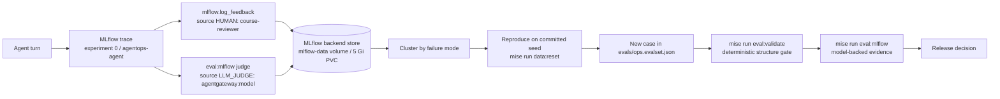

# 7.4. Feedback

!!! abstract "In one glance"

    - **You will:** Attach a human verdict to one specific trace in MLflow, then turn a repeated verdict into an offline test case.
    - **You need:** At least one trace in the `agentops-agent` experiment, i.e. [7.1. Tracing](./7.1.%20Tracing.md) finished.
    - **Time:** about 25 minutes, hands-on.

## Why must feedback reference a trace?

"Bad answer" with no trace id is an opinion. "`safe_and_grounded=false` on trace `tr-…`" is a reproducible defect.

Feedback is a signal about a specific execution, and it comes in two shapes:

- _Implicit_ signals — the user retried, rephrased, ignored the recommendation, or approved the guarded action — are free to collect because they fall out of normal traffic. They are also ambiguous: a retry might mean a wrong answer, a slow answer, or a distracted user.
- _Explicit_ ratings — a reviewer marking one turn correct or unsafe — are expensive but unambiguous.

Either way the signal is worthless unless you know what execution it judged and what context the reviewer actually saw.

A trace id anchors the verdict to one execution. With default content capture off, that trace retains model, tool names and order, timing, token counts, and status — not tool arguments, evidence bodies, the answer, or the exact prompt version. Preserve the release tuple separately when that lineage matters. This follows the same cardinality and leakage discipline [7.2. Monitoring](./7.2.%20Monitoring.md) applies to metrics.

## How can you log feedback to self-hosted MLflow?

Attach one verdict now, before the theory. An **assessment** is one stored verdict attached to one trace.

Step 1 finds the most recent trace in the local `agentops-agent` experiment (id `0`). Run both blocks in the same terminal: the second one reads what the first exports.

```bash
cd agents/python
export MLFLOW_TRACKING_URI=http://localhost:5000
TRACE_ID="$(uv run mlflow traces search \
  --experiment-id 0 \
  --max-results 1 \
  --order-by 'timestamp_ms DESC' \
  --output json \
  --extract-fields info.trace_id \
  | jq -r '.traces[0].info.trace_id')"
export TRACE_ID
```

!!! warning "Check the trace id before you judge anything"

    Run `echo "$TRACE_ID"`. If it prints `null` or nothing, no trace has arrived yet, and step 2 fails with an MLflow error that never mentions the real cause. Send one turn with `OTEL_EXPORTER_OTLP_ENDPOINT` set ([7.1. Tracing](./7.1.%20Tracing.md#how-do-you-point-a-host-agent-at-the-collector)) and try again.

Step 2 attaches one assessment to that trace. Two lines are yours to change: the rubric item in `name=` and your verdict in `value=`. Everything else is boilerplate.

```bash
uv run python - <<'PY'
import os

import mlflow
from mlflow.entities import AssessmentSource, AssessmentSourceType

mlflow.set_tracking_uri(os.environ["MLFLOW_TRACKING_URI"])
mlflow.log_feedback(
    trace_id=os.environ["TRACE_ID"],
    name="safe_and_grounded",  # the rubric item you are scoring
    value=True,  # your verdict for this turn
    source=AssessmentSource(
        source_type=AssessmentSourceType.HUMAN,
        source_id="course-reviewer",
    ),
    rationale="Matched the incident and cited the expected runbook.",
)
print(os.environ["TRACE_ID"])
PY
```

This attaches one assessment to the selected trace. Confirm the trace before judging it. Production systems must take the trace id from the response context rather than assume "latest".

## How does a reviewer get the right trace id?

Nothing in the shipped runtime hands a reviewer a trace id. That is why the snippet above falls back to selecting the most recent trace by `timestamp_ms DESC`.

The persistent A2A server ([`server.py`](https://github.com/MLOps-Courses/agentops-open-course/blob/main/agents/python/src/agent/server.py)) exposes only `/healthz` and `/livez` beyond the A2A routes. Neither the A2A response envelope nor the single-file web client ([`clients/web/index.html`](https://github.com/MLOps-Courses/agentops-open-course/blob/main/clients/web/index.html)) surfaces the id of the turn just answered. With no id on the response, "the latest trace in experiment `0`" is a serviceable heuristic for a single reviewer driving one turn at a time.

Treat that heuristic as a lab shortcut, not a design. It breaks the moment two turns interleave, and it silently attaches your verdict to someone else's execution. A production feedback path must thread the trace id from the response context back to the reviewer, which is the boundary the course does not ship.

## What feedback should you collect?

Use a small rubric tied to decisions the agent actually makes, not a single thumbs rating:

1. Correct and grounded in tool/runbook evidence?
1. Chose the necessary tools without waste?
1. Recommendation safe and actionable?
1. Approval/policy behavior correct?
1. Free-text rationale with sensitive details removed?

!!! warning "A stored trace cannot tell you whether the answer was right"

    Score correctness only while you can still see the answer. From a stored trace, score only the metadata it retained.

    An assessment attaches to a trace, and the trace inherits that turn's content-capture setting. `setup_telemetry()` sets `ADK_CAPTURE_MESSAGE_CONTENT_IN_SPANS=false` by default. ADK then replaces request, response, and tool-argument bodies with `"{}"`. Spans retain timing, model, tool names and order, token counts, and status, but not the arguments or evidence needed to reconstruct the full [trajectory](../0.%20Overview/0.7.%20Glossary.md#trajectory).

    A reviewer scoring a turn while it runs (in the terminal, the web client, or `adk web`) can judge answer correctness from what they just saw. A reviewer who opens the stored trace later can assess coarse tool selection, order, timing, and status. They need the audit trail for write-policy evidence and an authorized content record for correctness or grounding. Decide up front whether your rubric scores metadata or the live answer.

A thumbs-up rate alone cannot separate wrong facts from poor style from unsafe action selection, and those three failures need different fixes.

## How do human and judge assessments share one store?

`log_feedback` is the human side of the same assessment API the evaluation code already writes with a machine. Every assessment carries an `AssessmentSource` — a record of who produced the verdict — and its `source_type` field is what tells the two apart in one place.

The human call above uses `AssessmentSourceType.HUMAN` with `source_id="course-reviewer"`. The optional gateway judge in [`mlflow_eval.py`](https://github.com/MLOps-Courses/agentops-open-course/blob/main/agents/python/evals/mlflow_eval.py) returns its verdict as the same entity type from a different source:

```python
return Feedback(
    value=verdict.passed,
    rationale=verdict.rationale,
    source=AssessmentSource(source_type="LLM_JUDGE", source_id=f"agentgateway:{model}"),
)
```

The judge is enabled only when `MLFLOW_JUDGE_MODEL`, `MLFLOW_JUDGE_BASE_URL`, and `MLFLOW_JUDGE_API_KEY` are all set. Leave all three unset to disable it; a partial configuration fails fast instead of borrowing the agent's generic `OPENAI_*` route.

Because both land as assessments on a trace, you can filter a trace's verdicts two ways: by `source_type` (`HUMAN` vs `LLM_JUDGE`), and by `source_id` (which reviewer, which judge model). You never confuse a machine score for a human one.

??? note "Deeper: what happens when two people score the same trace?"

    That shared model also means assessments _accumulate_: each `log_feedback` call appends a new assessment with its own id — it does not overwrite an earlier one with the same `name`. Two reviewers scoring `safe_and_grounded` on the same trace produce two coexisting HUMAN assessments; a judge run adds a third from an `LLM_JUDGE` source. Nothing forces last-write-wins, so conflicting verdicts sit side by side and must be reconciled by policy (source precedence, adjudication, majority) rather than by the store. To revise one specific assessment instead of appending, use `update_assessment` against its assessment id.

## Where does an assessment live, and for how long?

Assessments are rows in MLflow's backend store, not a separate service. The pinned `agentops-mlflow` image uses the version owned by the [locked MLflow project manifest](https://github.com/MLOps-Courses/agentops-open-course/blob/main/infra/mlflow/pyproject.toml) and runs the tracking server against a SQLite backend (`mlflow.db`) on a persistent volume — the `mlflow-data` Docker volume on the host Compose profile ([`compose.yaml`](https://github.com/MLOps-Courses/agentops-open-course/blob/main/infra/observability/compose.yaml)), and the 5 Gi `mlflow` `PersistentVolumeClaim` in Kubernetes ([`infra/k8s/base/mlflow.yaml`](https://github.com/MLOps-Courses/agentops-open-course/blob/main/infra/k8s/base/mlflow.yaml)). Your verdict persists there next to the trace it references.

For how long is the sharp edge. The three stores that hold a turn's evidence expire on very different clocks:

| Store                           | Retention                                                                                                                                                                                                                                       | How to reset                                                    |
| ------------------------------- | ----------------------------------------------------------------------------------------------------------------------------------------------------------------------------------------------------------------------------------------------- | --------------------------------------------------------------- |
| MLflow (traces and assessments) | **No retention or garbage-collection job** — the life of the volume/PVC                                                                                                                                                                         | Delete the named volume (`docker compose … down -v`) or the PVC |
| Prometheus (a trace's metrics)  | 7 days on the host Compose profile; 2 days on the in-cluster local overlay ([`prometheus.yaml`](https://github.com/MLOps-Courses/agentops-open-course/blob/main/infra/k8s/overlays/local/prometheus.yaml)), via `--storage.tsdb.retention.time` | Ages out on its own                                             |
| Loki (a trace's logs)           | 7 days in both profiles, via `retention_period: 168h`                                                                                                                                                                                           | Ages out on its own                                             |

A human verdict therefore outlives the metrics and logs that gave it context. A stored assessment with a free-text rationale is a durable artifact you are responsible for, under whatever data policy governs the store.

!!! danger "Reviewer notes are never redacted"

    The repository redacts PII and credentials before free text reaches other stores: `redact_persisted_value` filters the OTLP log bridge ([`telemetry.py`](https://github.com/MLOps-Courses/agentops-open-course/blob/main/agents/python/src/agent/telemetry.py)) and `redact_persisted_text` filters the audit `rationale` before it hits SQLite ([`actions.py`](https://github.com/MLOps-Courses/agentops-open-course/blob/main/agents/python/src/agent/actions.py)). But **nothing redacts an MLflow assessment rationale**.

    Whatever a reviewer types in `rationale=` lands in the store verbatim and stays. Do not paste incident specifics, customer identifiers, or copied prompt text into a reviewer note. Reference the trace id and keep the note about the _behavior_.

## Does the A2A application collect feedback automatically?

No. The shipped A2A server has no authenticated feedback endpoint, and the web client has no rating control. MLflow supplies the storage and assessment API for the lab only.

The course stops at the storage boundary on purpose — the same deliberate boundary [7.5. Online Evaluation](./7.5.%20Online%20Evaluation.md) draws for online scoring. Building past it means building the whole reviewer-facing API yourself.

??? note "Deeper: what a production feedback API would have to do"

    A production feedback API must authenticate the reviewer, authorize access to the referenced trace, validate the rubric, rate-limit and deduplicate writes, keep reviewer notes free of PII, and bind each assessment to an identity so appended verdicts are attributable rather than anonymous.

## How does feedback improve the agent?

Feedback earns its keep only when a recurring verdict becomes a regression case. The loop is: score turns, cluster the failures, reproduce one on committed data, encode it as a sanitized case, validate its structure in the merge gate, and collect model-backed evidence on every future change.


```mermaid
flowchart LR
  turn["Agent turn"] --> trace["MLflow trace<br/>experiment 0 / agentops-agent"]
  trace --> human["mlflow.log_feedback<br/>source HUMAN: course-reviewer"]
  trace --> judge["eval:mlflow judge<br/>source LLM_JUDGE: agentgateway:model"]
  human --> store[("MLflow backend store<br/>mlflow-data volume / 5 Gi PVC")]
  judge --> store
  store --> cluster["Cluster by failure mode"]
  cluster --> repro["Reproduce on committed seed<br/>mise run data:reset"]
  repro --> case["New case in evals/ops.evalset.json"]
  case --> gate["mise run eval:validate<br/>deterministic structure gate"]
  gate --> evidence["mise run eval:mlflow<br/>model-backed evidence"]
  evidence --> release["Release decision"]
```

Concretely, once you have a handful of verdicts:

1. Cluster assessments by failure mode and open representative traces.
1. Reproduce the issue against the committed dataset. Clear disposable runtime state with `mise run data:reset` so the run starts from the seeded `incidents.db`, never from a mutated session.
1. Add the smallest new case to [`evals/ops.evalset.json`](https://github.com/MLOps-Courses/agentops-open-course/blob/main/agents/python/evals/ops.evalset.json).
1. Confirm its structure with `mise run eval:validate` (offline, no model).
1. Collect behavioral evidence with `mise run eval:mlflow`, whose deterministic scorers must clear their configured floors inside that model-backed run.
1. Change one component and compare on the holdout — a **holdout** is a set of cases you never tune against.

Never paste a private production conversation into the committed eval set: transcribe the _behavior_ onto sanitized seed data, which is exactly why the loop routes through `data:reset` rather than through captured traffic.

## What proves this page worked?

Three exercises, in order:

1. Attach one human assessment to a known trace with `mlflow.log_feedback`, then find it back in MLflow filtered by its `HUMAN` source.
1. If you have run `mise run eval:mlflow` with all three `MLFLOW_JUDGE_*` variables, confirm a same-named `LLM_JUDGE` assessment coexists on a trace without either overwriting the other.
1. Write the smallest sanitized regression case in `evals/ops.evalset.json` that would have caught the issue, and validate it offline with `mise run eval:validate`.

Record reviewer source and rationale, keep PII out of the rationale, and never use feedback text as a metrics label.

**You are done when:**

- `echo "$TRACE_ID"` prints a real trace id, not `null`.
- The trace at `http://localhost:5000` shows a `safe_and_grounded` assessment whose source is `HUMAN` / `course-reviewer`.
- Running `mlflow.log_feedback` a second time on that trace leaves two assessments, not one.
- `evals/ops.evalset.json` holds one new sanitized case, and `mise run eval:validate` passes on it.
- No rationale you wrote contains an incident specific, a customer identifier, or copied prompt text.

[7.5. Online Evaluation](./7.5.%20Online%20Evaluation.md) is an optional design exercise for sampled production scoring; the repository deliberately ships no automatic online evaluator.

Continue to [7.6. Governance](./7.6.%20Governance.md) when one of your own verdicts has become a committed case rather than a note.
