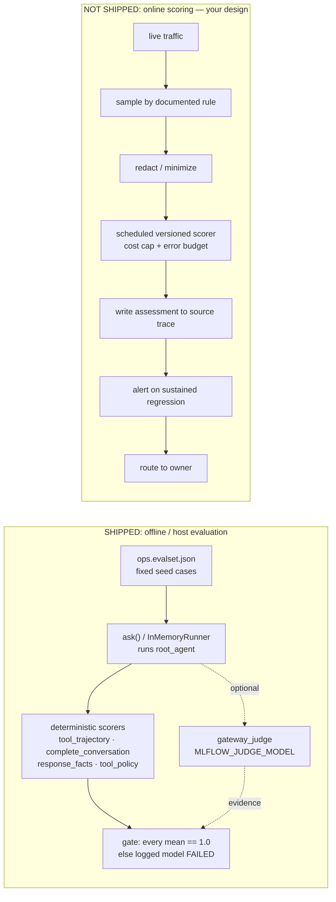

# 7.5. Online Evaluation

## How is online evaluation different from offline evaluation?

Offline evaluation runs a versioned dataset before release: fixed inputs, known-good expectations, a pass/fail gate. It answers "did this change regress the behaviors I already care about?" Online evaluation samples the traces produced by real traffic _after_ release and scores them asynchronously. It answers a different question the fixed set cannot: "are inputs and answers drifting away from what I anticipated?" The two are complementary, not interchangeable — a green offline gate says nothing about the queries users actually sent yesterday.

Online scoring also lives under harder constraints. It handles real user data rather than curated seed data, so consent, minimization, and retention apply. It runs on unbounded input, so it needs sampling and a cost cap. And it happens after the answer already shipped, so it can _detect_ a bad turn but never _block_ it — that is the guardrail's job at request time ([4.5. Guardrails](../4. Quality/4.5. Guardrails.md)), not the evaluator's after the fact.

## What evaluation does the course actually ship instead?

The course ships **offline, host-side** evaluation, and it is worth naming precisely so the boundary is unambiguous. `mise run eval:mlflow` runs [`mlflow_eval.py`](https://github.com/MLOps-Courses/agentops-open-course/blob/main/agents/python/evals/mlflow_eval.py): `ask()` drives an `InMemoryRunner(agent=root_agent, ...)` over the _fixed_ `ops.evalset.json` cases, in an isolated session with a disposable state directory, and scores each conversation with four deterministic scorers — `tool_trajectory`, `complete_conversation`, `response_facts`, `tool_policy` — plus an optional agentgateway-backed `gateway_judge` when `MLFLOW_JUDGE_MODEL` is set. The mechanics of those scorers belong to [4.4. Evaluations](../4. Quality/4.4. Evaluations.md#what-does-the-mlflow-evaluation-add), and the lineage they log belongs to [7.0. Reproducibility](./7.0. Reproducibility.md#what-is-deterministic-and-what-is-not); this page only cares about _where_ it runs.

It runs against committed cases the developer chose, not against live traffic. Nothing in that path samples a production trace, and the model call happens inside the eval process — not by re-reading a stored trace. That is the definition of offline evaluation. Online evaluation would keep the same scorers but feed them _sampled runtime traces_ instead of `ops.evalset.json`, and that substitution is exactly what the course does not implement.

## Does the course ship an automatic online evaluator?

No. It ships trace collection ([7.1. Tracing](./7.1. Tracing.md)), MLflow storage, the offline scorers above, and trace-linked human feedback ([7.4. Feedback](./7.4. Feedback.md)). It does not schedule any scorer over live traffic, so it makes no claim that drift detection is active. The `gateway_judge` machinery _could_ in principle be pointed at sampled traces — it already returns an MLflow `Feedback` with an `LLM_JUDGE` source — but nothing in the repository samples, redacts, schedules, budgets, or thresholds it against runtime data. Human feedback ([7.4](./7.4. Feedback.md#does-the-a2a-application-collect-feedback-automatically)) is the shipped human counterpart to that missing automated loop, and it stops at the same storage boundary.

This is a deliberate line, not an oversight. A safe online pipeline needs sampling, consent/retention, reviewer access control, judge budgets, deduplication, alert thresholds, and incident ownership — none of which are free, and each of which can leak data or burn money if bolted on carelessly.



## Why can't you re-score a stored runtime trace?

The obvious online design is "read yesterday's traces and run a correctness scorer over them." The shipped telemetry blocks it at the source. `setup_telemetry()` disables content capture by default:

```python
# Content capture is opt-in: traces retain timing, model, tool, token, and
# status metadata without duplicating user prompts or model responses.
os.environ.setdefault("ADK_CAPTURE_MESSAGE_CONTENT_IN_SPANS", "false")
os.environ.setdefault("OTEL_INSTRUMENTATION_GENAI_CAPTURE_MESSAGE_CONTENT", "false")
```

So a stored runtime trace carries the _trajectory_ — tool names, arguments, model, token counts, latency, status — but not the prompt or the response body. You cannot re-derive "was this answer correct and grounded?" from a trace that never stored the answer. This is the same limitation [7.4. Feedback](./7.4. Feedback.md#what-feedback-should-you-collect) raises for a late reviewer: only a reviewer who saw the live answer can score correctness; anyone reading the stored trace can score only tool selection and policy behavior.

That leaves two honest online paths, each with a cost stated plainly:

1. Enable content capture so answers land in the trace — which duplicates user prompts and model responses into the trace store, a privacy and retention cost you must accept explicitly and defend under the same discipline the log bridge already applies ([7.2. Monitoring](./7.2. Monitoring.md#where-do-my-agent-logs-go)).
1. Keep content capture off and score only what the trajectory reveals — tool choice, approval/policy behavior, retrieval hits — never answer correctness.

There is no third option where you get correctness for free from a metadata-only trace.

## How do you inspect a bounded trace sample?

Before designing any scorer, look at real traces. The shipped MLflow entrypoint names experiment id `0` as `agentops-agent` ([7.0. Reproducibility](./7.0. Reproducibility.md#how-do-a-trace-a-run-a-prompt-version-and-a-logged-model-link-together) explains the rename), so the runtime collector and named evaluation runs share this query target:

```bash
cd agents/python
MLFLOW_TRACKING_URI=http://localhost:5000 \
uv run mlflow traces search \
  --experiment-id 0 \
  --max-results 20 \
  --no-include-spans \
  --output table
```

Start with metadata-only results; fetch full spans only for authorized investigation, and use the filter/order options to select a time window, model/revision, or error state.

The pitfall is that experiment `0` holds **both** runtime traces and the traces `mise run eval:mlflow` generates. `_load_cases()` tags every eval row with its `eval_id`, and the whole evaluation runs under a run named `eval-prompt-vN` ([7.0](./7.0. Reproducibility.md#how-does-mlflow-link-prompt-and-model-evidence)). A naive "search experiment 0" therefore mixes real user turns with the fixed seed cases, and a drift estimate built on that mixture is measuring your own eval traffic. Any sampling query over live behavior must scope to real traffic — exclude the `eval-prompt-vN` run and the `eval_id`-tagged cases — before you draw a single conclusion.

## Which shipped signals approximate drift today?

You do not need a scorer to see the coarsest drift, because the stack already exports proxies short of one. Read these first:

1. `agentops_calls_total` broken down by the `span_metrics` connector's dimensions — `gen_ai.operation.name`, `gen_ai.request.model`, and `error.type` ([otel-collector.yaml](https://github.com/MLOps-Courses/agentops-open-course/blob/main/infra/observability/otel-collector.yaml)) — shows shifts in operation mix, a silent model swap, and rising error classes.
1. `agentops_guardrails_injections_neutralized_total` rising means the _input_ distribution is drifting toward adversarial content; the shipped `AgentInjectionNeutralizedSpike` alert already watches it.
1. `agentops_triage_report_schema_failures_total` rising means the _model's_ structured output is drifting after a swap or prompt change; `AgentTriageSchemaFailures` watches that.
1. The [7.2. Monitoring](./7.2. Monitoring.md#which-dashboard-is-shipped) dashboard panels — request rate, p95 latency, error ratio, gateway rate, guardrail rejection — are drift proxies read by deployment/model over time.
1. Human MLflow assessments ([7.4. Feedback](./7.4. Feedback.md)) are the only shipped _quality_ signal on real turns, and they are sparse and manual.

None of these is answer-correctness scoring. A guardrail spike or a schema-failure trend tells you _something_ moved; it does not tell you the answers got worse. Treat them as the free early-warning layer that a designed online scorer would sit above, not as a substitute for one.

## How do you detect drift without inventing a metric?

Detection is a comparison against a baseline, not a single moving line. Pick the signals from the section above, fix a baseline window and a minimum sample size, then compare distributions by deployment, model, and prompt version: tool-sequence mix, error ratio, latency, call count, retrieval no-match, guardrail rejection, and any human/scorer assessments. Two disciplines keep this honest:

1. A dashboard line moving is not automatically drift — sparse lab traffic is noisy, and a handful of turns can swing a ratio. Require statistical significance over a stated window before you act, the same way the multiwindow burn-rate alert in [7.2](./7.2. Monitoring.md#what-alerts-ship-with-the-course) refuses to page on one failure.
1. The absence of a metric is not evidence of stability. If you never scored correctness on live traffic, you have no correctness trend — say so, rather than reading calm latency as a calm agent.

Keep the same cardinality discipline the metrics layer enforces ([7.2](./7.2. Monitoring.md#why-avoid-session-or-prompt-labels)): compare over bounded model/operation/error dimensions, never by slicing on prompts, users, sessions, or trace ids.

## What would a production scoring job require?

If you build the online lane the diagram marks "not shipped," it is a gated pipeline, and every gate is there to stop a specific failure:

1. Select a representative, rate-limited sample with a documented inclusion rule — otherwise you score whatever is cheapest to fetch and call it the population.
1. Redact and minimize data before any external judge call, so a scored trace does not become a fresh copy of user content in a third party's logs.
1. Version the scorer and judge prompt/model and record its cost and error rate, so a scorer regression is distinguishable from an agent regression.
1. Write assessments back to the source trace without changing it — the same append-only assessment model human and judge feedback already use ([7.4](./7.4. Feedback.md#how-do-human-and-judge-assessments-share-one-store)).
1. Alert only on a sustained, statistically meaningful regression, not on one low score.
1. Route confirmed issues to a named owner and promote sanitized cases back into the offline set, so a real online failure becomes a permanent offline gate ([4.4](../4. Quality/4.4. Evaluations.md#how-can-an-evaluation-lie-to-you)).

Run every step outside the request path so judge latency or failure cannot break user traffic — the same reason the shipped judge lives in a batch eval command, never in `server.py`.

## What is the online-evaluation checkpoint?

Two parts, one executable and one on paper. First, inspect real telemetry: run the metadata-only `mlflow traces search` above against experiment `0` and confirm you can distinguish live turns from `eval_id`-tagged eval cases; then open the [7.2](./7.2. Monitoring.md#which-dashboard-is-shipped) dashboard and name which shipped signals would move first under input or model drift. Do not enable an automated live judge.

Second, write a design for one sampled scorer: the exact inclusion filter, the data fields it reads, the redaction applied, the scorer version and cost cap, the threshold and window, the owner, and the rollback action. State honestly whether it scores the trajectory or the answer — and if the answer, name the content-capture privacy cost it takes on. The design is the deliverable; do not switch on a live judge until privacy and budget approval exist.
