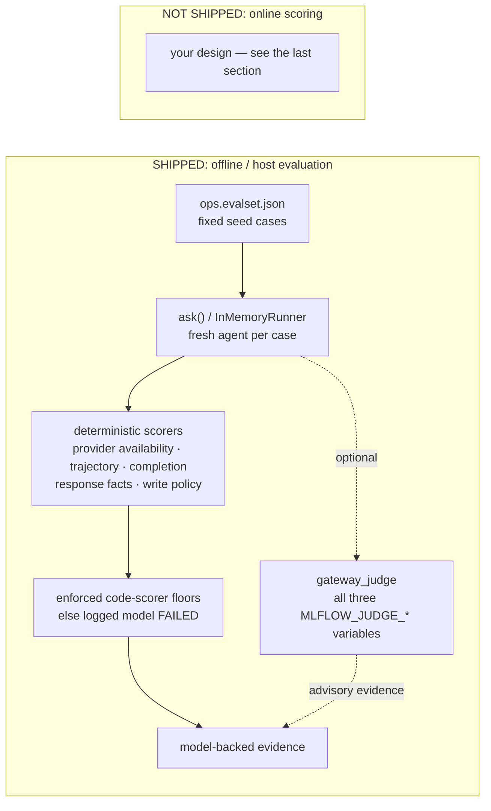

# 7.5. Online Evaluation

!!! abstract "In one glance"

    - **You will:** Query the traces you already collected, tell real turns from eval traffic, and write the design for a scorer you will deliberately not switch on.
    - **You need:** [7.1. Tracing](./7.1.%20Tracing.md) finished, with some real turns stored in the `agentops-agent` experiment.
    - **Time:** about 28 minutes, hands-on.

## How is online evaluation different from offline evaluation?

The shipped eval set holds fifteen cases, all written in advance. Real users send questions nobody wrote down. Offline evaluation checks the fifteen; online evaluation is about everything else.

This page ends with a design, not a running scorer. You will query your own traces, then write the specification for one sampled scorer and deliberately leave it switched off.

Offline evaluation runs a versioned dataset before release: fixed inputs, known-good expectations, a deterministic structure gate, and model-backed behavioral evidence. It answers "did this change regress the behaviors I already care about?"

Online evaluation samples the traces produced by real traffic _after_ release and scores them asynchronously. It answers a different question the fixed set cannot: "are inputs and answers drifting away from what I anticipated?" **Drift** is real traffic moving away from the behavior you built and tested for.

The two are complementary, not interchangeable — a green offline result says nothing about the queries users actually sent yesterday.

Online scoring also lives under harder constraints:

1. It handles real user data rather than curated seed data, so consent, minimization, and retention apply.
1. It runs on unbounded input, so it needs sampling and a cost cap.
1. It happens after the answer already shipped, so it can _detect_ a bad turn but never _block_ it.

Blocking is the guardrail's job at request time, not the evaluator's after the fact ([4.5. Guardrails](../4. Quality/4.5. Guardrails.md)).

## How do you inspect a bounded trace sample?

Before designing any scorer, look at real traces — the ones your own turns already left behind. The shipped MLflow entrypoint names experiment id `0` as `agentops-agent` ([7.0. Reproducibility](./7.0. Reproducibility.md#how-do-a-trace-a-run-a-prompt-version-and-a-logged-model-link-together) explains the rename), so the runtime collector and named evaluation runs share this query target:

```bash
cd agents/python
MLFLOW_TRACKING_URI=http://localhost:5000 \
uv run mlflow traces search \
  --experiment-id 0 \
  --max-results 20 \
  --no-include-spans \
  --output table
```

Start with metadata-only results; fetch full spans only for authorized investigation, and use the filter/order options to select a time window, model, or error state.

!!! warning "Your query also returns eval traffic"

    Experiment `0` holds **both** runtime traces and the traces `mise run eval:mlflow` generates — the offline evaluation the next section describes. `_load_cases()` tags every eval row with its `eval_id`, and the whole evaluation runs under a run named `eval-prompt-vN` ([7.0. Reproducibility](./7.0. Reproducibility.md#how-does-mlflow-link-prompt-and-model-evidence)).

    A naive "search experiment 0" therefore mixes real user turns with the fixed seed cases, and a drift estimate built on that mixture is measuring your own eval traffic. Any sampling query over live behavior must scope to real traffic — exclude the `eval-prompt-vN` run and the `eval_id`-tagged cases — before you draw a single conclusion.

## What evaluation does the course actually ship instead?

The course ships **offline, host-side** evaluation, and it is worth naming precisely so the boundary is unambiguous.

`mise run eval:mlflow` runs [`mlflow_eval.py`](https://github.com/MLOps-Courses/agentops-open-course/blob/main/agents/python/evals/mlflow_eval.py). For each _fixed_ `ops.evalset.json` case, `ask()` builds a fresh conversational agent and drives it through an `InMemoryRunner` in an isolated session and disposable state directory. It scores each conversation with five deterministic scorers — `provider_available`, `tool_trajectory`, `complete_conversation`, `response_facts`, `tool_policy` — plus an optional agentgateway-backed `gateway_judge` only when `MLFLOW_JUDGE_MODEL`, `MLFLOW_JUDGE_BASE_URL`, and `MLFLOW_JUDGE_API_KEY` are all set.

It runs against committed cases the developer chose, not against live traffic. Nothing in that path samples a production trace, and the model call happens inside the eval process — not by re-reading a stored trace. That is the definition of offline evaluation. Online evaluation would keep the same scorers but feed them _sampled runtime traces_ instead of `ops.evalset.json`, and that substitution is exactly what the course does not implement.

This page only cares about _where_ that runs. Owned by [4.7. Evaluation Reference](../4. Quality/4.7. Evaluation Reference.md#what-does-the-mlflow-evaluation-add) for the scorer mechanics and [7.0. Reproducibility](./7.0. Reproducibility.md#what-is-deterministic-and-what-is-not) for the lineage they log.

## Does the course ship an automatic online evaluator?

No. It ships trace collection ([7.1. Tracing](./7.1. Tracing.md)), MLflow storage, the offline scorers above, and trace-linked human feedback ([7.4. Feedback](./7.4. Feedback.md)). It does not schedule any scorer over live traffic, so it makes no claim that drift detection is active.

The `gateway_judge` machinery _could_ in principle be pointed at sampled traces: it already returns an MLflow `Feedback` with an `LLM_JUDGE` source. But nothing in the repository samples, redacts, schedules, budgets, or thresholds it against runtime data.

Human feedback is the shipped human counterpart to that missing automated loop, and it stops at the same storage boundary. Owned by [7.4. Feedback](./7.4. Feedback.md#does-the-a2a-application-collect-feedback-automatically).

This is a deliberate line, not an oversight.

??? note "Deeper: what a safe online pipeline would have to add"

    A safe online pipeline needs sampling, consent/retention, reviewer access control, judge budgets, deduplication, alert thresholds, and incident ownership — none of which are free, and each of which can leak data or burn money if bolted on carelessly.


```mermaid
flowchart LR
  subgraph shipped["SHIPPED: offline / host evaluation"]
    direction TB
    dataset["ops.evalset.json<br/>fixed seed cases"] --> ask["ask() / InMemoryRunner<br/>fresh agent per case"]
    ask --> det["deterministic scorers<br/>provider availability · trajectory · completion<br/>response facts · write policy"]
    ask -. optional .-> judge["gateway_judge<br/>all three MLFLOW_JUDGE_* variables"]
    det --> floors["enforced code-scorer floors<br/>else logged model FAILED"]
    floors --> evidence["model-backed evidence"]
    judge -. advisory evidence .-> evidence
  end
  subgraph online["NOT SHIPPED: online scoring"]
    direction TB
    design["your design — see the last section"]
  end
```

## Why can't you re-score a stored runtime trace?

The obvious online design is "read yesterday's traces and run a correctness scorer over them." The shipped telemetry blocks it at the source. `setup_telemetry()` disables content capture by default:

```python
# Content capture is opt-in: traces retain timing, model, tool, token, and
# status metadata without duplicating user prompts or model responses.
os.environ.setdefault("ADK_CAPTURE_MESSAGE_CONTENT_IN_SPANS", "false")
os.environ.setdefault("OTEL_INSTRUMENTATION_GENAI_CAPTURE_MESSAGE_CONTENT", "false")
```

So a stored runtime trace carries only **trajectory metadata**: tool names and order, model, token counts, latency, and status. ADK replaces request, response, and tool-argument bodies with `"{}"`, so the trace does not retain arguments, retrieved evidence, the prompt, or the response body.

You cannot re-derive "was this answer correct and grounded?" from a trace that never stored the answer or evidence. This is the same limitation [7.4. Feedback](./7.4. Feedback.md#what-feedback-should-you-collect) raises for a late reviewer: only a reviewer who saw the live answer can score correctness. A metadata-only trace supports coarse tool-order, timing, status, and model checks; write-policy evidence still belongs in the audit trail.

That leaves two honest online paths, each with a cost stated plainly:

1. Enable content capture so answers are retained. **Know which variable does what before you touch either.** They are not interchangeable, and the one whose name mentions spans is not the one that fills spans:

   | Variable                                             | Default | What a truthy value does                                                |
   | ---------------------------------------------------- | ------- | ----------------------------------------------------------------------- |
   | `ADK_CAPTURE_MESSAGE_CONTENT_IN_SPANS`               | `false` | Puts request/response bodies **in the trace spans** (MLflow)            |
   | `OTEL_INSTRUMENTATION_GENAI_CAPTURE_MESSAGE_CONTENT` | `false` | Emits bodies as **GenAI log events**, which the collector ships to Loki |

   So enabling only the OTel variable does not put answers in your traces — it copies prompts and responses into your **log** store, where the retention, access control, and redaction posture are different ones. Either way you are duplicating user prompts and model responses into a durable store: a privacy and retention cost to accept explicitly, and to defend under the same discipline the log bridge already applies ([7.2. Monitoring](./7.2. Monitoring.md#where-do-my-agent-logs-go)).
1. Keep content capture off and score only retained metadata — coarse tool choice/order, timing, status, and model — never arguments, retrieval evidence, approval correctness, or answer correctness.

There is no third option where you get correctness for free from a metadata-only trace.

## Which shipped signals approximate drift today?

You do not need a scorer to see the coarsest drift, because the stack already exports proxies short of one. Read these first:

1. `agentops_calls_total`, broken down by the `span_metrics` connector's dimensions `gen_ai.operation.name`, `gen_ai.request.model`, and `error.type` ([otel-collector.yaml](https://github.com/MLOps-Courses/agentops-open-course/blob/main/infra/observability/otel-collector.yaml)). Shifts there show a changed operation mix, a silent model swap, or rising error classes.
1. `agentops_guardrails_injections_neutralized_total` rising means the _input_ distribution is drifting toward adversarial content; the shipped `AgentInjectionNeutralizedSpike` alert already watches it.
1. `agentops_triage_report_schema_failures_total` rising means the _model's_ structured output is drifting after a swap or prompt change; `AgentTriageSchemaFailures` watches that.
1. The [7.2. Monitoring](./7.2. Monitoring.md#which-dashboard-is-shipped) dashboard panels — request rate, p95 latency, error ratio, gateway rate, guardrail rejection — are drift proxies read by deployment/model over time.
1. Human MLflow assessments ([7.4. Feedback](./7.4. Feedback.md)) are the only shipped _quality_ signal on real turns, and they are sparse and manual.

None of these is answer-correctness scoring. A guardrail spike or a schema-failure trend tells you _something_ moved; it does not tell you the answers got worse. Treat them as the free early-warning layer that a designed online scorer would sit above, not as a substitute for one.

## How do you detect drift without inventing a metric?

Detection is a comparison against a baseline, not a single moving line.

Pick the signals from the section above, fix a baseline window and a minimum sample size, then compare distributions by deployment and model. Compare prompt versions only when an external release record maps each window to its source commit and image digest, because production traces carry no prompt-version attribute. Useful dimensions include tool-name sequence mix, error ratio, latency, call count, guardrail rejection, and any human or scorer assessments.

Two disciplines keep this honest:

1. A dashboard line moving is not automatically drift. Sparse lab traffic is noisy, and a handful of turns can swing a ratio. Require **statistical significance** — a gap larger than the noise a small sample produces — over a stated window before you act. The multiwindow burn-rate alert in [7.2. Monitoring](./7.2. Monitoring.md#what-alerts-ship-with-the-course) refuses to page on one failure for the same reason.
1. The absence of a metric is not evidence of stability. If you never scored correctness on live traffic, you have no correctness trend — say so, rather than reading calm latency as a calm agent.

Keep the same cardinality discipline the metrics layer enforces ([7.2. Monitoring](./7.2. Monitoring.md#why-avoid-session-or-prompt-labels)): compare over bounded model/operation/error dimensions, never by slicing on prompts, users, sessions, or trace ids.

## What would a production scoring job require?

Six controls stand between "score some traces" and a job you can safely run. Each one stops a specific failure, and the list below is the raw material for the design you write in the checkpoint.

??? note "Deeper: the six controls, and what each one prevents"

    If you build the online lane the diagram marks "not shipped," each control is there to stop a specific failure:

    1. Select a representative, rate-limited sample with a documented inclusion rule — otherwise you score whatever is cheapest to fetch and call it the population.
    1. Redact and minimize data before any external judge call, so a scored trace does not become a fresh copy of user content in a third party's logs.
    1. Version the scorer and judge prompt/model and record its cost and error rate, so a scorer regression is distinguishable from an agent regression.
    1. Write assessments back to the source trace without changing it — the same append-only assessment model human and judge feedback already use ([7.4. Feedback](./7.4. Feedback.md#how-do-human-and-judge-assessments-share-one-store)).
    1. Alert only on a sustained, statistically meaningful regression, not on one low score.
    1. Route confirmed issues to a named owner and promote sanitized cases back into the offline set, so `eval:validate` gates their structure and model-backed runs preserve behavioral evidence ([4.7. Evaluation Reference](../4. Quality/4.7. Evaluation Reference.md#how-can-an-evaluation-lie-to-you)).

Run every step outside the request path so judge latency or failure cannot break user traffic — the same reason the shipped judge lives in a batch eval command, never in `server.py`.

## What proves this page worked?

Two parts, one executable and one on paper.

First, inspect real telemetry: run the metadata-only `mlflow traces search` above against experiment `0` and confirm you can distinguish live turns from `eval_id`-tagged eval cases; then open the [7.2. Monitoring](./7.2. Monitoring.md#which-dashboard-is-shipped) dashboard and name which shipped signals would move first under input or model drift. Do not enable an automated live judge.

Second, write a design for one sampled scorer. Your design is done when you can fill in every line:

1. The exact inclusion filter: which traces get scored, and which do not.
1. The data fields it reads.
1. The redaction applied.
1. The scorer version and cost cap.
1. The threshold, and the window it is measured over.
1. The owner.
1. The rollback action.

State honestly whether it scores retained metadata or captured content — and if it needs the answer, name the content-capture privacy cost it takes on. The design is the deliverable; do not switch on a live judge until privacy and budget approval exist.

**You are done when:**

- `mlflow traces search` returned rows from experiment `0` on your machine.
- You can point at a returned row and say whether it is a live turn or an `eval_id`-tagged eval case.
- You can name which shipped signal would move first under input drift, and which under model drift.
- Every line of the design checklist above is filled in, including the owner and the rollback action.
- No automated live judge is running against your traces.

Continue to [7.6. Governance](./7.6.%20Governance.md) when your scorer design is written down and still switched off.
