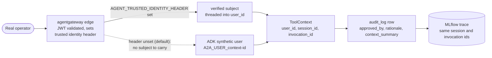

# 7.6. Governance

## What does governance mean for this agent?

Governance is the ability to answer, after the fact and to someone who was not in the room, who could do what under which policy, using which model, prompt, and data, which runtime identity confirmed a state change, what changed, and how long the evidence survives to be inspected. For a deterministic service a commit hash and an access log almost cover it. An agent adds three problems a CRUD app does not have: the actor proposing the change is a sampling model, the target of the change is decided at runtime from data the model read, and the evidence is scattered across a trace store, a metrics store, a log store, and an application database that have different owners and different lifetimes.

This repository implements governance as identities, code, transactions, storage, traces, and review — not a policy paragraph. This page walks that chain end to end for the one thing the agent can actually change, a guarded mock action, and is deliberately honest about where the chain breaks.

## Who authorized this change, and can you prove it?

An audit row is only as strong as the identity in its `approved_by` column. The hard part of agent governance is carrying a _verified human_ identity from the network edge all the way to the row that records a mutation. The course ships the whole chain and one intentional break in it:



On the default course path the A2A listener is unauthenticated ([4.6. Security](../4.%20Quality/4.6.%20Security.md)), so there is no real subject to carry: ADK derives a synthetic per-conversation user `A2A_USER_<context-id>`, and that value lands in `approved_by`. It links the pause, the resume, the mutation, the session, the invocation, and the MLflow trace into one correlatable thread — but it does not name a person. The [5.3. A2A Gateway](../5.%20Gateway/5.3.%20A2A%20Gateway.md) integration test asserts exactly this default shape (`approved_by == f"A2A_USER_{context_id}"`).

Closing that gap is opt-in and lives at the server boundary. When a trusted gateway validates a JWT and sets a caller-identity header, `AGENT_TRUSTED_IDENTITY_HEADER` names it; a small ASGI middleware in [`server.py`](https://github.com/MLOps-Courses/agentops-open-course/blob/main/agents/python/src/agent/server.py) binds that verified subject for the request, and the A2A request converter makes it the session `user_id` — so the same `approved_by` column now names the real operator ([5.5. Gateway Security](../5.%20Gateway/5.5.%20Gateway%20Security.md#how-does-the-gateway-verified-identity-reach-the-audit-row) shows the header contract). The trust boundary is explicit and one-directional: the value is honored **only** when the variable is set, which an operator does only behind a gateway that validates the JWT and overwrites any client-supplied copy of the header — a raw client could otherwise forge it. Unset, the synthetic id stands and the audit thread is still correlatable, just not attributable to a person.

## What does an audit row contain?

```sql
--8<-- "agents/data/sql/schema.sql:audit-schema"
```

Every guarded action writes exactly one row inside the same transaction that performs the mutation — why that atomicity is non-negotiable is [4.5. Guardrails](../4.%20Quality/4.5.%20Guardrails.md#why-are-mutation-and-audit-one-transaction)'s lane. The row is not free-form. `_validated_approval` in `actions.py` requires a confirmed approval carrying `user_id`, session id, invocation id, and a non-empty rationale; it trims the rationale and rejects it before any write once it exceeds `MAX_AUDIT_RATIONALE_LENGTH` (500 characters). It then runs `redact_persisted_text` over the rationale _before_ persistence, so concrete PII and obvious credential/token patterns are scrubbed on the way into SQLite while domain identifiers such as `INC-002` survive — the persisted-text policy deliberately excludes Presidio's broad `ORGANIZATION` recognizer so incident and service ids stay legible in evidence. A rejected rationale produces neither a mutation nor a row.

The `context_summary` column is the one field a caller cannot supply. It is reconstructed server-side at execution while the write lock is held (`_restart_context` and `_resolution_context` in `data.py`), so the recorded "why now" is the agent's actual view of state — the service status and open incidents at the moment of the change — not a claim the caller typed. One honesty note carried from [7.4. Feedback](7.4.%20Feedback.md#where-does-an-assessment-live-and-for-how-long): `redact_persisted_text` guards this `rationale`, but the parallel free-text field a human types into an MLflow assessment is _not_ redacted. Keep reviewer notes about behavior and off the record for specifics.

## Is the audit log immutable?

No — append-only, not immutable, and the difference is the whole point. The schema installs two triggers immediately after the table:

```sql
CREATE TRIGGER audit_log_no_update
BEFORE UPDATE ON audit_log
BEGIN
    SELECT RAISE(ABORT, 'audit_log is append-only');
END;

CREATE TRIGGER audit_log_no_delete
BEFORE DELETE ON audit_log
BEGIN
    SELECT RAISE(ABORT, 'audit_log is append-only');
END;
```

These abort any `UPDATE` or `DELETE` against existing rows, so `INSERT` is the only write the application can make through the schema. That is genuinely useful: a compromised agent process or a buggy tool cannot quietly rewrite what it already recorded. It is not tamper-proof. Anyone who reaches the database file rather than the schema — replace the file, `DROP TRIGGER`, or re-create the table on a fresh connection — can still rewrite the log, and nothing in the course records that they did. The next two sections make that boundary concrete: how long the evidence lives, and who can still touch it.

## How do you inspect action evidence in Kubernetes?

```bash
kubectl -n agentops exec deploy/agentops-agent -- \
  python -c 'import sqlite3; db=sqlite3.connect("/app/state/incidents.db"); print(db.execute("SELECT ts, actor, approved_by, action, target FROM audit_log ORDER BY id DESC LIMIT 10").fetchall())'
```

Compare the returned session and invocation identifiers with the corresponding MLflow trace: this is the right-hand join in the authority diagram above, made concrete. Treat the synthetic `A2A_USER_<context-id>` as correlation evidence, not authenticated identity. Do not expose audit rows through an unrestricted agent tool — a read tool the model can call turns the append-only log into model-reachable data.

## How long does each kind of evidence survive?

The evidence behind one action does not have a single lifetime. It has several, each set independently by whichever store holds that pillar, and they do not agree. That mismatch is a governance fact you must state before promising "we can reconstruct any action for N days":

| Evidence             | Store                             | Lifetime                           |
| -------------------- | --------------------------------- | ---------------------------------- |
| Metrics              | Prometheus TSDB                   | 2 days k8s overlay / 7 days host   |
| Logs                 | Loki                              | 7 days (explicit retention)        |
| Traces + assessments | MLflow SQLite backend on a PVC    | life of the volume/PVC — no GC job |
| Audit rows           | agent-state SQLite on the RWO PVC | life of the PVC                    |
| State snapshot       | second backup PVC                 | newest 7 daily snapshots           |

Prometheus metrics age out at 2 days in the Kubernetes overlay (7 days on the host Compose profile) and Loki logs at 7 days by explicit configuration, so the metrics and log lines that gave an action its context are gone within a week — that retention is [7.2. Monitoring](7.2.%20Monitoring.md)'s lane. MLflow ships no retention or garbage-collection job, so its traces and its human and judge assessments persist for the life of the volume (the `mlflow-data` volume on the host, the 5 Gi PVC in Kubernetes, GCS artifacts on GKE) — [7.4. Feedback](7.4.%20Feedback.md#where-does-an-assessment-live-and-for-how-long)'s lane. The audit rows live for the life of the `agentops-agent-state` RWO PVC; the agent, MCP, and later reads all share that one claim, so sessions, A2A tasks, actions, and reads stay coherent across pod replacement.

The only copy off that single PVC is the nightly snapshot. The `agentops-state-backup` CronJob runs `schedule: "30 3 * * *"` (daily 03:30 UTC), mounts the state PVC read-only, uses the stdlib `sqlite3` backup API for a consistent page-by-page copy while the agent keeps writing, verifies each file with `PRAGMA integrity_check`, and keeps the newest seven completed snapshots on a second PVC. Its own manifest comment is honest about scope: a backup PVC in the same single-node cluster is crash and mistake recovery, not disaster recovery, and `skaffold delete` removes both PVCs together. The course does ship a restore path — `restore-state.sh` reverses one snapshot into a state directory after you stop every writer, and `backup-drill.sh` proves offline that a snapshot restores before you need it — but no cluster-level disaster-recovery runbook. So one action's evidence has heterogeneous lifetimes — 2 days of metrics, 7 days of logs, PVC-lifetime traces and audit rows, seven daily state snapshots — and losing the cluster or both PVCs loses all of it at once.

## How do you answer a data-subject access or erasure request?

Retention says how long evidence _lives_; a privacy regime such as GDPR asks a harder question: when a person asks what you hold about them, or asks you to delete it, what can you actually do? The honest answer is that the agent's stores split cleanly into two categories, and the split is the whole point.

Most personal data the agent holds is **erasable**. Long-term memory is keyed by user, so a subject-access request is a filtered read of `incident_notes`, and an erasure request is a delete — the operator command `forget_user_memory` ships exactly for this:

--8<-- "agents/python/src/agent/longterm.py:forget"

```bash
cd agents/python
uv run python -m agent.longterm "alice@example.com"   # erase one user's long-term notes
```

Session history and traces are similarly scoped by the session/user identifier, and content capture is off by default ([7.5. Online Evaluation](7.5.%20Online%20Evaluation.md#why-cant-you-re-score-a-stored-runtime-trace)), so a trace holds trajectory metadata rather than the person's words in the first place. The one store that is deliberately **not** erasable is the audit log: it is append-only ([above](#is-the-audit-log-immutable)), and that is a feature, not an oversight. This is the tension every regulated audit trail faces — the right to erasure versus the duty to retain a record of who authorized a state change. The course resolves it the way regulators expect: the audit row is minimized (approver identity, rationale, decision context — not free personal data), and it is retained under a _different legal basis_ (a legitimate-interest / legal-obligation record of change) than the memory notes a user contributed. You erase the personal data; you keep the accountability record. What makes that defensible is that the two were separated by design — memory is deletable per user, the audit trail is not, and no personal narrative was ever meant to land in the audit row.

| Store            | Contains                         | On a DSAR access request   | On an erasure request                        |
| ---------------- | -------------------------------- | -------------------------- | -------------------------------------------- |
| Long-term memory | user-authored incident notes     | filtered read by `user_id` | `forget_user_memory(user_id)`                |
| Session / traces | trajectory metadata (no content) | export by session/user id  | drop the session; traces age with the volume |
| Audit log        | approver, rationale, context     | provide the change record  | **retained** under a separate legal basis    |

Two honest limits: the operator, not the agent, runs erasure (the model can save and recall memory but was never given the capability to delete it), and this is engineering guidance for building the mechanism, not legal advice on when you must invoke it — that judgement belongs to your data-protection owner.

## Who can still alter the evidence, and what stops them?

A control is governance evidence only when you can name its owner and its bypass. Here is the honest ledger for the audit trail.

Defends it today:

- Append-only triggers reject `UPDATE` and `DELETE` at the schema, as shown above.
- The mutation and its audit row commit in one `BEGIN IMMEDIATE` transaction in `data.py`, so there is no window with a state change and no record — the atomicity [4.5. Guardrails](../4.%20Quality/4.5.%20Guardrails.md#why-are-mutation-and-audit-one-transaction) owns.
- Every workload ServiceAccount sets `automountServiceAccountToken: false` (including the backup job), so a compromised pod holds no Kubernetes API token to reach the PVC, secrets, or other workloads through the API server.
- MCP and the backup job mount the state PVC `readOnly: true`; only the agent mounts it read-write, so the write surface is exactly one workload.
- Content capture stays off, redaction runs before persistence, and `readOnlyRootFilesystem` with dropped capabilities hardens each pod.

Does not defend it:

- No WORM or external append-only store — a storage or database administrator who reaches the file rather than the schema can replace or re-create it.
- No integrity hashing or signing of rows, so a rewrite leaves no detectable gap.
- No independent access log — nothing records who read or replaced the SQLite file.
- The backup is single-cluster crash recovery restored by `restore-state.sh`, not tamper-evident or off-cluster archival.

Production evidence needs restricted database administration, external append-only/WORM storage where required, row integrity verification (hash chaining or signing), independent access logging, and a tested restore path. Name which of these you have before you call the log "audit-grade".

## How is cloud authority separated?

The same principle — one workload identity per external authority, no long-lived JSON key — governs the cloud side on GKE:

- Workloads that do not call the Kubernetes API (agent, MCP server, agentgateway, MLflow, and the backup job) do not automount API tokens; GKE Workload Identity Federation uses the metadata server instead.
- The agentgateway WIF identity can consume Vertex and service usage.
- The MLflow WIF identity can write objects only in its artifact bucket.
- Node identity reads Artifact Registry and performs GKE node duties.

A blast radius stays scoped to one workload because no workload shares a credential with another.

## What evidence belongs in a release decision?

A release decision is itself a governance act: someone accepts residual risk on the record. The full reproducibility tuple — code, dependencies, image, model path, prompt, data, tool contract, runtime, evaluation — is [7.0. Reproducibility](7.0.%20Reproducibility.md)'s lane, and its one-pass commands capture it; do not re-list it here. This page's addition is the authority-and-retention layer on top of that tuple:

- Who approved the release and which residual risks they accepted, recorded rather than implied.
- The audit-and-trace correlation for any guarded action taken during validation — session and invocation ids agree across the row and the MLflow trace.
- The retention and backup state of that evidence: which pillars age out in 7 days, which persist for PVC life, and when the last snapshot ran, so an approver knows how long the decision stays reconstructible.
- The rollback and teardown path, including that `skaffold delete` removes both PVCs and that `restore-state.sh` restores a snapshot once every writer is stopped, with no cluster-level disaster-recovery runbook.

## What is the governance checkpoint?

Approve one mock action, then verify that the action result, the audit row, and the MLflow trace agree on the same session and invocation ids. Attempt to rewrite an existing row and confirm the trigger aborts it — an identity-only update needs no string literal and still fires `BEFORE UPDATE`:

```bash
kubectl -n agentops exec deploy/agentops-agent -- \
  python -c 'import sqlite3; db=sqlite3.connect("/app/state/incidents.db"); db.execute("UPDATE audit_log SET id = id WHERE id = 1")'
```

That raises `audit_log is append-only` instead of succeeding. Finally, document who can still alter the SQLite file or the PVC, and how long each pillar of the evidence survives — the enumerations two sections above are the answer to write down. A control is governance evidence only when its bypass, its owner, and its retention are all understood.
