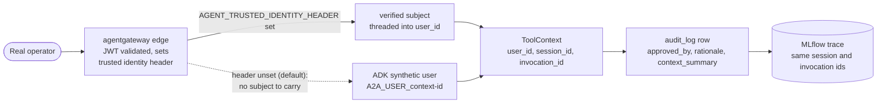

# 7.6. Governance

!!! abstract "In one glance"

    - **You will:** Follow one approved write from the caller to its audit row and its trace, then try to rewrite that row and watch the database refuse.
    - **You need:** The local k3d platform from Chapter 6 running with the agent deployed.
    - **Time:** about 40 minutes, hands-on.

## What does governance mean for this agent?

Six months from now, someone asks: who approved restarting the checkout service, and why? Governance is being able to answer that, with a record rather than a memory.

Answering it after the fact, to someone who was not in the room, means holding four things:

- who could do what, under which policy;
- which model, prompt, and data were used;
- which runtime identity confirmed a state change, and what changed;
- how long the evidence survives to be inspected.

For a deterministic service a commit hash and an access log almost cover it. An agent adds three problems a CRUD app does not have:

1. The actor proposing the change is a sampling model.
1. The target of the change is decided at runtime from data the model read.
1. The evidence is scattered across a trace store, a metrics store, a log store, and an application database that have different owners and different lifetimes.

This repository implements governance as identities, code, transactions, storage, traces, and review — not a policy paragraph. This page walks that chain end to end for the one thing the agent can actually change: a **guarded action**, a mock write that runs only after a human approves it. It is deliberately honest about where the chain breaks.

## Who authorized this change, and can you prove it?

An audit row is only as strong as the identity in its `approved_by` column. The hard part of agent governance is carrying a _verified human_ identity from the network edge all the way to the row that records a mutation. The course ships the whole chain and one intentional break in it:


```mermaid
flowchart LR
    Person([Real operator]) --> Edge["agentgateway edge<br/>JWT validated, sets<br/>trusted identity header"]
    Edge -->|"AGENT_TRUSTED_IDENTITY_HEADER set"| Verified["verified subject<br/>threaded into user_id"]
    Edge -. "header unset (default):<br/>no subject to carry" .-> Synth["ADK synthetic user<br/>A2A_USER_context-id"]
    Verified --> Ctx
    Synth --> Ctx["ToolContext<br/>user_id, session_id, invocation_id"]
    Ctx --> Row["audit_log row<br/>approved_by, rationale, context_summary"]
    Row --> Trace[("MLflow trace<br/>same session and invocation ids")]
```

On the default course path the A2A listener is unauthenticated ([4.6. Security](../4.%20Quality/4.6.%20Security.md)), so there is no real subject to carry. ADK derives a synthetic per-conversation user `A2A_USER_<context-id>`, and that value lands in `approved_by`.

That synthetic id still links the pause, the resume, the mutation, the session, the invocation, and the MLflow trace into one correlatable thread. What it does not do is name a person. The [5.3. A2A Gateway](../5.%20Gateway/5.3.%20A2A%20Gateway.md) integration test asserts exactly this default shape (`approved_by == f"A2A_USER_{context_id}"`).

Closing that gap is opt-in and lives at the server boundary. A trusted gateway validates the caller's **JWT** — a signed token proving who the caller is — and sets a caller-identity header. `AGENT_TRUSTED_IDENTITY_HEADER` names that header. A small ASGI middleware in [`server.py`](https://github.com/MLOps-Courses/agentops-open-course/blob/main/agents/python/src/agent/server.py) binds the verified subject for the request, and the A2A request converter makes it the session `user_id`, so the same `approved_by` column now names the real operator.

The trust boundary is explicit and one-directional:

- The value is honored **only** when the variable is set.
- An operator sets it only behind a gateway that validates the JWT and overwrites any client-supplied copy of the header, because a raw client could otherwise forge it.
- Unset, the synthetic id stands: the audit thread is still correlatable, just not attributable to a person.

Owned by [5.5. Gateway Security](../5.%20Gateway/5.5.%20Gateway%20Security.md#how-does-the-gateway-verified-identity-reach-the-audit-row), which shows the header contract.

Prove the approval and transaction boundary offline before inspecting a runtime row:

```bash
cd agents/python
uv run pytest tests/test_actions.py -q
```

## How do you inspect action evidence?

Read the rows the agent wrote. One has to exist first: approve a guarded action through the confirmation flow of [3.1. Tools](../3.%20Capabilities/3.1.%20Tools.md#how-does-human-confirmation-work) before you run either command below.

On the Kubernetes path this needs the local platform from [6.2. Platform Install](../6.%20Platform/6.2.%20Platform%20Install.md), with the agent deployed as in [6.6. Platform Delivery](../6.%20Platform/6.6.%20Platform%20Delivery.md). Read the table inside the pod:

```bash
kubectl -n agentops exec deploy/agentops-agent -- \
  python -c 'import sqlite3; db=sqlite3.connect("/app/state/incidents.db"); print(db.execute("SELECT ts, actor, approved_by, action, target FROM audit_log ORDER BY id DESC LIMIT 10").fetchall())'
```

If you are still on the host path used earlier in this chapter, the same table sits in the agent's own state directory:

```bash
cd agents/python
uv run python -c 'import sqlite3; db=sqlite3.connect(".state/incidents.db"); print(db.execute("SELECT ts, actor, approved_by, action, target FROM audit_log ORDER BY id DESC LIMIT 10").fetchall())'
```

Both print the ten most recent rows, newest first.

!!! warning "An empty list is not a broken log"

    Both commands print `[]` until a guarded action has been approved and executed. The committed seed carries no audit rows, so an empty list is the starting state rather than a failure.

Add `session_id, invocation_id` to the `SELECT` list and compare those values with the corresponding MLflow trace: this is the right-hand join in the authority diagram above, made concrete. Treat the synthetic `A2A_USER_<context-id>` as correlation evidence, not authenticated identity. Do not expose audit rows through an unrestricted agent tool — a read tool the model can call turns the append-only log into model-reachable data.

## What does an audit row contain?

Twelve columns, eleven of them `NOT NULL`, so a row cannot be half-recorded. Here is the schema, then one row filled in.

```sql
--8<-- "agents/data/sql/schema.sql:audit-schema"
```

Approving `restart_service` on `inventory` records this (identifiers shortened for reading):

| Column            | Value in one recorded row                                         |
| ----------------- | ----------------------------------------------------------------- |
| `id`              | `1`                                                               |
| `schema_version`  | `1`                                                               |
| `ts`              | `2026-07-27T21:17:50Z`                                            |
| `actor`           | `agentops-agent`                                                  |
| `approved_by`     | `A2A_USER_ctx-1`                                                  |
| `rationale`       | `Inventory is down and INC-002 matches the service-down runbook.` |
| `context_summary` | `service inventory was down; open incidents: INC-002`             |
| `session_id`      | `ctx-1`                                                           |
| `invocation_id`   | `e-1a2b3c`                                                        |
| `action`          | `restart_service`                                                 |
| `target`          | `inventory`                                                       |
| `detail`          | `service restarted and marked operational (mock)`                 |

Three of those columns are what make the row evidence rather than a log line: `approved_by` (who), `rationale` (why), and `context_summary` (what the agent saw at that moment).

`schema_version` makes the append-only row self-describing. The writer stamps `CURRENT_AUDIT_SCHEMA_VERSION`; the database also defaults the column to `1`, so every current row declares the contract a future reader must use.

Every guarded action writes exactly one row inside the same transaction that performs the mutation. The `(invocation_id, action, target)` tuple is also a unique idempotency key: replaying one approved write returns its original row without mutating state again. Why that atomicity is non-negotiable is [3.1. Tools](../3.%20Capabilities/3.1.%20Tools.md#why-are-mutation-and-audit-one-transaction)'s lane.

The row is not free-form. `_validated_approval` in `actions.py` requires three things before any write:

1. A confirmed approval carrying `user_id`, session id, invocation id, and a non-empty rationale.
1. A rationale that, once trimmed, stays within `MAX_AUDIT_RATIONALE_LENGTH` (500 characters); a longer one is rejected before any write.
1. A pass of `redact_persisted_text` over the rationale _before_ persistence.

That last pass scrubs concrete PII (personally identifiable information) and obvious credential/token patterns on the way into SQLite, while domain identifiers such as `INC-002` survive. The persisted-text policy deliberately excludes Presidio's broad `ORGANIZATION` recognizer so incident and service ids stay legible in evidence. A rejected rationale produces neither a mutation nor a row.

The `context_summary` column is the one field a caller cannot supply. It is reconstructed server-side at execution while the write lock is held (`_restart_context` and `_resolution_context` in `data.py`). So the recorded "why now" is the agent's actual view of state — the service status and open incidents at the moment of the change — not a claim the caller typed.

One honesty note carried from [7.4. Feedback](7.4.%20Feedback.md#where-does-an-assessment-live-and-for-how-long): `redact_persisted_text` guards this `rationale`, but the parallel free-text field a human types into an MLflow assessment is _not_ redacted. Keep reviewer notes about behavior and off the record for specifics.

## Is the audit log immutable?

No — append-only, not immutable, and the difference is the whole point. The schema installs two triggers immediately after the table:

```sql
CREATE TRIGGER audit_log_no_update
BEFORE UPDATE ON audit_log
BEGIN
    SELECT RAISE(ABORT, 'audit_log is append-only');
END;

CREATE TRIGGER audit_log_no_delete
BEFORE DELETE ON audit_log
BEGIN
    SELECT RAISE(ABORT, 'audit_log is append-only');
END;
```

These abort any `UPDATE` or `DELETE` against existing rows, so `INSERT` is the only write the application can make through the schema. That is genuinely useful: a compromised agent process or a buggy tool cannot quietly rewrite what it already recorded.

It is not tamper-proof. Anyone who reaches the database file rather than the schema — replace the file, `DROP TRIGGER`, or re-create the table on a fresh connection — can still rewrite the log, and nothing in the course records that they did. Two later sections make that boundary concrete: how long the evidence lives, and who can still touch it.

## How long does each kind of evidence survive?

The evidence behind one action does not have a single lifetime. It has several, each set independently by whichever store holds that pillar, and they do not agree. That mismatch is a governance fact you must state before promising "we can reconstruct any action for N days":

| Evidence             | Store                             | Lifetime                           |
| -------------------- | --------------------------------- | ---------------------------------- |
| Metrics              | Prometheus TSDB                   | 2 days k8s overlay / 7 days host   |
| Logs                 | Loki                              | 7 days (explicit retention)        |
| Traces + assessments | MLflow SQLite backend on a PVC    | life of the volume/PVC — no GC job |
| Runtime sessions     | `runtime.db` on the RWO PVC       | life of the PVC                    |
| Audit rows           | agent-state SQLite on the RWO PVC | life of the PVC                    |
| State snapshot       | second backup PVC                 | newest 7 daily snapshots           |

Four rows lean on Kubernetes storage words. A **PVC** (PersistentVolumeClaim) is a disk the cluster keeps and re-attaches to a pod; **RWO** (ReadWriteOnce) means one node mounts it read-write at a time.

Those lifetimes are set in different places:

1. Prometheus metrics age out at 2 days in the Kubernetes overlay (7 days on the host Compose profile) and Loki logs at 7 days by explicit configuration, so the metrics and log lines that gave an action its context are gone within a week — that retention is [7.2. Monitoring](7.2.%20Monitoring.md)'s lane.
1. MLflow ships no retention or garbage-collection job, so its traces and its human and judge assessments persist for the life of the volume (the `mlflow-data` volume on the host, the 5 Gi PVC in Kubernetes, GCS artifacts on GKE) — [7.4. Feedback](7.4.%20Feedback.md#where-does-an-assessment-live-and-for-how-long)'s lane.
1. Runtime sessions, A2A tasks, and audit rows live for the life of the `agentops-agent-state` RWO PVC. The agent and MCP share that claim, so state stays coherent across pod replacement.

One nightly snapshot is the only copy that ever leaves that state PVC, and it is crash and mistake recovery rather than disaster recovery.

??? note "Deeper: how the nightly snapshot is taken, and what restores it"

    The only copy off that single PVC is the nightly snapshot. The `agentops-state-backup` CronJob runs `schedule: "30 3 * * *"` (daily 03:30 UTC), mounts the state PVC read-only, uses the stdlib `sqlite3` backup API for a consistent page-by-page copy while the agent keeps writing, verifies each file with `PRAGMA integrity_check`, and keeps the newest seven completed snapshots on a second PVC. Its own manifest comment is honest about scope: a backup PVC in the same single-node cluster is crash and mistake recovery, not disaster recovery, and `skaffold delete` removes both PVCs together. The course does ship a restore path — `restore-state.sh` reverses one snapshot into a state directory after you stop every writer, and `backup-drill.sh` proves offline that a snapshot restores before you need it — but no cluster-level disaster-recovery runbook.

So one action's evidence has heterogeneous lifetimes — 2 days of metrics, 7 days of logs, PVC-lifetime traces, sessions, tasks, and audit rows, plus seven daily state snapshots. Losing the cluster or both PVCs loses all of it at once.

## How do you answer a data-subject access or erasure request?

Someone emails and asks what personal data you hold about them, or asks you to delete it. What can you actually do?

Privacy laws can grant access and erasure rights, but their scope and exceptions depend on the jurisdiction, controller, purpose, and facts. A **DSAR** is a data-subject access request. Retention says how long evidence _lives_; this question asks what an operator can find and remove.

Start with the real data inventory. The only shipped per-user erasure command is `forget_user_memory`, which deletes long-term `incident_notes` keyed by `user_id`:

```bash
cd agents/python
uv run python -m agent.longterm "alice@example.com"   # erase one user's long-term notes
```

Do not infer runtime storage from telemetry policy. The two content-capture flags keep message bodies out of exported OpenTelemetry and MLflow spans by default ([7.5. Online Evaluation](7.5.%20Online%20Evaluation.md#why-cant-you-re-score-a-stored-runtime-trace)). They do not change what ADK or the A2A server writes to `runtime.db`.

ADK stores complete event JSON in `events.event_data`. It can include user messages, model responses, tool calls, tool responses, and state changes. The A2A task store writes `status`, `artifacts`, and `history` as JSON, so request and response content can appear there too. The `sessions` table also holds the user id and persistent session state.

The repository does not ship a subject-wide runtime erasure workflow. The pinned SDKs expose low-level `delete_session(...)` and task-store `delete(...)` methods. The server exposes no protected operator command that maps a subject to every session and task, removes both, and verifies the result. Until that workflow exists, session and task erasure is an operator gap.

The audit log has no erasure path either: its triggers reject application `DELETE` operations ([above](#is-the-audit-log-immutable)). That technical choice does not decide whether retaining a row is lawful. The controller must decide how access, retention, exceptions, and erasure apply under its jurisdiction and purpose.

??? note "Deeper: what engineering cannot decide about retention"

    A _legal basis_ is the lawful reason a regulation permits processing personal data. Engineering can minimize fields, separate stores, and expose deletion mechanisms. It cannot choose a legal basis, decide whether an exception applies, or set a lawful retention period. The controller should document those decisions with its data-protection owner or counsel before production.

| Store            | What can persist                                                                 | Current access path                | Shipped erasure path                        |
| ---------------- | -------------------------------------------------------------------------------- | ---------------------------------- | ------------------------------------------- |
| Long-term memory | user-authored incident notes                                                     | filter `incident_notes` by user id | `forget_user_memory(user_id)`               |
| `runtime.db`     | user/session state; ADK events; A2A task status, artifacts, and history          | manual identifier-based inspection | none — coordinated session/task erasure gap |
| MLflow           | trajectory metadata and assessment text; message content when capture is enabled | manual trace lookup                | none — no subject erasure or GC workflow    |
| Audit log        | approver, rationale, and decision context                                        | manual row lookup                  | none — schema rejects application deletion  |

Three honest limits:

- The operator, not the agent, runs the only shipped erasure command. The model cannot delete long-term memory itself.
- SDK deletion primitives are not a subject-wide operator procedure. The repository still needs identity mapping, authorization, orchestration, and verification before it can claim runtime erasure.
- This is an engineering inventory, not legal advice. The controller decides what rights apply and whether any record may or must be retained.

## Who can still alter the evidence, and what stops them?

The schema stops the application from rewriting history. It does not stop anyone who can reach the database file.

A control is governance evidence only when you can name its owner and its bypass. Here is the honest ledger for the audit trail.

Defends it today:

- Append-only triggers reject `UPDATE` and `DELETE` at the schema, as shown above.
- The mutation and its audit row commit in one `BEGIN IMMEDIATE` transaction in `data.py`, so there is no window with a state change and no record — the atomicity [3.1. Tools](../3.%20Capabilities/3.1.%20Tools.md#why-are-mutation-and-audit-one-transaction) owns.
- Every workload ServiceAccount sets `automountServiceAccountToken: false` (including the backup job), so a compromised pod holds no Kubernetes API token to reach the PVC, secrets, or other workloads through the API server.
- MCP and the backup job mount the state PVC `readOnly: true`; only the agent mounts it read-write, so the write surface is exactly one workload. Agent startup creates `/app/state/.state-restore.lock`; backup, restore, and crash recovery all take `flock(2)` on that one PVC inode. A backup fails closed if startup has not initialized the lock.
- Telemetry content capture stays off, model and tool callbacks redact their controlled paths, and `readOnlyRootFilesystem` with dropped capabilities hardens each pod.

Does not defend it:

- No **WORM** store (write once, read many: storage that refuses overwrites) and no external append-only store, so a storage or database administrator who reaches the file rather than the schema can replace or re-create it.
- No integrity hashing or signing of rows, so a rewrite leaves no detectable gap.
- No independent access log — nothing records who read or replaced the SQLite file.
- Runtime session ingestion happens before model-request redaction. The content-capture flags do not stop `runtime.db` from storing raw messages and A2A content.
- The backup is single-cluster crash recovery restored by `restore-state.sh`, not tamper-evident or off-cluster archival.

Production evidence needs five things:

1. restricted database administration;
1. external append-only/WORM storage where required;
1. row integrity verification — **hash chaining** (each row carries a hash of the one before, so a removal shows a gap) or signing;
1. independent access logging;
1. a tested restore path.

Name which of these you have before you call the log "audit-grade".

## How is cloud authority separated?

On the optional GKE path, each workload carries its own identity and no long-lived JSON key. One compromised workload's **blast radius** — how far the damage reaches — therefore stops at that workload.

??? note "Deeper: which GKE identity may do what"

    The same principle — one workload identity per external authority, no long-lived JSON key — governs the cloud side on GKE:

    - Workloads that do not call the Kubernetes API (agent, MCP server, agentgateway, MLflow, and the backup job) do not automount API tokens; GKE Workload Identity Federation uses the metadata server instead.
    - The agentgateway WIF identity can consume Vertex and service usage.
    - The MLflow WIF identity can write objects only in its artifact bucket.
    - Node identity reads Artifact Registry and performs GKE node duties.

    A blast radius stays scoped to one workload because no workload shares a credential with another.

## What evidence belongs in a release decision?

A release decision is itself a governance act: someone accepts residual risk on the record.

The full reproducibility tuple — code, dependencies, image, model path, prompt, data, tool contract, runtime, evaluation — is [7.0. Reproducibility](7.0.%20Reproducibility.md)'s lane, and its one-pass commands capture it. Do not re-list it here. This page's addition is the authority-and-retention layer on top of that tuple:

- Who approved the release and which residual risks they accepted, recorded rather than implied.
- The audit-and-trace correlation for any guarded action taken during validation — session and invocation ids agree across the row and the MLflow trace.
- The retention and backup state of that evidence: which pillars age out in 7 days, which persist for PVC life, and when the last snapshot ran, so an approver knows how long the decision stays reconstructible.
- The rollback and teardown path, including that `skaffold delete` removes both PVCs and that `restore-state.sh` restores a snapshot once every writer is stopped, with no cluster-level disaster-recovery runbook.

## What proves this page worked?

Approve one mock action, then verify that the action result, the audit row, and the MLflow trace agree on the same session and invocation ids. Attempt to rewrite an existing row and confirm the trigger aborts it — an identity-only update needs no string literal and still fires `BEFORE UPDATE`:

```bash
kubectl -n agentops exec deploy/agentops-agent -- \
  python -c 'import sqlite3; db=sqlite3.connect("/app/state/incidents.db"); db.execute("UPDATE audit_log SET id = id WHERE id = 1")'
```

That raises `audit_log is append-only` instead of succeeding. Finally, document who can still alter the SQLite file or the PVC, and how long each pillar of the evidence survives — the retention table and the ledger above are the answers to write down. A control is governance evidence only when its bypass, its owner, and its retention are all understood.

**You are done when:**

- A `SELECT` on `audit_log` returns a row whose `approved_by`, `rationale`, and `context_summary` are all filled in.
- That row's `session_id` and `invocation_id` match the ids on the corresponding MLflow trace.
- The `UPDATE` above fails with `audit_log is append-only` rather than succeeding.
- You can name one control that defends the audit trail today and one bypass that nothing in the course covers.
- You can say, per pillar, how long the evidence survives: metrics, logs, traces, runtime sessions and tasks, audit rows, snapshots.

Continue to [7.7. Incident Response](./7.7.%20Incident%20Response.md) when you can point at the row for a change you approved, say who authorized it, and admit who could still rewrite it.
