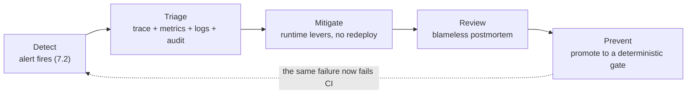
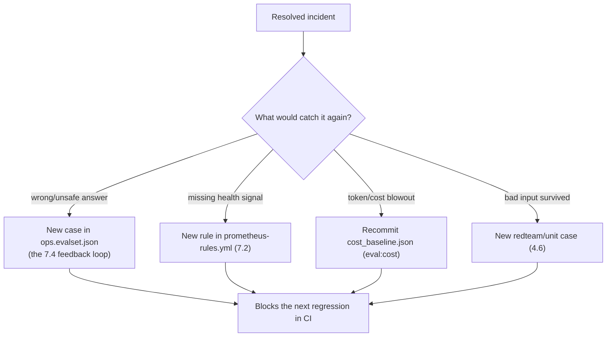

# 7.7. Incident Response

## Why does the agent need its own incident response?

The reference agent spends the whole course triaging incidents for a fictional service. This page turns that lens around: the agent is now a running Kubernetes workload ([Chapter 6](../6.%20Platform/)), and a workload has incidents of its own. An error-budget burn, a latency regression, a spike of neutralized injections, a run of schema failures, a cost blowout, or a stream of thumbs-down feedback are all the agent misbehaving — not the platform it watches.

The previous pages each own one signal. This one connects them into the loop an on-call engineer actually runs — **detect → triage → mitigate → review → prevent** — and, critically, insists that an incident is not closed when service is restored, but when a deterministic check would catch it again. That last step is what keeps the [AgentOps loop](../0.%20Overview/0.2.%20AgentOps.md) from leaking: every real outage should leave behind a test, an eval case, an alert, or a baseline that the earlier chapters can enforce forever.



## What counts as an incident for the agent itself?

The shipped alert rules already name most of them. Each maps to a first signal and the page that owns it:

| Fired alert                      | What it means                                          | Read first                                            |
| -------------------------------- | ------------------------------------------------------ | ----------------------------------------------------- |
| `AgentErrorBudgetBurn`           | Spans are failing faster than the 99% budget allows    | [7.2. Monitoring](./7.2.%20Monitoring.md) → the trace |
| `AgentTurnLatencyP95High`        | Span p95 exceeds 15s — model, tool, or hardware        | [7.1. Tracing](./7.1.%20Tracing.md) span breakdown    |
| `AgentInjectionNeutralizedSpike` | Guardrails neutralized an unusual burst of injections  | [4.6. Security](../4.%20Quality/4.6.%20Security.md)   |
| `AgentTriageSchemaFailures`      | Structured reports are failing `TriageReport` schema   | [4.0. Typing](../4.%20Quality/4.0.%20Typing.md)       |
| `AgentTokenTelemetryMissing`     | Spans flow but no token counters — broken cost signal  | [7.3. Costs](./7.3.%20Costs.md)                       |
| `ObservabilityCollectorDown`     | Prometheus cannot scrape the collector — you are blind | [7.0. Reproducibility](./7.0.%20Reproducibility.md)   |

Two incident classes have no alert because they are judgements, not thresholds: a **quality** incident (a cluster of thumbs-down [feedback](./7.4.%20Feedback.md) or judge disagreement on answers that are wrong, not just terse) and a **cost** incident (a prompt or model change that quietly doubled tokens, caught by the [`eval:cost`](../4.%20Quality/4.4.%20Evaluations.md#how-do-you-catch-a-correct-but-expensive-regression) baseline rather than a live gauge). Treat both as first-class incidents even though nothing pages you.

## Which signals do you walk, in order?

Triage is a fixed walk across the three pillars plus the audit trail, not a hunt. The signals already join on one identifier — the trace id — so each step narrows the next:

1. **Metric** — confirm the alert is real and scope it: is the error ratio or p95 rising for every turn or one tool? ([7.2](./7.2.%20Monitoring.md))
1. **Trace** — open one failing turn in MLflow and read the span tree: which model or tool span failed, retried, or ran long, and what were its token counts? ([7.1](./7.1.%20Tracing.md))
1. **Logs** — pivot to the correlated Loki logs for that window for the error text the span only summarizes. ([the collector fans logs to Loki](./index.md))
1. **Audit** — if any state changed, read the append-only audit row: who approved which write, with what rationale, against which incident. ([7.6](./7.6.%20Governance.md))

The guardrail architecture bounds the blast radius while you do this: every state-changing tool required human approval ([4.5. Guardrails](../4.%20Quality/4.5.%20Guardrails.md)), so an agent incident can waste tokens, mislead, or fail — but it cannot have silently mutated production data without an audit row naming the approver.

## What can you change to mitigate without a redeploy?

Most agent incidents are mitigated by configuration, not code, because the highest-leverage surfaces are already externalized. In rough order of reach for:

1. **Roll back the instruction.** If the incident started after a prompt change, pin the previous registry version with `AGENT_PROMPT_URI=prompts:/agentops-agent-instruction/N` — an instant revert with no image rebuild ([4.4](../4.%20Quality/4.4.%20Evaluations.md#how-do-you-version-pin-and-roll-back-the-instruction)).
1. **Cap the resource envelope.** A runaway-cost or context incident is bounded now, not at the next deploy: tighten `AGENT_MAX_TOKENS_PER_SESSION` so sessions end with an actionable message, and set `AGENT_MAX_HISTORY_MESSAGES` so long conversations are trimmed rather than silently truncated ([3.4](../3.%20Capabilities/3.4.%20Memory.md#how-do-you-bound-the-history-automatically)).
1. **Narrow the surface.** Disable an opt-in that is misbehaving — turn `AGENT_SEMANTIC_RETRIEVAL` back off to fall back to the deterministic keyword scorer, or route reads back off a failing MCP gateway.
1. **Roll back the release.** If the cause is code, the immutable image tag and release lineage ([7.0](./7.0.%20Reproducibility.md)) make redeploying the previous digest the last, cleanest lever.

Record which lever you pulled and when — that timestamp is the first line of the postmortem.

## How do you write a blameless postmortem?

Keep it short, factual, and about the system, not the person who shipped the change. A usable template for this agent:

```markdown
# Postmortem: <short title> (<date>)

## Impact

What degraded, for how long, and for whom (e.g. "structured reports failed schema validation for 40 min; on-call saw empty triage output").

## Timeline

- HH:MM AgentTriageSchemaFailures fired
- HH:MM Trace <id> showed the model omitting a required field
- HH:MM Pinned prompt version N-1 (AGENT_PROMPT_URI); alert cleared

## Root cause

The one change or condition that produced the impact, tied to evidence: trace id(s), the audit row, the fired alert, the release/prompt version.

## What caught it, and what didn't

Which signal surfaced it, and which gate should have caught it earlier but did not — this section is the input to Prevent.

## Actions (owner, gate)

- [ ] New eval case reproducing the failure on seed data — <owner>
- [ ] Alert / test / cost baseline that would catch a recurrence — <owner>
```

The "what caught it, and what didn't" section is the load-bearing one: an incident that a cheaper layer _should_ have caught is really a gap in that layer, and naming it is how the layer improves.

## How do you turn the incident into a permanent gate?

This is the step that closes the loop, and it reuses machinery from the earlier chapters rather than inventing anything. Pick the cheapest layer that would have caught the failure:



Reproduce the behavior on the committed seed with `mise run data:reset` — never paste a real production conversation into the repository; transcribe the _behavior_ onto sanitized seed data, exactly as the [feedback loop](./7.4.%20Feedback.md#how-does-feedback-improve-the-agent) prescribes. A quality incident becomes a new deterministic eval case; a missing health signal becomes a new Prometheus rule; a cost incident becomes a recommitted `cost_baseline.json`; a bad input that reached a tool becomes a new deterministic red-team case. The incident is closed only when that gate is green on `main` — meaning the same failure would now fail a pull request before it ever reached production again.

## What is the incident-response checkpoint?

Run one incident end to end on the local stack, without needing a model:

1. Induce a capacity incident: from `agents/python`, start a session with `AGENT_MAX_TOKENS_PER_SESSION=1` set and send one turn. Observe the refusal message and the `agentops.tokens` counter, exactly as [7.3](./7.3.%20Costs.md) describes.
1. Walk the signals: find the turn's trace ([7.1](./7.1.%20Tracing.md)), confirm the token attributes on its spans, and confirm no audit row was written because no write was approved ([7.6](./7.6.%20Governance.md)).
1. Write the five-section postmortem above — impact, timeline, root cause, what caught it, actions.
1. Promote one action to a gate: add a unit test asserting `enforce_token_budget` refuses past the limit (or a Prometheus rule that would alert on it), and confirm it is green.

You have completed the loop when the condition that caused your induced incident is covered by a check that runs without you — which is the whole point of operating an agent instead of merely running one.
