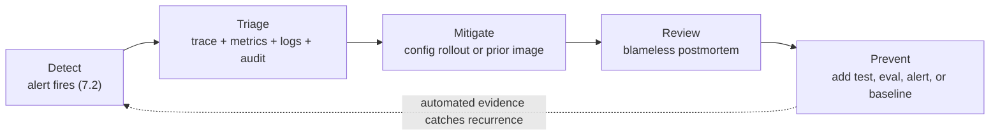
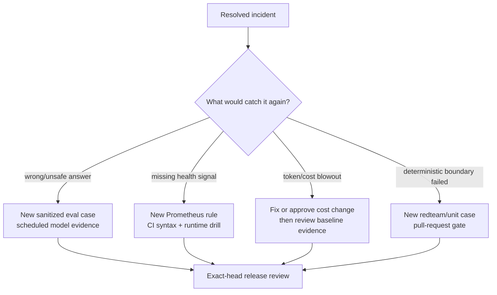

# 7.7. Incident Response

!!! abstract "In one glance"

    - **You will:** Cause one incident the agent refuses and one a shipped alert catches, walk the signals in order, write the postmortem, and add the cheapest automated evidence that catches it again.
    - **You need:** [7.2. Monitoring](./7.2.%20Monitoring.md) and [7.3. Costs](./7.3.%20Costs.md) finished, with the host observability stack still running.
    - **Time:** about 35 minutes, hands-on.

## Why does the agent need its own incident response?

**Until now the agent triaged incidents. This page is about the agent _being_ the incident.**

The reference agent spends the whole course triaging incidents for a fictional service. It is itself a running workload now — a host process behind the gateway, or a Kubernetes workload if you have done [Chapter 6](../6.%20Platform/) — and a workload has incidents of its own. Six symptoms all mean the agent itself is misbehaving, not the platform it watches:

- An **error-budget burn**: failures eating the small allowance a 99% success target leaves.
- A latency regression.
- A spike of neutralized injections.
- A run of schema failures.
- A cost blowout.
- A stream of thumbs-down feedback.

The previous pages each own one signal. This one connects them into the loop an on-call engineer actually runs: **detect → triage → mitigate → review → prevent**.

The last step is the one people skip. An incident is not closed when service is restored. It closes when the cheapest appropriate layer would expose it again: CI for deterministic behavior, scheduled model evidence for generative behavior, or a runtime drill for an alert. That is what keeps the [AgentOps loop](../0.%20Overview/0.2.%20AgentOps.md) from leaking.


```mermaid
flowchart LR
    Detect["Detect<br/>alert fires (7.2)"] --> Triage["Triage<br/>trace + metrics + logs + audit"]
    Triage --> Mitigate["Mitigate<br/>config rollout or prior image"]
    Mitigate --> Review["Review<br/>blameless postmortem"]
    Review --> Prevent["Prevent<br/>add test, eval, alert, or baseline"]
    Prevent -.->|"automated evidence catches recurrence"| Detect
```

## Your turn: how do you break it on purpose?

Cause two small, safe failures now, so the rest of the page has something real to walk: one the agent refuses by itself, and one a shipped detector finds without you.

- **Mode**: `inspect`.
- **Goal**: observe one fail-closed application limit and one real alert lifecycle, then return every process and setting to its starting state.
- **Files to touch**: none. The token limit is scoped to one foreground command; do not edit the root `.env`.
- **Preflight**: from the repository root, require `docker compose -f infra/observability/compose.yaml ps --status running --services | grep -Fx otel-collector` to succeed before stopping anything.
- **Gate that proves completion**: the second agent turn returns `TOKEN_BUDGET_EXHAUSTED`, and `ObservabilityCollectorDown` moves through pending, firing, and resolved.
- **Final state**: stop the foreground agent, verify `otel-collector` is running again, then use the page teardown to stop the stack. No environment or tracked-file change remains.

**The application symptom.** Scope `AGENT_MAX_TOKENS_PER_SESSION=1` to one foreground process, then start a session and send two turns:

```bash
cd agents/python
AGENT_MAX_TOKENS_PER_SESSION=1 mise run run
```

The first turn still calls the model and answers, because a fresh session has spent nothing yet. The second turn is refused before any model call, with `error_code="TOKEN_BUDGET_EXHAUSTED"` and a message naming the variable to raise. That refusal is your induced capacity incident, exactly as [7.3. Costs](./7.3.%20Costs.md) describes it.

**The detected outage.** Nothing pages you for that refusal: a cost incident is a judgement, not a threshold, and the shipped rules deliberately watch none of them. An incident you only notice because you were already watching is not a detection story, so induce a second failure that a shipped rule does watch. With the observability stack still up, stop the single telemetry entry point:

```bash
docker compose -f infra/observability/compose.yaml stop otel-collector
```

Prometheus scrapes that container as the `otel-collector` job, so `up{job="otel-collector"}` drops to `0` at the next scrape, and `ObservabilityCollectorDown` moves to `pending`, then to `firing` once its 2-minute `for:` window elapses. Watch both states at `http://localhost:9090/alerts`, then find the alert in Alertmanager at `http://localhost:9093`. The agent keeps answering the whole time: the gap between "the service is fine" and "you are blind" is the incident, and it is why this rule pages instead of filing a ticket.

Restarting the collector is your mitigation, so do it only after both states are recorded:

```bash
docker compose -f infra/observability/compose.yaml start otel-collector
```

Watch the alert resolve. Traces, metrics, and logs for the outage window are gone permanently — nothing backfills them. Note the times it fired and resolved; those two timestamps are the timeline your postmortem needs.

!!! warning "Common mistakes"

    - **Sending only one turn.** `enforce_token_budget` refuses once the session's spent tokens reach the limit, and a fresh session starts at zero. The first turn always reaches the model. Send two.
    - **Setting the variable on a different command.** Keep the inline assignment on `mise run run`; a value exported in another terminal does not reach this process. Run `AGENT_MAX_TOKENS_PER_SESSION=1 mise run config:check` from `agents/python` to print the configuration the agent resolves.
    - **Expecting the alert immediately.** Prometheus needs one scrape to mark the target down, then the whole `for:` window before `pending` becomes `firing`. An alert stuck in `pending` usually means you restarted the collector too early.

## What counts as an incident for the agent itself?

The shipped alert rules already name most of them. Each maps to a first signal and the page that owns it:

| Fired alert                      | What it means                                          | Read first                                            |
| -------------------------------- | ------------------------------------------------------ | ----------------------------------------------------- |
| `AgentErrorBudgetBurn`           | Spans are failing faster than the 99% budget allows    | [7.2. Monitoring](./7.2.%20Monitoring.md) → the trace |
| `AgentTurnLatencyP95High`        | Span p95 exceeds 15s — model, tool, or hardware        | [7.1. Tracing](./7.1.%20Tracing.md) span breakdown    |
| `AgentInjectionNeutralizedSpike` | Guardrails neutralized an unusual burst of injections  | [4.6. Security](../4.%20Quality/4.6.%20Security.md)   |
| `AgentTriageSchemaFailures`      | Structured reports are failing `TriageReport` schema   | [4.0. Typing](../4.%20Quality/4.0.%20Typing.md)       |
| `AgentTokenTelemetryMissing`     | Spans flow but no token counters — broken cost signal  | [7.3. Costs](./7.3.%20Costs.md)                       |
| `ObservabilityCollectorDown`     | Prometheus cannot scrape the collector — you are blind | [7.2. Monitoring](./7.2.%20Monitoring.md)             |

Two more classes never page you, because they are judgements rather than thresholds: a quality incident and a cost incident. Treat both as first-class incidents anyway.

??? note "Deeper: the two incidents nothing will page you about"

    Two incident classes have no alert because they are judgements, not thresholds: a **quality** incident (a cluster of thumbs-down [feedback](./7.4.%20Feedback.md) or judge disagreement on answers that are wrong, not just terse) and a **cost** incident (a prompt or model change that quietly doubled tokens, caught by the [`eval:cost`](../4.%20Quality/4.4.%20Evaluations.md#how-do-you-catch-a-correct-but-expensive-regression) baseline rather than a live gauge). Treat both as first-class incidents even though nothing pages you.

## Which signals do you walk, in order?

Triage is a fixed walk across the three pillars plus the audit trail, not a hunt. The signals already join on one identifier — the trace id — so each step narrows the next:

1. **Metric** — confirm the alert is real and scope it: is the error ratio or p95 rising for every turn or one tool? ([7.2. Monitoring](./7.2.%20Monitoring.md))
1. **Trace** — open one failing turn in MLflow and read the span tree: which model or tool span failed, retried, or ran long, and what were its token counts? ([7.1. Tracing](./7.1.%20Tracing.md))
1. **Logs** — pivot to the correlated Loki logs for that window for the error text the span only summarizes. ([the collector fans logs to Loki](./index.md))
1. **Audit** — if a guarded remediation changed state, read the append-only audit row: who approved which action, with what rationale, against which incident. ([7.6. Governance](./7.6.%20Governance.md))

While you walk, the blast radius is already bounded. Every guarded remediation action required human approval. Durable memory notes are a separate PII-redacted write and the kill-switch freezes them too; they do not mutate the mock service or incident tables.

Owned by [4.5. Guardrails](../4.%20Quality/4.5.%20Guardrails.md).

## What can you change without writing new code?

Most agent incidents can be mitigated with existing configuration or a prior image. `Settings()` reads environment values once at process startup, so changing a flag requires restarting the host process or rolling out the workload configuration; none of these flags hot-reloads.

| Symptom                                                                                           | Lever                                                                                                                                                                 | Setting                                                      | Read more                                                                                                                   |
| ------------------------------------------------------------------------------------------------- | --------------------------------------------------------------------------------------------------------------------------------------------------------------------- | ------------------------------------------------------------ | --------------------------------------------------------------------------------------------------------------------------- |
| Bad state changes: a compromised session, a prompt gone wrong, a change window you must not touch | **Freeze every agent write.** After rollout, guarded actions and durable note writes refuse while reads keep working.                                                 | `AGENT_WRITES_DISABLED=true`                                 | [4.5. Guardrails](../4.%20Quality/4.5.%20Guardrails.md#how-do-you-freeze-every-write-for-an-incident)                       |
| Runaway cost, or a conversation that keeps growing                                                | **Cap the resource envelope.** After restart, sessions end with an actionable message; long conversations are trimmed rather than silently truncated.                 | `AGENT_MAX_TOKENS_PER_SESSION`, `AGENT_MAX_HISTORY_MESSAGES` | [3.4. Memory](../3.%20Capabilities/3.4.%20Memory.md#how-do-you-bound-the-history-automatically)                             |
| An opt-in path is misbehaving                                                                     | **Narrow the surface.** Disable semantic retrieval or unset the failing MCP route, then restart the process.                                                          | `AGENT_SEMANTIC_RETRIEVAL=false`, unset `AGENT_MCP_URL`      | [3.3. MCP](../3.%20Capabilities/3.3.%20MCP.md#what-changes-when-you-flip-agent_mcp_url)                                     |
| A read dependency is hard down                                                                    | **Stop paying the full retry budget** on every doomed call.                                                                                                           | `AGENT_CIRCUIT_BREAKER_ENABLED=true`                         | [3.1. Tools](../3.%20Capabilities/3.1.%20Tools.md#how-does-the-agent-shed-load-when-a-dependency-stays-down)                |
| The model endpoint is down and you have a validated smaller model                                 | **Fail over to it.**                                                                                                                                                  | `AGENT_MODEL_FALLBACK`                                       | [5.4. Model Gateway](../5.%20Gateway/5.4.%20Model%20Gateway.md#how-does-the-agent-fail-over-when-the-primary-model-is-down) |
| The cause is committed code or prompt text                                                        | **Roll back the release.** The immutable image lineage makes redeploying the previous digest the last, cleanest lever. Production does not load prompt-registry URIs. | the previous image digest                                    | [7.0. Reproducibility](./7.0.%20Reproducibility.md)                                                                         |

Freezing every write is the fastest application-level blast-radius cut, which is why it is first. Record the configuration change and when the replacement process became ready: those timestamps start the postmortem.

`AGENT_PROMPT_URI` is not a production rollback lever. The minimal serving image omits MLflow and ships the committed instruction, so prompt rollback means redeploying the prior evaluated image digest and its matching source commit.

## How do you write a blameless postmortem?

Keep it short, factual, and about the system, not the person who shipped the change. Five sections carry it:

1. **Impact** — what degraded, for how long, and for whom.
1. **Timeline** — the alert, the trace, and the lever you pulled, each with a time.
1. **Root cause** — the one change or condition, tied to evidence.
1. **What caught it, and what didn't** — the input to Prevent.
1. **Actions** — one owner and one check or evidence path per line.

The fourth section is the one that matters. An incident that a cheaper layer _should_ have caught is really a gap in that layer, and naming it is how the layer improves.

??? note "Deeper: the full template, and one filled in"

    A usable template for this agent:

    ```markdown
    # Postmortem: <short title> (<date>)

    ## Impact

    What degraded, for how long, and for whom (e.g. "structured reports failed schema validation for 40 min; on-call saw empty triage output").

    ## Timeline

    - HH:MM AgentTriageSchemaFailures fired
    - HH:MM Trace <id> showed the model omitting a required field
    - HH:MM Redeployed the previous known-good image digest; alert cleared

    ## Root cause

    The one change or condition that produced the impact, tied to evidence: trace id(s), the audit row, the fired alert, the release/prompt version.

    ## What caught it, and what didn't

    Which signal surfaced it, and which check or evidence path should have exposed it earlier but did not — this section is the input to Prevent.

    ## Actions (owner, check or evidence path)

    - [ ] New eval case reproducing the failure on seed data — <owner>
    - [ ] Alert / test / cost baseline that would catch a recurrence — <owner>
    ```

    A realistic historical example shows the gap that the repository's current structured-report evaluation now covers:

    ```markdown
    # Postmortem: TriageReport schema failures after a prompt change (2026-03-14)

    ## Impact

    Structured reports failed schema validation for 40 min; on-call saw empty triage output. Read-only questions kept answering normally.

    ## Timeline

    - 09:12 AgentTriageSchemaFailures fired
    - 09:20 Trace 4f9c1e showed the model omitting the required severity field
    - 09:26 Redeployed the image containing prompt version 4; alert cleared 09:34

    ## Root cause

    Prompt version 5 reworded the report section and dropped the sentence naming every required field, so the model stopped emitting severity. TriageReport sets extra="forbid" and severity has no default, so every report failed validation.

    ## What caught it, and what didn't

    - Caught it: AgentTriageSchemaFailures, a few minutes after the first failed turn.
    - Did not catch it at the time: scheduled evaluation had no case asserting a complete TriageReport.

    ## Actions (owner, check or evidence path)

    - [x] Add the dedicated structured-report eval over seed incident INC-002 — agent owner
    - [x] Keep the existing AgentTriageSchemaFailures alert; add no duplicate — on-call
    ```

## How do you turn the incident into permanent evidence?

This is the step that closes the loop, and it reuses machinery from the earlier chapters rather than inventing anything. Pick the cheapest layer that would have caught the failure:


```mermaid
flowchart TD
    Incident["Resolved incident"] --> Which{"What would catch it again?"}
    Which -->|"wrong/unsafe answer"| Case["New sanitized eval case<br/>scheduled model evidence"]
    Which -->|"missing health signal"| Alert["New Prometheus rule<br/>CI syntax + runtime drill"]
    Which -->|"token/cost blowout"| Cost["Fix or approve cost change<br/>then review baseline evidence"]
    Which -->|"deterministic boundary failed"| Test["New redteam/unit case<br/>pull-request gate"]
    Case --> Review["Exact-head release review"]
    Alert --> Review
    Cost --> Review
    Test --> Review
```

Reproduce the behavior on the committed seed with `mise run data:reset`. Never paste a real production conversation into the repository. Transcribe the _behavior_ onto sanitized seed data, exactly as the [feedback loop](./7.4.%20Feedback.md#how-does-feedback-improve-the-agent) prescribes.

Each incident class has one cheapest reproducible check or evidence path:

- A quality incident becomes a sanitized eval case. CI validates its structure; scheduled model evaluation supplies the behavioral evidence.
- A missing health signal becomes a Prometheus rule. CI validates the manifest; a runtime drill proves that the rule fires.
- A cost incident is fixed or explicitly approved first. Only then do you commit a reviewed corrected **cost baseline** for scheduled `eval:cost` evidence; never normalize an unexplained increase by overwriting the baseline.
- A deterministic boundary failure becomes a unit or red-team case that blocks pull requests.

Close the incident only when the relevant evidence is green on the exact `main` commit. Do not call a scheduled eval or runtime alert a pull-request gate when CI only validates its source.

## What proves this page worked?

Run one incident end to end on the local stack:

1. Induce a capacity incident: from `agents/python`, run `AGENT_MAX_TOKENS_PER_SESSION=1 mise run run` and send two turns. The second is refused with `TOKEN_BUDGET_EXHAUSTED`. Observe the refusal message and the `agentops.tokens` counter, exactly as [7.3. Costs](./7.3.%20Costs.md) describes.
1. Walk the signals: find the turn's trace ([7.1. Tracing](./7.1.%20Tracing.md)), confirm the token attributes on its spans, and confirm no audit row was written because no write was approved ([7.6. Governance](./7.6.%20Governance.md)).
1. Induce the detected outage: stop the `otel-collector` container, watch `ObservabilityCollectorDown` go `pending` then `firing` at `http://localhost:9090/alerts` and reach Alertmanager, then start it again and watch it resolve.
1. Write the five-section postmortem above — impact, timeline, root cause, what caught it, actions.
1. Promote one action to a repeatable path: add a unit test asserting `enforce_token_budget` refuses past the limit and run it, or add a Prometheus rule and prove both its CI manifest validation and runtime drill.

Stop any foreground agent process with `Ctrl-C`, then stop the host observability stack without deleting its volumes:

```bash
mise run observability:down
```

**You are done when:**

- The second turn of your budgeted session was refused with `error_code="TOKEN_BUDGET_EXHAUSTED"`, and the first was not.
- You can open that turn's trace in MLflow and read `agentops.tokens.session.total` off its spans.
- The `audit_log` table gained no row, because no write was approved.
- `ObservabilityCollectorDown` reached `firing` while the collector was stopped, appeared in Alertmanager, and resolved after you restarted it — a detector found your second incident, not you.
- Your postmortem fills all five sections, including "what caught it, and what didn't".
- The relevant evidence is green: CI for a deterministic test, or a runtime drill for an alert rule.
- The foreground agent and host observability stack are stopped; the exercise introduced no token-limit value in `.env` or the parent shell environment.

You have completed the loop when the condition that caused your induced incident is covered by a check that runs without you. That is the whole point of operating an agent instead of merely running one.

Continue to [8.7. Capstone](../8.%20Community/8.7.%20Capstone.md) when the relevant evidence is green for the exact `main` revision. The Chapter 8 maintenance pages remain optional references for publishing or sustaining an OSS project.
