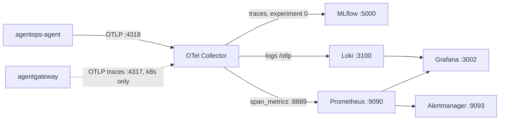

# 7. Observability

## How will you operate the agent after deployment?

Your AgentOps Agent now runs as a private Kubernetes workload ([Chapter 6](../6. Platform/)). This chapter closes the [AgentOps loop](../0. Overview/0.2. AgentOps.md) with evidence: release lineage, OpenTelemetry traces, span-derived/gateway metrics, explicit cost assumptions, trace-linked human feedback, a safe online-evaluation design, and auditable approved actions.

Every later page in this chapter assumes one shipped telemetry topology and one set of ports. Read this landing page first so the OTLP endpoints, stores, and deployment profiles the sibling pages keep referencing already mean something concrete.

The shipped OSS stack is MLflow, the OpenTelemetry Collector, Prometheus, Alertmanager, Loki, and Grafana. Pages separate implemented signals from desired production extensions, and each boundary is documented on the page where it bites: there is no fake dollar-cost panel ([7.3](./7.3. Costs.md)), no automatic live judge ([7.5](./7.5. Online Evaluation.md)), no external paging — alerts stop at the local Alertmanager ([7.2](./7.2. Monitoring.md)) — and no cryptographically immutable audit store or HA claim ([7.6](./7.6. Governance.md)).

## What does the shipped telemetry stack look like end to end?

The agent and gateway emit; one collector fans a single stream out to three stores; Prometheus scrapes the collector and feeds the dashboard and alerts:

The collector receives OTLP on `:4317` (gRPC) and `:4318` (HTTP), then splits it three ways: traces go to MLflow at `:5000` tagged with the `x-mlflow-experiment-id: 0` header, logs go to Loki at `:3100/otlp`, and the `span_metrics` connector plus native metrics are exposed for Prometheus on `:8889`. Prometheus (`:9090`) stores them, evaluates alert rules into Alertmanager (`:9093`), and Grafana (`:3002`, host profile only) reads both Prometheus and Loki. Agent traces, metrics, and logs always arrive over OTLP; agentgateway pushes OTLP traces to the collector only in the Kubernetes profiles, and its own metrics live at `:15020` — scraped directly by Prometheus on the host and by the collector in Kubernetes.

Which scraper and UI actually exist depends on the deployment profile, and every sibling page re-states this split:

| Profile           | Config                             | Scraper + alert rules                                                        | Grafana      | How you reach it                                |
| ----------------- | ---------------------------------- | ---------------------------------------------------------------------------- | ------------ | ----------------------------------------------- |
| Host Compose      | `infra/observability/compose.yaml` | Prometheus scrapes collector `:8889`, MLflow `/metrics`, gateway `:15020`    | yes, `:3002` | `localhost` ports                               |
| Local k8s overlay | `infra/k8s/overlays/local`         | own Prometheus + Alertmanager, same rules, scrape only `otel-collector:8889` | no           | `kubectl port-forward`                          |
| GKE overlay       | `infra/k8s/overlays/gke`           | none shipped; `:8889` stays a ClusterIP                                      | no           | point your own scraper at `otel-collector:8889` |

## Which signal answers which question?

Traces, metrics, logs, assessments, and audit rows each answer a different operational question; open the page that owns the signal you actually need:

| When you ask...                            | Signal to read                       | Where it lives                      | Page                                                  |
| ------------------------------------------ | ------------------------------------ | ----------------------------------- | ----------------------------------------------------- |
| Can I rebuild this exact release?          | code/image/model/prompt/data lineage | git, registry, MLflow               | [7.0. Reproducibility](./7.0. Reproducibility.md)     |
| What happened inside one turn?             | ADK/gateway trace                    | MLflow `:5000`                      | [7.1. Tracing](./7.1. Tracing.md)                     |
| Is the service healthy right now?          | RED + gateway metrics, alerts        | Prometheus `:9090`, Grafana `:3002` | [7.2. Monitoring](./7.2. Monitoring.md)               |
| What did the work cost?                    | token counters + stated assumptions  | Prometheus, docs                    | [7.3. Costs](./7.3. Costs.md)                         |
| Was this answer any good?                  | human MLflow assessment              | MLflow                              | [7.4. Feedback](./7.4. Feedback.md)                   |
| Are answers drifting at scale?             | sampled trace scoring (design)       | MLflow                              | [7.5. Online Evaluation](./7.5. Online Evaluation.md) |
| Who approved this write, and what changed? | append-only audit row                | SQLite audit table                  | [7.6. Governance](./7.6. Governance.md)               |

The chapter checkpoint uses local or already-running lab telemetry. It does not deploy GCP or call a model unless the learner explicitly chooses that step.
