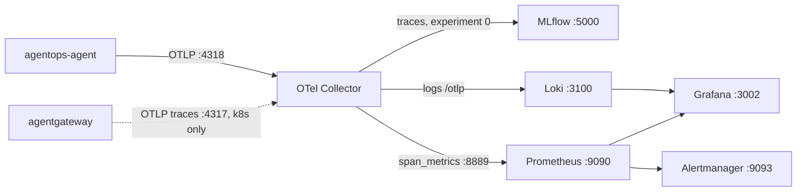

# 7. Observability

!!! abstract "In one glance"

    - **You will:** See how one agent turn becomes a trace, a metric, and a log line, and know which page owns which signal.
    - **You need:** Chapter 5 finished and Docker running. Only [7.6. Governance](./7.6. Governance.md) also needs the Chapter 6 cluster.
    - **Time:** about 6 minutes, orientation.

**Part II — Platform engineering.** This part is more demanding and assumes container and Kubernetes knowledge. Complete [4.8. Developer Handoff](../4.%20Quality/4.8.%20Developer%20Handoff.md) or begin from its tested reference checkpoint. Prepare with [Kubernetes Basics](https://kubernetes.io/docs/tutorials/kubernetes-basics/) if needed.

## How will you operate the agent after deployment?

Your AgentOps Agent runs behind agentgateway ([Chapter 5](../5. Gateway/)), and optionally as a Kubernetes workload ([Chapter 6](../6. Platform/)). This chapter closes the [AgentOps loop](../0. Overview/0.2. AgentOps.md) with evidence: seeing what the agent does, proving what it did, and reacting when it breaks.

The telemetry stack is a Docker Compose stack, not a cluster feature. Seven of the eight pages below run entirely on it; [7.6. Governance](./7.6. Governance.md) is the single page that reads its evidence off the deployed workload and therefore needs `mise run install:platform` and a running k3d cluster. Read the rest whenever Chapter 5 is behind you.

!!! tip "Start the stack before you read further"

    Every later page in this chapter shows you something inside a running stack. Bring it up now, from the repository root:

    ```bash
    mise run doctor:gateway    # checks Docker, Compose, and the other container prerequisites
    mise run observability:up  # MLflow, the collector, Prometheus, Alertmanager, Loki, Grafana
    ```

    Then open MLflow at `http://localhost:5000` and Grafana at `http://localhost:3002`, and keep both tabs open for the rest of the chapter. Your own turns only appear there once the agent exports to the collector, which [7.1. Tracing](./7.1. Tracing.md) _(hands-on)_ sets up.

Every later page assumes one telemetry topology and one set of ports. This landing page is the map: which signal answers which question, what runs where, and which port each piece listens on.

## Which signal answers which question?

Traces, metrics, logs, assessments, and audit rows each answer a different operational question; open the page that owns the signal you actually need:

| When you ask...                            | Signal to read                        | Where it lives                      | Page                                                                        |
| ------------------------------------------ | ------------------------------------- | ----------------------------------- | --------------------------------------------------------------------------- |
| Can I rebuild this exact release?          | code/image/model/prompt/data lineage  | git, registry, MLflow               | [7.0. Reproducibility](./7.0. Reproducibility.md) _(hands-on)_              |
| What happened inside one turn?             | ADK/gateway trace                     | MLflow `:5000`                      | [7.1. Tracing](./7.1. Tracing.md)                                           |
| Is the service healthy right now?          | RED + gateway metrics, alerts         | Prometheus `:9090`, Grafana `:3002` | [7.2. Monitoring](./7.2. Monitoring.md) _(hands-on)_                        |
| What did the work cost?                    | token counters + stated assumptions   | Prometheus, docs                    | [7.3. Costs](./7.3. Costs.md) _(hands-on)_                                  |
| Was this answer any good?                  | human MLflow assessment               | MLflow                              | [7.4. Feedback](./7.4. Feedback.md) _(hands-on)_                            |
| Are answers drifting at scale?             | sampled trace scoring (design)        | MLflow                              | [7.5. Online Evaluation](./7.5. Online Evaluation.md) _(optional hands-on)_ |
| Who approved this write, and what changed? | append-only audit row                 | SQLite audit table                  | [7.6. Governance](./7.6. Governance.md) _(hands-on, needs the cluster)_     |
| The agent itself broke — now what?         | detect→triage→mitigate→review→prevent | every signal above, joined          | [7.7. Incident Response](./7.7. Incident Response.md) _(hands-on)_          |

Each of those pages is also explicit about where the shipped stack stops.

??? note "Deeper: what this chapter deliberately does not ship"

    Pages separate implemented signals from desired production extensions, and each boundary is documented on the page where it bites: there is no fake dollar-cost panel ([7.3. Costs](./7.3. Costs.md)), no automatic live judge ([7.5. Online Evaluation](./7.5. Online Evaluation.md)), no external paging — alerts stop at the local Alertmanager ([7.2. Monitoring](./7.2. Monitoring.md)) — and no cryptographically immutable audit store or HA claim ([7.6. Governance](./7.6. Governance.md)).

## What does the shipped telemetry stack look like end to end?

One collector receives what the agent and gateway emit, then fans that single stream out to three stores. Prometheus scrapes the collector and feeds the dashboard and the alerts:


```mermaid
flowchart LR
    Agent[agentops-agent] -->|OTLP :4318| Collector[OTel Collector]
    Gateway[agentgateway] -.->|OTLP traces :4317, k8s only| Collector
    Collector -->|traces, experiment 0| MLflow[MLflow :5000]
    Collector -->|logs /otlp| Loki[Loki :3100]
    Collector -->|span_metrics :8889| Prometheus[Prometheus :9090]
    Prometheus --> Grafana[Grafana :3002]
    Loki --> Grafana
    Prometheus --> Alertmanager[Alertmanager :9093]
```

Three names in that diagram are worth pinning down now:

- **OTLP** — the OpenTelemetry wire protocol that carries traces, metrics, and logs off the agent ([0.7. Glossary](../0.%20Overview/0.7.%20Glossary.md#otlp)).
- **`span_metrics`** — the collector connector that turns spans into request-count and duration metrics.
- **experiment `0`** — MLflow's built-in default experiment, which the course image renames to `agentops-agent`.

The shipped OSS stack is MLflow, the OpenTelemetry Collector, Prometheus, Alertmanager, Loki, and Grafana. Each piece listens on one port, and every later page assumes you already know which:

| Component                  | Port                       | What it is for                                                                                  |
| -------------------------- | -------------------------- | ----------------------------------------------------------------------------------------------- |
| OpenTelemetry Collector    | `:4317` gRPC, `:4318` HTTP | receives the agent's traces, metrics, and logs                                                  |
| MLflow                     | `:5000`                    | stores the traces, and serves the UI where you read one turn                                    |
| Loki                       | `:3100/otlp`               | stores the logs                                                                                 |
| Collector metrics endpoint | `:8889`                    | exposes `span_metrics` and native metrics for Prometheus                                        |
| Prometheus                 | `:9090`                    | stores those metrics and evaluates the alert rules                                              |
| Alertmanager               | `:9093`                    | receives the alerts Prometheus fires                                                            |
| Grafana                    | `:3002`                    | dashboards over Prometheus and Loki, host profile only                                          |
| agentgateway metrics       | `:15020`                   | the gateway's own metrics, scraped by Prometheus on the host and by the collector in Kubernetes |

Which scraper — the process that pulls metrics from an endpoint on a schedule — and which UI you actually get depends on the **deployment profile**: host Compose, the local k3d overlay, or GKE.

??? note "Deeper: what each deployment profile ships"

    This table is the canonical deployment-profile split; sibling pages link back instead of restating it. Both collector profiles expose span-derived metrics at `:8889`. The Kubernetes collector also scrapes agentgateway `:15020`, so its `:8889` endpoint includes gateway metrics.

    | Profile           | Config                             | Scraper + alert rules                                                        | Grafana      | How you reach it                                |
    | ----------------- | ---------------------------------- | ---------------------------------------------------------------------------- | ------------ | ----------------------------------------------- |
    | Host Compose      | `infra/observability/compose.yaml` | Prometheus scrapes collector `:8889`, MLflow `/metrics`, gateway `:15020`    | yes, `:3002` | `localhost` ports                               |
    | Local k8s overlay | `infra/k8s/overlays/local`         | own Prometheus + Alertmanager, same rules, scrape only `otel-collector:8889` | no           | `kubectl port-forward`                          |
    | GKE overlay       | `infra/k8s/overlays/gke`           | none shipped; `:8889` stays a ClusterIP                                      | no           | point your own scraper at `otel-collector:8889` |

??? note "Deeper: how the collector splits one stream three ways"

    The collector receives OTLP on `:4317` (gRPC) and `:4318` (HTTP), then splits it three ways: traces go to MLflow at `:5000` tagged with the `x-mlflow-experiment-id: 0` header, logs go to Loki at `:3100/otlp`, and the `span_metrics` connector plus native metrics are exposed for Prometheus on `:8889`. Prometheus (`:9090`) stores them, evaluates alert rules into Alertmanager (`:9093`), and Grafana (`:3002`, host profile only) reads both Prometheus and Loki. Agent traces, metrics, and logs always arrive over OTLP; agentgateway pushes OTLP traces to the collector only in the Kubernetes profiles, and its own metrics live at `:15020` — scraped directly by Prometheus on the host and by the collector in Kubernetes.

## What proves this chapter worked?

The chapter checkpoint uses local or already-running lab telemetry. It does not deploy GCP or call a model unless the learner explicitly chooses that step.

**You are done when:**

- `mise run observability:up` has finished and `http://localhost:5000` serves the MLflow UI.
- `http://localhost:3002` opens Grafana without asking you to log in.
- For a trace, a metric, a log line, an assessment, and an audit row, you can name the page that owns it.
- You can say which port the agent exports to, and which store keeps each of the three signals.
- You finished the required drill in [7.2. Monitoring](./7.2.%20Monitoring.md#your-turn-how-do-you-add-an-alert-rule-and-its-runbook): your own alert rule passed `promtool check rules`, reached `firing` at `http://localhost:9090/alerts`, and resolved when you cleared the condition.
- Without reopening Chapter 4, you can name the offline gate that proves a guardrail before release and the runtime signal that proves it in production — and say why neither replaces the other.

Continue to [7.0. Reproducibility](./7.0.%20Reproducibility.md) when the stack is up and you know which page to open for the signal you need.
