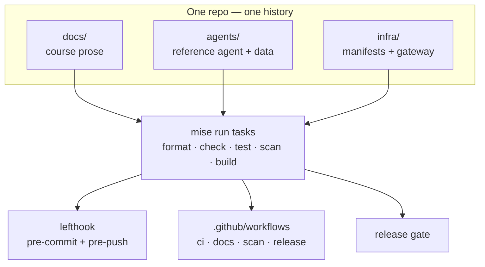
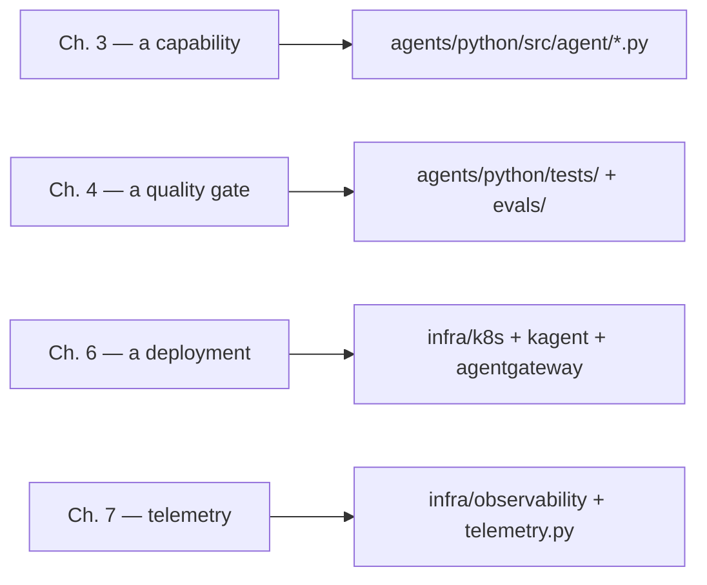

# 8.0. Repository

## What is inside the repository?

A course that teaches an agent's whole lifecycle has to keep three things that usually live in three repos — the prose, the code it documents, and the deployment artifacts — in one place, so a reader can jump from a sentence to the exact file that backs it. Everything the course produces therefore lives in a single repository, [`MLOps-Courses/agentops-open-course`](https://github.com/MLOps-Courses/agentops-open-course): three payloads (the course content, the reference agent, the infrastructure), the A2A clients and load tests that exercise it, and the tooling that binds them:

```text
agentops-open-course/
├── README.md            # for humans — start here
├── AGENTS.md            # for AI coding agents (dogfoods the AGENTS.md convention)
├── CONTRIBUTING.md      # setup, quality gates, and pull-request expectations
├── CODE_OF_CONDUCT.md   # community participation standards
├── SECURITY.md          # private vulnerability-reporting process
├── CITATION.cff         # machine-readable citation metadata
├── CHANGELOG.md         # Keep a Changelog release history
├── LICENSE              # MIT — software, scripts, workflows, and configuration
├── mkdocs.yml           # Zensical config: theme, navigation, extensions
├── pyproject.toml       # root project: version + the pinned Zensical build dependency
├── mise.toml            # task runner: install/serve/build/format/check/test/scan
├── lefthook.yml         # git hooks → mise run tasks
├── dprint.json          # formatting for JSON, Markdown, TOML, YAML
├── renovate.json5       # scheduled dependency-update policy
├── trivy.yaml           # security-scan configuration
├── scripts/             # repo-level gates: check-docs.sh, doctor.sh, cluster-start.sh, …
├── .github/             # ci/docs/eval/scan/release/renovate/freshness workflows + templates
├── docs/                # ← THE COURSE (this site): CC BY 4.0 prose + license text
├── agents/              # ← THE REFERENCE AGENT
│   ├── python/          # ADK Python project (uv, ruff, ty, pytest) — MIT
│   └── data/            # immutable seed: incidents.db, sql/, runbooks/, skills/, logs/ (MIT)
├── clients/             # minimal offline A2A web client — its own MIT LICENSE
│   └── web/             # dependency-free browser client for the AgentOps Agent
├── load/                # k6 load tests + documented latency budgets — its own MIT LICENSE
└── infra/               # ← THE INFRASTRUCTURE: agentgateway, k8s, kagent, MLflow, OTel, OpenTofu (MIT)
```

`docs/` mirrors the sibling [MLOps Coding Course](https://mlops-coding-course.fmind.dev/): one folder per phase, `N.M` section pages, and an `index.md` per folder, all written as FAQ Markdown. The generated static site (`site/`) is a build artifact, not committed. The dual-license split — CC BY 4.0 prose, MIT code — is the subject of [8.1. License](./8.1. License.md).

## Why keep the course, the agent, and the infra together?

A monorepo is a trade-off, not a default. It buys one clone, one version history, and one set of tasks: when [Chapter 3](../3. Capabilities/index.md) teaches a tool, the exact tool lives in `agents/`; when [Chapter 6](../6. Platform/index.md) deploys the agent, the exact manifests live in `infra/`; and a change that touches prose, code, and a manifest at once lands as one reviewable commit. The cost is coupling and scale — every clone carries all three payloads, and at large team size a single history becomes a contention point. A teaching repository is exactly the case where the benefit dominates: the whole value is that the prose, the code, and the deployment stay provably in lockstep, so nothing in the course points at a snippet you cannot open and run.

What actually holds the three payloads together is a shared task vocabulary. Every payload is driven by the same `mise run` verbs — `format`, `check`, `test`, `scan`, `build` — and `lefthook.yml`, the [`.github/workflows`](./8.5. Contributions.md), and the [release gate](./8.2. Releases.md) all delegate to those same verbs instead of re-implementing them. That is why a green pre-commit hook and a green CI run mean the same thing: they call the identical task.



`lefthook.yml` makes the binding literal: its `pre-commit` and `pre-push` commands are one-liners that call `mise run format`, `mise run check`, `mise run secure:staged`, and `mise run test`. Add a payload or a gate and you extend the vocabulary once, in `mise.toml`, and every consumer inherits it.

## What lives under infra?

`infra/` is not a single deployment; it is a set of profiles the course adds one at a time, each owning one concern so an overlay change never rewrites a base. The subtree maps directly to the platform chapters:

| Path                                      | Role                                                                          | Chapter                                          |
| ----------------------------------------- | ----------------------------------------------------------------------------- | ------------------------------------------------ |
| `agentgateway/{host,k3d,gke}/`            | the three data-plane profiles (host loopback, in-cluster, GKE)                | [5. Gateway](../5. Gateway/index.md)             |
| `k8s/base/` + `k8s/overlays/{local,gke}/` | one shared Kubernetes base, two Kustomize overlays                            | [6. Platform](../6. Platform/index.md)           |
| `kagent/`                                 | the BYO Agent, gateway `ModelConfig`, and governed `RemoteMCPServer`          | [6. Platform](../6. Platform/index.md)           |
| `mlflow/`                                 | the locked non-root self-hosted MLflow server image                           | [7. Observability](../7. Observability/index.md) |
| `observability/`                          | host Compose plus in-cluster OTel, Prometheus, and Grafana resources          | [7. Observability](../7. Observability/index.md) |
| `gcp/`                                    | a plan-first OpenTofu module for the optional GKE lab                         | [6. Platform](../6. Platform/index.md)           |
| `scripts/`                                | the host gateway wrapper, state backup/restore drills, and the loopback relay | 5–7                                              |

The `base` versus `overlays` split is the load-bearing idea: the same image and manifests run on k3d and on the GKE lab, and only the overlay changes — model identity, resource sizing, and cloud wiring — so "local-to-cloud" is one contract, not two deployments. Host and cluster observability deliberately reuse the same ports, which is why you must not run host Compose while the in-cluster stack is port-forwarded.

## Why split the agent into python and data?

The reference agent — the DevOps "AgentOps Agent" — is implemented as a Python project, split from the data it reads:

- `agents/python` is a **self-contained project**, with its own `mise.toml` and the standard task vocabulary (`install`, `format`, `check`, `test`).
- `agents/data` is **separate**: immutable SQLite/Markdown/log/skill seed input. The runtime copies SQLite into writable state; Kubernetes agent and MCP processes share one PVC so approved writes and later reads stay coherent. Rebuild the seed with `cd agents/data && mise run build`.

This is the seed/state boundary the whole course leans on: the committed dataset is reproducible, runtime state is disposable, and no exercise can dirty the input. Course pages show short executable excerpts; the complete Python and infrastructure sources remain canonical.

## Why is the agent package a flat set of single-purpose modules?

Inside `agents/python/src/agent/` there is almost no package hierarchy to navigate — twenty-three flat modules, each owning exactly one concern, and each docstring naming the chapter that teaches it. The lone exception is the tiny `structured_report/` subpackage: a five-line ADK-discovery adapter that re-exports `triage_report_agent` as `root_agent` so the report eval gets its own discoverable entrypoint ([3.0. Packaging](../3.%20Capabilities/3.0.%20Packaging.md#how-is-the-project-organized)). That is the repository's "flat over deep, one owner per concern" principle made concrete: to find where a behavior lives you read a filename, not a tree.

| Concern                      | Modules                                                  |
| ---------------------------- | -------------------------------------------------------- |
| Typed configuration          | `config.py`, `config_check.py`                           |
| Domain types and data access | `models.py`, `data.py`, `report.py`                      |
| Read and knowledge tools     | `tools.py`, `memory.py`, `retrieval.py`, `skills.py`     |
| Guarded writes and safety    | `actions.py`, `guardrails.py`, `pii.py`, `resilience.py` |
| Cross-session memory         | `longterm.py`                                            |
| Agent composition            | `agent.py`, `model.py`, `workflow.py`, `delegation.py`   |
| Protocol surfaces            | `mcp_server.py`, `mcp_client.py`, `server.py`            |
| Operations                   | `budget.py`, `telemetry.py`                              |

The payoff is reviewability: a guardrail change touches `guardrails.py` and its test, never a shared `utils`; a new read tool is one function in `tools.py`, not an edit across layers. The full module-to-chapter map is tabulated in the [3. Capabilities index](../3. Capabilities/index.md) and reused as the change surface in [8.7. Capstone](./8.7. Capstone.md), so when you build your own domain you edit the same flat boundaries rather than inventing new ones.

## How do you jump from a course page to the code it describes?

The repository's core promise is that nothing points at a snippet you cannot open. Critical Python excerpts on a course page are not copy-pasted prose that can rot; they are pulled from a named, checked region in the real source with a `pymdownx.snippets` reference — a standalone line of the form `--8<-- "agents/python/src/agent/memory.py:get-runbook"`. That reference in [3.4. Memory](../3. Capabilities/3.4. Memory.md) inlines the exact `get-runbook` region from `memory.py` at build time. Rename or delete the region and the site build fails, so the page and the source cannot silently diverge. When a page instead quotes a manifest or a command, it matches `infra/`, and it links to the source file so you can read the surrounding context. The FAQ format contract, the snippet-mirroring, and the docs CI that enforce all of this are the subject of [8.4. Documentation](./8.4. Documentation.md).

That gives a reliable path from any chapter to its owning tree:



So to answer "where does this actually happen?", read the chapter number: a capability lives in a flat `agent/` module, its proof lives in `agents/python/tests/` and `evals/`, a deployment concern lives in an `infra/` manifest, and telemetry spans both `infra/observability/` and `telemetry.py`.

## README.md or AGENTS.md — which do I read?

Both exist on purpose, for two different audiences:

- **[`README.md`](https://github.com/MLOps-Courses/agentops-open-course/blob/main/README.md)** is for **humans**: the pitch, the feature list, the layout, and the install commands.
- **[`AGENTS.md`](https://github.com/MLOps-Courses/agentops-open-course/blob/main/AGENTS.md)** is for **AI coding agents**: the same repository described as machine-actionable rules — the layout, the `mise run` commands, the conventions, the pinned contracts, and the definition of done.

The repository practises what it teaches. Compatible assistants read one shared file, and maintainers review their changes through the same `mise run` gates as human contributions — the binding from the diagram above, applied to authorship as well as to code.

## Where are the contributor and security policies?

GitHub surfaces the repository's community files automatically:

- [`CONTRIBUTING.md`](https://github.com/MLOps-Courses/agentops-open-course/blob/main/CONTRIBUTING.md) gives contributors one setup path and the exact local quality gate; [8.5. Contributions](./8.5. Contributions.md) walks it through.
- [`CODE_OF_CONDUCT.md`](https://github.com/MLOps-Courses/agentops-open-course/blob/main/CODE_OF_CONDUCT.md) defines participation and enforcement standards.
- [`SECURITY.md`](https://github.com/MLOps-Courses/agentops-open-course/blob/main/SECURITY.md) routes vulnerabilities away from public issues.
- [`CITATION.cff`](https://github.com/MLOps-Courses/agentops-open-course/blob/main/CITATION.cff) lets GitHub and reference managers generate a citation for the course.
- `.github/ISSUE_TEMPLATE/` and `.github/PULL_REQUEST_TEMPLATE.md` ask for reproducible evidence and the same `mise run` validation used by CI; see [8.3. Templates](./8.3. Templates.md).

## What is the AGENTS.md standard?

`AGENTS.md` is a plain-Markdown file at the repository root that gives AI coding agents the instructions and context they need to work in a project. It is to agents what `README.md` is to humans: a predictable, agent-first entry point that any tool can look for and read.

!!! info "AGENTS.md is an open convention"

    [AGENTS.md](https://agents.md/) is a vendor-neutral repository convention adopted by multiple coding tools. It is not presented as an AAIF protocol. This course teaches it in [1.5. Workspace](../1. Setup/1.5. Workspace.md) and uses it as a worked example.

The rest of this chapter walks through the other things that turn a repository into a shareable, sustainable project: its [license](./8.1. License.md), its [releases](./8.2. Releases.md), reusable [templates](./8.3. Templates.md), its [documentation pipeline](./8.4. Documentation.md), the [contribution](./8.5. Contributions.md) workflow, and the [AAIF](./8.6. AAIF.md) it supports.
