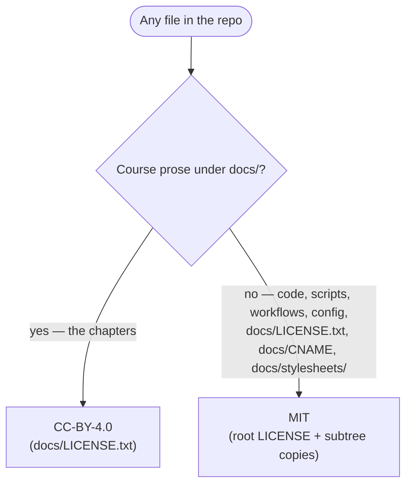
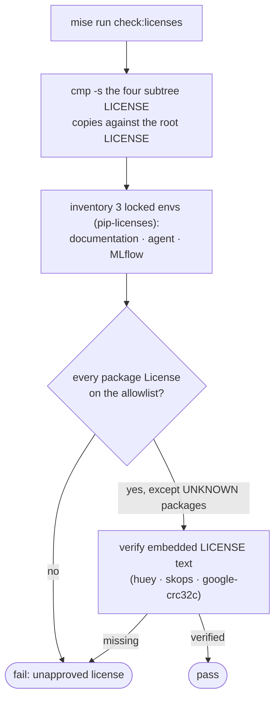

# 8.1. License

## What license is this course under?

A **dual license**, because the repository holds two kinds of work that want different, purpose-built grants:

- **Course prose** — everything under `docs/` that you read as a chapter — is [Creative Commons Attribution 4.0 (CC-BY-4.0)](https://creativecommons.org/licenses/by/4.0/), whose text lives in [`docs/LICENSE.txt`](https://github.com/MLOps-Courses/agentops-open-course/blob/main/docs/LICENSE.txt). Three things under `docs/` are configuration, not prose, and sit outside that grant: `docs/LICENSE.txt` (the Creative Commons text itself), `docs/CNAME` (the custom-domain record), and `docs/stylesheets/` (the site CSS).
- **Everything executable** — the agent, clients, infrastructure, load tests, scripts, workflows, and configuration — is licensed under the [MIT License](https://opensource.org/license/mit), granted by the root [`LICENSE`](https://github.com/MLOps-Courses/agentops-open-course/blob/main/LICENSE).

Both grants allow use, adaptation, redistribution, and commercial reuse. CC-BY requires attribution; MIT requires preservation of its copyright and permission notice. Neither imposes the other's terms — that separation is the whole point of splitting them.



## Why does each reusable subtree carry its own LICENSE file?

The root `LICENSE` is not the only MIT copy. Four **byte-identical** copies sit beside the independently distributable component trees: [`agents/LICENSE`](https://github.com/MLOps-Courses/agentops-open-course/blob/main/agents/LICENSE), [`clients/LICENSE`](https://github.com/MLOps-Courses/agentops-open-course/blob/main/clients/LICENSE), [`infra/LICENSE`](https://github.com/MLOps-Courses/agentops-open-course/blob/main/infra/LICENSE), and [`load/LICENSE`](https://github.com/MLOps-Courses/agentops-open-course/blob/main/load/LICENSE).

The concept is simple: a license grant travels only with the files a recipient actually receives. If someone vendors or forks `agents/` on its own — a realistic way to reuse the reference agent without the docs or the load harness — the root notice never comes along. A `LICENSE` inside each subtree guarantees the grant is present in every copy that can be split off, so no reusable directory ever ships as bare, all-rights-reserved code.

The repository keeps those copies honest rather than trusting them: the drift gate below runs `cmp -s` on each of the four files against the root `LICENSE` and fails on a single-byte difference, so the notices cannot silently diverge as the repo evolves.

## Why two licenses instead of one?

Because prose and software are best served by different, purpose-built licenses:

- **Creative Commons** licenses are written for creative and educational works — articles, courses, diagrams, datasets. CC-BY-4.0 is the natural fit for the chapters you are reading.
- **Software licenses** like MIT are written for source code — they speak in terms of "the Software", warranties, and liability, which is what you want around the agent and the manifests.

Splitting them keeps each grant clean: reusing a paragraph of the course and forking the agent have clear, separate rules, and neither accidentally imposes the other's terms.

## What is an open-source license, briefly?

A license is the legal permission that lets other people use your work. Without one, default copyright reserves all rights, and nobody may legally copy or modify what you publish — even on a public GitHub repo. Open licenses grant those permissions up front. They fall into two broad families:

- **Permissive** (e.g., [MIT](https://opensource.org/license/mit), [Apache-2.0](https://www.apache.org/licenses/LICENSE-2.0)): do almost anything, including using the work in closed-source or commercial products, as long as you preserve the copyright and license notice.
- **Copyleft** (e.g., [GPLv3](https://www.gnu.org/licenses/gpl-3.0.en.html)): the same freedoms, but any derivative you distribute must be released under the same license, keeping it open.

For creative works, [Creative Commons](https://creativecommons.org/) plays the same role: CC-BY is the permissive option (attribution only); variants add conditions like `NC` (non-commercial) or `SA` (share-alike). This course deliberately chose the most permissive options — MIT and CC-BY — so the material spreads with as little friction as possible.

## What can I do with the content and the code?

Under **CC-BY-4.0** (the course content) you may share and adapt the material — including for commercial use — provided you give credit, link the license, and note any changes.

Under **MIT** (the code) you may use, copy, modify, merge, publish, distribute, sublicense, and sell the software, provided you keep the copyright and permission notice. Both come "as is", with no warranty.

## Which license covers the code snippets shown in the course?

This page is the natural owner of a subtle reuse nuance. The chapters are CC-BY, but many of them **embed real source code** rather than paraphrasing it. The FAQ pages mirror source through `pymdownx.snippets`: a `--8<--` marker pulls a named region out of a file under `agents/` straight into the rendered page (see [8.4. Documentation](./8.4.%20Documentation.md) for how that mirroring is wired). The guardrail excerpt on [4.5. Guardrails](../4.%20Quality/4.5.%20Guardrails.md), for instance, is a live include of a region in `agents/python/src/agent/agent.py`, rebuilt from the file at every site build. So the code you read in a fenced block is the MIT-licensed source, verbatim, not a CC-BY retelling of it.

The consequence for a reuser: **copy a rendered chapter and you copy material under two licenses at once.** The surrounding explanation is CC-BY — attribute it; the quoted code block is MIT — preserve its notice. If you lift a snippet into your own project, treat it as MIT source and keep the copyright line. If you republish a whole page, satisfy both grants. None of this is exotic — it is the ordinary consequence of putting code and prose in one document — but it is easy to miss when you only think of the page as "the course".

## How do I attribute it?

Both licenses require you to preserve their notice, and CC-BY additionally requires attribution. Keep it simple and visible:

- **Reusing course content (CC-BY-4.0)** — credit the author and source, link the license, and indicate if you changed anything. For example:

  > Adapted from the [AgentOps Open Course](https://github.com/MLOps-Courses/agentops-open-course) by Médéric Hurier (MLOps Courses), licensed under [CC-BY-4.0](https://creativecommons.org/licenses/by/4.0/). Changes were made.

- **Reusing code (MIT)** — keep the `LICENSE` file (or its copyright line and permission notice) in your copy or derivative. The exact notice to preserve is:

  > Copyright (c) 2026 Médéric Hurier (Fmind)

That is the whole obligation. You do not need to ask permission, pay a fee, or open-source your own project.

## How does the repository prevent license drift?

A dual license is only as trustworthy as the process that keeps it true while dependencies churn. Two gates enforce it, and they check different things.

`mise run check:licenses` runs [`check-licenses.sh`](https://github.com/MLOps-Courses/agentops-open-course/blob/main/scripts/check-licenses.sh), a machine-verifiable gate that does four concrete things:

1. **Layout** — confirms `LICENSE` and `docs/LICENSE.txt` exist, then `cmp -s` each of `agents/LICENSE`, `clients/LICENSE`, `infra/LICENSE`, and `load/LICENSE` against the root and fails on any byte difference.
1. **Inventory** — collects a `pip-licenses` manifest, in parallel, for all three locked Python environments: the documentation (site) env, the agent env, and the MLflow env.
1. **Allowlist** — rejects any dependency whose reported `License` is not on an explicit allowlist of permissive and weak-copyleft identifiers (MIT, Apache-2.0, BSD, ISC, MPL-2.0, PSF, and their SPDX combinations).
1. **Embedded text** — for the handful of packages whose metadata reports `UNKNOWN` (`huey`, `skops`, and `google-crc32c`), it does not wave them through; it reads the embedded `LicenseText` and asserts it matches the expected license (`Permission is hereby granted` for `huey`, `MIT License` for `skops`, `Apache License` for `google-crc32c`).



Run it yourself — the gate is fast and offline:

```bash
mise run check:licenses
```

A pass prints the layout line, then — for each of the three environments (documentation, agent, MLflow) — an `inventory collected` line and a package-count line, and finally one `embedded license verified` line per `UNKNOWN`-metadata package. The three environments are inventoried in parallel, so those lines interleave; the counts are runtime values, not fixed numbers:

```text
repository licenses: MIT software + CC BY 4.0 course content
documentation dependencies: <N> packages use reviewed open-source licenses
agent dependencies: <N> packages use reviewed open-source licenses
MLflow dependencies: <N> packages use reviewed open-source licenses
agent: embedded license verified for huey
agent: embedded license verified for skops
MLflow: embedded license verified for google-crc32c
MLflow: embedded license verified for huey
MLflow: embedded license verified for skops
```

Each `<N>` is the total number of packages in that environment's inventory; the `embedded license verified` lines are the `UNKNOWN`-metadata packages (`huey`, `skops`, `google-crc32c`) whose bundled license text was read and confirmed instead of waved through. A single unapproved identifier or a missing embedded notice exits non-zero, so this is a merge gate, not a report.

`mise run secure` complements that policy with Trivy's dependency, secret, misconfiguration, and license scanners plus a full-history gitleaks scan. Trivy classifies copyleft as HIGH "restricted" risk, so its license gate runs at UNKNOWN/HIGH/CRITICAL and explicitly accepts only the reviewed runtime identifiers listed in [`trivy.yaml`](https://github.com/MLOps-Courses/agentops-open-course/blob/main/trivy.yaml) — the GPL/LGPL used by the Wolfi/Python base image, a few valid SPDX expressions, legacy metadata labels, and public-domain grants Trivy leaves unclassified — while still rejecting non-commercial and every other unreviewed term.

That same `trivy.yaml` policy is reused wherever images are built. The [`scan.yml`](https://github.com/MLOps-Courses/agentops-open-course/blob/main/.github/workflows/scan.yml) container matrix builds the agent and MLflow images and runs Trivy twice on each — vulnerabilities and secrets at HIGH/CRITICAL, then licenses at UNKNOWN/HIGH/CRITICAL — and the release workflow applies the identical license gate before any image is pushed or published (see [8.2. Releases](./8.2.%20Releases.md)). The two gates are complementary by design: `check-licenses.sh` reads the three locked Python environments where the course adds most of its dependencies, while the Trivy image scan reaches the OS-level packages baked into each container that a Python inventory never sees. A scanner is evidence, not a legal opinion: review any new dependency and its upstream license before adding it.

## What license should my own agent use?

When you turn the reference agent into your own project (see [8.3. Templates](./8.3.%20Templates.md)), pick the license that matches your goal:

- Want the widest possible reuse with minimal strings? Use **MIT**, as this repository's code does.
- Need an explicit patent grant for contributors? Use **Apache-2.0**.
- Want derivatives to stay open? Use a **copyleft** license like GPLv3.

Use [choosealicense.com](https://choosealicense.com/) to decide, then drop the full, unmodified license text into a `LICENSE` file at your repo root. And remember your project is a derivative work of its dependencies: check that their licenses are compatible with the one you pick.

## How do I cite this course?

The repository ships [`CITATION.cff`](https://github.com/MLOps-Courses/agentops-open-course/blob/main/CITATION.cff), a machine-readable citation file understood by GitHub and reference managers such as Zotero. It records `type: software`, the current `version`, and a `license` list that names **both** `MIT` and `CC-BY-4.0`, so the citation metadata mirrors the dual license rather than flattening it to one. On GitHub, open the repository's **Cite this repository** menu to export the current metadata.

Citation and licensing solve different problems: the CFF file gives readers a consistent scholarly reference, while CC-BY-4.0 and MIT define the legal permissions and attribution obligations for reuse.
