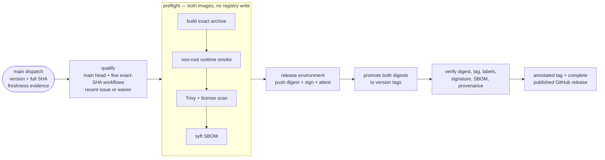

# 8.2. Releases

!!! abstract "In one glance"

    - **You will:** See how a version number, a changelog entry, a tag, and a signed image are tied together, and check that this repository's version metadata still agrees.
    - **You need:** A clone and `mise run install:maintainer`; you will not tag a release of this repository.
    - **Time:** about 12 minutes, reference.

## What is a release?

A release here is one version name covering four artifacts at once:

- A `v`-prefixed Git tag on the commit that shipped it.
- The matching dated `## [x.y.z] - YYYY-MM-DD` section in `CHANGELOG.md`.
- The same version in `pyproject.toml`, `agents/python/pyproject.toml`, and `CITATION.cff`.
- The two container images (`agent` and `mlflow`) that tag publishes to GHCR, GitHub's container registry.

Run `git tag --list 'v*' --sort=v:refname | tail -1` to see which release the checkout you are reading is on. This page never names a specific version, because a version printed in prose is a version that can rot.

More generally, a release is a deliberately tagged snapshot plus evidence about its code, course, agent package, images, data, infrastructure, and known limitations. A version identifies those artifacts; it cannot guarantee that an external hosted model behaves identically forever.

You will not tag this repository. Read the rest of this page as the release pattern to copy into your own project, and run only the checkpoint at the end.

## How is the project versioned?

Use [Semantic Versioning](https://semver.org/):

1. **MAJOR** for incompatible public application/deployment contract changes.
1. **MINOR** for backward-compatible capabilities.
1. **PATCH** for backward-compatible fixes and clarifications.

Note what is _not_ on that list: course pages. This repository versions its software contracts and deliberately leaves its prose free to improve — chapters can be reordered and pages renamed in any release, with redirects so published URLs never 404. That split is stated in [`SUPPORT.md`](https://github.com/MLOps-Courses/agentops-open-course/blob/main/SUPPORT.md), and it is worth copying: applying software semantics to teaching material buys nothing and blocks every improvement.

Root `pyproject.toml`, `agents/python/pyproject.toml`, and `CITATION.cff` must agree for a release.

`mise run check:release-metadata` enforces that agreement, requires the newest dated changelog heading and citation release date to match, and can validate an expected `v`-prefixed version. The release workflow runs that check before building either image, so mistyped dispatch input cannot publish artifacts with a different package/A2A version.

## How is the changelog maintained?

[`CHANGELOG.md`](https://github.com/MLOps-Courses/agentops-open-course/blob/main/CHANGELOG.md) follows [Keep a Changelog](https://keepachangelog.com/en/1.1.0/). Add user-visible work under `Unreleased`; move it into a dated version only during an intentional release. Do not generate claims from commit prefixes without reviewing the actual diff.

The repository does not currently ship a git-cliff configuration/task. If automation is added later, it must preserve curated entries and pass the same docs checks rather than replacing review.

## What must pass before tagging?

A tag is worth cutting only when this whole gate is green from a clean checkout:

```bash
mise run install:maintainer
mise run format
mise run check
mise run test
mise run scan
mise run check:release-metadata
# the script also accepts the explicit version supplied to the release workflow:
# python3 scripts/check_conventions.py release-metadata "v$(awk -F '\"' '/^version = / { print $2; exit }' pyproject.toml)"
test -z "$(git status --porcelain)"
```

Five more requirements sit alongside that block, and a sixth applies only to a publication release:

1. **Render both Kubernetes overlays** — `mise run check:infra`, which the `mise run check` above already includes.
1. **Inspect dependency and image locks** for anything you did not intend to ship.
1. **Run live evaluations on explicitly recorded models when behavior changed** — `mise run eval` from `agents/python/`.
1. **Review release notes** for OSS, cloud, cost, and security overclaims.
1. **Close a freshness audit from the last 120 days with every checklist box checked** or write an explicit waiver for the protected release-environment reviewer.
1. **A publication release** additionally requires the anonymous clone/site/source-link gate from [8.4. Documentation](./8.4.%20Documentation.md).

## How would a maintainer publish a release?

These six steps belong to whoever holds push rights; you are reading them, not running them.

The release workflow accepts one version, one full commit SHA from `main`, and freshness evidence; its default token has no permissions. Later jobs grant only the authority each publication step needs:

```yaml
--8<-- ".github/workflows/release.yml:release-dispatch-authority"
```

1. Choose the SemVer change from the public contract diff.
1. Update all version metadata and locks.
1. Move reviewed changelog entries out of `Unreleased` with the release date.
1. Run the complete release gate and verify the documentation site locally.
1. Commit and merge the release metadata, then wait for CI, Docs, Scan, Eval, and Platform to pass on that exact `main` commit.
1. Dispatch `Release` with that full commit SHA, `v`-prefixed version, and either `issue:<number>` for a recently closed, fully checked freshness audit or `waiver:<reviewed reason>`; the protected workflow creates the annotated tag and publishes the curated changelog section with its evidence.

No release is created merely by merging to `main`; the docs site deployment and a versioned release are separate events.

Repository settings complete this source-controlled chain. The protected `release` environment requires a maintainer review before every write/OIDC job, immutable published releases prevent later asset mutation, and the `v*` rules reject tag updates and deletion by ordinary maintainers. The rules deliberately do not restrict tag creation: GitHub's built-in workflow token cannot be safely allowlisted for that rule, and adding a personal token or unrelated third-party App would weaken the release boundary. A manually created tag still has no publication authority because only a protected-`main` dispatch can qualify the exact current `main` SHA and obtain the release environment's write authority. Organization administrators retain the narrow break-glass bypass for tag repair; use it only for incident recovery and record the reason. These controls live outside Git, so the maintainer verifies them before dispatch rather than assuming this workflow file can enforce them alone.

## What does the release workflow publish?

Dispatching [`release.yml`](https://github.com/MLOps-Courses/agentops-open-course/blob/main/.github/workflows/release.yml) from protected `main` turns one qualified commit into verifiable artifacts. Five of its words are worth pinning down first:

- **buildx** — Docker's builder, used here to build the image without pushing it.
- **SBOM** — a machine-readable inventory of everything inside an image, generated by **syft** ([0.7. Glossary](../0.%20Overview/0.7.%20Glossary.md#sbom)).
- **keyless signing** — cosign binds the signature to the workflow that produced it, so there is no signing key to leak.
- **attestation** — that SBOM, signed and attached to the image, so the inventory travels with the artifact.
- **provenance** — a signed SLSA record binding the image digest to this workflow run and source commit.

The workflow then does seven things:

1. Requires the requested SHA to equal the current protected `main` head, requires successful CI, Docs, Scan, Eval, and Platform runs for that exact SHA, and records a fully checked freshness issue closed within 120 days or an explicit waiver.
1. Builds both images with source, revision, version, creation time, license, title, description, and documentation labels.
1. Runtime-smokes and scans both images before either can write to GHCR; vulnerabilities/secrets fail at HIGH/CRITICAL, and licenses fail outside `trivy.yaml`.
1. Pushes the exact preflight archives first by source-SHA tag, records their digests, signs them keyless with cosign, attaches SPDX SBOMs, and creates signed SLSA provenance.
1. Promotes both recorded digests to the version only after both publication jobs succeed; failure reconciliation rediscovers current registry state and removes only version indexes that still prove exact ownership.
1. Verifies each recorded `image@digest`, its version-tag resolution, OCI labels, cosign signature, SBOM attestation, and GitHub provenance in a separate job.
1. Creates the annotated source tag, attaches qualification, model lineage, digests, SBOMs, provenance, and verification evidence to a draft, then publishes the complete GitHub release.

Those steps form one fail-closed chain. The release environment receives write/OIDC authority only after qualification and both read-only preflights:

Actions artifacts passed between those jobs are transient and retained for at most **7 days**, matching the organization policy. Durable consumer evidence is copied onto the immutable GitHub release and attached to the OCI image, so verification never depends on an expired workflow handoff.

A failure before publication may leave source-SHA images, an exact annotated tag, or a resumable draft; none is a published version by itself. Re-run the same version and SHA to resume. Reconciliation removes only version indexes whose package record, registry digest, single source manifest, and OCI annotations prove ownership. An ambiguous registry or release lookup preserves every index and fails for manual review.

For issue-based freshness evidence, GitHub renders both the issue and the exact candidate template as GFM. The validator accepts only GitHub's real task-list checkboxes, matches their visible labels, and records the inventory count and SHA-256. Code examples, comments, raw HTML, and a shortened or expanded issue cannot stand in for that release's review.



**Diagram in words:** A maintainer dispatches one full `main` SHA and freshness handoff. Five exact-SHA workflows plus a recent closed audit or explicit waiver qualify it before both images are built, smoked, scanned, and inventoried without registry write access. The protected release environment then reviews the handoff, publishes, signs, attests, promotes, and independently verifies both digests before creating the annotated tag and public release.

??? note "Deeper: what threat does qualification stop?"

    A pushed tag used to select both the code and the workflow that held package, release, and OIDC authority. A tag on an unmerged commit could therefore ask its own workflow definition to publish. The dispatch model reverses that authority: protected `main` supplies the workflow, the requested SHA must still be the current `main` head, and five independent exact-SHA runs must already be successful before a write-capable job starts.

The workflow does not replace the manual gate above: a maintainer still curates and merges the changelog before explicitly dispatching publication. Consumers verify images as shown in [6.1. Containers](../6.%20Platform/6.1.%20Containers.md).

## How does Dependabot propose dependency updates?

[`dependabot.yml`](https://github.com/MLOps-Courses/agentops-open-course/blob/main/.github/dependabot.yml) opens dependency pull requests every Monday. Dependabot is native to GitHub: no token, no app to install, no workflow of its own to run.

It watches six targets, because Dependabot takes no globs and each project needs its own entry: GitHub Actions, the three `uv` projects, and the two Dockerfiles. Routine minor and patch bumps arrive as grouped pull requests; majors plus `google-adk` and `mlflow` stay separate. Docker updates ignore Python major/minor jumps so the build stage cannot silently diverge from the Python 3.13 runtime; patch and digest updates still arrive.

!!! warning "Dependabot does not see every pin in this repository"

    It covers packages and Dockerfile base images. It does **not** watch the `[tools]` pins in `mise.toml` and `mise.lock`, the Helm chart versions in `infra/helmfile.yaml`, the image digests inside `infra/k8s/**`, or the Wolfi `apk` pins in the agent Dockerfile.

    Those four are updated by hand, and the quarterly [docs-freshness issue](https://github.com/MLOps-Courses/agentops-open-course/blob/main/.github/ISSUE_TEMPLATE/docs-freshness.md) is what makes sure someone looks. The coordinated-pins checklist below is the other half of that discipline.

## How does a maintainer validate a dependency update?

A dependency PR is validated on a laptop, on the PR branch, before it merges — the same gate a release runs.

1. Check out the pull-request branch and run `mise run install:maintainer`; a hand-made `mise.toml` tool bump also needs the refreshed `mise.lock` committed with it.
1. Run the full local gate: `mise run format`, `mise run check` (includes rendering both Kubernetes overlays), `mise run test`, and `mise run scan`. It calls no model, cluster, or cloud resource; dependency and image scans may use the network.
1. For behavior-affecting bumps — ADK, model wiring, agentgateway — also run `mise run eval`, `mise run eval:workflow`, and `mise run eval:mlflow` from `agents/python/` against an explicitly recorded model.
1. For platform pins (agentgateway, kagent, collector), smoke-test on k3d: `mise run cluster:start`, `mise run platform:install`, `mise run platform:dev`, then exercise the gateway endpoints.
1. To roll back, revert the merge commit and re-run the gate; published images are immutable per digest, so deployments roll back by pinning the previous verified digest.

## Which pinned components must move together?

Six components are pinned in more than one file, so bumping one file alone leaves the repository inconsistent. The list below is the reviewer's checklist for an upgrade PR; open it when you take one.

??? note "Deeper: the six coordinated pins"

    The coordinated pins from `AGENTS.md` cannot be bumped file-by-file:

    1. **Google ADK**: the compatible range in `agents/python/pyproject.toml` and the exact pin in its `uv.lock`.
    1. **agentgateway**: the mise-managed binary in the root `mise.toml` and the image digest in `infra/k8s/base/agentgateway.yaml`, across all three data-plane profiles.
    1. **kagent**: the `kagent-crds` and `kagent` OCI digests in `infra/helmfile.yaml` stay on the same reviewed stable release, and API resources remain `v1alpha2`.
    1. **MLflow**: the `agents/python` dependency and the `infra/mlflow` lock, plus the local build tag `agentops-mlflow:<version>` in `infra/observability/compose.yaml` and the root `build:mlflow-image` task — the tag is not a registry image, so update it by hand.
    1. **OpenTelemetry Collector**: the same contrib digest in `infra/observability/compose.yaml` and `infra/k8s/base/otel-collector.yaml`.
    1. **Python 3.13**: `requires-python` in the pyprojects and both image base pins.

Dependabot sees only the package half of most of these rows; every other half is hand-maintained, which is exactly why the checklist exists. After merging an upgrade that changes an image, cut the next release tag so the published GHCR artifacts, signatures, and SBOMs match the repository again (see the release workflow above).

## Why use v-prefixed tags?

A `v`-prefixed tag such as `v0.3.0` clearly distinguishes a version tag from other Git refs. GitHub and release tooling widely understand the convention. Choose one convention and keep package metadata, changelog headings, tag, and release title consistent.

## What proves this page worked?

Two commands, offline and done in seconds:

```bash
mise run check:release-metadata "$(git tag --list 'v*' --sort=v:refname | tail -1)"
```

That passes the newest `v`-prefixed tag straight into the check, so nothing here depends on which version you happen to be reading. Together they verify that the latest dated entry in `CHANGELOG.md` matches that tag and that `pyproject.toml`, `agents/python/pyproject.toml`, and `CITATION.cff` all carry the same version.

A consistent repository prints `release metadata: <tag> (<date>) is consistent`. A drifted one names the mismatch and exits non-zero, for example `release metadata: tag v2.0.0 does not match source version v0.3.0`.

Any new release requires explicit maintainer intent and the full gate above.

**You are done when:**

- The command above prints the `is consistent` line and exits zero.
- The tag it resolved is the same version as the newest dated `CHANGELOG.md` heading.
- You can name the three files that must agree on the version, without opening them.
- You can say what the tag adds that a commit does not: scanned images, an SBOM, a signature, and a job that verifies both.

Return to [8. Community](./index.md) and pick your next maintenance question when you could reproduce this release pattern — tag, changelog entry, matching metadata, signed image — in a repository of your own. These pages are a lookup, not a sequence.
