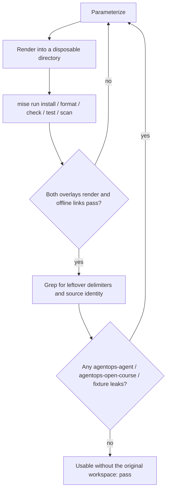

# 8.3. Templates

A template is a reusable starting point: it captures a proven structure once so the next project spends its effort on the new problem instead of rediscovering the same scaffolding. This repository carries templates at two very different scales.

At the small scale the templates are concrete and already shipped: the GitHub issue and pull-request forms under `.github/` that shape every contribution before a maintainer reads it. At the large scale, "template" is a design decision you should make deliberately — whether to turn the whole reference agent into a parameterized project generator, or to fork it once and move on.

This page owns the _structure and enforcement_ of both. The workflow that fills the forms in lives in [8.5. Contributions](./8.5. Contributions.md); the recommended way to build your own agent from this one lives in [8.7. Capstone](./8.7. Capstone.md); the docs contract those templates protect lives in [8.4. Documentation](./8.4. Documentation.md).

## Which reusable templates does this repository already ship?

Four kinds of template already live under `.github/`, and a derivative repository can copy them almost verbatim:

1. **Issue forms.** [`bug.yml`](https://github.com/MLOps-Courses/agentops-open-course/blob/main/.github/ISSUE_TEMPLATE/bug.yml), [`feature.yml`](https://github.com/MLOps-Courses/agentops-open-course/blob/main/.github/ISSUE_TEMPLATE/feature.yml), and [`docs.yml`](https://github.com/MLOps-Courses/agentops-open-course/blob/main/.github/ISSUE_TEMPLATE/docs.yml) are structured GitHub issue forms, not free text. Each pins a `title:` prefix and `labels:` so triage is automatic: a bug carries the `bug` label and a `bug:` subject, a proposal carries `enhancement` and `feat:`, a docs report carries `documentation` and `docs:`. Required `validations` force the fields a maintainer actually needs. `bug.yml` demands the affected area (a dropdown over reference agent, local infrastructure, Kubernetes/GKE manifests, repository tooling, other), exact reproduce commands with credentials removed, expected behavior, and an environment with commit SHA; the text-rendered log excerpt is offered but optional. `feature.yml` demands the learner problem _before_ the preferred tool, the simpler alternatives considered, and the upstream OSS license (placeholder `Apache-2.0`) so a proposal cannot smuggle in a paid feature gate. `docs.yml` demands the page path, a description of what is wrong or unclear, and a confirmation that `main` and the rendered course were checked and that personal data was removed; the suggested smallest unblocking change is invited but optional.
1. **Routing.** [`config.yml`](https://github.com/MLOps-Courses/agentops-open-course/blob/main/.github/ISSUE_TEMPLATE/config.yml) sets `blank_issues_enabled: false`, so there is no unstructured escape hatch: every issue enters through a form. Its `contact_links` route vulnerabilities to a private security mailbox and readers to the rendered course, keeping exploit detail and "is this already fixed?" traffic out of the public tracker.
1. **Pull-request template.** [`PULL_REQUEST_TEMPLATE.md`](https://github.com/MLOps-Courses/agentops-open-course/blob/main/.github/PULL_REQUEST_TEMPLATE.md) asks for What/Why/How and a Test Plan whose checkboxes are the exact repository gate (`mise run format`, `check`, `test`, `scan`) plus "ran every changed documentation command from its documented working directory" and "added no credentials, generated reports, or unrelated changes."
1. **Recurring maintenance template.** [`docs-freshness.md`](https://github.com/MLOps-Courses/agentops-open-course/blob/main/.github/ISSUE_TEMPLATE/docs-freshness.md) is a checklist issue for re-verifying time-sensitive claims before each release — model names such as `qwen3:4b-instruct` and `gemini-3.5-flash`, pinned versions such as agentgateway `v1.3.1` and kagent `0.9.11`, price targets, and measured checkpoints.

The reusable idea is not the wording but the _shape_: force structure at intake, label for automatic routing, make required fields carry the information a reviewer would otherwise chase, and close the unstructured escape hatch. What a contributor actually does with these forms is [8.5. Contributions](./8.5. Contributions.md).

## Should you template or fork the reference agent?

The bigger question is what to do with the whole agent. Two honest paths exist, and most learners want the first:

1. **Fork once.** Start from the completed reference on `main`, branch, and change one boundary at a time while the gates stay green. This is exactly the path [8.7. Capstone](./8.7. Capstone.md) endorses and grades. You keep the git history, the tests, and the infrastructure, and you pay no generator tax.
1. **Extract a generator.** Turn the reference into a parameterized template that stamps out _many_ derivatives. Do this only when several agents genuinely need the same packaging, validation, image, protocol, security, and delivery contracts. A generator is another product: it has its own versions, migrations, tests, and support obligations, and every parameter you expose is a promise to keep working.

`main` is a reference implementation, not a published project generator. If you have one derivative in mind, fork it. Reach for a generator only when maintaining it costs less than hand-porting the same changes into three or more repositories.

## What should be parameterized?

In a generator a parameter is any value that legitimately differs between derivatives — identity, provider, ownership, and deployment coordinates — as opposed to structure that should stay fixed. Get this line wrong in either direction and the generator hurts: too few parameters and every derivative hand-edits the same files; too many and the template becomes a fragile configuration language. For this agent the parameters group into:

1. Identity: the distribution/module name, the ADK `app_name`, the telemetry service name, the MLflow experiment and prompt-registry names, the audit actor, and the human-facing display name. The CHANGELOG's "Ops Copilot" → "AgentOps Agent" rename is a map of exactly which surfaces an identity change touches.
1. Model path: the provider, model id, and direct-or-gateway base URL.
1. Ownership: which tool, skill, and data packages ship, and who approves writes.
1. Serving: the advertised A2A address and the per-request call budget.
1. Deployment coordinates: the OCI image name, Kubernetes namespace, local registry, and the optional GCP project/region/zone/bucket.

Never template a credential, a personal path, an existing trace or runtime database, or a hard-coded cloud identity. That rule is already modelled in the reference. `.env.example` ships only placeholders and is copied to a git-ignored `.env`; install, check, and test tasks never load it. The default `OPENAI_API_KEY=local-ollama` is a _non-secret marker_ the OpenAI SDK requires and Ollama ignores — a real key never appears in the tree. And the GKE overlay mounts no cloud key at all: it uses Workload Identity Federation through `iam.gke.io/gcp-service-account` annotations. A generator inherits these patterns by copying `.env.example` (never `.env`), keeping the marker, and keeping WIF.

## Where does each parameter live in this repository today?

A generator's job is to rewrite exactly the cells below and leave everything else alone. Anything not in this table should be an invariant, not a knob.

| Parameter                            | Where it lives today                                                                                                                                                                         |
| ------------------------------------ | -------------------------------------------------------------------------------------------------------------------------------------------------------------------------------------------- |
| Agent identity (`agentops-agent`)    | `agents/python/pyproject.toml` `[project].name`; ADK `app_name` and audit actor in `server.py`/`actions.py`/`mcp_server.py`; `OTEL_SERVICE_NAME`, `MLFLOW_EXPERIMENT_NAME` in `.env.example` |
| Course/site identity                 | root `pyproject.toml` `[project].name = "agentops-open-course"`; site config and `docs/CNAME`                                                                                                |
| Provider, model, base URL            | `AGENT_MODEL_PROVIDER`, `AGENT_MODEL`, `OPENAI_BASE_URL` in `.env.example`; defaults in `config.py` (`ModelProvider`, `model`, `openai_base_url`)                                            |
| A2A advertised address + call budget | `AGENT_A2A_HOST`/`AGENT_A2A_PORT`/`AGENT_A2A_PROTOCOL` and `AGENT_A2A_MAX_LLM_CALLS`; the `a2a_*` fields in `config.py`                                                                      |
| OCI image name                       | the `agentops-agent` artifact in `infra/skaffold.yaml` and the `build:agent-image` task                                                                                                      |
| Kubernetes namespace                 | `agentops` in `infra/k8s/base/namespace.yaml`                                                                                                                                                |
| Local registry                       | `registry.localhost:5050` (the `platform:dev` task)                                                                                                                                          |
| GCP project/region/zone              | `infra/gcp/terraform.tfvars.example` (`project_id`, `region`, `zone`)                                                                                                                        |
| GCS artifact bucket + WIF identity   | GKE overlay: `gs://agentops-open-course-mlflow-artifacts` and the `...@agentops-open-course.iam.gserviceaccount.com` service accounts                                                        |

## What should remain invariant?

The point of a template is that its _structure_ is trustworthy: parameterize identity and coordinates, and freeze the contracts that make the agent correct and operable. Freeze:

1. the `src/` package layout and the locked dependency workflow (`uv sync --locked`);
1. the one `mise run` task vocabulary that hooks, CI, and this course all reuse — see [8.5. Contributions](./8.5. Contributions.md) and [8.4. Documentation](./8.4. Documentation.md);
1. the typed settings/domain/tool boundaries;
1. the immutable seed versus writable runtime state split (`agents/data/incidents.db` is never mutated);
1. direct local reads versus governed MCP reads and confirmed, audited writes;
1. offline branch-covered tests and deterministic adversarial cases;
1. the non-root image with explicit health, resource, storage, and NetworkPolicy declarations;
1. the docs/source synchronization contract and the OSS-boundary language that keeps optional cloud clearly labelled.

These are the same invariants the capstone must preserve; a generator simply refuses to make them parameters.

## Which OSS templating tool should you use?

[Copier](https://copier.readthedocs.io/) is an open-source option when generated projects must keep receiving template updates. [Cookiecutter](https://cookiecutter.readthedocs.io/) is a simpler open-source generator for create-once scaffolds. Review licenses and dependencies and pin the selected tool; neither is required by this repository.

## How do you validate a generated project?

A generator is only correct if its _output_ is correct, so you test the rendered project, not the template. The failure mode is a template that renders but produces a project that only builds inside the original author's workspace — leftover delimiters, dangling references to the source identity, or fixture data that was never meant to ship.

Generate into a disposable directory and run the reference's own gate against the output:

1. `mise run install` resolves the locked dependency environment.
1. `mise run format` then `mise run check` — the check step already renders both Kubernetes overlays (`check:infra`) and runs the offline Markdown link check (`check:links`), so overlay render and link validation come for free.
1. `mise run test` runs the offline, branch-covered suite with no model, provider, cluster, or cloud.
1. `mise run scan` runs gitleaks history plus Trivy vulnerabilities, secrets, licenses, and misconfiguration.

Then grep the rendered tree for anything that should have been replaced: unreplaced template delimiters, the source identities `agentops-agent` and `agentops-open-course`, the maintainer email and GCP project, and the seed fixtures under `agents/data/`. The generated repository must pass its own gate _and_ be usable without any access to the original workspace.

## What is the template checkpoint?

Write the parameter table above and the expected generated tree, then prove that _two different_ parameter sets both pass the complete gate from a clean checkout. Do not publish the generator until its update/migration behavior and license notices are themselves tested — a published generator promises those to every derivative. If you only have one derivative in mind, the checkpoint is simpler: fork, and follow the [8.7. Capstone](./8.7. Capstone.md) path instead.
