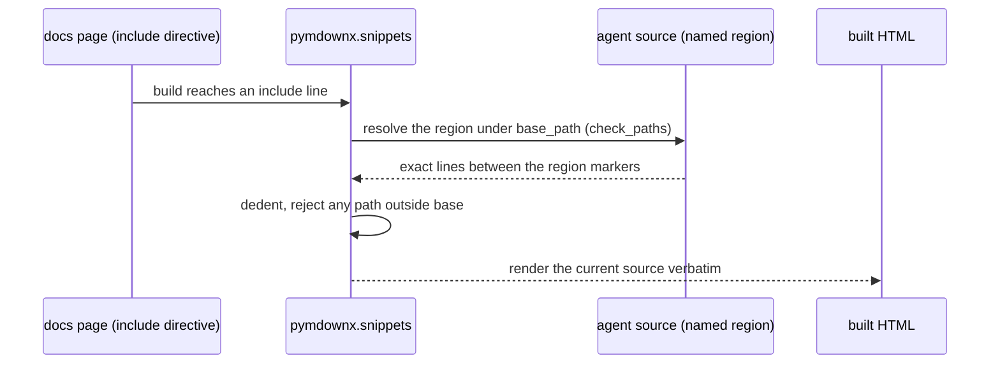
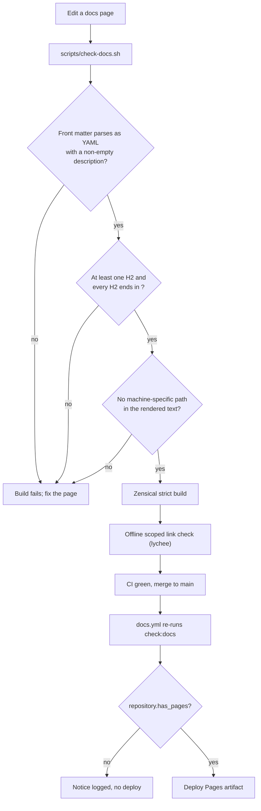

# 8.4. Documentation

## What builds this site?

A documentation site is a static site: Markdown compiled to HTML once, served as plain files, with no server running at request time. That makes it cheap to host, trivial to cache, and easy to verify — the whole site is a folder you can diff, grep, and link-check. This course builds with Zensical, the static site generator from the Material for MkDocs authors, pinned exactly in the root `pyproject.toml`:

```toml
dependencies = [
  "zensical==0.0.50",
]
```

Zensical is pre-1.0, so its rendering can shift between releases. The exact pin plus `uv.lock` freezes the whole build environment, so an upgrade is a deliberate bump that must rebuild and visually re-inspect the entire site — never a floating dependency that changes output silently under you. `mise run serve` runs `zensical serve` for a live-reload preview and `mise run build` writes the static site under `site/`.

## Why is configuration in mkdocs.yml?

Zensical reads MkDocs configuration natively, so one `mkdocs.yml` describes the whole site as data instead of scattering behavior across scripts. Three settings there carry most of the weight, and each defends a specific failure:

1. `strict: true` turns any build warning — a broken nav entry, a missing include, a dead relative link — into a non-zero exit. A site that renders is not enough; it must render clean.
1. The `nav:` tree lists every page explicitly. A new stylesheet, image, or cloud-profile page cannot silently reorder the learning path, because a page that is not in `nav` is not in the site.
1. `use_directory_urls: false` emits `.html` files rather than pretty directory URLs, which keeps the deep links used across the course (and in the publication gate below) stable and greppable.

The file also wires the Material theme features (code copy, tabs, search), the `mermaid` custom fence, `edit_uri` for per-page source links, the social links, and the `pymdownx.snippets` include mechanism covered below. A header comment records the plan to migrate this to `zensical.toml` once Zensical reaches 1.0; until then, MkDocs configuration is the contract.

## What does the structural checker enforce?

Before Zensical renders anything, `scripts/check-docs.sh` imposes a house style so every page is a self-describing FAQ entry. It applies three gates to each `docs/**/*.md` file:

1. The file starts with parseable YAML front matter that defines a non-empty `description`.
1. The file has at least one `##` (H2), and every H2 reads as a question ending in `?`.
1. The file contains no machine-specific path — an absolute path under a user home directory, a `file://` URL, or the retired local container-registry hostname — so the rendered text stays portable across machines.

The front-matter gate is the subtle one, and it exists because of a bug that actually shipped. A `description` whose text contains an unquoted colon-space (`key: value` inside the value) is valid-looking prose but invalid YAML. The renderer then leaves the block unparsed, Markdown reads the text plus the trailing `---` as a setext heading, and the description is published as the page's `<h2>`. This happened on three chapter index pages and is recorded in the `CHANGELOG.md` "Fixed" section. A textual regex cannot see it; only a real parse can, which is why `scripts/check_frontmatter.py` loads the block with a YAML parser instead of pattern-matching it:

```python
try:
    meta = yaml.safe_load(match.group(1))
except yaml.YAMLError as error:
    detail = str(error).splitlines()[0]
    return f"front matter is not valid YAML ({detail}); quote values containing ': '"
```

The heading pass is fence-aware: it toggles an in-fence flag on code-fence lines so a `## ...` shown inside a code block is not mistaken for a real heading. The takeaway for authors is mechanical: quote any description that needs a colon, phrase every H2 as a question, and keep local paths out of the prose.

## Why must every heading be a question?

The FAQ shape is not decoration; it is what makes headings addressable. Zensical turns every H2 into a URL fragment — its slug, the heading lowercased with spaces and punctuation hyphenated — and the rest of the course deep-links into those fragments. The glossary in [0.7. Glossary](../0. Overview/0.7. Glossary.md) points terms at specific chapter headings (for example the A2A entry links into `3.6. A2A#...`), and roughly twenty pages carry `.md#slug` cross-references. A question heading gives each section a stable, human-readable anchor and forces the author to state exactly what the section answers.

That stability is a real maintenance concern, because renaming an H2 changes its slug and silently breaks every inbound link — nothing in a normal build flags a fragment that no longer exists. So the workflow before rewording an existing heading is: search the docs tree for inbound links to its slug and either keep the wording or update every linking page in the same change. New headings you add carry no such constraint. The checker enforces the surface form; the discipline of not breaking anchors is on the author.

## How do course snippets stay identical to the source?

The worst failure mode in technical docs is a code sample that has drifted from the code it claims to show. This course removes the copy entirely: critical examples are pulled from the real source at build time through `pymdownx.snippets`, configured in `mkdocs.yml`:

```yaml
- pymdownx.snippets:
    base_path:
      - .
    check_paths: true
    restrict_base_path: true
    dedent_subsections: true
```

`base_path: .` roots includes at the repository. `check_paths: true` fails the build if a referenced file or named region is missing — so deleting or renaming a source region cannot leave a stale sample rendering, it breaks the build instead. `restrict_base_path: true` forbids traversal outside the repository, so a page cannot reach arbitrary host files. `dedent_subsections: true` strips indentation from a marked region so a method body renders flush-left. A page names a source file and a region after a colon; the boundaries live in the source as comment markers (a `start` and matching `end`), so the excerpt is a live window onto the current code:



You can see this working in the deepened chapters: [2.1. First Agent](../2. Agents/2.1. First Agent.md) embeds the `root-agent` region from `agent.py`, and [3.4. Memory](../3. Capabilities/3.4. Memory.md) embeds the `get-runbook` region from `memory.py`. The rule for authors is the mirror image of the guarantee: never hand-copy source into a page, and never edit the rendered excerpt — change the source, and the page follows on the next build. When no reusable region fits, copy a short excerpt manually and label it illustrative rather than adding a new marker.

## How do you preview and build?

```bash
mise run serve   # live preview at http://localhost:8000
mise run build   # static site under site/
mise run check:docs
mise run check:links
```

`mise run check:docs` runs the structural checker and then a full strict Zensical build. `mise run check:links` is a separate, offline, scoped gate: `lychee --offline` over an explicit file set — `README.md`, `CONTRIBUTING.md`, `SECURITY.md`, `CODE_OF_CONDUCT.md`, `CHANGELOG.md`, and the `docs`, `agents`, and `infra` Markdown trees. Offline means it validates repository-local relative links and anchors without reaching the network, so it never flakes on a slow external host and never silently passes a broken internal link. Both gates run in CI on every push and pull request as part of `mise run check`.

In the live preview, review desktop and mobile navigation, Mermaid diagrams, tables, code-copy buttons, admonitions, internal links, and long headings in the rendered site. A green checker plus a green link check proves structure and connectivity, not that the prose reads well — read it.

## What does the Pages workflow actually guarantee?

On a push to `main`, `.github/workflows/docs.yml` installs the pinned mise toolchain and runs `mise run check:docs`. It configures Pages, uploads the artifact, and deploys only when GitHub reports that Pages is enabled for the repository (`github.event.repository.has_pages`); otherwise it records a notice and stops after validation. The end-to-end path from an edit to a published page is a chain of independent gates, each of which can stop it:



A green workflow proves the source builds from a clean checkout. It does not by itself prove that the repository is anonymously readable, that the Pages setting is correct, that DNS resolves, that TLS is valid, or that every deployed link works — those are what the publication gate below checks.

## How does the course keep time-sensitive claims fresh?

Passing gates prove a page is well-formed and its code samples are current; they cannot prove that a version number, a model name, a benchmark, or a cloud price is still true. Those claims rot silently, so the repository schedules a re-verification. `.github/workflows/freshness.yml` runs a quarterly cron (07:00 UTC on the first of January, April, July, and October) and, if no freshness audit is already open, opens exactly one tracking issue from `.github/ISSUE_TEMPLATE/docs-freshness.md`. The idempotence matters: the cron never piles duplicates onto an untriaged issue, so each release cycle includes one — and only one — freshness pass.

The template is a concrete checklist tied to the files that carry each claim: the default and optional model ids and their licenses, the GKE cost targets and node shapes, the pinned agentgateway and kagent versions and their quirks, the Wolfi and image-digest pins, and the measured retrieval checkpoint. Each item names both the claim and where it lives, so the audit is "open the source, confirm the value still matches reality, check the box or file a fix" rather than a vague reminder. When a claim moves, is added, or is retired, the fix includes updating the template itself, so the checklist tracks the course instead of decaying alongside it.

## What is the publication gate?

Before the README advertises a hosted course, verify from a clean unauthenticated environment:

1. Anonymous Git access can resolve and clone the repository.
1. The deployed homepage and a deep chapter URL return successful HTTPS responses.
1. The custom domain resolves to the intended Pages host and presents a valid certificate.
1. Repository edit/source links open without maintainer credentials.
1. Every link in the built site passes an online link check.

One reproducible release check is:

```bash
CLEAN_HOME="$(mktemp -d)"
GIT_CONFIG_NOSYSTEM=1 GIT_TERMINAL_PROMPT=0 HOME="$CLEAN_HOME" \
  git -c credential.helper= ls-remote \
  https://github.com/MLOps-Courses/agentops-open-course.git HEAD
rm -rf "$CLEAN_HOME"

curl -fsS https://agentops-open-course.fmind.dev/ >/dev/null
curl -fsS \
  'https://agentops-open-course.fmind.dev/8.%20Community/8.7.%20Capstone.html' \
  >/dev/null
lychee --no-progress 'site/**/*.html'
```

This is the online counterpart to the offline `mise run check:links`: run it only after `mise run check:docs` has generated `site/`, and note the deep-URL form depends on `use_directory_urls: false`. If any command fails, the verified surface remains the local preview and the release is not publication-complete. The [8.2. Releases](./8.2. Releases.md) gate requires this same anonymous check for any publication release.

## How is the custom domain declared?

`docs/CNAME` and `site_url` in `mkdocs.yml` declare the intended `agentops-open-course.fmind.dev` address. They are configuration, not evidence that DNS or Pages is active: the file names the domain, it does not prove the domain points here. DNS, the GitHub Pages repository setting, the deployed artifact, and certificate status must all agree before the URL is presented as working — which is exactly what the publication gate confirms.

## What is the documentation checkpoint?

Run `mise run check:docs` and `mise run check:links`, follow all changed pages in the local preview, and confirm critical snippets still render from source. Inspect the generated `site/CNAME`. For a publication release, run the anonymous clone/site/source-link gate above from outside any maintainer-authenticated browser or session, and walk the current freshness-audit issue if one is open. Do not advertise or deploy manually from an unvalidated working tree.
